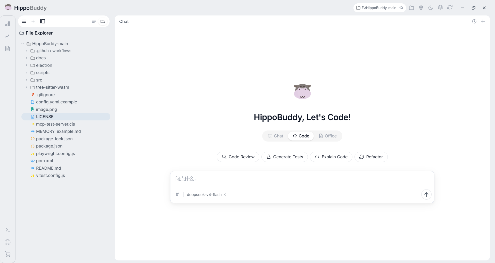

<h1 align="center">
  
  HippoBuddy
</h1>

<p align="center">AI-powered desktop assistant for chat, coding, and office productivity.</p>

<p align="center">
  简体中文 ｜ <a href="./docs/README.en.md">English</a>
</p>

<p align="center">
  
  
  
  
  
  
  
  
</p>

<p align="center">
  
</p>

---

## 下载安装

| 平台 | 下载 |
|---|---|
| Windows | [HippoBuddy Setup](https://github.com/Puteitous/HippoBuddy/releases/latest) |
| macOS (Intel) | [HippoBuddy.dmg](https://github.com/Puteitous/HippoBuddy/releases/latest) |
| macOS (Apple Silicon) | [HippoBuddy-arm64.dmg](https://github.com/Puteitous/HippoBuddy/releases/latest) |
| Linux (AppImage) | [HippoBuddy.AppImage](https://github.com/Puteitous/HippoBuddy/releases/latest) |

> 📖 在线文档：[https://www.hippobuddy.cn/](https://www.hippobuddy.cn/)
>
> 💬  交流群（QQ：1102524202）— 问题反馈、功能建议、使用求助、摸鱼心得，欢迎大家交流

---

## 功能概览

| 功能 | 说明 |
|---|---|
| **智能对话** | 聊天 / 代码 / 办公三种模式，自由切换 |
| **AI 编程协助** | 理解项目上下文，生成、修改、重构代码 |
| **文件操作** | 读、写、编辑、删除，支持 diff 回滚 |
| **会话管理** | 新建、重命名、删除、分叉讨论 |
| **工具箱** | Token 统计、终端、浏览器、实时监控等 |
| **新手指引** | 首次启动聚光灯导览，快速上手 |

<p align="center">
  
  <br>
  <em>Chat 面板与预览面板协同工作</em>
</p>

---

## 为什么选择 HippoBuddy？

与市面上其他 AI Agent 产品（Codex、Claude Code、Copilot、Kimi、Trae Work、WorkBuddy 等）的对比：

| 维度 | HippoBuddy |
|---|---|
| **开源免费** | 全部源码开源，Apache 2.0 协议 |
| **开箱即用** | 无需登录、无需第三方账号，下载即用 |
| **LLM 行为可视化** | 工具调用与思考过程全透明，实时可见 |
| **代码编辑** | 完整读/写/编辑，支持 diff 预览与回滚 |
| **Office 文档** | 内置 PDF / Word / Excel / PPT 等格式浏览 |
| **文件变更系统** | 文件级与会话级变更追踪，随时回滚 |
| **上下文与 Token 监控** | 实时 Token 统计、上下文用量、LLM 监控 |
| **内置工具** | 10+ 种工具：终端、浏览器、搜索、代码分析等 |
| **性能** | 轻量桌面应用，Java 虚拟线程高并发 |
| **UI 设计** | 极简精美，专注内容 |
| **平台** | 桌面端（Windows / macOS / Linux） |


---

### 当前不足

HippoBuddy 正在积极开发中，目前存在以下局限：

- 需要个人 LLM API 密钥及联网搜索工具配置
- Subagent、MCP、Memory 等功能尚在完善中
- 暂无插件系统、自动化任务流水线、浏览器操控等能力
- Office 文件生成编辑依赖 skill 调用及第三方编辑器
- 第三方软件集成不足（归于插件范畴）
- 大规模长上下文场景的稳定性仍在验证中
- 更偏向个人任务执行与效率提升，非 7×24 在线服务

---

## 🎬 视频介绍

6 分钟快速了解 HippoBuddy：

<p align="center">
  <a href="https://www.bilibili.com/video/BV13xud6KEXw/">
    
  </a>
  <br>
  <a href="https://www.bilibili.com/video/BV13xud6KEXw/">
    
  </a>
</p>

---

## 快速开始

### 方式一：桌面端（推荐）

下载[安装包](https://github.com/Puteitous/HippoBuddy/releases/latest) -> 安装 -> 启动 -> 开始使用

### 方式二：源码启动

```bash
# 1. 编译 Java 后端
mvn package -DskipTests

# 2a. 启动桌面端（Electron）
cd electron && npm install && npm start

# 2b. 或仅启动 Web 端（不带 Electron）
mvn exec:java -Dexec.mainClass="com.example.agent.WebApplication"
```

> **配置说明** — 源码启动时，应用首次运行会自动根据 [`config.yaml.example`](./config.yaml.example) 创建 `config.yaml`，编辑其中的 LLM 配置即可：
>
> ```yaml
> llm:
>   api_key: ${DEEPSEEK_API_KEY:-your-api-key-here}
>   model: deepseek-v4-flash
>   base_url: https://api.deepseek.com
> ```
>
> 支持 **DeepSeek / Claude / GPT / Ollama**。完整配置见 [`config.yaml.example`](./config.yaml.example)。

---

## 技术栈

| 层 | 技术 |
|---|---|
| 桌面壳 | **Electron 32** |
| 前端 | 原生 JS + CSS |
| 后端 | **Java 21** + 虚拟线程 |
| 构建 | Maven 3.9 |
| AI 协议 | OpenAI SDK / Ollama / DashScope |
| 测试 | JUnit 5 + Playwright |

---

## 项目结构

```
src/main/java/com/example/agent/
├── WebApplication.java           Web 入口
├── DesktopApplication.java       桌面端入口
├── core/                         DI、事件总线、安全拦截
├── llm/                          LLM 客户端（OpenAI、Claude、Ollama...）
├── tools/                        内置工具集（20+）
├── execute/                      Agent 对话循环
├── orchestrator/                 任务编排（DAG）
├── subagent/                     多代理系统
├── mcp/                          MCP 协议集成
├── memory/                       长期记忆
├── session/                      会话存储与转录
├── web/                          HTTP 处理器与 SSE 流式
├── prompt/                       Prompt 库与管理
├── domain/                       规则、技能、内容截断
└── config/                       配置中心
```

---

## 项目文档

| 文档标题 | 链接 |
|---|---|
| HippoBuddy — 项目介绍 | [docs/intro](https://www.hippobuddy.cn/docs/intro) |
| 快速开始 | [docs/quick-start](https://www.hippobuddy.cn/docs/quick-start) |
| HippoBuddy 架构哲学 | [docs/architecture/philosophy](https://www.hippobuddy.cn/docs/architecture/philosophy) |
| AI Agent 使用心得 | [docs/guides/agent-mindset](https://www.hippobuddy.cn/docs/guides/agent-mindset) |
| AI 桌面应用，启动时到底在加载什么？ | [docs/guides/startup-loading](https://www.hippobuddy.cn/docs/guides/startup-loading) |

---

## 许可证

[Apache License 2.0](./LICENSE)

---

<p align="center">
  💬 交流群（QQ：1102524202）— 问题反馈、功能建议、使用求助、摸鱼心得，欢迎大家交流
</p>
