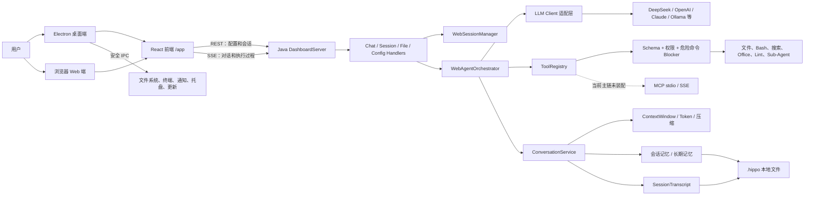
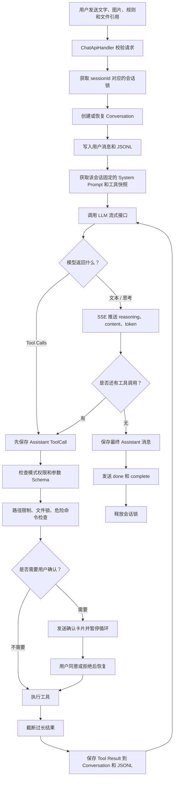
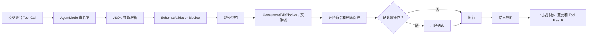
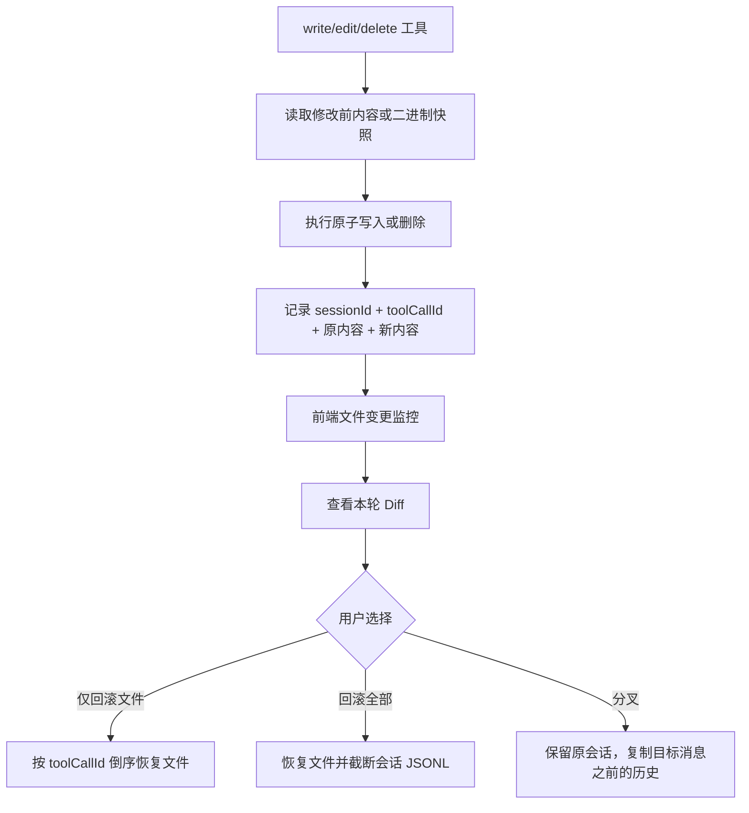
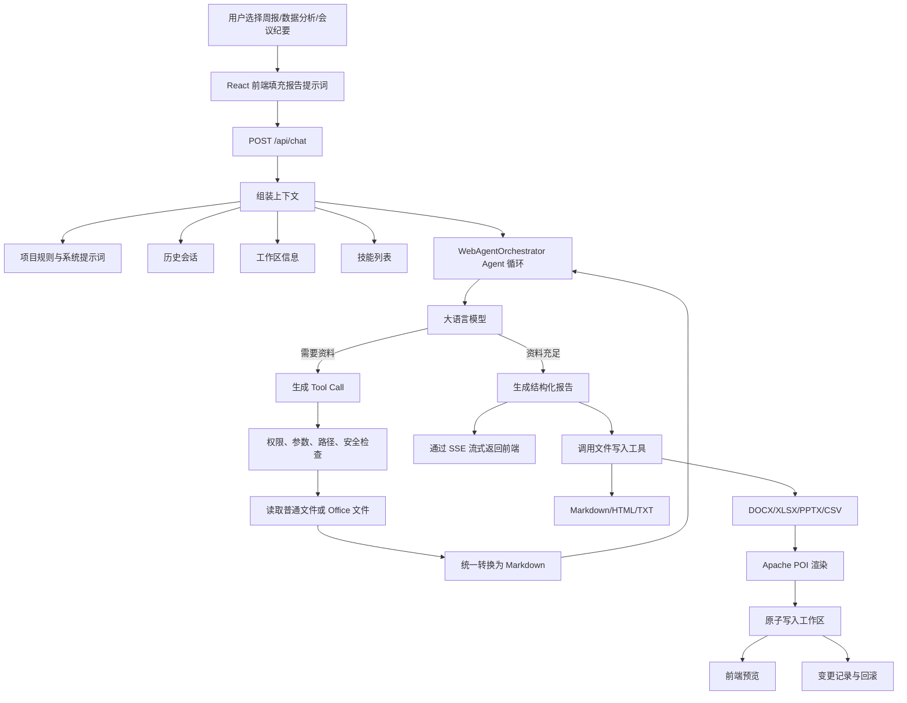

# 告诉我下该项目的所有功能 以及功能的实现原理 ,思路图

- 会话 ID：`01a057a0-abf4-79d1-aad1-5d1230beb64f`
- 导出来源：Codex Desktop（仅保留对话内容）

## 用户

告诉我下该项目的所有功能 以及功能的实现原理 ,思路图

## Codex（过程说明）

我会先完整梳理项目的模块、入口、接口、数据模型和关键调用链，再按“功能清单 → 实现原理 → 思路图”给你一份可核对的中文说明。你还要求了思路图，因此我会使用可视化能力，把核心业务流程和模块关系画出来。

## 用户

继续

## Codex（最终回答）

我按当前源码的实际接线情况梳理了一遍。HippoBuddy 本质上不是普通聊天工具，而是一个“本地优先的桌面 AI Agent 平台”：

- Electron 负责桌面窗口、文件系统和系统集成
- React 负责聊天、工作区、文件预览和设置界面
- Java 21 负责 Agent 循环、LLM 调用、工具执行、安全控制和本地持久化
- 同时支持脱离 Electron，以 Web 服务运行
- 不使用数据库，数据主要保存在 `.hippo/` 下的 JSONL、JSON、Markdown 和 YAML 文件中

## 一、项目功能全景

| 功能模块 | 用户可用功能 | 实现原理 |
|---|---|---|
| AI 对话 | 流式回答、思考过程、Markdown、代码高亮、公式、Mermaid 图 | `POST /api/chat` 建立 SSE 流，Java 后端逐块推送 reasoning、content、tool、token 等事件 |
| 三种工作模式 | 聊天、代码、办公 | 不同 System Prompt + 工具白名单；聊天模式只读，代码/办公模式允许执行和修改 |
| 多模型支持 | DeepSeek、OpenAI、Claude、Ollama、通义、智谱、Kimi、MiniMax、豆包等 | 多个 Provider 最终适配为 OpenAI Compatible、Anthropic、Ollama、Responses 四类客户端 |
| 模型管理 | 添加、编辑、删除、切换模型，拉取模型列表，保存模型历史 | 配置写入 `config.yaml`，切换 Provider 时重建 LLM Client |
| 深度推理 | 展示 reasoning，配置 thinking 和 reasoning effort | LLM 流式客户端分别组装 reasoning 和 content delta |
| 图片理解 | 上传、粘贴、多图预览、视觉模型能力检测 | 图片先保存到 `.hippo/images`，再转换为多模态 `ContentPart` 传给模型 |
| Agent 自动执行 | 模型分析 → 调工具 →读取结果 → 继续分析，默认最多 50 轮 | `WebAgentOrchestrator` 实现循环；模型无工具调用时结束 |
| 文件操作 | 读取、创建、覆盖、追加、精确编辑、删除、撤销 | 模型通过 Function Calling 调用 ToolRegistry 中的文件工具 |
| 项目搜索 | 目录树、Glob、正则搜索、文件内容搜索 | 优先使用内置多平台 ripgrep，失败时回退 Java 搜索实现 |
| 终端执行 | Maven、Gradle、npm、Git及一般命令；实时显示输出 | Java 启动子进程，stdout/stderr 经 SSE 约 200ms 节流推送 |
| 代码诊断 | Java、JS、TS、Python、Go、Rust、HTML、CSS、JSON 语法检查 | Rust Tree-sitter 编译为 WASM，由 Chicory 在 JVM 中执行 |
| 联网能力 | 搜索互联网、抓取网页、服务端搜索状态展示 | Brave/Tavily 搜索；网页通过 OkHttp 获取、Jsoup 清洗；DeepSeek Responses 可使用内置搜索 |
| Office 处理 | 读取 Word、Excel、PPT、CSV；预览 DOCX/PPTX/XLSX；底层支持生成 Office 文件 | 后端 Apache POI 负责解析/生成，前端 docx-preview 和 OOXML/WASM 负责可视化 |
| 工作区 | 选择目录、文件树、文件标签、编辑和保存、搜索、自动换行 | Electron IPC 操作本地文件；CodeMirror 6 负责编辑器 |
| 文件预览 | 文本、Markdown、HTML、图片、PDF、DOCX、PPTX、XLSX | 根据扩展名路由到 CodeMirror、Markdown、iframe、图片或 OOXML Viewer |
| 内嵌浏览器 | 地址栏、前进、后退、刷新、外部浏览器打开 | 前端使用 iframe 保存当前地址，切换标签时重新加载 |
| 文件变更监控 | 展示本会话修改的文件、增加/删除行数、查看 Diff | 每次写入前保存原始内容，写入后登记 `FileChange` |
| 回滚 | 单文件撤销、按消息回滚文件、回滚文件和会话 | 按 `toolCallId` 倒序恢复快照；全部回滚时同时截断 JSONL 会话 |
| 会话管理 | 新建、重命名、删除、置顶、自动标题、后台运行状态 | 会话元数据保存在 `session.json`，消息保存在 `conversation.jsonl` |
| 会话分叉 | 从任意历史消息创建新会话 | 复制目标消息以前的 JSONL，生成新的 fork sessionId |
| 消息操作 | 复制、重试、编辑、分叉、回滚、查看产物 | 编辑消息会截断该消息及之后历史，再作为新请求执行 |
| 上下文引用 | `@文件`、文件行号引用、选中文本加入输入框 | 前端生成 RefChip，短选区直接内联，长选区只传路径和行号 |
| Token 管理 | 实时 Token、缓存命中率、输入/输出量、趋势 | LLM usage 经 SSE 推送，并在会话级累计 |
| 上下文压缩 | 手动压缩、长会话恢复、工具结果截断、超限提示 | `ManualCompactor` 使用裁剪或 LLM 摘要；恢复时可用 session-memory + 最近消息 |
| Prompt 管理 | 自定义三种模式的 Prompt、恢复默认值 | Prompt 作为基础内容，再叠加规则、技能、工作区和环境信息 |
| 规则系统 | 项目规则、全局规则、始终生效、手动引用 | 从 `.hippo/rules/*.md` 懒加载并注入 System Prompt |
| 技能系统 | 项目技能、用户技能、创建、编辑、删除、热重载 | 会话创建时注入技能清单，模型需要时调用 `skill` 读取正文 |
| 技能市场 | 搜索、分类、预览、安装、卸载精选技能 | 下载技能 Markdown，再写入用户技能目录 |
| 长期记忆 | 会话摘要、长期记忆文件、记忆列表/修改/删除 API | “文件即记忆”，每条记忆是带 frontmatter 的 Markdown |
| Sub-Agent | 单个或批量创建子 Agent、查看状态、取消 | 有界线程池执行独立轻量会话；默认关闭 |
| MCP | 配置 stdio/SSE 服务、环境变量、重连、动态工具适配代码 | 实现了 JSON-RPC、tools/resources/prompts，但主启动链尚未装配 |
| 实时监控 | LLM 请求数、成功率、延迟趋势、工具调用和失败数 | EventBus 收集指标，前端每 10 秒访问 `/api/metrics` |
| 桌面能力 | 托盘、窗口状态、系统通知、终端、文件对话框、自动更新 | Electron `contextBridge` 暴露受控 IPC |
| UI 个性化 | 中英文、亮/暗/Midnight/玻璃主题、背景、强调色、面板位置 | Zustand + localStorage；Electron 同步保存启动页主题 |
| 新手引导 | 欢迎页和聚光灯步骤 | React 全局挂载 `OnboardingTour` |
| 文档网站 | 中英文产品文档和架构文章 | 独立 Docusaurus 子项目 |

## 二、整体架构思路图



当前桌面端默认加载 React `/app`，旧版原生 JavaScript 界面仍保留在 `/cockpit`，可用于兼容或回退。

## 三、一次聊天请求的实现原理



这里有几个关键设计：

1. 同一会话串行，不同会话可以并行。HTTP 请求由 Java 虚拟线程处理，但每个 `sessionId` 有独立锁，避免用户同时发送两条消息破坏历史顺序。

2. 工具定义按会话冻结。System Prompt 和工具 Schema 在会话创建时固化，避免规则、日期或工具描述变化导致 LLM 前缀缓存失效。

3. ToolCall 必须先写入历史，再执行工具。这样 `assistant.tool_calls` 和后面的 `tool_result` 能保持 Function Calling 协议配对。

4. SSE 只是实时展示通道，真正的历史事实保存在 Conversation 和 JSONL 中。

## 四、内置 Agent 工具

### 默认工具

| 类别 | 工具 | 作用 |
|---|---|---|
| 文件读取 | `read_file` | 读取普通文本文件 |
| Office 读取 | `read_office_file` | 读取 XLSX、XLS、CSV、DOCX、PPTX |
| 文件写入 | `write_file` | 原子创建、覆盖或追加 |
| 精确编辑 | `edit_file` | 查找并替换指定文本 |
| 撤销 | `undo_file` | 恢复文件上一个版本 |
| 删除 | `delete_file` | 预览后删除文件或目录 |
| Office 写入 | `write_office_file` | 创建 XLSX、CSV、DOCX、PPTX |
| 目录 | `list_directory` | 列目录或递归目录树 |
| 文件查找 | `glob` | 通配符查找文件 |
| 内容查找 | `grep` | 正则搜索文件内容 |
| 终端 | `bash` | 执行构建、测试、Git 等命令 |
| 诊断 | `lint_diagnostics` | Tree-sitter 语法检查 |
| 用户交互 | `ask_user` | 暂停 Agent 并询问用户 |
| 计划 | `todo_write` | 创建树状任务清单 |
| 技能 | `skill` | 按需加载技能正文 |
| 网页读取 | `web_fetch` | 抓取并清洗网页 |

### 按配置启用

| 工具 | 默认 | 说明 |
|---|---:|---|
| `web_search` | 关闭 | Brave 或 Tavily；DeepSeek Responses 可走服务端搜索 |
| `fork_agent` | 关闭 | 创建单个子 Agent |
| `fork_agents` | 关闭 | 批量并行创建子 Agent |
| `list_subagents` | 关闭 | 查询子任务状态和结果 |
| `cancel_subagent` | 关闭 | 取消子任务 |

工具执行安全链如下：



## 五、文件变更和回滚思路

文件修改并不是直接写完就算结束：



因此项目支持三个不同层次：

- 单文件撤销：撤销最近一次编辑。
- 仅文件回滚：恢复文件，但保留聊天内容。
- 全部回滚：恢复文件，并把会话回到目标消息之前。

## 六、本地存储结构

```text
.hippo/
├── config.yaml
├── config/
│   └── workspace.txt
├── sessions/
│   └── yyyy-MM-dd/
│       └── <sessionId>/
│           ├── session.json
│           ├── system-prompt.txt
│           ├── conversation.jsonl
│           ├── file-changes.jsonl
│           ├── tool-results/
│           ├── plans/
│           ├── subagents/
│           └── memory/session-memory.md
├── memory/
│   ├── MEMORY.md
│   └── <uuid>.md
├── rules/
├── skills/
├── images/
└── logs/
```

选择文件存储而不是数据库的原因是：适合单用户本地应用，内容可读、易备份、易人工修改，也避免引入数据库部署。但它不适合多用户、跨设备同步或强事务场景。

## 七、当前源码中需要特别注意的功能边界

这些是“源码存在”和“实际可用”之间的区别：

- MCP：客户端、JSON-RPC、stdio/SSE、工具适配和配置页面都已实现，但启动链没有创建 `McpServiceManager`，所以当前配置的 MCP 服务不会自动连接。
- 长期记忆：存储、检索、提取和整合代码存在，但长期提取默认关闭，`recall_memory` 也没有注册到 Agent 工具。
- 自动压缩：达到阈值时当前主要注入“建议新建会话”的提示；真正压缩主要通过手动 `/compact` 完成。
- Office 写入：`write_office_file` 已注册且底层支持四种格式，但没有加入 `AgentMode` 白名单，因此目前模型从标准聊天主链无法正常调用它。
- XLS 兼容：后端可以读取旧 `.xls`，但 React 前端不直接预览 `.xls`，会提示转换为 `.xlsx`。
- Sub-Agent：默认关闭，启用后在启动时注册；当前配置动态更新只会实时同步 `web_search`，Sub-Agent 通常需要重启。
- Bash：危险命令拒绝和确认机制有效，但 `bash.enabled` 开关目前没有完整参与工具注册/执行控制。
- 安全边界：项目设计目标是可信本机上的个人应用。HTTP 服务当前没有用户鉴权，不建议直接暴露到公网。

## 八、建议的源码阅读入口

- 产品概览：[README.md](../README.md)
- React 主界面：[AppShell.tsx](../frontend/src/components/AppShell.tsx:1)
- 三种模式和工具权限：[AgentMode.java](../src/main/java/com/example/agent/core/AgentMode.java:5)
- 服务和工具装配：[CoreModule.java](../src/main/java/com/example/agent/core/di/CoreModule.java:38)
- 聊天请求入口：[ChatApiHandler.java](../src/main/java/com/example/agent/web/handler/ChatApiHandler.java:95)
- Agent 核心循环：[WebAgentOrchestrator.java](../src/main/java/com/example/agent/web/orchestrator/WebAgentOrchestrator.java:198)
- 工具执行中心：[ToolRegistry.java](../src/main/java/com/example/agent/tools/ToolRegistry.java:19)
- 会话和记忆：[ConversationService.java](../src/main/java/com/example/agent/application/ConversationService.java:38)
- 文件变更与回滚：[FileChangeTracker.java](../src/main/java/com/example/agent/tools/FileChangeTracker.java:184)
- 深度原理文档：[AGENT_IMPLEMENTATION_DEEP_DIVE.md](../docs/AGENT_IMPLEMENTATION_DEEP_DIVE.md)
- 架构报告：[ARCHITECTURE_REPORT.md](../docs/ARCHITECTURE_REPORT.md)

一句话概括它的设计思路：让 LLM 只负责“提出下一步动作”，所有真正的文件、命令和系统副作用，都必须经过 Java Runtime 的权限、参数、安全、确认、锁、持久化和回滚控制。

## 用户

有智能生成报告的功能

## Codex（过程说明）

我再把“智能生成报告”单独补进功能清单，并区分“当前已经可用”和“代码存在但尚未完全接通”的部分。

## Codex（最终回答）

对，项目确实具备“智能生成报告”能力，应单独列为核心功能。

### 智能报告功能

支持根据用户输入、项目文件和联网资料生成：

- 工作周报
- 数据分析报告
- 项目总结
- 会议纪要
- 技术分析报告
- PPT 大纲
- Word 文档
- Excel 数据报表
- PPT 演示文稿
- Markdown/HTML/TXT 报告

前端已经提供“周报、数据分析、PPT 大纲、会议纪要”等快捷入口，见 [modePresetsData.ts](../frontend/src/components/chat-panel/modePresetsData.ts:34)。

### 实现原理

```text
用户输入报告要求
        ↓
读取项目文件/Office 文件/用户资料
        ↓
可选：联网搜索补充资料
        ↓
LLM 提取重点、分析数据、组织报告结构
        ↓
生成标题、摘要、正文、结论、建议
        ↓
输出 Markdown 或调用文件工具生成报告文件
        ↓
工作区预览、修改、回滚
```

报告并不是通过固定模板简单拼接，而是由 Agent 自主完成：

1. 通过 `read_file`、`read_office_file` 收集资料。
2. 通过 `web_search`、`web_fetch` 补充外部信息。
3. 大模型完成归纳、分析、提纲和正文生成。
4. 通过 `write_file` 保存 Markdown、HTML 等普通报告。
5. 通过 `write_office_file` 理论上可以输出：
   - DOCX：Markdown 内容转 Word
   - XLSX：多 Sheet、表头、结构化数据
   - PPTX：标题、要点、表格、幻灯片
   - CSV：结构化表格数据
6. 文件写入会经过路径安全校验、文件锁、变更记录和回滚机制。

Office 文件生成实现位于 [WriteOfficeFileTool.java](../src/main/java/com/example/agent/tools/WriteOfficeFileTool.java:31)。

### 当前实际状态

目前可以正常完成“报告内容智能生成”，也能通过 `write_file` 保存 Markdown/HTML 报告。

但 Office 文件一键导出存在一个接线问题：`write_office_file` 已经实现并注册，却没有加入 `OFFICE` 和 `CODING` 模式的工具白名单，见 [AgentMode.java](../src/main/java/com/example/agent/core/AgentMode.java:6)。因此标准 Agent 流程目前无法直接调用它。

只要把：

```java
"write_office_file"
```

加入 `OFFICE` 和 `CODING` 的 `allowedTools`，Word、Excel、PPT 报告生成链路就能真正打通。

所以更准确的结论是：**智能报告内容生成已经可用，Office 报告文件生成代码已经完成，但还差工具权限接入。**

## 用户

功能的实现的技术原理 麻烦输出下

## Codex（过程说明）

我按“智能生成报告”这项功能，拆解到前端入口、Agent 编排、资料读取、模型生成、文件导出、安全与回滚，并补一张端到端技术流程图。我会使用可视化技能呈现调用关系，方便直接用于项目说明或答辩。

## Codex（最终回答）

可以。该项目的“智能生成报告”本质上不是一个独立的 `ReportService`，而是由“预设提示词 + 通用 Agent 循环 + 文件读取工具 + LLM 分析 + Office 写入器”组合实现。

## 一、总体技术架构



核心原则是：

> LLM 负责理解需求、选择资料、分析内容和决定下一步；Java Runtime 负责真正执行文件读取、文件写入、安全检查、会话持久化和回滚。

---

## 二、前端报告入口原理

办公模式提供了以下预设：

- 周报
- 数据分析
- PPT 大纲
- 会议纪要

对应代码在 [modePresetsData.ts](../frontend/src/components/chat-panel/modePresetsData.ts:34)。

例如选择“周报”后，前端实际上是在输入框中填入类似提示词：

```text
请根据以下本周工作要点，生成一份结构清晰的周报，
包括进展、问题、下周计划：
```

因此，这些按钮本质上是“提示词模板”，不是独立的报告接口。

用户补充材料后，前端提交：

```json
{
  "sessionId": "session-id",
  "mode": "office",
  "message": "请根据项目资料生成本周研发周报",
  "selectedRules": [],
  "images": []
}
```

请求通过 `POST /api/chat` 发送，前端使用流式 SSE 消费响应，见 [client.ts](../frontend/src/api/client.ts:137)。

---

## 三、上下文组装原理

请求进入 [ChatApiHandler.java](../src/main/java/com/example/agent/web/handler/ChatApiHandler.java:43) 后，会先组装完整的模型上下文。

上下文包括：

```text
系统提示词
+ 当前 Agent 模式
+ 当前工作区路径
+ 项目规则
+ 用户手动引用的规则
+ 可用技能列表
+ 当前日期与运行环境
+ 历史会话消息
+ 用户本次报告要求
```

这样模型不仅能看到用户当前输入，还能理解：

- 当前项目是什么；
- 可以读取哪些文件；
- 应遵守什么报告格式；
- 之前讨论过哪些内容；
- 当前处于办公模式还是聊天模式。

每个会话还会加锁，防止同一个会话同时执行多个报告任务导致消息、文件变更记录错乱。

---

## 四、资料收集原理

项目没有采用向量数据库式 RAG，而是采用“LLM 主导的工具检索”。

模型可以根据任务主动调用：

```text
list_directory      查看目录
glob                根据文件名搜索
grep                搜索文件内容
read_file           读取普通文本文件
read_office_file    读取 Office 文件
web_search          联网搜索
web_fetch           获取网页内容
```

例如生成项目周报时，模型可能执行：

```text
查看项目目录
    ↓
搜索 TODO、README、更新日志
    ↓
读取本周修改的业务文件
    ↓
读取 Excel 进度表
    ↓
提取已完成、未完成和风险项
    ↓
生成周报
```

这不是 Java 代码写死的固定步骤，而是模型根据上下文自主规划。

---

## 五、Office 文件解析原理

Office 文件属于二进制格式，不能直接作为普通文本发送给模型。因此项目先将它们统一解析为 Markdown。

入口是 [ReadOfficeFileTool.java](../src/main/java/com/example/agent/tools/ReadOfficeFileTool.java:24)。

### DOCX

使用 Apache POI 的 `XWPFDocument`：

- 读取 Word 段落；
- 识别 Heading1～Heading5；
- 提取表格；
- 转换成 Markdown 标题和表格；
- 图片只统计数量，不识别图片内容。

实现见 [DocxParser.java](../src/main/java/com/example/agent/tools/office/DocxParser.java:13)。

### XLSX/XLS

使用 Apache POI `WorkbookFactory`：

- 读取 Sheet；
- 识别字符串、数字、日期、布尔值和公式缓存值；
- 第一行作为 Markdown 表头；
- 支持指定 `sheet_index`；
- 默认最多读取三个 Sheet、每次最多1000行。

实现见 [SpreadsheetParser.java](../src/main/java/com/example/agent/tools/office/SpreadsheetParser.java:17)。

### PPTX

使用 Apache POI `XMLSlideShow`：

- 遍历幻灯片；
- 提取文本框；
- 识别标题和正文；
- 提取 PPT 表格；
- 最多读取50张；
- 图片和图表暂不进行视觉识别。

实现见 [PptxParser.java](../src/main/java/com/example/agent/tools/office/PptxParser.java:15)。

最终不同格式都转换成：

```markdown
# 文件：研发进度.xlsx

## Sheet 0：任务列表

| 任务 | 负责人 | 状态 |
| --- | --- | --- |
| 登录模块 | 张三 | 已完成 |
| 报表模块 | 李四 | 进行中 |
```

这种“先规范化成 Markdown，再交给模型”的方式，可以降低模型处理不同文件格式的复杂度。

---

## 六、Agent 循环原理

Agent 核心循环位于 [WebAgentOrchestrator.java](../src/main/java/com/example/agent/web/orchestrator/WebAgentOrchestrator.java:198)。

简化后的实现逻辑是：

```java
for (int turn = 0; turn < maxAgentTurns; turn++) {
    List<Message> messages = buildContext(conversation);

    ChatResponse response =
        llmClient.chatStream(messages, allowedTools, streamCallback);

    saveAssistantMessage(response);

    if (response.getToolCalls().isEmpty()) {
        // 模型认为报告已经完成
        sendDoneEvent();
        return;
    }

    for (ToolCall call : response.getToolCalls()) {
        validateModePermission(call);
        validateSchema(call);
        checkPathSecurity(call);

        String result = toolRegistry.execute(
            call.getName(),
            call.getArguments()
        );

        addToolResultToConversation(result);
    }

    // 工具结果加入上下文，进入下一轮模型推理
}
```

典型报告任务可能经历：

```text
第1轮：模型决定查看目录
第2轮：模型决定读取README和任务记录
第3轮：模型决定读取Excel进度表
第4轮：模型汇总资料并生成报告
第5轮：模型调用写文件工具保存报告
第6轮：模型返回生成结果和文件路径
```

默认轮数受 `context.max_agent_turns` 控制，配置为 `0` 时不限制。

---

## 七、报告内容生成原理

资料收集完成后，LLM主要负责以下逻辑：

1. 识别报告类型和受众。
2. 从资料中抽取事实、数字和事项。
3. 对内容分类。
4. 生成报告提纲。
5. 按章节编写正文。
6. 输出问题、风险、结论和建议。
7. 根据目标文件格式生成结构化工具参数。

例如周报可能被模型组织为：

```markdown
# 项目研发周报

## 一、本周完成情况

## 二、关键数据

## 三、存在问题

## 四、风险与解决建议

## 五、下周计划
```

需要注意：这里没有单独的 Java 报告算法。报告质量主要取决于：

- 模型能力；
- 系统提示词；
- 输入资料完整度；
- 报告模板约束；
- 工具读取结果是否准确。

---

## 八、报告文件生成原理

Office 文件写入入口是 [WriteOfficeFileTool.java](../src/main/java/com/example/agent/tools/WriteOfficeFileTool.java:31)。

模型调用的不是“写二进制文件”，而是生成结构化 JSON，然后由 Java Writer 转换成具体文件。

| 输出格式 | 模型生成的数据 | Java实现 |
|---|---|---|
| DOCX | Markdown正文 | `DocxWriter` |
| XLSX | sheets、headers、rows | `SpreadsheetWriter` |
| PPTX | slides、title、bullets、table | `PptxWriter` |
| CSV | headers、rows | `CsvWriter` |

### Word报告

调用参数示例：

```json
{
  "path": "reports/项目周报.docx",
  "format": "docx",
  "data": {
    "content": "# 项目周报\n\n## 本周进展\n\n完成登录模块开发。"
  }
}
```

[DocxWriter.java](../src/main/java/com/example/agent/tools/office/DocxWriter.java:26) 使用 Apache POI 将 Markdown 转换为：

- Word标题；
- 普通段落；
- Word表格；
- 加粗表头。

当前不支持复杂内联样式、目录、页眉页脚和图片。

### Excel报告

模型生成：

```json
{
  "path": "reports/任务统计.xlsx",
  "format": "xlsx",
  "data": {
    "sheets": [
      {
        "name": "任务统计",
        "headers": ["状态", "数量"],
        "rows": [
          ["已完成", "18"],
          ["进行中", "5"]
        ]
      }
    ]
  }
}
```

[SpreadsheetWriter.java](../src/main/java/com/example/agent/tools/office/SpreadsheetWriter.java:18) 使用 `XSSFWorkbook` 实现：

- 多Sheet；
- 表头加粗；
- 数据行写入；
- 自动列宽；
- 原子保存。

### PPT报告

模型生成：

```json
{
  "path": "reports/项目汇报.pptx",
  "format": "pptx",
  "data": {
    "slides": [
      {
        "title": "项目进展",
        "bullets": [
          "核心功能开发完成",
          "测试覆盖率持续提升"
        ]
      }
    ]
  }
}
```

[PptxWriter.java](../src/main/java/com/example/agent/tools/office/PptxWriter.java:18) 使用 `XMLSlideShow` 创建：

- 幻灯片标题；
- 正文；
- 项目符号；
- 表格；
- 最多50张幻灯片。

当前还不支持图片嵌入和复杂主题模板。

---

## 九、流式输出原理

报告生成过程中，后端不会等全部完成后一次性返回，而是通过 SSE 推送事件：

```text
thinking           开始新一轮思考
reasoning          模型推理内容
content            报告正文增量
tool_start         开始读取或写入文件
tool_progress      工具执行进度
tool_result        工具结果
token_update       Token统计
continue           进入下一轮Agent
done               报告生成完成
error              生成失败
```

所以前端可以实时显示：

- AI正在分析；
- 正在读取哪些资料；
- 当前调用了什么工具；
- 报告正文逐字生成；
- 最终生成了哪些文件。

---

## 十、安全与回滚原理

文件写入不是直接无条件执行，而是经过：


主要机制包括：

- `PathSecurityUtils`：限制文件路径；
- `requiresFileLock()`：避免并发写入冲突；
- `overwrite=false`：默认禁止覆盖已有文件；
- `FileUtils.atomicWriteStream()`：先写临时内容，再进行原子替换；
- `FileChangeTracker`：记录修改前后内容；
- 会话回退：可以同时回退消息和报告文件。

变更跟踪实现见 [FileChangeTracker.java](../src/main/java/com/example/agent/tools/FileChangeTracker.java:184)。

---

## 十一、当前实现缺口

当前代码已经注册了 `write_office_file`，见 [CoreModule.java](../src/main/java/com/example/agent/core/di/CoreModule.java:131)。

但 [AgentMode.java](../src/main/java/com/example/agent/core/AgentMode.java:6) 的 `OFFICE` 和 `CODING` 白名单中缺少：

```java
"write_office_file"
```

而编排器会执行模式权限检查：

```java
if (mode != null && !mode.isToolAllowed(toolName)) {
    // 拒绝执行
}
```

因此当前状态是：

- 报告分析和正文生成：可用；
- Markdown/HTML报告保存：可用；
- Office写入底层代码：已完成；
- Agent直接生成DOCX/XLSX/PPTX：被权限白名单拦截；
- PDF报告：暂无专用生成器；
- 定时自动生成报告：暂无调度模块；
- 专用报告模板管理中心：暂无。

把 `write_office_file` 加入 `OFFICE`、`CODING` 工具白名单，并新建会话刷新工具快照后，Office报告生成链路即可真正打通。

