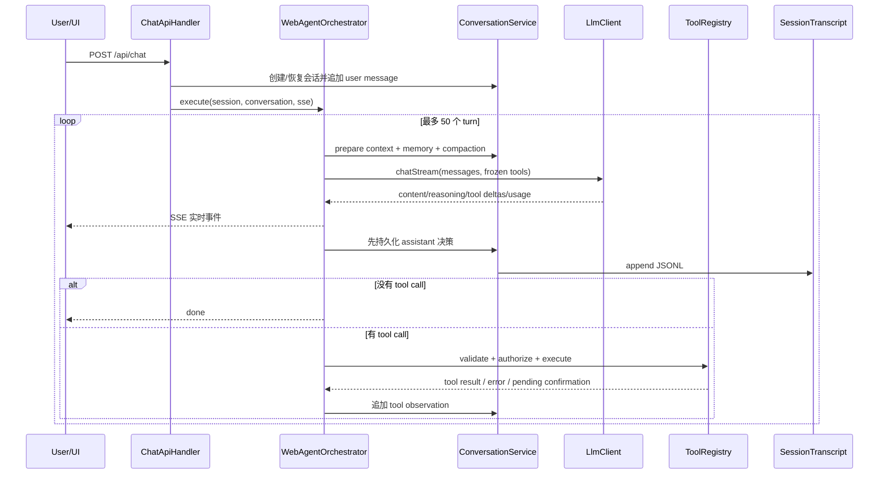
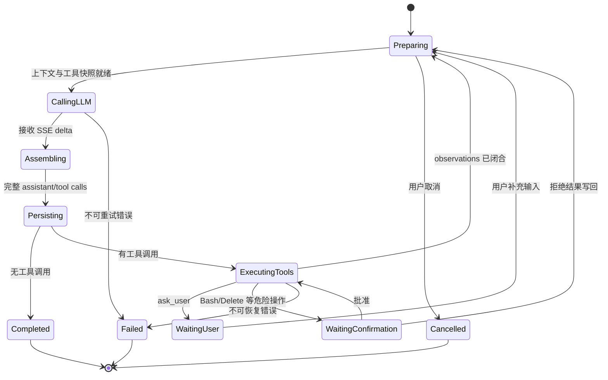
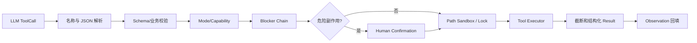

# HippoBuddy Agent 专项面试手册

这份手册只解决一个目标：让你能围绕 HippoBuddy，把 Agent 从概念讲到协议、状态、工具、安全、上下文、记忆、并发、Sub-Agent、MCP、测试和生产化，而不是停留在“会调用大模型 API”。

如果面试官继续追问状态所有权、源码执行顺序、崩溃窗口、幂等、DAG 调度、MCP 生命周期和状态机改造，转到 [Agent 实现原理深度手册](AGENT_IMPLEMENTATION_DEEP_DIVE.md)。

## 1. 一句话抓住 Agent 的本质

> Agent 是一个闭环决策系统：LLM 根据目标和当前状态提出 action，受控 Runtime 校验并执行 action，把 observation 写回状态，再决定继续、暂停、失败或完成。

可以形式化为：

```text
(goal, state) --policy/LLM--> action --runtime/environment--> observation --> new state
```

- LLM 是不可信、概率性的策略函数；
- Runtime 是可信执行环境，掌握权限、校验、副作用和终止权；
- Conversation 不只是聊天记录，也是 Agent 的工作状态；
- ToolCall 是 action，ToolResult 是 observation；
- Agent Loop 把一次概率输出变成可持续执行的任务过程。

### Agent、Chatbot 与 Workflow

| 类型 | 下一步由谁决定 | 优点 | 风险/边界 |
|---|---|---|---|
| Chatbot | 一次模型响应 | 简单、成本低 | 不能主动作用于环境 |
| Workflow | 程序预定义流程 | 可控、可测试、稳定 | 难处理开放目标 |
| Agent | 模型动态选择动作，Runtime 约束 | 灵活处理不确定任务 | 成本、停滞、安全和可恢复性更难 |

好的系统通常是混合架构：确定性强的步骤用 Workflow，开放性决策交给 Agent，危险副作用由 Runtime 和人工确认控制。

## 2. HippoBuddy 的完整 Agent 主链



源码阅读顺序：

1. [`ChatApiHandler`](../src/main/java/com/example/agent/web/handler/ChatApiHandler.java)：HTTP 输入、Session、SSE 和异常出口；
2. [`WebAgentOrchestrator`](../src/main/java/com/example/agent/web/orchestrator/WebAgentOrchestrator.java)：主循环、流式事件、工具执行和暂停；
3. [`ConversationService`](../src/main/java/com/example/agent/application/ConversationService.java)：上下文、记忆、转录和恢复；
4. [`AbstractLlmClient`](../src/main/java/com/example/agent/llm/client/AbstractLlmClient.java)：Provider 请求、流式合并、Usage 和取消；
5. [`ToolRegistry`](../src/main/java/com/example/agent/tools/ToolRegistry.java)：工具发现、参数解析、Blocker 和文件锁；
6. [`SessionTranscript`](../src/main/java/com/example/agent/session/SessionTranscript.java)：JSONL 追加与刷盘。

## 3. Agent Loop 状态机



### 项目真实执行顺序

1. 读取 Session 中冻结的 `AgentMode`；
2. 为会话建立稳定的 Tool Schema 快照，避免每轮顺序和描述变化；
3. 从 `ConversationService` 获取推理上下文；
4. 保证 system message 在首位，清理孤儿 tool calls；
5. `chatStream` 增量接收 reasoning、content、tool call 和 usage；
6. 合并成完整 assistant message；
7. 先持久化 assistant 的决策；
8. 无 tool call 则发送 `done`；
9. 有 tool call 则校验并执行，所有成功/失败都形成 observation；
10. 若进入确认或询问用户状态则暂停，否则继续下一轮；
11. 取消、异常、空响应和 `MAX_TURNS=50` 都能结束循环。

### 五个核心不变量

1. `assistant.tool_call.id` 必须被同 id 的 tool result 闭合；
2. 必须先记录 action，再执行副作用，否则崩溃后无法解释已发生的动作；
3. 等待确认时不能偷偷进入下一轮 LLM；
4. 工具失败也必须作为 observation 写回，不能让模型误以为成功；
5. 终态不能继续迁移，恢复时必须区分持久状态和 TCP/SSE 等瞬时状态。

### 为什么 `MAX_TURNS` 不够

最大轮数只能保证有界，无法识别低效循环。生产级还需要：

- 重复动作指纹：`toolName + normalizedArgs + resultHash`；
- 进展检测：diff、Todo、新信息、错误数量是否变化；
- 连续失败上限；
- 总 deadline；
- Token/费用预算；
- 对可逆与不可逆动作使用不同策略。

当前 [`WebAgentOrchestrator`](../src/main/java/com/example/agent/web/orchestrator/WebAgentOrchestrator.java) 中 StopHook 列表为空，这是可主动说明的改进点。

## 4. Function Calling / Tool Calling

Function Calling 不是“模型执行函数”，而是模型生成结构化调用意图：

```json
{
  "id": "call_123",
  "type": "function",
  "function": {
    "name": "read_file",
    "arguments": "{\"path\":\"README.md\"}"
  }
}
```

Runtime 需要完成六件事：

1. 根据 Registry 判断工具是否存在；
2. 把增量 arguments 合并成完整 JSON；
3. 按 JSON Schema 与业务规则校验；
4. 检查当前 Mode/Capability 和安全 Blocker；
5. 执行工具并捕获所有失败；
6. 用原 `callId` 写回 tool result。

### 为什么流式参数不能逐 chunk 解析

SSE 可能把 `{"path":"README.md"}` 拆成多个片段，单个片段不是合法 JSON。合并通常按 tool-call index/id 维护累积器：name 取首次非空值，arguments 顺序 append，终态后统一解析。还要防御重复 id、乱序 index、缺失 name、终态未闭合等情况。

### Tool Schema 的工程意义

Schema 同时服务于模型选择与 Runtime 校验，但它不是完整安全边界：

- schema 能限制类型、必填字段、枚举和基本格式；
- 不能独自判断路径是否越界、命令是否危险、用户是否授权；
- 描述和工具顺序变化还会破坏 Prompt 前缀稳定性；
- HippoBuddy 因而为会话冻结 Tools 快照。

深入复习：[Function Calling 与工具协议](backend-knowledge/03-agent-llm/02-function-calling.md)、[SSE Delta 解析与增量合并](backend-knowledge/03-agent-llm/03-stream-delta-assembly.md)。

## 5. Tool Runtime 与安全边界



### 必须讲清的防线

- `ToolRegistry`：名称到 Executor 的注册表，也是统一执行入口；
- JSON 参数校验：把模型输出视为不可信外部输入；
- `AgentMode`：按聊天、编码、办公场景提供不同能力集合；
- Blocker Chain：责任链依次检查 schema、并发编辑和危险命令；
- Path Sandbox：当前实现会绝对化、规范化并校验工作区边界；生产化还应以 `toRealPath`/父目录真实路径校验防符号链接逃逸；
- Human-in-the-loop：对 Bash/Delete 等副作用暂停并生成可消费的一次性确认；
- File Lock：多个目标路径规范化、去重、固定排序加锁，避免循环等待；
- Snapshot/Undo：文件操作用补偿机制恢复，不宣称拥有数据库 ACID；
- Truncation：限制大输出，保留类型语义和 head/tail，而非无脑截字符串。

### Prompt Injection 的正确回答

Prompt Injection 不能仅靠“再写一段系统提示”解决。外部网页、文件和 MCP 返回内容都是数据，不应自动升级为指令；真正安全边界应在 Runtime：最小权限、工具白名单、参数校验、路径沙箱、网络域限制、秘密隔离、危险操作确认、审计日志和预算限制。

## 6. 上下文工程、Prompt Cache 与记忆

### 三类状态不要混淆

| 层 | 内容 | 生命周期 | 主要目标 |
|---|---|---|---|
| Working Context | 当前 system/user/assistant/tool 消息 | 当前推理请求 | 保持任务连贯和协议合法 |
| Session Memory | 长会话摘要、目标、进度和关键事实 | 当前 Session | 压缩后恢复工作状态 |
| Long-term Memory | 跨会话偏好、经验和知识 | 多个 Session | 在未来任务中按需召回 |

### 为什么不能简单 `subList`

按消息条数裁剪可能留下孤立 tool result 或丢失对应 assistant tool call，造成 Provider 拒绝请求或模型误解状态。正确做法是按完整 turn 分组，保护 system prompt、最近用户目标、未闭合工具对和最近有效 observation，再按预算选择保留、摘要或降级裁剪。

### HippoBuddy 上下文链

[`ConversationService`](../src/main/java/com/example/agent/application/ConversationService.java) 为每个 Session 组装：

- `BudgetWarningInjector`：预算阈值观察；
- `AutoCompactTrigger`：自动压缩触发；
- `MemoryRetriever`：长期记忆检索与上下文头；
- `SessionMemoryExtractor`：会话摘要提取；
- `MemoryExtractor`：长期记忆提取；
- `MemoryConsolidator`：后台整合；
- `SessionTranscript`：原始事实日志。

### Prompt Cache

Prompt Cache 依赖稳定前缀。通常把 system prompt、固定规则和 Tool Schema 放前面，把高变化的用户输入、工具结果放后面。HippoBuddy 冻结会话 system prompt 和 tools snapshot，并记录 cache read/miss usage。前缀缓存降低延迟和费用，但不能替代应用侧结果缓存，也不能保证供应商一定命中。

### Memory/RAG 面试边界

文件型 Markdown Memory 的优势是可解释、可编辑、零部署；缺点是规模、语义召回、多进程一致性有限。数据量增大后可以演进为 BM25/关键词 + embedding + rerank 的混合检索，但必须用固定问题集评估 Recall@K、Precision@K、答案正确率和额外 Token 成本，不能只因“向量库流行”就引入。

## 7. 多 Provider、流式、重试与错误

### Adapter 层

项目用统一 `LlmClient` 隔离 OpenAI Chat Completions、Responses、Anthropic 和 Ollama 差异。上层只理解统一的 `Message`、`ToolCall`、`ChatResponse`、`StreamChunk` 和 `Usage`。

Provider 适配不只是改 URL，还包括：

- system message 和多模态内容结构；
- tool schema 与 tool result 格式；
- SSE event 类型和结束标记；
- reasoning/content/tool delta；
- usage 和 prompt-cache 字段；
- 错误 body、限流语义和 timeout。

### 三种超时

1. connect timeout：TCP/TLS 建连失败；
2. request/read timeout：整体请求或读操作超时；
3. idle timeout：已经开始流式响应，但超过阈值没有任何新字节。

SSE 半开连接最容易漏掉第三种。`IdleTimeoutInputStream`/watchdog 通过最后读取时间主动关闭流，让卡死转化为可处理异常。

### 重试的判断

- 可重试：临时网络错误、429、部分 5xx、连接中断；
- 通常不可重试：认证失败、参数错误、内容策略、确定性 schema 错误；
- 退避：指数退避 + jitter + `Retry-After`；
- 幂等：纯 LLM 请求可相对安全重试，带外部副作用的工具不能盲目重放；
- 边界：重试必须受次数、deadline 和取消控制。

## 8. 并发、背压与取消

### 虚拟线程不等于无限并发

虚拟线程降低“等待型任务占用平台线程”的成本，但不会增加 LLM quota、内存、文件句柄、网络连接或子进程容量。因此：

- HTTP 和短 I/O 可以使用每任务虚拟线程；
- Sub-Agent、LLM 并发和外部进程仍需 Semaphore/有界队列；
- 文件编辑需要锁和版本检查；
- 每个 Session 的 Agent Loop 通常应串行，避免同一历史并发分叉写入。

### 取消必须端到端传播

```text
UI cancel
  → SessionCancelManager
  → Orchestrator 每轮/工具前检查
  → LlmClient abortCurrentRequest / 关闭流
  → BashProcessManager 终止子进程
  → 不再执行剩余工具
  → 记录 cancelled 终态
```

只 `Future.cancel(true)` 不够，因为第三方库、阻塞 I/O 和子进程未必响应线程中断。需要显式关闭 socket/stream、销毁 Process，并保证 finally 清理锁、MDC 和 pending state。

## 9. Sub-Agent

Sub-Agent 适用于可独立、边界清楚、结果可合并的任务，例如并行扫描不同模块。不适合高耦合、共享写同一文件或每一步都依赖前一步结论的任务。

### 项目模型

- `ForkAgentTool` / `ForkAgentsTool`：把模型意图转为子任务；
- [`SubAgentManager`](../src/main/java/com/example/agent/subagent/SubAgentManager.java)：任务注册、状态、调度、取消和查询；
- [`SubAgentRunner`](../src/main/java/com/example/agent/subagent/SubAgentRunner.java)：创建轻量 Conversation 并执行子 Agent；
- `SubAgentPermission`：限制子 Agent 工具能力；
- `SubAgentResultFormatter`：把大结果压缩成父 Agent 可消费 observation；
- EventBus 事件：Started、Progress、Waiting、Completed、Failed。

### 面试必须覆盖的治理

1. 有界并发和队列，避免 Agent 爆炸；
2. 父子上下文只传必要目标与稳定前缀，避免完整复制历史；
3. 子 Agent 默认最小权限；
4. deadline、取消和父任务结束时的级联处理；
5. 结果按任务 id 确定性归并；
6. 限制结果大小，防止父上下文被吞噬；
7. 为每个子任务记录 Token、费用、状态和失败原因；
8. 写冲突任务应串行或声明文件所有权。

多 Agent 不天然优于单 Agent。收益必须覆盖额外上下文、协调、冲突和成本。

## 10. MCP

MCP 的价值是把外部能力标准化为 Tool、Resource 和 Prompt，使 Agent Runtime 不必为每个外部服务手写私有协议。

### 一次典型生命周期

```text
创建 transport
  → initialize request
  → initialize response(capabilities/protocolVersion)
  → initialized notification
  → tools/list、resources/list、prompts/list
  → 注册成本地适配器
  → tools/call 或 resources/read
  → 超时、断线、取消、重连、注销
```

### JSON-RPC 要点

- request 有 `id`，response 必须用相同 id 关联；
- notification 没有 id，不期待响应；
- `result` 与 `error` 互斥；
- 客户端维护 `id → CompletableFuture` pending map；
- timeout/disconnect 时必须清理并失败所有 pending future。

### Transport

- stdio：本地子进程，边界清楚、延迟低；要处理 stderr、进程退出和行协议污染；
- SSE/HTTP：适合远程服务；要处理鉴权、重连、空闲超时和消息端点发现。

HippoBuddy 已有 [`McpServiceManager`](../src/main/java/com/example/agent/mcp/McpServiceManager.java)、stdio/SSE client、JSON-RPC handler 及 Tool/Resource/Prompt registry；面试时要把“协议实现”和“产品主链完整启用”分开陈述。

## 11. Prompt、Rule、Skill、Tool、MCP 的边界

| 概念 | 本质 | 是否直接产生副作用 | 典型例子 |
|---|---|---:|---|
| Prompt | 当前推理的角色、目标和约束 | 否 | coding mode system prompt |
| Rule | 长期适用的约束策略 | 否 | 项目编码规范、禁止操作 |
| Skill | 可按需加载的领域工作说明 | 间接 | TDD 流程、代码审查步骤 |
| Tool | Runtime 可执行的结构化动作 | 是/可能 | read_file、bash、edit_file |
| MCP | 暴露 Tool/Resource/Prompt 的标准协议 | 取决于远端能力 | 外部数据库或 SaaS 工具 |

面试易错点：Skill 不是 Tool，MCP 也不是“另一种大模型”。Skill 改变模型如何工作，Tool 改变模型能对环境做什么，MCP 解决外部能力如何标准接入。

## 12. 持久化与恢复

JSONL 适合本地会话的原因：追加成本低、每行可独立解析、容易审计和流式写入，尾部半行损坏通常只影响最后一条。它不是数据库 WAL，也不天然提供事务、二级索引、多进程并发和跨记录约束。

Agent 恢复比聊天恢复更难，因为必须处理：

- assistant action 已记录但 tool result 缺失；
- 工具副作用已发生但进程在 result 落盘前崩溃；
- 正在等待确认；
- SSE 已断开；
- RUNNING 状态在重启后不能继续假装运行。

生产级做法是给 run/step/tool-call 建显式状态和幂等键。重启后将瞬时 RUNNING 转成 INTERRUPTED；对缺失 observation 的调用按工具幂等性决定查询、补失败、人工确认或补偿，不能统一重放。

## 13. 可观测性、测试与 Eval

### 四层指标

| 层 | 指标 |
|---|---|
| LLM | 首 Token 延迟、总延迟、Token、缓存命中、费用、错误分类 |
| Agent | turn 数、完成率、停滞率、取消率、最终原因 |
| Tool | 调用量、成功率、P95、确认率、拒绝率、截断率 |
| Sub-Agent/MCP | 队列、活跃数、超时、重连、每任务成本 |

日志回答“发生了什么”，指标回答“整体是否异常”，Trace 回答“一次请求跨组件如何流转”。应以 sessionId/runId/turn/toolCallId 关联全链路，跨线程时显式传播 MDC。

### 测试金字塔

1. 纯函数单测：delta 合并、状态迁移、路径解析、截断、错误分类；
2. Fake LLM：脚本化返回 tool call → result → final，验证 Agent Loop；
3. Fake SSE Server：拆帧、半包、空闲、429、5xx 和异常 body；
4. Tool 契约测试：schema 与 Executor 参数一致；
5. MCP 契约测试：initialize/list/call、乱序 response、timeout、disconnect；
6. 恢复测试：在每个持久化边界注入崩溃；
7. Agent Eval：固定任务集测完成率、正确率、turn、Token、费用和副作用；
8. 少量真实 Provider 测试：验证第三方协议漂移，不让普通 CI 依赖真实费用。

“LLM 输出不稳定”不是不测试的理由。应把确定性 Runtime 充分单测，把概率性行为用数据集、阈值和多次采样评估。

## 14. Agent 安全威胁模型

优先准备以下威胁及防线：

| 威胁 | 例子 | 防线 |
|---|---|---|
| Prompt Injection | 网页内容要求泄露密钥 | 数据/指令隔离、最小权限、秘密不可见 |
| Path Traversal | `../../outside` | canonical/real path、工作区校验、符号链接策略 |
| Command Injection | 拼接 Shell 参数 | 结构化参数、白名单、危险命令 Blocker、确认 |
| SSRF | web_fetch 访问内网元数据 | URL/协议/地址段校验、重定向复检、域策略 |
| 数据外泄 | 把本地文件发送到外部 | egress policy、敏感信息检测、确认和审计 |
| DoS/成本攻击 | 无限循环或子 Agent 爆炸 | turn/deadline/Token/费用/并发预算 |
| MCP 供应链 | 恶意远端工具描述或返回 | Server 信任、能力白名单、输出视为数据、隔离 |
| 并发覆盖 | 两个 Agent 写同一文件 | 文件所有权、固定序锁、版本校验、快照补偿 |

## 15. 高频面试题与回答骨架

### Q1：Agent 和普通大模型聊天的区别？

聊天通常一次输入输出；Agent 增加状态、工具、循环和终止条件。LLM 决定候选 action，Runtime 执行并返回 observation，因此能完成多步环境任务，也引入权限、成本、停滞和恢复问题。

### Q2：你们的 Agent Loop 怎么跑？

会话级冻结 mode/tools，准备上下文并清理协议孤儿，流式调用模型，合并完整 assistant/tool calls，先持久化决策；无工具则结束，有工具则经 Registry/Blocker/确认/锁执行，把结果按 callId 写回，再进入下一轮。取消、等待、错误、空响应和 50 轮上限都能收敛。

### Q3：为什么先保存 tool call 再执行？

日志先行能在崩溃后解释副作用来源。反过来执行后才记录，一旦中途崩溃，就出现系统已改变但历史没有 action 的不可恢复状态。

### Q4：如何保证工具调用历史合法？

每个 assistant tool call 都要有同 callId 的 tool result；裁剪按完整 turn，失败也写 observation；请求前清理孤儿只是恢复兜底，根本方案是让 action/result 的持久化协议可恢复。

### Q5：如何防止 Agent 无限循环？

最大步数只是最后防线，还要有重复动作指纹、进展检测、连续失败阈值、deadline、Token/费用预算和取消。检测到停滞时可以先把 warning 写回模型，给一次自我修正机会。

### Q6：模型返回的工具参数安全吗？

不安全。它与任何外部输入一样，需要 JSON/schema、业务语义、权限、路径、命令和网络策略校验；危险副作用还要人工确认，模型从不直接获得系统权限。

### Q7：SSE 为什么适合这里？

主要通信是服务端持续向 UI 推送 content、reasoning、tool progress 和 usage，单向流与 HTTP 语义匹配，实现简单。若需要高频双向交互或二进制通道再考虑 WebSocket。

### Q8：如何处理流式卡死？

区分 connect/request/idle timeout；每次读到字节更新 lastReadTime，watchdog 超过 idle 阈值就关闭流并统一分类异常，同时响应 Session 取消。

### Q9：为什么需要 Tools 快照？

保持同一会话的能力语义和 Prompt 前缀稳定，防止配置热更新、MCP 动态注册或 HashMap 顺序变化导致模型每轮看到不同工具集合并击穿缓存。切换 mode 或新会话时再重建。

### Q10：上下文满了怎么办？

先估算 Token，按完整 turn 保护 system、目标和 tool 对；超过阈值时摘要旧历史并保留最近轮次，失败时再安全裁剪。原始 transcript 独立保存，压缩上下文不是删除事实日志。

### Q11：Memory 和上下文压缩有什么区别？

压缩解决当前窗口容量，Session Memory 保存当前任务状态，长期 Memory 用于跨会话召回。三者的写入条件、生命周期和检索方式不同，不能用一个“摘要”概念混在一起。

### Q12：什么时候用 Sub-Agent？

任务可独立、结果可压缩、写冲突可避免且并行收益高于协调成本时使用。需要有界并发、父子取消、最小权限、结果排序和预算；强依赖链仍应串行。

### Q13：MCP 解决什么问题？

它标准化外部 Tool/Resource/Prompt 的发现和调用，底层用 JSON-RPC，经 stdio 或 HTTP/SSE transport。它解决接入协议，不自动解决授权、可信度、成本和 Prompt Injection。

### Q14：为什么不用向量数据库？

当前是单机个人、规模有限的可编辑 Markdown 记忆，关键词索引更简单可解释。规模和语义召回需求上升后再用混合检索，并以评测集证明收益。

### Q15：虚拟线程能否解决所有并发问题？

不能。它降低阻塞等待的线程成本，不增加外部配额，也不消除竞态、背压和死锁。昂贵资源仍需有界调度，共享状态仍需原子性设计。

### Q16：重试工具调用有什么风险？

工具可能已经产生副作用。LLM 读取类请求较易重试，支付、删除、写文件等必须有幂等键、状态查询、确认或补偿，不能把 HTTP 重试策略机械套到工具层。

### Q17：如何测试 Agent？

用 Fake LLM 脚本化每轮输出，Fake Tool 记录副作用，验证状态转移和 action/result 配对；流协议用 Fake SSE Server；概率性效果用固定任务集统计成功率、成本和副作用。

### Q18：如何演进成多租户 SaaS？

增加鉴权/RBAC/租户隔离，把工具放进容器或远程 worker；会话事件进入 PostgreSQL，对象存储保存大结果；任务队列提供幂等、租约、重试和预算；SSE 网关支持断线续传；集中审计所有副作用。

## 16. 项目亮点的 STAR 讲法

### 故事一：流式连接半开

- S：服务端已经返回响应头，但长时间没有新 chunk；
- T：避免 Agent 请求永久占用线程和 Session；
- A：区分请求超时与 idle timeout，用 watchdog 关闭流并统一错误分类；
- R：卡死变成可观测、可取消、可重试的失败。

### 故事二：上下文压缩破坏工具协议

- S：简单裁剪历史会留下孤立 tool call/result；
- T：在 Token 有限时仍保证 Provider 协议合法；
- A：按完整 turn 分组，保护关键消息，摘要旧历史，保留原始 transcript；
- R：长会话可继续推理，同时保留恢复和审计能力。

### 故事三：并发文件编辑

- S：多个工具或 Sub-Agent 可能同时修改重叠文件；
- T：避免覆盖、死锁和不可撤销修改；
- A：规范化路径、固定顺序锁、编辑前版本检查、快照和 Undo；
- R：把文件副作用从“直接写”变成可检测、可补偿的受控动作。

### 故事四：稳定 Prompt 前缀

- S：每轮 tools 描述或顺序变化导致缓存命中下降；
- T：降低长会话延迟和 Token 成本；
- A：冻结 system prompt、mode 和会话级 tools snapshot，记录 cache usage；
- R：稳定前缀可观测，异常命中率可以告警和定位。

## 17. 可主动承认的技术债

1. `WebAgentOrchestrator` 超过千行，状态分散在循环变量和多个 pending map；可重构成 `AgentRunState + transition + effects`；
2. StopHook 接口存在但当前列表为空；应补重复动作和无进展检测；
3. 等待确认 continuation 仍应增强 run/version/idempotency 语义；
4. JVM 内路径锁无法覆盖多进程，应结合版本号、OS 锁或集中存储；
5. `PathSecurityUtils` 当前主要依赖 normalize + startsWith，没有完整解析符号链接真实路径；
6. `McpServiceManager` 有协议实现但主启动代码未实例化，`RecallMemoryTool` 的正式注册也仍被注释；
7. MCP、Memory、Sub-Agent 要分别核对“协议代码、启动接线、UI 产品路径”三层完成度；
8. 本地文件存储没有多租户事务和查询能力，SaaS 化应迁移事件与元数据；
9. Agent Eval 需要固定数据集和回归门禁，不能只靠单元测试数量证明质量。

技术债的回答结构：为什么当前场景可以接受 → 风险触发条件 → 下一步设计 → 如何迁移与验证。不要包装成“已经完美解决”。

## 18. 白板前必须能画的六张图

1. `/api/chat` 到 final answer 的完整时序图；
2. Agent Loop 状态机；
3. SSE tool-call delta 合并器；
4. Tool Runtime 五层安全边界；
5. Working Context / Session Memory / Long-term Memory 三层图；
6. Parent Agent → bounded scheduler → Sub-Agent → result merge 图。

## 19. 最后自测

- [ ] 30 秒和 2 分钟项目介绍都能闭卷完成；
- [ ] 能把一次 Agent turn 精确讲到 action 先落盘、observation 后闭合；
- [ ] 能列出所有暂停、失败和终止条件；
- [ ] 能解释 5 个 Agent 不变量；
- [ ] 能回答 Prompt Injection 为什么不是 Prompt 能单独解决；
- [ ] 能比较 Agent/Workflow、SSE/WebSocket、关键词/向量、单/多 Agent；
- [ ] 能解释 Token、缓存命中、费用和延迟的关系；
- [ ] 能给出 Sub-Agent 与 MCP 的完整生命周期；
- [ ] 能设计 Fake LLM、Fake Tool、Fake SSE Server 和恢复测试；
- [ ] 能主动说出 3 个真实技术债及演进方案。

若任一项说不清，回到对应专题，而不是重新通读全部文档：

- [Agent Loop](backend-knowledge/03-agent-llm/01-agent-loop-state-machine.md)
- [Function Calling](backend-knowledge/03-agent-llm/02-function-calling.md)
- [工具安全](backend-knowledge/04-tools-security/02-blocker-capability.md)
- [上下文压缩](backend-knowledge/05-context-storage/02-context-compaction.md)
- [Sub-Agent](backend-knowledge/06-extension-quality/01-subagent-scheduling.md)
- [MCP](backend-knowledge/06-extension-quality/02-jsonrpc-mcp.md)
- [Agent 安全](backend-knowledge/06-extension-quality/07-threat-model.md)
