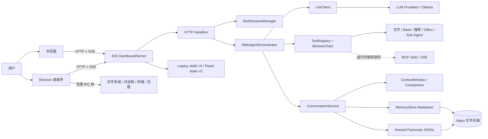
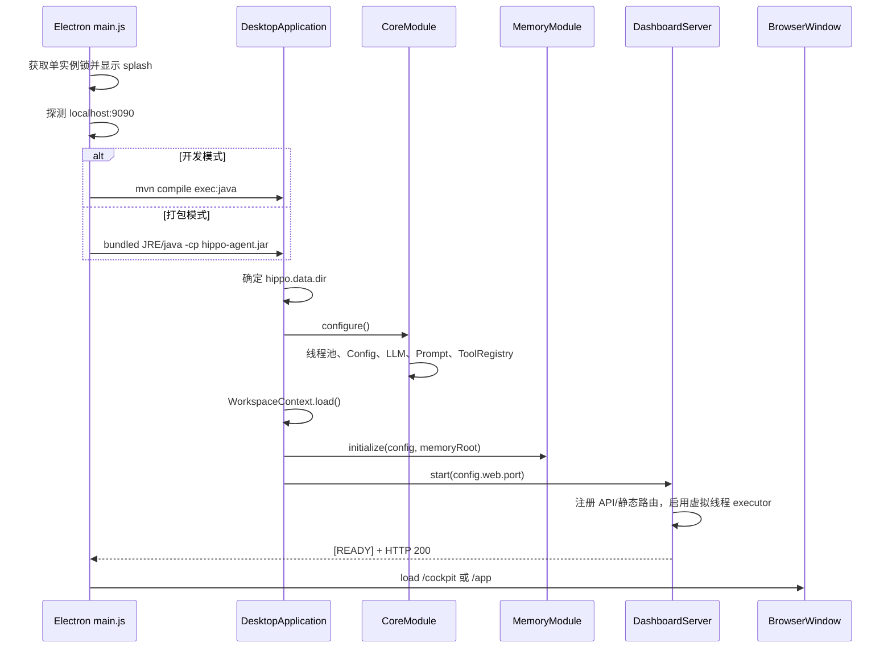
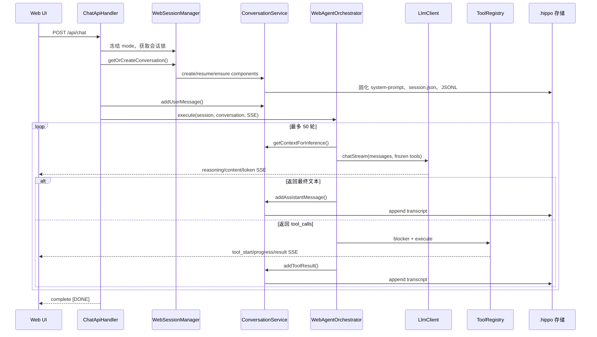

# HippoBuddy 项目架构报告

> 分析日期：2026-08-25  
> 分析基线：`main` / `ee31022`  
> 分析方式：源码、构建配置、资源、CI 与测试代码静态核验；未运行外部服务。

## 1. 执行摘要

HippoBuddy 是一个面向聊天、编码和办公场景的本地优先 AI Agent 桌面应用。它采用“Electron 桌面壳 + Java 21 Agent 后端 + 本地 Web UI”的单机架构，也可以脱离 Electron 以纯 Web 服务方式运行。

项目不是 Spring 应用。后端直接使用 JDK `HttpServer`、Java 虚拟线程和手写 `ServiceLocator` 进行服务装配；Agent 核心由 LLM 流式客户端、会话上下文、工具注册表、安全阻断器、记忆系统和 JSONL 转录存储组成。默认桌面 UI 仍是 `src/main/resources/static/` 下的原生 JavaScript；`frontend/` 中另有一套正在迁移的 React/Vite UI。

总体判断：项目功能覆盖较广，核心 Agent 循环、会话恢复、工具回滚、上下文压缩和多模型适配均已有实质实现；但安全边界、CI 质量门禁、双前端发布链路和若干运行时接线仍存在明显缺口。当前更适合“可信本机上的个人桌面应用”，不适合直接作为局域网或公网多用户服务部署。

### 关键结论

- 后端共有 315 个 Java 源文件、约 53,379 行；其中 `tools`、`web`、`llm` 和 `memory` 是复杂度最高的四个模块。
- 核心聊天链路是 `POST /api/chat → ChatApiHandler → WebAgentOrchestrator → LlmClient → ToolRegistry → ConversationService → JSONL/SSE`。
- 项目没有关系型数据库、ORM 或数据库迁移系统；会话、记忆、配置和日志全部以 JSON、JSONL、Markdown、YAML 和文本文件持久化。
- Java 测试资产丰富，但 CI 中后端测试被注释，发布构建显式跳过测试；React UI 没有测试文件，也未进入主 CI/Release 构建链路。
- 本地 HTTP 服务绑定所有网卡、没有应用级鉴权，多个接口开放 `Access-Control-Allow-Origin: *`，且 `/api/file/raw` 可按任意绝对路径读取文件。这是当前最高优先级风险。
- `WebSessionManager.getSessionJsonlPath()` 指向 `.hippo/memory/sessions/<当天>/...`，而真实 transcript 位于 `.hippo/sessions/<会话日期>/...`，导致会话文件变更检测和相关指标读取失效。
- MCP 实现代码完整度较高，但 `McpServiceManager` 没有被任何启动或装配代码实例化，配置中的 `auto_connect` 当前不会真正发生。
- `/app` 映射到 `static-v2`，但当前仓库没有该产物，Release 也没有执行 `frontend` 构建；React 启动脚本在全新发布产物中不可依赖。

## 2. 项目规模与仓库边界

### 2.1 主要子项目

| 路径 | 定位 | 构建体系 | 当前角色 |
|---|---|---|---|
| `src/main/java` | Agent 后端、HTTP API、工具和本地存储 | Maven / Java 21 | 主运行时 |
| `src/main/resources/static` | 原生 JS/CSS 桌面与 Web UI | 根目录 npm 脚本构建 vendor | 默认 UI |
| `frontend` | React 18 + TypeScript + Vite UI | 独立 npm 工程 | 迁移中的 `/app` UI |
| `electron` | 桌面窗口、Java 子进程、系统 IPC、自动更新 | Electron Builder | 桌面壳与安装包 |
| `website` | 产品文档网站 | Docusaurus 3 | 独立发布 |
| `tree-sitter-wasm` | Rust/WASM 语法解析器源码 | Cargo / Make | Java 进程内语法诊断 |
| `scripts` | CodeMirror、OOXML、Docx 预览等资源构建 | Node.js | vendor 资源生成 |

仓库有 4 份独立 `package-lock.json`：根 UI、Electron、React UI、文档网站。锁文件合计描述约 2,421 个 package 条目，意味着依赖升级和供应链维护需要按四条链路分别管理。

### 2.2 Java 模块规模

| 模块 | 文件数 | 约行数 | 主要职责 |
|---|---:|---:|---|
| `tools` | 57 | 11,239 | 文件、Shell、搜索、Office、回滚、Sub-Agent 工具 |
| `web` | 35 | 8,904 | HTTP 路由、SSE、会话管理、Agent 编排 |
| `llm` | 33 | 6,892 | OpenAI/Anthropic/Ollama/Responses 客户端、流解析、重试 |
| `memory` | 27 | 5,624 | Markdown 记忆库、检索、提取、整合 |
| `domain` | 23 | 2,992 | Conversation、Rule、Skill、AST、内容截断 |
| `core` | 29 | 2,885 | DI、线程池、事件、健康检查、安全 Blocker |
| `mcp` | 26 | 2,222 | MCP stdio/SSE 客户端、协议和注册表 |
| `session` | 8 | 2,127 | Session 元数据、JSONL transcript、加载修复 |
| `subagent` | 16 | 2,094 | 子代理生命周期、运行、权限与日志 |
| `config` | 14 | 1,953 | YAML/JSON/properties 配置与热更新模型 |
| `context` | 13 | 1,626 | Token 预算、压缩、裁剪、阻塞保护 |
| 其他 | 34 | 4,917 | prompt、logging、service、console、入口等 |

复杂度集中明显。最大的类包括：

- `ResponsesLlmClient`：1,404 行
- `WebAgentOrchestrator`：1,126 行
- `MemoryStore`：1,053 行
- `AbstractLlmClient`：981 行
- `AnthropicLlmClient`：883 行
- `FileChangeTracker`：879 行
- `ConversationService`：868 行

这些类横跨协议适配、状态管理、持久化或 UI 事件协议，是后续拆分和回归测试的优先区域。

## 3. 技术栈

### 3.1 运行时与框架

| 层 | 技术 |
|---|---|
| Java 运行时 | Java 21，启用 preview features |
| HTTP 服务 | JDK `com.sun.net.httpserver.HttpServer` |
| 并发 | 虚拟线程、`CompletableFuture`、并发 Map、定时线程池 |
| 依赖注入 | 手写静态 `ServiceLocator`，构造器反射解析 |
| 序列化 | Jackson Databind/YAML/JSR-310 2.16.1 |
| HTTP 客户端 | Java `HttpClient` + OkHttp/SSE 4.12.0 |
| HTML 解析 | Jsoup 1.17.2 |
| Token 估算 | jtokkit 1.1.0 |
| WASM | Chicory runtime/WASI 1.7.5 + Rust Tree-sitter WASM |
| Diff | java-diff-utils 4.12 |
| Office | Apache POI 5.4.1；浏览器端 OOXML/docx-preview |
| 日志 | SLF4J 2.0.9 + Logback 1.4.14 |
| 桌面壳 | Electron `^35.0.0`、electron-builder 25、electron-updater 6 |
| 默认前端 | 原生 ES Modules + CSS + CodeMirror + Marked/KaTeX/Mermaid |
| 新前端 | React 18.2、Zustand 4.5、TypeScript 5.3、Vite 5、DOMPurify |
| 文档站 | Docusaurus 3.10.2、React 19、TypeScript 6 |
| 测试 | JUnit 5、Mockito、AssertJ、JaCoCo、Vitest、jsdom |

README 中的 Electron 32 已与实际 `electron/package.json` 的 Electron 35 漂移。

### 3.2 架构选择

后端明确选择无 Spring、无 ORM、无 LangChain 框架的轻量实现：

- JDK HTTP Server 直接注册 handler；
- `CoreModule.configure()` 按层级构造共享服务；
- `ToolRegistry` 同时承担工具目录、参数 schema、安全 Blocker 和执行分派；
- `ConversationService` 负责会话领域状态、上下文组件、记忆触发和 transcript；
- `WebAgentOrchestrator` 负责 LLM/工具的多轮状态机和 SSE 协议。

优点是依赖少、启动路径直、易于定制；代价是生命周期、线程安全、鉴权、中间件、事务与可观测性都要由项目自行实现。

## 4. 总体架构



### 4.1 后端模块职责

- `core`：全局线程池、DI、事件总线、健康检查、Todo 与工具调用 Blocker。
- `llm`：统一 `LlmClient` 接口和多协议实现，支持流式内容、reasoning、tool call、usage 与服务端搜索事件。
- `web`：HTTP API、静态资源、SSE、会话锁、确认交互和核心 Agent 循环。
- `application`：当前只有 `ConversationService`，实际承担较重的应用服务角色。
- `domain`：相对纯粹的会话、规则、技能、AST 和截断模型。
- `tools`：Agent 可调用能力及文件变更追踪、安全路径、结果截断和回滚。
- `context`：推理前上下文、Token 预算、自动压缩和摘要。
- `session`：append-only JSONL 与会话索引、崩溃修复、兼容加载。
- `memory`：文件即记忆、关键词相关性、会话记忆和长期提取。
- `subagent`：并行子任务运行器和父子会话边界。
- `mcp`：客户端与动态工具/资源/prompt 适配；当前未接入启动链。

## 5. 启动流程

### 5.1 桌面端



开发模式由 Electron 执行：

```text
mvn compile exec:java -Dexec.mainClass=com.example.agent.DesktopApplication
```

打包模式优先使用 `electron/resources/jre`，其次要求系统 Java 21+；它把 Electron `userData` 下的 `.hippo` 作为后端数据目录，并通过 `-Dhippo.data.dir` 传入。

Electron 默认加载 `/cockpit`，传入 `--react-ui` 或 `HIPPO_UI=react` 时加载 `/app`。生产模式先显示本地 splash，检测后端日志就绪后再轮询 HTTP，确认 200 才切换主界面。

一个配置边界需要注意：Electron 的 `HIPPO_PORT` 只改变壳的探测和加载端口；Java `DesktopApplication` 仍读取 `config.web.port`。若只设置 `HIPPO_PORT` 而未同步 `config.yaml`，前后端端口会不一致。

### 5.2 纯 Web 端

`WebApplication` 的流程是：

1. 解析可选 `--port`；
2. 设置 AWT headless；
3. `CoreModule.configure()`；
4. `MemoryModule.initialize()`；
5. 注册关闭钩子，停止 HTTP Server 和共享线程池；
6. `DashboardServer.start()` 并由 `CountDownLatch` 保持进程运行。

Web 模式可由浏览器访问，但当前没有多用户隔离、身份认证、租户边界或服务端权限模型，不应直接暴露到不可信网络。

### 5.3 HTTP 路由

| 路由组 | 主要端点 | 作用 |
|---|---|---|
| Chat | `/api/chat` | SSE 流式 Agent 请求 |
| Tool | `/api/tool/confirm`、`/api/tool/abort` | 危险操作确认、取消 |
| Session | `/api/sessions` | 列表、消息、重命名、删除、置顶、恢复等 |
| Workspace/File | `/api/workspace`、`/api/files`、`/api/file/raw`、`/api/git/status` | 工作区和文件预览 |
| Config | `/api/config`、`/api/settings/data-dir` | 模型、工具、数据目录配置 |
| Context | `/api/system-prompts`、`/api/rules/*`、`/api/skills/*` | Prompt、规则与技能管理 |
| Memory/Metrics | `/api/memories`、`/api/metrics`、`/sse/memory-events` | 记忆和指标 |
| Static | `/cockpit`、`/chat`、`/`、`/app` | 默认 UI 与 React UI |

服务为每个 HTTP 请求创建虚拟线程。会话级并发由 `WebSessionManager` 中每个 `sessionId` 的 `ReentrantLock` 串行化，不同会话可并行运行。

## 6. 核心业务调用链

### 6.1 一次聊天请求



关键细节：

1. `ChatApiHandler` 解析会话 ID、消息、模式、图片和手动规则；验证 LLM 配置后获取会话锁。
2. System Prompt 在会话创建时注入模式、规则、工作区、技能清单、日期和环境信息，并写入 `system-prompt.txt` 固化。
3. `WebAgentOrchestrator` 为每个会话冻结 tool schema；同一 mode 后续请求复用，提升 LLM 服务端前缀缓存命中率。
4. 每轮推理前由 `ConversationService` 结合 ContextWindow、记忆和 compaction 状态生成有效上下文。
5. LLM 流同时发送 reasoning、content、tool call、usage 和服务端 web search 事件。
6. 助手消息先落入 Conversation，再异步追加 JSONL；有工具调用则执行后进入下一轮，直到模型不再调用工具或达到 50 轮。
7. 请求取消通过 `SessionCancelManager` 共享状态传递给 LLM 流和工具执行。

### 6.2 工具执行与安全确认

`CoreModule` 默认注册文件读写、Office、目录、Glob、Grep、AskUser、Bash、Todo、WebFetch、语法诊断和 Skill 工具。Web Search 与 Sub-Agent 工具按配置启用。

工具执行有三层控制：

- `SchemaValidationBlocker`：校验参数；
- `ConcurrentEditBlocker`：限制冲突编辑；
- `BashDangerousCommandBlocker`：拒绝或要求确认危险命令。

特殊分支：

- `bash`：危险级别为“确认”时暂停循环，通过 SSE 发送确认卡片；确认后恢复剩余 tool calls。命令输出按 200ms 节流流式推送。
- `delete_file`：先预览，拒绝 `.git`、`node_modules`、`.env` 等保护目标，再按配置确认。
- `ask_user`：保存 `PendingToolCall` 并发送 `waiting_user`，下一条用户消息作为 tool result 恢复循环。
- 普通工具：通过 `ToolRegistry.execute()` 再次走 Blocker，并根据文件路径使用文件锁。
- 所有工具输出进入 `TruncationService`，防止超长结果直接撑满上下文。

### 6.3 会话恢复与上下文管理

`ConversationService.resumeConversation()` 从 transcript 恢复消息，并处理三种情况：

- 无 transcript：新会话；
- Token 未超过 70% 阈值：恢复全部消息；
- 已有 `session-memory.md` 且 Token 超阈值：加载早期摘要并保留最近消息。

加载器可识别损坏或截断的最后一行，并修复孤立 tool call。上下文运行时还有预算警告、自动压缩、摘要和工具结果裁剪。

### 6.4 记忆链路

每个会话创建以下组件：

- `SessionMemoryExtractor`：生成会话内摘要；
- `MemoryExtractor`：按配置从对话提取长期记忆；
- `MemoryRetriever`：按标题、标签、类型和最近访问进行关键词相关性检索；
- `MemoryConsolidator`：后台整合候选记忆。

长期提取默认关闭，会话提取默认开启。`MemoryModule` 当前明确不向 `ToolRegistry` 注册记忆工具；MemoryStore 的 `addPendingMemory()` 仍是空操作，AutoDream 默认也关闭。因此“记忆存储与提取已有实现”不等于“所有记忆功能默认可用”。

### 6.5 MCP 和 Sub-Agent

Sub-Agent 可通过配置注册 4 个工具，运行时会创建独立轻量 Conversation，并限制递归 fork。

MCP 支持 stdio 和 SSE/HTTP 客户端，具备 initialize、tools、resources、prompts 和断线处理代码；但全仓库只有 `McpServiceManager` 自身引用，没有启动代码创建并调用 `initialize()`。所以当前配置页和 `config.yaml` 中的 MCP 服务器不会自动接入 ToolRegistry，这是“实现存在、装配缺失”的功能状态。

## 7. 数据库与持久化设计

### 7.1 结论：没有数据库

项目没有 JDBC、SQLite、PostgreSQL、MySQL、H2、Hibernate、JPA、Flyway 或 Liquibase 依赖。`java.sql` 只出现在打包 JRE 模块集合，不代表应用使用数据库。

数据模型由本地文件表达：

```text
.hippo/
├── config.yaml                    # LLM、工具、会话、上下文、MCP 等配置
├── config/workspace.txt           # 最近选择的工作区
├── sessions/
│   └── yyyy-MM-dd/
│       └── <sessionId>/
│           ├── session.json       # workspacePath、mode、pinned、lastActivityAt 等
│           ├── system-prompt.txt  # 会话创建时的固定 Prompt
│           ├── conversation.jsonl # append-only 消息流水
│           ├── tool-results/
│           ├── plans/
│           ├── subagents/
│           └── memory/session-memory.md
├── memory/
│   ├── MEMORY.md                  # 轻量索引
│   └── <uuid>.md                  # frontmatter + 一条长期记忆
├── rules/*.md
├── skills/*.md
├── logs/system/
├── logs/conversations/
└── default-workspace/
```

### 7.2 会话模型

`session.json` 是轻量索引和 UI 元数据；`conversation.jsonl` 是事实来源。Transcript 条目可表示：

- user / assistant / system message；
- tool result、toolName、toolCallId、耗时和成功状态；
- usage；
- custom title、tag；
- compact boundary 和 summary；
- uuid、parentUuid、时间、cwd、git branch、版本等审计信息。

写入策略：

- 每个 SessionTranscript 使用最多 10,000 条的内存队列；
- 每 500ms 或累计 50 条批量追加并 flush；
- UUID 缓存用于幂等去重；
- 关闭时 force flush；
- 队列等待 100ms 仍满时会记录警告并丢弃该条 transcript；
- 初始化/写入失败时尝试降级或恢复。

`SessionStorage` 写 `session.json` 时采用临时文件加原子移动，但 `WebSessionManager` 更新 mode、pin、lastActivityAt 时直接整文件读改写，且没有统一文件锁或原子替换，存在并发丢字段和半写文件风险。

### 7.3 长期记忆模型

每条记忆是一个 `<uuid>.md`：正文外带 id、类型、标签、创建/更新时间、访问统计和 scope 等 frontmatter。`MemoryStore` 在内存维护 `ConcurrentHashMap<String, MemoryEntryMeta>`，正文按需读盘。

可靠性设计包括：

- JVM 内按记忆 ID 加锁；
- 临时文件写入、`fsync`、原子移动；
- 写前沙箱检查；
- MEMORY.md 异步重建；
- 索引与实际文件数不一致时全量扫描恢复。

查询不是向量搜索。废弃的 `searchSimilar()` 固定返回空列表；当前检索主要依赖标题、标签、类型与关键词评分。`MEMORY.md` 限制为 200 行/25KB，因此超过 200 条记忆后索引会截断，并在下次启动因“索引数与文件数不一致”触发全目录扫描。

### 7.4 文件存储的适用边界

适合：单用户、本地运行、数据量有限、需要可读可编辑和易备份的桌面 Agent。

不适合：多进程写入、多用户并发、跨设备同步、强事务、复杂统计查询、细粒度权限和高规模记忆检索。若未来定位不变，不一定需要引入数据库；优先补齐原子元数据写入、统一路径解析、备份/恢复和 schema version 即可。

## 8. 外部依赖与集成

### 8.1 LLM Provider

工厂枚举支持：DashScope、OpenAI、Ollama、Azure、Anthropic、Custom、DeepSeek Chat Completions、DeepSeek Responses、智谱、Moonshot、MiniMax、StepFun、零一万物、豆包、SiliconFlow 和讯飞。

实现实际收敛为四类客户端：

- OpenAI-compatible：大多数云厂商；
- Anthropic Messages；
- Ollama 本地兼容端点；
- DeepSeek Responses API。

网络层支持流式 SSE、取消、idle timeout、usage、reasoning、tool call delta、错误分类与 RetryPolicy。

### 8.2 搜索、网页与 MCP

- Web Search：Brave Search 或 Tavily，默认关闭；DeepSeek Responses 可使用服务端内置搜索。
- Web Fetch：OkHttp 抓取页面，Jsoup 清理为文本，最大返回 50,000 字符。
- MCP：stdio 子进程或 SSE/HTTP；代码存在但当前未装配到启动链。

### 8.3 本地原生能力

- 捆绑多平台 ripgrep 二进制，并提供 Java fallback；
- Tree-sitter Rust parser 编译为 WASM，通过 Chicory 在 JVM 内执行；
- Apache POI 和浏览器 OOXML/WASM 双路线预览/生成 Office 文件；
- Electron IPC 提供文件、对话框、终端、外链、通知、主题、窗口和自动更新能力；
- Electron Builder 使用 jlink 生成精简 JRE，发布 Windows NSIS、macOS DMG 和 Linux AppImage。

## 9. 测试与质量门禁

### 9.1 静态测试资产

| 测试层 | 文件/用例规模 | 覆盖区域 |
|---|---:|---|
| Java | 159 个 `.java` 测试文件、约 44,360 行、约 2,557 个测试注解 | tools、web、memory、LLM、session、context、rule/skill、DI 等 |
| Legacy JS | 20 个 `*.test.js`，约 457 个 `it/test` 调用 | SSE、聊天 UI、会话、diff、文件预览、设置等 |
| React UI | 0 个 test/spec 文件 | 无自动化测试 |
| Electron | 0 个自动化测试文件 | 无主进程/IPC/打包 smoke test |

POM 声明 JaCoCo 目标：行覆盖 80%、分支覆盖 70%。这只是配置目标，当前流水线没有真正执行或强制它。

### 9.2 CI/Release 现状

- `.github/workflows/ci.yml` 安装根 npm 依赖并运行 Legacy JS 测试；`mvn test` 被注释。
- CI 不构建、不 lint、不测试 `frontend/` React 工程。
- Release 只构建根 vendor，然后执行 `mvn package -DskipTests`。
- Release 没有执行 `npm --prefix frontend run build`，所以不会生成 `/static-v2`。
- Electron 没有启动 smoke test，无法验证 JRE、JAR、端口和 UI 组合是否能真正启动。

### 9.3 本次验证结果

本次工作区没有任何 `node_modules`。`npm test` 因找不到 Vitest 未执行。

`mvn test` 在解析 JaCoCo 依赖时，因受限的全局 Maven 本地仓库不可写而失败；后续依赖下载/外部写入授权未获允许，因此没有生成 surefire 或 JaCoCo 报告。该结果是“环境阻断、测试未运行”，不是代码测试失败，也不能据此宣称测试通过。

## 10. 风险清单与整改优先级

### P0：立即处理

#### R1. 未鉴权 HTTP API 暴露本机文件和 Agent 能力

已确认事实：

- `HttpServer.create(new InetSocketAddress(port), 0)` 未指定 loopback，默认可监听所有网卡；
- API 没有应用级认证/授权中间件；
- 多数 handler 设置 `Access-Control-Allow-Origin: *`；
- `/api/file/raw?path=<绝对路径>` 会直接读取任意常规文件，未限制到工作区；
- API 还能修改配置、操作工作区、触发聊天和工具。

影响：同一局域网客户端或本机恶意网页可能读取本地文件、发起 Agent 操作或修改配置。即使目标只是桌面应用，这也是高影响边界突破。

建议：

1. 默认绑定 `127.0.0.1`/`::1`；Web 对外模式必须显式开启。
2. Electron 启动时生成随机会话 token，所有 API/SSE 必须验证。
3. 严格校验 `Origin`/`Host`，移除通配 CORS；增加 CSRF 防护。
4. `RawFileHandler` 和所有文件 API 强制 canonical path 位于当前工作区或受控数据目录。
5. 对“桌面本地”和“远程 Web”定义两套独立权限配置。

#### R2. Electron IPC 文件桥权限过宽

`contextIsolation=true`、`nodeIntegration=false` 是正确基础，但 `sandbox=false`，preload 向任意渲染页面开放绝对路径的读、写、创建、重命名、回收站删除、终端和外链能力。若 Legacy UI、Markdown/Mermaid/Office 预览或依赖出现 XSS，攻击者可直接升级为本地文件系统能力。

建议：启用渲染 sandbox 和强 CSP；IPC 使用工作区句柄而不是任意路径；主进程验证 canonical path 和调用来源；`openExternal` 只允许 `https:` 等白名单协议；为高风险 IPC 增加确认或能力 token。

### P1：近期修复

#### R3. 会话热重载读取了错误目录

真实 transcript 路径由 `WorkspaceManager.getSessionMessagesFile()` 生成：

```text
.hippo/sessions/<session-date>/<sessionId>/conversation.jsonl
```

但 `WebSessionManager.getSessionJsonlPath()` 当前生成：

```text
.hippo/memory/sessions/<today>/<sessionId>/conversation.jsonl
```

同时它使用“当天日期”而非从 sessionId 解析的会话日期。结果是 `shouldReloadSession()` 通常认为文件不存在，文件变更检测、大小指标和缓存重载逻辑不能按设计工作。现有 `WorkspaceSwitchPromptTest` 描述了该契约，但没有创建真实 transcript 来验证路径。

建议：唯一使用 `WorkspaceManager.getSessionMessagesFile(sessionId)`；增加跨日期会话、外部修改和热重载集成测试。

#### R4. 后端测试和覆盖率未进入 CI/发布门禁

后端是核心运行时，却没有在 CI 执行；发布还显式跳过测试。声明的 80%/70% JaCoCo 阈值实际未守门。

建议：CI 至少执行 `mvn verify --batch-mode`；按 Linux/Windows 拆分平台相关测试；Release 必须依赖 CI 成功产物，不再单独 `-DskipTests` 绕过门禁。

#### R5. React UI 发布链断裂

`DashboardServer` 注册 `/app → /static-v2`，Vite 也配置输出到该目录，但当前目录不存在，Release 没有 React build。`start:react`/`dev:react` 与发布产物的能力不一致。

建议：若 React 已准备上线，将 `npm --prefix frontend ci && npm --prefix frontend run build` 纳入 CI/Release，并加 API/SSE 端到端测试；若仍是实验版，从面向用户的启动和服务日志中隐藏 `/app`，避免形成错误承诺。

#### R6. MCP 配置未接入运行时

配置默认 `mcp.enabled=true` 且 `auto_connect=true`，UI 也有 MCP 设置页，但启动代码从未创建 `McpServiceManager`。用户会误以为配置已生效。

建议：在 ToolRegistry 建立后显式构造并注册 McpServiceManager，启动完成后异步 initialize，关闭时 shutdown；同步定义 MCP 工具何时进入会话级冻结 tool snapshot。若功能尚未发布，应把默认开关和 UI 标记为实验状态。

#### R7. `web_fetch` 存在 SSRF 边界

工具只验证 http/https 和 URL userinfo，没有拒绝 loopback、私网、link-local、云元数据地址或重定向到内网。来自网页内容的 prompt injection 可能诱导 Agent 探测本机/内网服务。

建议：解析并校验每次 DNS 结果与重定向目标；默认拒绝 localhost、RFC1918、link-local、IPv6 本地地址和元数据地址；提供显式企业内网 allowlist。

### P2：计划治理

#### R8. API Key 前缀写入日志且配置明文持久化

`ConfigLoader` 会记录 API Key 前 10 个字符；`config.yaml` 和 model history snapshot 也保存完整 key。前缀泄露可能帮助识别凭证或污染日志归档。

建议：日志只记录“是否配置”和不可逆 fingerprint；桌面端使用 OS keychain/credential vault，配置文件只保存引用；至少收紧 `.hippo` 文件权限并提供敏感日志清理说明。

#### R9. 文件元数据写入缺少统一事务边界

SessionStorage 有原子写，但 WebSessionManager 对同一个 `session.json` 的 mode、pin、lastActivityAt 等采用多处直接读改写。并发 handler 可能互相覆盖字段，进程崩溃可能留下半写 JSON。

建议：抽出单一 `SessionMetadataRepository`，按 sessionId 加锁并统一执行 temp + fsync + atomic move；加 schemaVersion 和恢复策略。

#### R10. Transcript 在高压时允许静默降级和丢消息

队列达到 10,000 且 100ms 内不能入队时，系统只 WARN 并丢弃该条。写盘失败也会清空队列并禁用持久化。UI 内存态仍可能继续，看起来成功但重启后缺历史。

建议：把持久化健康状态回传 UI；对 user/assistant/tool result 采用不同优先级；提供同步兜底或 backpressure；为磁盘满、权限丢失和队列饱和增加故障注入测试。

#### R11. 全局静态状态与巨型编排类增加演进风险

WebAgentOrchestrator、WebSessionManager、MemoryModule、ServiceLocator 等大量使用静态单例/Map。`ServiceLocator.freeze()` 只在测试中使用，生产没有冻结；同时热更新又会覆盖 LlmClient。多处 800–1,400 行类把协议、状态机、事件编码和错误处理混在一起。

建议：优先拆分 `WebAgentOrchestrator` 为 LLM turn、tool dispatcher、confirmation continuation、SSE event mapper；把 SessionManager 和运行时 services 改为显式 application scope；定义受控热更新接口而不是覆盖全局单例。

#### R12. 文档与代码存在漂移

- README 声称存在 `orchestrator/` DAG 模块，实际没有该目录；
- README 把 `execute/` 描述为 Agent 对话循环，实际仅剩 `AgentTurnResult` 与 `StopHook`，循环位于 web orchestrator；
- README 标注 Electron 32，实际依赖 Electron 35；
- README 的“原生 JS 前端”没有解释并存的 React 迁移线；
- 记忆、MCP 和 React UI 的“代码存在”与“默认可用”状态没有清楚区分。

建议：由本报告反向更新 README 和网站架构文档；在功能矩阵中区分 stable、experimental、implemented-but-unwired。

## 11. 架构优势

- Agent 循环具备明确的轮次上限、取消信号、确认续跑和孤立 tool call 修复。
- 会话级 System Prompt 与 tool schema 固化，专门保护长会话前缀缓存稳定性。
- 文件工具有 schema 校验、危险命令阻断、删除预览、文件锁、快照和回滚链。
- JSONL transcript 具有 append-only、UUID 去重、批量刷盘、崩溃尾行修复和兼容加载设计。
- MemoryStore 使用可读 Markdown、fsync 和原子移动，便于本地备份和人工审计。
- LLM 协议层覆盖 reasoning、usage、tool delta、取消、错误分类和多 provider。
- 虚拟线程与每会话锁符合本地多会话 Agent 的并发模型。
- 测试代码规模大，说明核心边界已有较强测试意识；主要问题在于流水线没有执行这些资产。

## 12. 建议演进路线

### 第一阶段：安全与真实性（立即）

1. HTTP 仅绑定 loopback，增加随机 token、Origin/Host 校验和路径沙箱。
2. 修复 `getSessionJsonlPath()`，补跨日期/真实磁盘测试。
3. 删除 API Key 前缀日志。
4. 恢复 `mvn verify` CI，确保发布不能绕过。

### 第二阶段：打通已承诺功能

1. 明确 React UI 是否进入主线；进入则补构建、测试和发布。
2. 正式装配 MCP lifecycle，或在 UI/配置中降级为实验状态。
3. 统一 SessionMetadataRepository，消除 session.json 多写者。
4. 给 Electron IPC 建立工作区能力边界和端到端安全测试。

### 第三阶段：降低核心复杂度

1. 拆分 WebAgentOrchestrator 和超大 LLM client。
2. 减少静态全局状态，显式管理 application/session 生命周期。
3. 对 transcript 和 memory 加 schema version、备份、压缩与损坏恢复指标。
4. 建立依赖更新、SBOM 和漏洞扫描流程。

## 13. 建议的质量门禁

一个可执行的最小流水线应包含：

```text
backend:  mvn verify
legacy:   npm ci && npm test && npm run build:vendor
react:    npm --prefix frontend ci
          npm --prefix frontend run lint
          npm --prefix frontend run build
website:  npm --prefix website ci && npm --prefix website run build
desktop:  npm --prefix electron ci
          启动打包 JAR + HTTP smoke test + Electron smoke test
security: dependency/SBOM scan + localhost API/path boundary tests
```

建议把以下契约作为必须通过的集成测试：

- 服务只监听 loopback，未授权请求返回 401/403；
- 任意绝对路径、`..`、symlink 不能逃离工作区；
- 跨日期会话能恢复并检测外部 transcript 变更；
- Bash/Delete 确认后剩余工具按预期续跑；
- 磁盘满、JSONL 尾行损坏、队列饱和可被 UI 感知；
- MCP 工具在新会话可见，旧会话 tool snapshot 保持稳定；
- Legacy 与 React 对同一 SSE 事件序列得到一致状态；
- 打包后的 JRE、JAR、静态资源和自动更新元数据完整。

## 14. 最终定位

HippoBuddy 已经不是 README 中的“simple command-line AI Agent”，而是一个具备桌面壳、多模型协议、Agent 工具循环、本地知识与 Office 能力的中型本地应用平台。它当前最有价值的架构资产是：可读的本地数据、透明的工具执行、较完整的会话恢复以及不依赖重量框架的可控后端。

下一阶段不应首先继续扩功能面，而应把安全边界、CI 门禁、MCP/React 接线和存储一致性补齐。完成这些工作后，项目会从“功能丰富的个人 Agent”更接近“可稳定交付的桌面 Agent 平台”。
