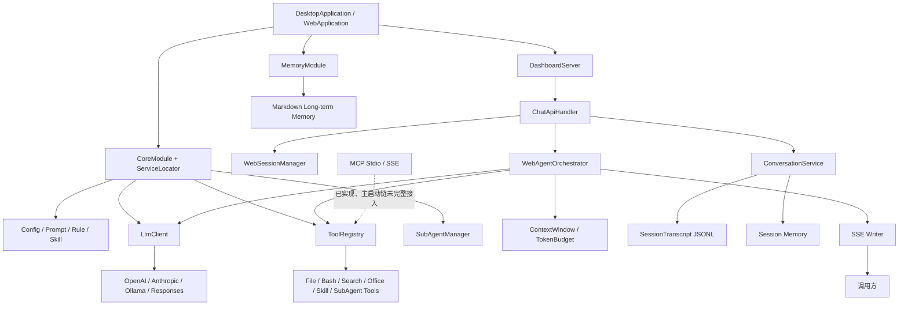

# HippoBuddy 后端技术路线与面试手册

> 分析范围：仅 `src/main/java/com/example/agent` 后端代码，不展开 Electron、React/Vue、静态页面等前端实现。  
> 分析基线：2026-08-25 当前工作区静态代码。  
> 使用目标：帮助项目作者梳理技术路线、理解实现原理，并能在面试中准确、有层次地讲清项目。
> 配套阅读：[《后端知识点实现原理与本质详解》](BACKEND_KNOWLEDGE_POINTS_DEEP_DIVE.md)。  
> 独立专题知识库：[《42 个后端知识单元》](backend-knowledge/README.md)，每篇包含概念、原理、Demo、思维导图和掌握检查。

## 1. 先给项目一个准确定位

HippoBuddy 不是传统的“Controller → Service → DAO → MySQL”管理系统，而是一个本地运行的 AI Coding Agent 后端。它以 Java 21 为运行时，自己实现了 LLM 多供应商适配、SSE 流式对话、Agent 多轮推理循环、工具调用与安全拦截、上下文压缩、会话恢复、长期记忆、子 Agent 和 MCP 协议客户端。

项目后端约有 315 个 Java 源文件、5.3 万行代码。它没有引入 Spring，也没有使用关系型数据库；HTTP 层基于 JDK `HttpServer`，并通过虚拟线程处理请求。数据主要以 JSONL、JSON、YAML 和 Markdown 文件保存在 `.hippo` 工作目录中。

一句话技术路线：

> Java 21 + JDK HttpServer/虚拟线程 + Jackson + Java HttpClient/OkHttp + SSE + 文件型持久化，围绕 Agent Loop 构建可扩展的 LLM 客户端、工具系统、上下文治理、记忆与子 Agent 平台。

### 30 秒面试介绍

> 我做的是一个 Java 版的本地 AI Coding Agent。后端没有依赖 Spring，而是用 Java 21、JDK HttpServer 和虚拟线程实现轻量服务；核心是一个最多 50 轮的 Agent Loop，它把 LLM 流式输出、工具调用、安全审批、会话持久化和上下文压缩串起来。项目支持 OpenAI、Anthropic、Ollama 等多种模型协议，提供文件、Shell、搜索、代码诊断、Office 和子 Agent 工具。数据采用 JSONL 和 Markdown 本地存储，适合单机桌面应用，也重点处理了 SSE 半开连接、并发文件写入、危险命令确认、会话中断恢复和 Token 超限等问题。

### 2 分钟面试介绍

> 这个项目的目标是做一个本地优先的 AI Coding Agent，而不只是一个聊天客户端。启动时会初始化手写 DI 容器、模型客户端、Prompt、规则、技能、工具注册表、记忆系统和健康指标，然后启动 JDK HttpServer。用户发起对话后，ChatApiHandler 建立 SSE 通道并获取会话锁，WebAgentOrchestrator 进入 Agent Loop：先组装系统提示词、历史消息和记忆，再调用 LLM 的流式接口；如果模型返回工具调用，就经过模式权限、参数 Schema、并发编辑和危险 Shell 命令等拦截器，再执行工具并把结果写回上下文，继续下一轮推理，直到模型返回最终文本或触发取消、审批、轮数上限。
>
> 长会话方面，我用 TokenBudget 做阈值监听，在 75%、85%、90%、95% 和 97.5% 分阶段告警或保护；压缩时按完整对话轮次保留工具调用配对，并结合会话摘要和 session-memory 恢复。持久化没有用数据库，因为项目主要是单用户本地桌面场景：会话使用追加式 JSONL，元数据使用原子替换，记忆使用带 frontmatter 的 Markdown 文件并维护内存索引。这种设计部署简单、可读可迁移，但也意味着多实例一致性、查询能力和事务性不如数据库，这是我会继续改进的方向。

## 2. 后端总架构



### 核心分层

| 层次 | 主要模块 | 责任 |
|---|---|---|
| 入口与交付 | `desktop`、根入口、`web`、`console`、`progress` | 启动应用、暴露 HTTP/SSE、传递进度和确认事件 |
| 应用编排 | `application`、`execute`、`web.orchestrator` | 串联会话、LLM、工具、停止条件和持久化 |
| 领域能力 | `domain`、`context`、`memory`、`session`、`subagent`、`mcp` | 对话模型、上下文治理、记忆、恢复、并行 Agent 和协议扩展 |
| 基础设施 | `llm`、`tools`、`logging`、`config`、`service` | 外部模型、操作系统/文件工具、日志、配置、Token 计算 |
| 公共内核 | `core`、`prompt` | DI、并发池、事件、健康检查、安全拦截、提示词装配 |

## 3. 后端模块全景表

| 顶层模块 | 技术路线 | 重点知识点 | 面试价值 |
|---|---|---|---|
| `application` | 以 `ConversationService` 为应用服务，聚合会话、上下文、记录和记忆 | 应用服务、生命周期、恢复与一致性 | 解释为什么不能把所有逻辑塞进 Handler |
| `config` | Jackson YAML/JSON + 环境变量解析 + 分区配置对象 | 配置分层、默认值、密钥注入、配置校验 | 讲多模型和多环境如何配置 |
| `console` | JLine/控制台渲染与交互辅助 | CLI 输入输出、终端兼容 | 次要模块，可说明历史/备用交付形态 |
| `context` | Token 预算监听 + 滑动窗口 + LLM 摘要 +压缩状态机 | 上下文窗口、阈值事件、消息不变量、降级策略 | 项目最有区分度的模块之一 |
| `core` | 手写 DI、虚拟线程池、事件总线、健康检查、Blocker Chain | IoC、并发、观察者、责任链、生命周期 | 展示底层设计能力 |
| `desktop` | 桌面入口协调数据目录和 Web 服务 | 本地应用生命周期、OS 数据目录 | 解释本地优先定位 |
| `domain` | 对话、规则、技能、AST、输出截断等领域模型 | DDD 边界、策略模式、WASM 解析 | 说明业务规则不是散落在基础设施里 |
| `execute` | Agent 单轮结果与 StopHook | 终止条件、停滞检测、状态表达 | 解释无限循环如何防护 |
| `llm` | 抽象客户端 + 多供应商适配 + SSE 增量解析 + 重试 | 适配器、流式协议、超时、指数退避、错误分类 | 核心技术亮点 |
| `logging` | SLF4J/Logback + MDC + 工作区日志 + 成本/事件指标 | 可观测性、上下文传播、指标 | 解释如何排查长链路问题 |
| `mcp` | JSON-RPC 2.0 + stdio/SSE Transport + 注册表/适配器 | 协议设计、进程通信、异步 Future、重连 | 展示开放生态设计，但要如实说明接入状态 |
| `memory` | Markdown 文件即记忆 + 元数据索引 +自动提取/整合 | 本地知识存储、检索、缓存、沙箱、原子写 | 与传统 RAG 的设计对比 |
| `progress` | 工具执行回调、进度状态和 Spinner | 回调、状态事件、交互反馈 | 辅助模块 |
| `prompt` | 类路径 Prompt 库 +模式化 Prompt 装配 | Prompt 版本化、组合、稳定前缀 | 连接模型效果和工程治理 |
| `service` | TokenEstimator 多实现、标题生成 | Strategy/Factory、近似计算与精确计算 | 支撑成本和上下文控制 |
| `session` | JSONL 追加日志 +元数据原子写 +恢复/修复 | WAL 思想、异步批量刷盘、幂等、崩溃恢复 | 非数据库持久化的核心论证 |
| `subagent` | 有界线程池 +任务状态机 +父子会话复制/共享 | 并行任务、依赖、超时、权限、结果汇总 | 复杂 Agent 能力亮点 |
| `tools` | Tool Schema 注册 +责任链拦截 +文件锁 +大量工具适配 | 插件化、命令模式、安全边界、并发控制 | 项目代码量最大、面试必讲 |
| `web` | JDK HttpServer +虚拟线程 + SSE +会话锁 | HTTP、长连接、取消、背压、会话并发 | 对外主链路 |

下面按模块展开。

## 4. 启动与依赖装配

### 4.1 `DesktopApplication` / `WebApplication` / `desktop`

技术路线：用两个轻量入口区分桌面打包运行和纯 Web 运行，共享同一套核心初始化逻辑。

启动顺序：

1. 确定 `.hippo` 数据目录和当前工作区。
2. 调用 `CoreModule.configure()` 初始化线程池、配置、LLM、工具和领域服务。
3. 调用 `MemoryModule.initialize()` 扫描记忆文件并注册记忆服务。
4. 调用 `DashboardServer.start(port)` 注册 HTTP 路由并启动服务。
5. 注册 shutdown hook，主线程通过 `CountDownLatch` 保活。

实现原理：入口只负责生命周期，不直接承载业务。桌面入口会根据 `hippo.data.dir`、开发目录或操作系统应用数据目录确定存储位置；Web 入口支持端口参数和 headless 模式。Maven Shade 插件最终生成以 `DesktopApplication` 为 Main-Class 的 fat jar。

面试知识点：

- 应用启动阶段的依赖初始化顺序；
- shutdown hook 和优雅关闭；
- 本地应用与 Server 应用共享内核；
- fat jar、Java 21 preview 参数。

建议讲法：

> 我把入口类控制得很薄，启动阶段只做数据目录、DI、Memory 和 HTTP Server 四步装配。这样桌面版和 Web 版可以复用所有应用服务，差异只停留在启动参数和宿主生命周期上。

### 4.2 `core.di`：手写 DI 容器

关键类：`CoreModule`、`ServiceLocator`。

技术路线：不用 Spring 容器，使用 `ConcurrentHashMap<Class<?>, Object>` 保存单例，支持 Provider、反射构造、循环依赖检测和冻结机制。

实现原理：

- `CoreModule` 按基础设施 → 领域服务 → 工具层的顺序显式注册对象；
- `ServiceLocator.get(type)` 优先取单例，再取 Provider，最后尝试反射构造；
- 用 ThreadLocal 保存当前构造栈，发现重复类型时判断循环依赖；
- `freeze()` 后禁止继续注册，避免运行期误覆盖依赖；
- 测试可以替换单例，降低部分组件的构造成本。

优点：依赖少、启动快、初始化过程直观。缺点：Service Locator 会隐藏依赖，一些类在方法内部 `get()`，可测试性和编译期约束弱于构造器注入；当前生产入口也没有明确调用 `freeze()`，冻结保护更多出现在测试中。

面试追问：为什么不用 Spring？

> 这是本地单进程 Agent，不需要 MVC、ORM、事务等完整生态。选择轻量 DI 可以降低包体和启动成本，也让我能控制对象初始化顺序。但如果演进为多人服务或模块继续膨胀，我会迁移到构造器注入为主的 DI，并在启动完成后强制冻结容器。

## 5. `web`：HTTP、SSE 和 Agent 主链路

### 5.1 技术路线

- HTTP Server：JDK `com.sun.net.httpserver.HttpServer`；
- 并发模型：`Executors.newThreadPerTaskExecutor(Thread.ofVirtual())`；
- API 组织：每个路径一个 `HttpHandler`；
- 流式响应：SSE，事件包括 reasoning、content、tool_start、tool_progress、tool_result、tool_confirmation、token_update、error；
- 会话并发：同一 session 加锁，不同 session 可并行；
- 中断：`SessionCancelManager` 保存取消状态，LLM 和工具边界均检查。

### 5.2 请求调用链

```text
POST /api/chat
  → ChatApiHandler 解析请求、设置 SSE Header
  → WebSessionManager 获取 session lock、重置取消标记
  → ConversationService 新建/恢复 Conversation
  → WebAgentOrchestrator.execute()
      → 组装系统 Prompt、工具 Schema、记忆和历史消息
      → LlmClient.chatStream()
      → 增量推送 reasoning/content/token 事件
      → 合并 tool_call deltas
      → ToolRegistry 安全检查并执行工具
      → 工具结果写入 Conversation 和 JSONL
      → 继续下一轮 LLM 推理
  → 释放 session lock、结束 SSE
```

### 5.3 `WebAgentOrchestrator` 的 Agent Loop

Agent Loop 是后端最核心的业务算法：

```text
for turn in 0..49:
    检查取消与上下文状态
    准备推理消息和当前模式可见工具
    流式请求 LLM
    将文本/思考/Token 增量发送给调用方
    持久化 assistant message
    if 没有 tool_calls: 正常结束
    for tool_call:
        权限检查 → 安全拦截 → 必要时暂停等待用户确认
        执行工具 → 截断输出 → 持久化 tool_result → SSE 回传
    StopHook 判断是否停滞
达到 50 轮仍未结束: 强制停止并告警
```

工具列表会按 AgentMode 过滤，并为同一会话冻结一个快照。这样可以保持 Prompt/Tool Schema 的稳定前缀，提高支持前缀缓存的模型供应商的缓存命中率。代码还记录 cache hit token 和命中率，长会话命中异常时会告警。

### 5.4 SSE Writer 的实现意义

SSE 适合服务端单向、逐 Token 推送，不需要 WebSocket 的双工协议和连接状态复杂度。`SseWriter` 通过内部队列和独立写线程串行写事件，并及时 `flush`，避免多个产出线程直接并发写 ResponseBody。

需要主动讲出的工程问题：

- 客户端断开时写操作可能阻塞或抛异常，因此需要取消和关闭传播；
- 生产级 SSE 还需要心跳、背压上限、代理超时配置和断线续传策略；
- 当前服务面向本地运行，HTTP Server 默认没有完整的生产网关能力。

### 5.5 面试问题

**为什么用虚拟线程？**

LLM 请求、SSE、文件和 Shell 都是 I/O 密集型任务。虚拟线程允许每请求/每任务保持直观的同步代码结构，又能避免平台线程被大量长连接耗尽。但虚拟线程不能自动解决锁竞争、无限队列、外部连接数和 native 调用阻塞，因此项目仍对 session、文件和子 Agent 并发做了单独限制。

**为什么同一 session 要加锁？**

同一会话包含有序消息、tool_call/tool_result 配对和 JSONL 追加顺序。两个请求同时修改会导致历史分叉或协议不合法，所以采用 session 级互斥；不同会话不共享这条顺序约束，可以并行。

## 6. `llm`：多模型适配与流式协议

### 6.1 技术路线

关键抽象：`LlmClient`；主要实现：`AbstractLlmClient`、`OpenAiLlmClient`、`AnthropicLlmClient`、`OllamaLlmClient`、`ResponsesLlmClient`；创建入口：`LlmClientFactory`。

支持的配置类型包括 OpenAI 兼容接口、DashScope、Azure、Anthropic、Ollama、DeepSeek/Responses、智谱、Moonshot、MiniMax、StepFun、零一万物、豆包、硅基流动、讯飞等。大量供应商复用 OpenAI-compatible 协议，特殊协议单独适配。

### 6.2 实现原理

1. `LlmClientFactory` 根据 provider 配置选择客户端，并注入 URL、模型、API Key、超时和重试策略。
2. 客户端将统一的 `Message`、`Tool`、`ChatRequest` 转为供应商 JSON。
3. Java `HttpClient` 发出请求；流式响应按行读取 SSE。
4. `SseParser` 识别 `data:` 和 `[DONE]`，解析 content、reasoning、usage 和 tool call delta。
5. 工具调用的 name、id、arguments 可能分多帧到达，客户端按 index 合并字符串片段，结束后构造完整 `ToolCall`。
6. 上层通过回调实时消费 chunk，同时最终得到完整 `ChatResponse`。

`SseParser` 对工具下标和参数长度设有上限，防止异常响应导致内存无界增长。

### 6.3 超时、重试和错误分类

- 默认最多重试 3 次，延迟为 1s、2s、4s，上限 10s；
- 仅连接错误、超时、5xx 和限流重试；认证失败、参数错误等不重试；
- `LlmErrorClassifier` 将供应商差异统一成认证失败、余额不足、限流、模型不存在、上下文超限、内容过滤等错误码；
- Java HttpClient 的 request timeout 不能可靠覆盖响应头之后的流式 body 静默，因此 `IdleTimeoutInputStream` 使用 daemon watchdog 检查最后读取时间，超时后关闭底层流，把半开连接转成明确的 `SocketTimeoutException`。

面试亮点：这里不只是“调了一个大模型 API”，而是实现了供应商抽象、协议增量合并、错误语义统一和流式连接防挂死。

### 6.4 设计模式

- Factory：选择客户端实现；
- Adapter：把多供应商协议转成统一模型；
- Template Method：`AbstractLlmClient` 复用请求、流处理和重试框架；
- Callback/Observer：向上层传递 token 增量；
- Value Object：`Message`、`Usage`、`ToolCall` 等统一跨层数据。

## 7. `tools`：Agent 的执行能力与安全边界

这是代码量最大的模块，包含文件、目录、Glob/Grep、Shell、网页搜索/抓取、代码诊断、Office、技能、Todo、撤销和子 Agent 等工具。

### 7.1 工具注册和调用

每个工具实现 `ToolExecutor`，提供：

- 唯一名称；
- 描述和 JSON Schema；
- `execute(JsonNode arguments)`；
- 是否后台执行；
- 是否需要文件锁；
- 受影响的路径；
- 可用 AgentMode。

`ToolRegistry` 保存 name → executor 映射，同时把工具转换为 LLM 可理解的 Function Tool Schema。收到工具调用后，它解析 JSON 参数、找到执行器、经过 Blocker Chain，然后在必要时加文件锁执行。

这本质上是 Command + Registry + Adapter 的组合：模型只生成结构化意图，真正的副作用由后端受控执行。

### 7.2 多层安全设计

```text
模型返回工具调用
  → AgentMode 白名单
  → SchemaValidationBlocker：参数结构是否合法
  → ConcurrentEditBlocker：文件是否已被外部修改
  → BashDangerousCommandBlocker：命令风险识别
  → PathSecurityUtils / Tool Sandbox：路径是否越界
  → Bash/Delete 用户确认
  → FileLockManager：同路径互斥
  → 实际执行
  → FileChangeTracker：记录快照、diff、撤销信息
```

其中 Blocker 采用责任链模式。危险 Shell 和批量/受保护删除不是直接执行，而是生成 pending confirmation，通过 SSE 通知调用方；用户确认后恢复剩余工具序列并继续 Agent Loop。

### 7.3 并发工具执行

`ConcurrentToolExecutor` 将必须前台串行的工具直接执行，把适合后台的多个工具提交给虚拟线程 executor。结果按照原始 index 排序，保证返回顺序稳定。

需要区分“组件能力”和“当前主链路”：`CoreModule` 已创建并注册 `ConcurrentToolExecutor`，但当前 Web 主编排器仍在 `executeToolCalls()` 中用 `for` 循环逐个执行工具，没有调用这个并发执行器。因此正确表述是“并发工具执行组件已实现，Web Agent 主链仍以串行为主”，不能说所有模型一次返回的工具都已在生产链路并行执行。

文件工具额外使用 `FileLockManager`：

- 路径先转绝对路径并 normalize；
- 多路径先去重、排序，再依次加 `ReentrantLock`，避免不同加锁顺序产生死锁；
- finally 按逆序释放锁；
- 锁粒度是规范化文件路径，因此不同文件可以并发。

注意：这是 JVM 进程内锁，无法处理两个 HippoBuddy 进程同时修改同一文件。生产级多进程场景应增加文件锁、版本号或集中式协调。

### 7.4 并发编辑检测与撤销

`FileSnapshotService`/`FileChangeTracker` 在编辑前后记录内容、时间和 diff。并发编辑拦截器比较“工具读到的版本”和“真正写入前的版本”，防止模型基于旧内容覆盖用户的新改动。Undo 工具基于快照恢复，是一种本地可补偿事务。

### 7.5 搜索、AST 与 Office

- Grep 优先选择原生 `rg` 等后端，必要时回退 Java 实现；
- Jsoup 用于网页内容抽取；
- `TreeSitterWasmParser` 通过 Chicory 在 JVM 内运行 WASM Tree-sitter Parser，给代码编辑提供语法诊断；
- Apache POI 读写 Word/Excel 等 Office 文件；
- java-diff-utils 生成文本差异。

面试时不要把所有工具逐个背诵，重点讲“统一协议、权限与副作用治理”。

## 8. `context`：Token 预算与长会话压缩

### 8.1 技术路线

`ContextWindow` 保存消息；`TokenEstimator` 估算 Token；`TokenBudget` 维护当前使用量并按阈值通知 Listener；`ContextClipper` 做确定性滑动窗口；`ContextSummarizer` 使用 LLM 生成摘要；`SessionCompactionState` 记录压缩边界和失败次数。

阈值设计：

| 阈值 | 动作含义 |
|---:|---|
| 75% | 提醒控制输出长度 |
| 85% | 建议总结并开启新会话 |
| 90% | 注入滑动窗口/新会话提醒 |
| 95% | 进入自动压缩风险区 |
| 97.5% | Blocking Guard 阻止继续无界增长 |

### 8.2 压缩为什么不能简单 `subList`

OpenAI 类工具协议要求 assistant 的 tool_call 与后续 tool result 成对存在。如果从任意消息位置截断，模型请求可能直接被供应商拒绝。因此 `ContextClipper` 先把消息按完整 ConversationTurn 分组，再选择窗口，并维护以下不变量：

- 保留 system message；
- 不从 tool_call/tool_result 组合中间切开；
- 最近至少 3 轮优先保留；
- 尽量保留至少 5 个有效文本块；
- 目标窗口通常控制在 10k～40k Token；
- 有合法的历史摘要边界时从边界后选择；恢复会话找不到旧边界时从尾部向前扩展。

压缩结果前会插入 boundary marker 和早期会话摘要，明确告诉模型历史已被折叠。

### 8.3 两级压缩策略

1. 优先使用确定性的 Clipper，成本低、失败面小；
2. 如需保留更强语义，调用 `ContextSummarizer` 让 LLM 生成历史摘要；
3. Session Memory 在主上下文之外保存关键目标、决策、文件和待办；
4. 如果压缩连续失败，`SessionCompactionState` 限制重试，避免递归消耗 Token。

需要如实说明：当前 `AutoCompactTrigger` 的主要行为是监听阈值并注入系统提醒；真正的压缩由会话/手动压缩等调用链触发，不要在面试中说成“95% 一到就一定后台自动压缩完成”。

### 8.4 面试问题

**Token 为什么只能估算？**

不同模型 tokenizer 不同。项目提供简单估算和 jtokkit 实现，通过 Factory 选择。工程上关注的是预算趋势和安全余量，服务端返回的 usage 用于事后校准；不能把字符数直接当作精确 Token。

**压缩会丢信息吗？**

一定存在信息损失，所以设计目标不是“无损”，而是保护协议不变量并优先保留近期上下文、目标、决策、文件状态和未完成事项。重要内容还会进入 session-memory 或长期记忆，形成多层上下文。

## 9. `session` 与 `application`：会话持久化和恢复

### 9.1 `ConversationService`

它是应用层聚合点，负责：

- 创建/恢复 `Conversation`；
- 为每个会话创建 `SessionTranscript`、`ContextWindow`、预算监听器、记忆提取器和压缩状态；
- 添加 user/assistant/tool message 时同时更新内存上下文和持久化日志；
- 推理前注入规则、持久记忆等上下文；
- 修复中断时未闭合的工具调用；
- 管理普通会话和子 Agent 会话的生命周期。

### 9.2 为什么选择 JSONL

会话主体保存在 `conversation.jsonl`。每条事件独占一行，包含 UUID、时间、类型、消息等数据。

优点：

- 追加写，不需要每次重写完整大 JSON；
- 崩溃时通常只损坏最后一行；
- 可以流式读取和增量分析；
- 人类可读，方便用户备份、迁移和排错；
- 很像简化版 Write-Ahead Log/Event Log。

`SessionTranscript` 使用最大 10,000 的内存队列、每批最多 50 条、约 500ms 刷盘，降低频繁小写入成本；记录 UUID 做去重，避免重试造成重复消息。写入失败时不会无限阻塞主 Agent，而是记录故障并尝试恢复。

`TranscriptLoader` 读取时识别截断的最后一行并修复/跳过，寻找最近压缩边界，兼容历史格式，并补齐被中断的 tool result，从而恢复出供应商可接受的消息序列。

### 9.3 元数据的原子写

`session.json`、索引等小文件采用：

```text
写入同目录临时文件
  → flush/fsync（关键存储路径）
  → ATOMIC_MOVE + REPLACE_EXISTING
```

这样避免进程在“覆盖原文件的一半”时崩溃。原子重命名要求同一文件系统；不支持时应有非原子 move 的降级和告警。

### 9.4 没有数据库时如何回答

> 这是单用户、本地优先的桌面 Agent，核心访问模式是按 session 顺序追加、按文件加载、由用户直接查看和备份，不需要复杂 join 和多租户事务，所以我选择 JSONL + JSON + Markdown。它降低了部署和迁移成本，也让会话天然可审计。代价是跨文件事务、并发查询、索引和多实例一致性较弱；如果改成团队版，我会保留 append-only 事件语义，但落到 PostgreSQL，使用 session/version 做乐观锁，并把大工具输出放对象存储。

## 10. `memory`：文件即记忆

### 10.1 技术路线

长期记忆不是数据库表，也不是强依赖向量库，而是一条 Markdown 文件对应一条 Memory，frontmatter 保存 id、类型、标签和时间等元数据。`MemoryStore` 启动时扫描文件建立 `ConcurrentHashMap` 元数据索引，并异步维护 `MEMORY.md` 摘要索引。

### 10.2 实现原理

- `MemoryToolSandbox` 把可访问路径限制在记忆根目录；
- 同一记忆文件使用 JVM 内锁保护；
- 写入使用临时文件、fsync 和原子移动；
- 内存索引保存轻量 metadata，真正内容按需读文件；
- 索引文件限制在约 200 行/25KB，避免作为 Prompt 时无限膨胀；
- `MemoryRetriever` 默认只自动注入用户偏好、项目上下文两类持久记忆；
- 注入结果按“记忆数量 + 更新时间戳和”做 memoize 缓存；
- 每次最多注入 10 条，每条正文最多约 2,000 字符；
- SessionMemoryExtractor 在 10k 初始 Token、后续增长 8k Token 或 5 次工具调用等条件下触发阶段性提取。

### 10.3 检索设计

当前主路线刻意弱化自动向量检索，主要使用类型、标题、标签和关键词相关性。这样做的优点是透明、离线、无 embedding 成本，缺点是同义词和语义召回弱。

代码中还保留自动整合/“dream”能力和 pending memory 接口，但默认 `autoDream=false`，`addPendingMemory` 仍是 TODO；MemoryModule 里 recall 工具注册也被注释。因此面试中应该表述为：

> 已实现文件型记忆存储、持久上下文注入和会话记忆提取；自动语义检索和整合框架存在，但部分能力默认关闭或尚未接入主链路。

不要声称已经有成熟的向量数据库 RAG。

### 10.4 和 RAG 的比较

| 维度 | 当前文件记忆 | 向量数据库 RAG |
|---|---|---|
| 部署 | 零额外服务 | 需要 embedding 和向量存储 |
| 可解释性 | Markdown 可直接读写 | 召回依赖向量相似度 |
| 语义召回 | 较弱 | 较强 |
| 数据规模 | 适合个人本地规模 | 更适合大规模知识库 |
| 一致性 | 文件级原子写 | 数据库事务/索引 |

## 11. `subagent`：并行任务与父子上下文

### 11.1 技术路线

`SubAgentManager` 管理任务，`SubAgentRunner` 执行独立 Agent Loop，`SubAgentTask` 和 `SubAgentStatus` 表达状态；对外提供 fork、批量 fork、list、cancel 四类工具。

并发池参数：

- 并行度为 `max(2, CPU/2)`；
- 有界队列 100；
- daemon 平台线程；
- 默认任务超时 300 秒；
- Active task、logger、callback 使用并发 Map 管理。

### 11.2 父子上下文

创建子 Agent 时会新建独立 Conversation/Session，并把父会话消息复制进子会话，再附加任务指令。代码把这种方式称为“零拷贝/前缀复用”，其真正收益是内容前缀保持一致，模型服务端可能获得较高 Prompt Cache 命中；Java List 是否完全零复制不是关键，面试时最好称“上下文前缀复用”，避免过度宣传。

子 Agent 可以配置工具权限，任务可以声明 `dependsOn`；开始、等待、完成、失败通过 Event 发布，日志落在父会话的 subagents 目录。完成后由格式化器提取最终结果返回主 Agent。

### 11.3 面试追问

**为什么不用无限创建虚拟线程？**

子 Agent 每个都会消耗 LLM 并发额度、Token、工具和文件资源，真正的瓶颈不是线程。因此这里使用有界线程池做业务限流，比“线程很便宜所以无限并发”更正确。

**多个 Agent 同时写文件怎么办？**

工具层有规范化路径锁和并发编辑 Blocker；仍需认识到锁只在单 JVM 内有效，复杂任务最好让子 Agent 以只读研究为主，或在调度层声明写集/依赖关系。

## 12. `mcp`：Model Context Protocol 扩展

### 12.1 已实现的能力

- JSON-RPC 请求 id、pending future、超时清理和错误响应；
- stdio transport：启动 MCP 子进程，通过标准输入输出交换 JSON；
- SSE transport：OkHttp EventSource 接收事件，HTTP POST 发送请求；
- initialize、list tools/resources/prompts；
- Tool/Resource/Prompt Registry；
- `McpToolAdapter` 把远端 MCP Tool 转成项目 `ToolExecutor`；
- 断线重连和关闭逻辑。

### 12.2 当前接入状态

`McpServiceManager` 已经能读取配置、创建客户端、初始化服务并把 MCP 工具注册进 ToolRegistry，但当前 `CoreModule`、`DesktopApplication` 和 `WebApplication` 没有创建/初始化它。也就是说协议层和管理器已实现，主启动链尚未完整接线。

面试正确口径：

> 我完成了 MCP 的 stdio/SSE、JSON-RPC 和工具适配层，但在当前版本里启动集成还没合并到主链路。下一步是在 ToolRegistry 初始化后创建 McpServiceManager，在 shutdown hook 关闭客户端，并增加进程退出、重连和恶意 Schema 的集成测试。

这比把“有代码”误说成“线上已启用”更体现工程可信度。

## 13. `prompt`、`domain.rule` 与 `domain.skill`

### 13.1 Prompt 管理

`PromptLibrary` 从 classpath 加载基础角色和不同 TaskMode 的 Prompt，`PromptService` 根据任务上下文组合最终 system prompt。把 Prompt 放资源文件而不是 Java 字符串的好处是可版本化、可测试、可独立调整。

Prompt、规则和可见工具应该尽可能保持稳定顺序，因为变化会破坏供应商的前缀缓存。项目冻结 session tool snapshot 并记录 cache hit metrics，正是围绕这一点做的工程优化。

### 13.2 Rule

规则支持项目级和用户级文件，frontmatter 描述规则模式和说明。`RuleManager` 负责扫描、缓存和组合，手动选中的规则也可由 Chat API 传入。规则属于“始终约束或按模式生效”的策略，不应该和某个临时任务指令混在一起。

### 13.3 Skill

Skill 同样分项目级 `.hippo/skills/*.md` 和用户级目录。系统 Prompt 只注入技能名称与描述，需要时模型调用 `skill` 工具读取详细正文，从而避免每轮把所有技能全文塞进上下文。

这是典型的 progressive disclosure：先暴露索引，按需加载详情，以 Token 换取可扩展性。

### 13.4 面试区分

- Prompt：定义 Agent 的基础角色、行为和模式；
- Rule：项目或用户层面的持续约束；
- Skill：可按需加载的操作知识/流程；
- Tool：能够产生真实副作用或读取外部状态的执行器。

## 14. `domain`：领域模型与策略

### 14.1 Conversation

`Conversation` 管理 sessionId、Message 顺序、ContextWindow 等会话状态。它不直接处理 HTTP 或供应商协议，避免领域对象被基础设施污染。

### 14.2 输出截断

`TruncationService` 先由 `ContentClassifier` 判断工具输出类型，再选择策略：Code、Diff、Log、List、Tree 或 Head-Tail。不同输出保留重点不同，例如日志更重视尾部错误，目录树要保留层级，Diff 要保留 hunk 边界。

这是 Strategy Pattern 的好例子：统一入口，按内容类型替换算法。其目的不是美化 UI，而是防止工具输出占满上下文。

### 14.3 AST

`CodeParser` 抽象解析接口，`TreeSitterWasmParser` 通过 Chicory 运行 WASM Parser，返回语法错误位置。这样 JVM 不需要 JNI/native 动态库，也能复用 Tree-sitter 生态，但需要处理 WASM 资源加载、语言 Parser 映射和性能开销。

## 15. `core` 其他能力

### 15.1 Blocker Chain

`Blocker` 统一返回 `HookResult`，`BlockerChain` 依次执行 Schema、并发编辑、危险命令等检查。责任链比在 Orchestrator 里堆叠 if/else 更容易增删规则和单元测试。

### 15.2 EventBus

事件包括 Message、LLM Request、Tool Executed 和 SubAgent 状态等。发布订阅降低指标、日志和主业务的耦合，但进程内 EventBus 不具备可靠消息队列语义；事件处理器失败、顺序和线程模型要明确。

### 15.3 Health

`HealthCheckRegistry` 聚合 System、Config、LLM 指标，输出健康状态。当前更接近本地诊断接口；如果部署为服务，应拆分 liveness/readiness，并避免健康检查频繁调用收费 LLM。

### 15.4 ThreadPools / GracefulShutdown

集中管理线程池和关闭顺序，避免每个模块随意创建不可回收线程。项目仍存在若干模块自建静态线程池，这是后续可以统一治理的方向。

### 15.5 Todo

`TodoManager` 用树形节点表达任务和状态，可供工具更新。它体现 Agent 不只生成文字，还维护任务状态；目前属于进程内/会话辅助状态，不应描述为完整工作流引擎。

## 16. `config`：配置体系

`Config` 是聚合配置对象，分 LLM、Tools、Web、Memory、MCP、Search 等区段；`ConfigLoader` 用 Jackson YAML 加载，`EnvVariableResolver` 负责环境变量替换。

面试知识点：

- API Key 不应写死或记录到日志；
- 配置加载后需要默认值、必填校验和 provider 组合校验；
- 运行期热更新要区分“可热更新项”和“必须重建客户端项”；
- 单例配置方便，但会带来测试隔离和动态刷新问题；
- 配置文件、环境变量、命令行参数应有明确优先级。

当前 `Config` 使用单例，同时又被注册进 ServiceLocator。面试可主动指出这是双重全局入口，未来可统一为不可变配置快照 + 构造器注入。

## 17. `logging`、`service`、`progress`、`console`、`execute`

### 17.1 Logging 与 Metrics

- SLF4J + Logback 负责结构化日志；
- `LoggingContext` 基于 MDC 保存 session/tool 等上下文；
- 跨虚拟线程执行工具时先 snapshot 再 restore MDC；
- `CostMetricsCollector` 根据 usage 和模型价格估算成本；
- `EventMetricsCollector` 汇总 Agent 事件；
- `WorkspaceManager` 统一 `.hippo` 的会话、日志、记忆、技能和规则目录。

面试要点：异步/并发链路不能依赖普通 ThreadLocal 自动传播，必须显式捕获上下文或使用支持上下文传播的执行器。

### 17.2 Service

`TokenEstimator` 是接口，包含 Simple 和 JTokkit 实现，由 Factory 选择；`TitleGenerationService` 使用 LLM/规则为会话生成标题。这一模块适合讲 Strategy + Factory，以及“估算值”和“供应商真实 usage”的边界。

### 17.3 Progress / Console

这两个模块负责工具进度回调、终端 Spinner 和控制台展示，不参与 Web Agent 的核心决策。面试中一句带过即可：核心能力与展示解耦，既可在 Web SSE 展示，也保留终端交付适配。

### 17.4 Execute

`AgentTurnResult` 表达一轮执行结果；`StopHook` 检测连续无进展、重复工具调用等停滞信号，防止 Agent 无限自循环。需要和外层 `MAX_TURNS=50` 结合：前者是语义停滞检测，后者是硬上限兜底。

## 18. 外部依赖与选型理由

| 依赖 | 用途 | 面试说明 |
|---|---|---|
| Java 21 | 虚拟线程、现代语言特性 | I/O 密集型 Agent 链路保持同步编程模型 |
| Jackson Databind/YAML/JSR310 | API、配置、时间序列化 | 统一 JSON/YAML 映射 |
| Java HttpClient | 主 LLM HTTP/SSE | JDK 内置、减少依赖 |
| OkHttp + okhttp-sse | MCP SSE 等 | EventSource 支持更成熟 |
| Jsoup | Web 内容抓取和清洗 | HTML DOM 解析 |
| JLine | 控制台输入输出 | 终端交互兼容 |
| SLF4J + Logback | 日志和 MDC | 统一日志门面与实现 |
| jtokkit | Token 估算 | 比字符比例更接近模型 tokenizer |
| Chicory runtime/WASI | JVM 内运行 Tree-sitter WASM | 避免 JNI，支持语法分析 |
| java-diff-utils | diff 计算 | 文件变更展示与撤销辅助 |
| Apache POI | Office 读写 | 扩展 Agent 工具能力 |
| JUnit 5 / Mockito / AssertJ | 测试 | 单元测试、Mock、流式断言 |
| JaCoCo | 覆盖率报告 | 当前未设置强制覆盖门禁 |

## 19. 测试体系和质量现状

静态统计：`src/test/java` 有 159 个 Java 测试文件，约 2,557 个 JUnit 测试注解，覆盖 LLM Parser、重试、上下文、会话、记忆、工具、安全、MCP、子 Agent 和 Web Handler 等模块。

建议重点准备的测试案例：

1. SSE 工具参数跨多帧拼接，含 reasoning 和 usage；
2. 流式连接长时间无数据时 watchdog 关闭；
3. tool_call 与 tool_result 在压缩后仍配对；
4. 多文件按固定顺序加锁，不产生死锁；
5. JSONL 最后一行截断后的恢复；
6. 同 UUID 重试不会重复落盘；
7. 危险 Bash/删除触发确认，拒绝后不产生副作用；
8. 子 Agent 超时、取消、依赖等待和队列满；
9. MCP request id 与 future 正确匹配，断线清理 pending 请求；
10. 不同 provider 错误体映射为统一错误码。

质量边界要如实说明：

- 项目引入了 JaCoCo，但没有看到强制覆盖率阈值；不能只凭测试文件数量声称高覆盖率；
- `.github/workflows/ci.yml` 中 Maven test 步骤目前被注释；
- release 使用 `mvn package -DskipTests`；
- 本次分析未在当前环境成功完成全量 Maven 测试，因此报告结论来自静态代码取证，不代表所有测试当前均通过。

面试里可以主动给出改进：恢复 CI 后端测试，按 JDK 21 构建，增加 JaCoCo line/branch 门禁、关键模块 mutation test，以及真实 LLM/MCP 的契约测试和可控 fake server。

## 20. 风险、技术债与改进路线

按面试中“风险识别能力”的优先级排列。

### P0：服务暴露面的安全

`DashboardServer` 提供文件、Shell、配置和会话 API。当前设计面向本机桌面使用，没有完整认证授权，CORS 也较宽。如果错误绑定到公网地址，风险很高。

改进：默认只绑定 `127.0.0.1`；启动生成随机 CSRF/API token；校验 Origin；高危工具必须审批；远程模式增加 TLS、用户认证、RBAC、审计和沙箱进程。

### P0：路径与命令边界

虽然已有 PathSecurity、Blocker、确认和锁，但 Shell 本质上拥有宿主权限。字符串黑名单不能覆盖所有命令解释器技巧。

改进：OS 级 sandbox/container、工作区 allowlist、最小权限用户、命令 AST 解析、资源限制、默认拒绝网络和敏感目录。

### P1：超大编排类

`WebAgentOrchestrator` 超过千行，同时处理流式解析、事件、审批、工具、Token、错误和循环控制，修改风险较高。

改进拆分为 `AgentLoop`、`StreamingResponseAssembler`、`ToolCallCoordinator`、`ConfirmationWorkflow`、`AgentEventPublisher`，用显式状态机表达 RUNNING/WAIT_CONFIRMATION/WAIT_USER/CANCELLED/COMPLETED。

### P1：MCP 尚未接主启动链

协议代码存在，但 `McpServiceManager.initialize()` 未被入口调用。应在 ToolRegistry 后初始化，在 graceful shutdown 中关闭，并处理动态工具导致 Prompt 前缀变化的问题。

### P1：持久化一致性

JSONL append 和 session metadata 是跨文件更新，没有事务。异常退出可能出现“消息已落盘但 metadata 未更新”。

改进：以 JSONL 事件为真相源，metadata 视为可重建投影；写入事件加 sequence；启动时校验并重放；或迁移 SQLite/PostgreSQL。

### P1：已发现的路径疑点

`WebSessionManager.getSessionJsonlPath()` 组装到了 `.hippo/memory/sessions/<today>` 一类路径，而 `WorkspaceManager` 的正式会话路径是 sessions/date/sessionId/conversation.jsonl，两者存在不一致风险。应统一由 `WorkspaceManager.getSessionMessagesFile(sessionId)` 生成，避免“同一业务路径多处拼接”。

面试时可把它作为 Code Review 发现：描述现象、影响、修复方案和回归测试，不要说成已修复。

### P2：全局状态与线程池

Config、ServiceLocator、MemoryModule 和部分 Manager 使用 static/singleton；一些模块自建线程池。长期会增加测试串扰、资源泄漏和关闭顺序难题。

改进：引入 `ApplicationContext` 生命周期对象、构造器注入、统一 ExecutorRegistry，所有 Closeable 按逆依赖顺序关闭。

### P2：记忆功能完成度

自动整合默认关闭，pending memory 是 TODO，recall 工具未注册。应先明确产品语义，再补检索质量评估、召回工具和数据迁移，而不是只增加更多自动 Prompt。

### P2：并发与背压

SSE、Transcript、SubAgent 各自有队列/线程。应统一指标：队列深度、等待时间、拒绝数、活跃 Agent、工具耗时，并为调用方过慢、LLM 限流和磁盘慢设置背压策略。

## 21. 高频面试题与回答口径

### Q1：这个项目最核心的难点是什么？

> 不是接模型 API，而是把不稳定、增量式的模型输出变成可控的执行闭环：需要合并 SSE 工具参数、保证工具调用消息配对、限制副作用、处理中断恢复，并控制长上下文和成本。

### Q2：Agent 和普通聊天有什么区别？

> 普通聊天是一次请求得到文字；Agent 会让模型生成结构化工具调用，后端执行工具，把结果作为新消息送回模型，循环直到完成。后端因此要负责权限、状态、终止条件和持久化。

### Q3：为什么不用 Spring Boot？

> 单机本地应用不需要 ORM、事务和大型 Web 容器，JDK HttpServer + 手写 DI 启动更轻、包更小。代价是路由、中间件、验证和生命周期都要自己治理；服务化后我会重新评估 Spring Boot/Vert.x/Helidon。

### Q4：SSE 和 WebSocket 怎么选？

> 当前主要是服务端把 Token 和工具事件持续推给调用方，用户请求仍走 HTTP，所以 SSE 足够，浏览器支持和重连语义简单。若需要双向实时音频、协同编辑或大量客户端控制事件，再考虑 WebSocket。

### Q5：如何避免 LLM 重复调用危险工具？

> 依靠多层控制：模式白名单、Schema 校验、危险命令 Blocker、路径 sandbox、用户审批、StopHook 和最大 50 轮。LLM 的输出只是提议，不直接拥有执行权限。

### Q6：工具参数为什么要做增量合并？

> 流式响应里一个 JSON arguments 字符串可能被拆成任意多个 delta，甚至 UTF-8/转义边界都不按字段对齐。必须按 tool index 累积 id/name/arguments，收到 finish 后再整体 JSON parse。

### Q7：如何处理 LLM 流卡住？

> 请求头超时不等于流 body 读取超时，所以用 IdleTimeoutInputStream 的 watchdog 观察最后收到数据的时间；超过阈值就关闭底层流，让阻塞 read 退出，再由上层分类为可重试超时。

### Q8：如何保证工具调用历史合法？

> 消息压缩和恢复都以完整轮次为单位，不能拆开 assistant tool_call 和 tool result。中断恢复时如果发现孤立调用，会补失败结果或清理不合法消息，再发给供应商。

### Q9：为什么 JSONL 比一个大 JSON 好？

> Agent 会话持续增长，JSONL 能追加写、增量读，崩溃通常只影响最后一行，天然适合事件日志。大 JSON 每次都要重写，写放大和崩溃损坏范围更大。

### Q10：没有数据库，怎么保证数据安全？

> JSONL 用追加和 UUID 去重；小元数据用临时文件 + fsync +原子 move；启动加载时能检测尾行截断。它提供文件级耐久性而不是跨文件 ACID，适合单机；团队版会换数据库或事件存储。

### Q11：虚拟线程是否意味着不需要线程池？

> 不意味着。线程便宜不等于 LLM quota、内存、文件句柄和外部进程无限。HTTP/短 I/O 可以每任务虚拟线程，子 Agent 等昂贵业务仍使用有界并发。

### Q12：如何避免文件写死锁？

> 将所有目标路径绝对化、规范化、去重，并按字符串固定排序加锁，finally 逆序释放。所有调用者遵循同一全序，就不会形成循环等待。

### Q13：长期记忆为什么不用向量库？

> 当前规模是个人本地记忆，优先可解释、可编辑和零部署，所以用 Markdown +metadata/关键词索引。大规模语义知识库再增加 embedding 和混合检索，而且要用离线评测验证召回收益。

### Q14：子 Agent 怎么控制成本？

> 有界并行、最大排队、任务超时、取消、工具权限和结果收敛；同时复用父会话稳定前缀争取 Prompt Cache。下一步还可按任务设置 Token/费用预算。

### Q15：MCP 在项目中如何工作？

> 它把远端或子进程暴露的 tool/resource/prompt 通过 JSON-RPC 统一接入，再用 Adapter 转为本项目 ToolExecutor。目前协议和管理器已实现，但主启动接线还需要完成。

### Q16：你会如何把它改成多人 SaaS？

> 第一阶段先拆宿主权限：Agent 放到隔离容器，API 加鉴权/RBAC/租户；会话事件进 PostgreSQL，工具大输出进对象存储；LLM/Agent 任务进队列，支持幂等、租约和预算；SSE 网关做断线续传；审计所有副作用。

### Q17：如何测试而不真实调用 LLM？

> 抽象 LlmClient，单测用 fake chunk 流；HTTP 层用本地 fake SSE server 模拟拆帧、限流、超时和异常体；真实 provider 只做少量契约测试，并通过环境开关避免 CI 消耗。

### Q18：你做了哪些可观测性？

> 日志 MDC 关联 session/tool，记录 turn、finish reason、工具耗时、Token、cache read/miss 和估算成本；健康检查覆盖系统、配置和 LLM。下一步是统一为 metrics/tracing 并增加队列和连接指标。

## 22. 可作为项目亮点的 6 个故事

### 故事 1：SSE 半开连接防挂死

- 问题：收到响应头后服务端静默，`readLine()` 可无限阻塞；
- 分析：request timeout 没覆盖持续读取阶段；
- 方案：watchdog + lastReadTime，超时主动 close stream；
- 结果：异常转为统一 timeout，进入可控重试/错误回传；
- 延伸：心跳、连接指标、取消传播。

### 故事 2：上下文压缩仍保持工具协议合法

- 问题：按消息数量截断会留下孤立 tool_call；
- 方案：按 ConversationTurn 分组，维护工具对、最近轮次、摘要边界；
- 结果：长会话压缩后仍能继续推理；
- 延伸：基于任务目标的语义保留评测。

### 故事 3：多工具并发写安全

- 问题：多个 Agent/会话可能同时编辑同一文件；
- 方案：固定顺序路径锁 +编辑前版本检测 +快照撤销；
- 结果：减少覆盖和死锁；
- 延伸：多进程锁与乐观版本号。

### 故事 4：追加式会话恢复

- 问题：长 JSON 重写成本高且崩溃易损坏；
- 方案：JSONL 追加、异步批量刷盘、UUID 去重、尾行修复；
- 结果：本地会话可审计、易迁移、恢复范围小；
- 延伸：事件溯源和投影重建。

### 故事 5：多供应商错误统一

- 问题：不同模型 API 的状态码和错误体差异大；
- 方案：统一 LlmError、按 provider/body/status 多级分类，只重试临时错误；
- 结果：前端和 Agent 层不依赖供应商细节；
- 延伸：熔断、fallback provider、Retry-After 和 jitter。

### 故事 6：稳定前缀和 Prompt Cache

- 问题：每轮 Tool Schema/Prompt 顺序变化会降低缓存命中并增加费用；
- 方案：会话级工具快照、稳定组合顺序、记录 cache usage 和异常命中率；
- 结果：让长会话更容易复用供应商前缀缓存；
- 延伸：Prompt hash、缓存效果 A/B 统计。

## 23. 简历表述模板

不要写“调用 ChatGPT API 实现聊天”。可以写成：

- 基于 Java 21 构建本地 AI Coding Agent 后端，自研多轮 Agent Loop，串联 LLM 流式推理、结构化工具调用、安全审批、会话恢复与 SSE 实时事件。
- 设计统一 `LlmClient` 适配层，兼容 OpenAI、Anthropic、Ollama 及多种 OpenAI-compatible 服务，实现 SSE 增量合并、空闲超时、错误分类与指数退避重试。
- 构建可扩展 Tool Registry 和责任链安全体系，覆盖文件、Shell、搜索、AST 诊断、Office、子 Agent 等能力，并通过路径沙箱、固定序文件锁、并发编辑检测和用户确认控制副作用。
- 实现 Token 预算与长上下文治理，按完整对话轮次滑窗，保护 tool_call/tool_result 协议不变量，并结合摘要、session-memory 支持中断恢复。
- 采用 JSONL/JSON/Markdown 实现本地优先持久化，支持异步批量刷盘、UUID 幂等、尾行修复、临时文件 + fsync +原子替换。

简历上只保留自己确实理解、能展开源码和取舍的 3～4 条。

## 24. 面试准备顺序

### 第一优先级：必须能画出来

1. 启动流程；
2. `/api/chat` 到最终答案的 Agent Loop；
3. LLM SSE delta 合并；
4. 工具安全责任链；
5. JSONL 持久化和恢复；
6. 上下文压缩不变量。

### 第二优先级：必须能比较

1. SSE vs WebSocket；
2. 虚拟线程 vs 平台线程池；
3. JSONL vs MySQL/PostgreSQL；
4. 文件记忆 vs 向量数据库；
5. 手写 DI vs Spring；
6. JVM 文件锁 vs 多进程锁。

### 第三优先级：主动承认边界

1. MCP 还没有完整接入启动链；
2. 自动记忆整合和 recall 工具未完全启用；
3. CI 后端测试目前被注释，release 跳过测试；
4. 本地服务的认证/CORS/沙箱需要生产化；
5. Orchestrator 体积大，需要状态机和职责拆分；
6. 没有数据库是场景选择，不是所有系统的通用答案。

能准确说明未完成项及下一步，比把所有模块都包装成“已完美实现”更有说服力。

## 25. 源码阅读导航

建议按以下顺序阅读，每次都从入口跟到下一层：

1. `src/main/java/com/example/agent/DesktopApplication.java`
2. `src/main/java/com/example/agent/core/di/CoreModule.java`
3. `src/main/java/com/example/agent/web/server/DashboardServer.java`
4. `src/main/java/com/example/agent/web/handler/ChatApiHandler.java`
5. `src/main/java/com/example/agent/web/orchestrator/WebAgentOrchestrator.java`
6. `src/main/java/com/example/agent/application/ConversationService.java`
7. `src/main/java/com/example/agent/llm/client/AbstractLlmClient.java`
8. `src/main/java/com/example/agent/llm/stream/SseParser.java`
9. `src/main/java/com/example/agent/tools/ToolRegistry.java`
10. `src/main/java/com/example/agent/context/compressor/ContextClipper.java`
11. `src/main/java/com/example/agent/session/SessionTranscript.java`
12. `src/main/java/com/example/agent/memory/MemoryStore.java`
13. `src/main/java/com/example/agent/subagent/SubAgentManager.java`
14. `src/main/java/com/example/agent/mcp/McpServiceManager.java`

最终目标不是背类名，而是能针对每条主链回答四件事：输入是什么、状态存在哪里、失败怎么处理、副作用如何约束。
