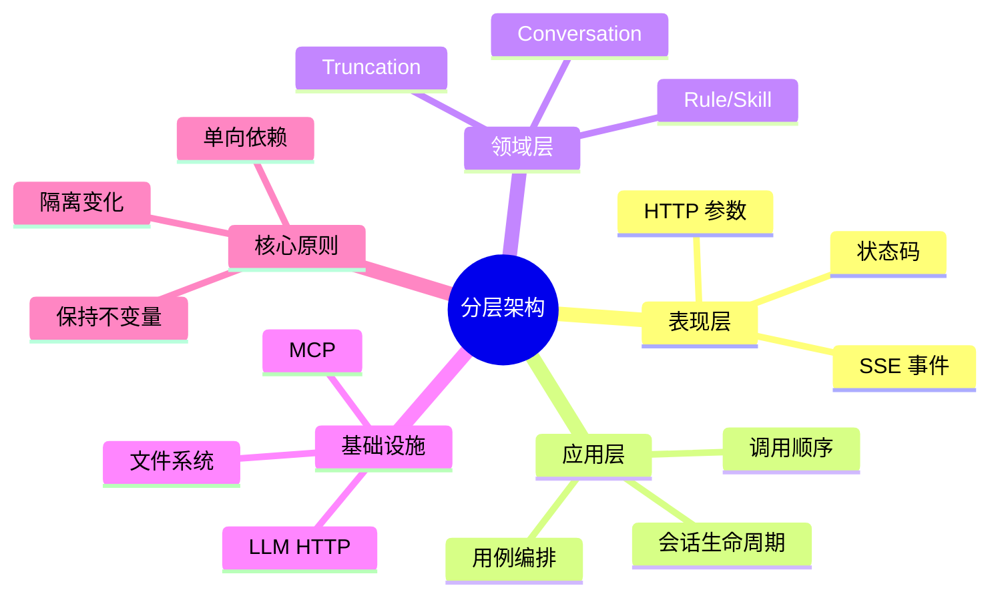

# 分层架构与应用服务

## 学习目标

- 区分表现层、应用层、领域层和基础设施层；
- 理解“依赖方向”比“包名”更重要；
- 能沿 HippoBuddy 的 `/api/chat` 调用链解释每层责任。

## 1. 概念

分层架构把不同变化原因隔开：表现层处理协议，应用层组织用例，领域层表达业务规则，基础设施层连接网络、磁盘和第三方服务。

应用服务不是“所有业务逻辑的集合”，而是用例编排器。它调用领域对象完成业务，同时控制事务/生命周期边界，但不关心 HTTP Header 或供应商 JSON。

## 2. 本质与原理

本质是控制依赖方向：越靠近核心的代码越不应该知道外部细节。HTTP、LLM 厂商和文件格式变化频繁，而“追加消息、准备上下文、记录工具结果”相对稳定。



一次请求的职责拆分：

```text
ChatApiHandler 解析 HTTP、建立 SSE
  → ConversationService 创建/恢复会话
  → WebAgentOrchestrator 编排 LLM 与工具
  → Conversation/Context 保持消息不变量
  → LlmClient、SessionTranscript 访问外部资源
```

## 3. 项目实现

| 层 | 项目类 | 责任 |
|---|---|---|
| 表现层 | `ChatApiHandler`、`SseWriter` | 请求解析、流式响应 |
| 应用层 | `ConversationService`、`WebAgentOrchestrator` | 用例和 Agent Loop |
| 领域层 | `Conversation`、`TruncationService`、Rule/Skill | 业务状态和策略 |
| 基础设施 | `AbstractLlmClient`、`SessionTranscript`、MCP Client | 网络、磁盘、外部协议 |

当前边界并不完美：`WebAgentOrchestrator` 同时承担流合并、审批、工具分支、Token 指标等，已经形成“大应用服务”。合理重构是拆出 `StreamingAssembler`、`ToolCoordinator`、`ConfirmationWorkflow`，而不是机械增加更多 package。

## 4. 最小 Demo

```java
interface MessageRepository {
    void append(String sessionId, String message);
}

final class ConversationService {
    private final MessageRepository repository;

    ConversationService(MessageRepository repository) {
        this.repository = repository;
    }

    void send(String sessionId, String text) {
        if (text == null || text.isBlank()) {
            throw new IllegalArgumentException("message is blank");
        }
        repository.append(sessionId, text); // 编排，不知道 JSONL 细节
    }
}

final class ChatHandler {
    private final ConversationService service;
    ChatHandler(ConversationService service) { this.service = service; }

    void post(String sessionId, String body) {
        service.send(sessionId, body); // 只处理协议到用例的转换
    }
}
```

把 `MessageRepository` 换成内存、JSONL 或 PostgreSQL，ConversationService 都不需要修改，这就是边界的价值。

## 5. 常见误区

- Controller 薄不代表 Service 可以成为万能类；
- DTO 不应直接成为核心领域状态，否则前端字段变化会穿透系统；
- “包很多”不等于分层，关键看 import 和调用方向；
- 领域层如果直接 `ServiceLocator.get()`，仍然依赖了全局基础设施。

## 6. 面试题

**问：为什么不直接在 Handler 调 LLM？**

答：HTTP 只是入口之一。直接调用会把会话恢复、工具循环和持久化绑死在 Web 协议上，子 Agent 或 CLI 无法复用，也难以独立测试应用用例。

**问：如何判断一个类属于应用层还是领域层？**

答：领域层表达业务规则和状态，应用层表达“先做 A 再做 B”的用例流程。领域对象通常不认识 HTTP、文件路径或供应商客户端。

## 7. 掌握检查

- [ ] 能画出 `/api/chat` 的四层调用链；
- [ ] 能指出 `WebAgentOrchestrator` 的三个可拆职责；
- [ ] 能解释依赖倒置而不是只背层名；
- [ ] 能为 ConversationService 写一个内存 Repository 测试。

## 8. 依赖规则的严格表达

可以把每层看成一个有向图节点。若核心层 import 了 `com.sun.net.httpserver`、OkHttp 或具体文件路径，就产生从稳定核心指向易变边界的反向边。依赖倒置不是让所有东西都变成接口，而是只在跨越变化边界时建立端口：`LlmClient`、`TokenEstimator`、Transcript/Repository 值得抽象；一个不会替换的纯值对象没有必要再包接口。

DTO、领域对象和持久化事件也应区分：HTTP DTO 允许随 API 版本变化；领域 Message 保持业务语义；TranscriptEntry 需要长期兼容历史文件。三者直接复用虽然少写转换代码，却会让一次前端字段重命名破坏历史恢复。

## 9. 一次请求中的数据转换

```text
HTTP JSON
  → ChatRequest DTO：校验 sessionId/message/mode
  → Domain Message：生成 id、role、content
  → Application Command：发送消息并执行 Agent
  → Provider Request：转换 system/tools/messages
  → Provider Stream：增量事件
  → Domain Assistant/Tool Message
  → TranscriptEntry：增加时间、类型、版本
  → SSE DTO：只暴露前端需要的字段
```

每次转换都是防腐边界。转换代码看似重复，却能集中默认值、兼容和安全脱敏。

## 10. 失败推演

假设 LLM 已返回 assistant tool call，但 Transcript 写入失败。应用层必须决定：停止工具执行，还是允许执行后产生无法恢复的副作用。对于 Coding Agent，更安全的是在关键状态无法持久化时 fail closed，或至少把 session 标为 incomplete。若 Handler 直接操作 LLM 和文件，它通常无法统一做这个决策，这说明应用服务还承担一致性边界。

另一个失败是 SSE 客户端断开：表现层感知 IOException，应用层负责把它翻译成 session cancellation，基础设施层关闭 HTTP body/Bash process。若每层都捕获异常后静默，取消无法传播。

## 11. 替代架构比较

| 架构 | 适合场景 | 对本项目的意义 |
|---|---|---|
| 传统三层 | CRUD、数据库中心 | 无法充分表达 Agent 状态和外部能力边界 |
| Hexagonal | 多入口、多外部适配器 | 很适合 LLM、Tool、Transcript 端口 |
| Clean Architecture | 强依赖规则和用例边界 | 适合继续拆 Orchestrator，但样板更多 |
| Actor | session 强顺序、消息驱动 | 可替换 session lock，简化并发状态 |
| Event Sourcing | 事件为真相源、需审计恢复 | Conversation 天然接近，但需规范事件版本/投影 |

## 12. 源码实验

1. 从 `ChatApiHandler.handle()` 开始，记录每次跨 package 调用；
2. 找出 Handler 中所有业务判断，判断哪些应下沉应用层；
3. 写 FakeLlmClient 和 InMemoryTranscript，只实例化 ConversationService；
4. 验证不启动 HttpServer 也能完成一轮无工具对话；
5. 把 provider response 类型故意传入 Conversation，观察污染如何扩散。

完成后应能回答：哪一层拥有事务/一致性决策，哪一层只负责转换协议。

## 项目源码精读

源码入口：[ConversationService.java](../../../src/main/java/com/example/agent/application/ConversationService.java)、[Conversation.java](../../../src/main/java/com/example/agent/domain/conversation/Conversation.java)、[LlmClient.java](../../../src/main/java/com/example/agent/llm/client/LlmClient.java)。应用服务中的关键依赖和创建流程如下：

```java
private final TokenEstimator tokenEstimator;
private final LlmClient llmClient;
private final ContextConfig defaultConfig;
private final TruncationService truncationService;

private final Map<String, Conversation> conversationRegistry = new ConcurrentHashMap<>();

public Conversation create(String systemPrompt, int maxTokens, String sessionId) {
    Conversation conversation = new Conversation(maxTokens, tokenEstimator, sessionId);
    conversation.setSystemPrompt(systemPrompt != null ? systemPrompt : "");
    initializeComponents(conversation);
    if (systemPrompt != null && !systemPrompt.isEmpty()) {
        conversation.addMessage(Message.system(systemPrompt));
    }
    conversationRegistry.put(sessionId, conversation);
    return conversation;
}
```

逐层解读：`ConversationService` 负责用例编排和 session 组件装配；`Conversation` 保存消息、预算等领域状态；`LlmClient`、Transcript 和 MemoryStore 是外部能力。`create()` 的顺序也有业务含义：先建立聚合与配套组件，再添加系统消息，最后发布到注册表，避免其他线程拿到半初始化对象。面试时应沿“Web Handler → Orchestrator/Application Service → Conversation → LLM/Storage Adapter”讲调用链，而不是只背四层名称。

> [!IMPORTANT]
> **疑难点：当前代码不是纯净分层。** `ConversationService` 构造器内部仍调用 `ServiceLocator.get(MemoryStore.class)` 并在失败时自行 `new MemoryStore`，这使应用层同时承担依赖查找和降级装配。它能运行，但依赖不完全可见，也可能产生双实例。深入改造应把 `MemoryStore/MemoryRetriever` 通过构造器注入，把 fallback 留在 Composition Root。

## 13. 源码级实现原理解读

### 13.1 真实入口不是一条“Controller 调 Service”的直线

HippoBuddy 的 Web 主链应按下面的状态变化来读，而不是只看 package 名称：

1. `ChatApiHandler.handle()` 先完成 HTTP 方法、JSON 字段和 session 参数校验；这一步只应产生协议错误，不应决定 Agent 策略。
2. Handler 调用 `ConversationService.addUserMessage()` 或 `editUserMessage()`。后者不是普通 update，而是先截断目标消息之后的历史，再追加一条新消息，因此会改变后续整条推理分支。
3. `WebAgentOrchestrator.execute()` 取得会话级 Tool 快照，构造 LLM 请求并消费流式响应；如果模型返回 ToolCall，状态从“等待模型”切换成“等待工具”。
4. `ToolRegistry.execute()` 完成名称分派、参数解析、Blocker 校验和执行；结果再由 `ConversationService.addToolResult()` 写回 Conversation。
5. 新增的 ToolResult 成为下一轮 LLM 的 observation，Orchestrator 重新进入模型调用；只有模型给出最终文本、取消、等待确认或失败，Loop 才终止。
6. `SessionTranscript` 和 SSE 分别面向“恢复”与“展示”。两者都是派生输出，不能反过来成为领域状态的唯一来源。

这里有三个不同的一致性边界：Conversation 中一轮消息的顺序、Transcript 中可恢复的顺序、SSE 中用户看见的顺序。正确实现不能只保证某一个顺序。

### 13.2 依赖倒置在运行时究竟发生了什么

Java 的接口不会自动解耦。真正的过程是：启动阶段在 Composition Root 创建具体对象，把它赋给核心代码只认识的端口；运行阶段 JVM 通过接口引用做动态分派。核心模块的 class 文件只依赖端口的方法描述符，不需要知道 OkHttp、JSONL 或 PostgreSQL 的构造细节。

```text
编译期：ApplicationService -> LlmPort
启动期：new OpenAiAdapter(httpClient, config) -> 注入 LlmPort
运行期：invokeinterface LlmPort.complete -> OpenAiAdapter.complete
测试期：new FakeLlmPort() -> 不启动网络也能验证用例
```

如果应用服务内部重新 `ServiceLocator.get()` 或 `new MemoryStore()`，对象创建权又泄漏回核心层，端口虽然存在，依赖倒置仍不完整。这正是当前 `ConversationService` 的源码缺口。

## 14. 可运行完整实现：端口、适配器与应用服务

下面代码可保存为 `LayeredArchitectureDemo.java`，直接用 Java 21 编译运行。它不仅展示接口，还验证了业务状态与基础设施实现可以独立替换：

```java
import java.util.*;

public class LayeredArchitectureDemo {
    record SendMessage(String sessionId, String text) {}
    record Reply(String text) {}

    interface ConversationRepository {               // outbound port
        List<String> load(String sessionId);
        void append(String sessionId, String message);
    }
    interface LlmPort { Reply complete(List<String> history); }

    static final class SendMessageService {            // application layer
        private final ConversationRepository repo;
        private final LlmPort llm;
        SendMessageService(ConversationRepository repo, LlmPort llm) {
            this.repo = Objects.requireNonNull(repo);
            this.llm = Objects.requireNonNull(llm);
        }
        Reply handle(SendMessage command) {
            if (command.sessionId() == null || command.sessionId().isBlank())
                throw new IllegalArgumentException("missing sessionId");
            if (command.text() == null || command.text().isBlank())
                throw new IllegalArgumentException("blank message");

            repo.append(command.sessionId(), "user:" + command.text());
            Reply reply = llm.complete(List.copyOf(repo.load(command.sessionId())));
            repo.append(command.sessionId(), "assistant:" + reply.text());
            return reply;
        }
    }

    static final class InMemoryRepository implements ConversationRepository {
        private final Map<String, List<String>> data = new HashMap<>();
        public List<String> load(String id) {
            return List.copyOf(data.getOrDefault(id, List.of()));
        }
        public void append(String id, String message) {
            data.computeIfAbsent(id, ignored -> new ArrayList<>()).add(message);
        }
    }

    public static void main(String[] args) {
        var repo = new InMemoryRepository();
        LlmPort fake = history -> new Reply("seen=" + history.size());
        var service = new SendMessageService(repo, fake);
        Reply result = service.handle(new SendMessage("s-1", "hello"));
        if (!result.text().equals("seen=1")) throw new AssertionError(result);
        if (repo.load("s-1").size() != 2) throw new AssertionError("not persisted");
        System.out.println(repo.load("s-1"));
    }
}
```

实现本质：`SendMessageService` 拥有“先存 user、再调用模型、再存 assistant”的用例顺序；Repository 拥有存储细节；LlmPort 拥有外部推理能力。把 `InMemoryRepository` 换成 JSONL 只改变适配器。进一步的失败实验是让 fake LLM 抛异常：此时 history 只留下 user 消息，系统必须明确这是允许恢复的 `incomplete turn`，还是要通过事务/补偿删除它。

## 延伸学习：博客与电子书

- [Patterns of Enterprise Application Architecture](https://martinfowler.com/books/eaa.html)：重点读 Layering、Service Layer，理解“协调用例”和“承载领域规则”的边界。
- [P of EAA 在线模式目录](https://martinfowler.com/eaaCatalog/)：结合项目判断 Service Layer、Gateway、Registry 分别落在哪一层。

## 思维导图节点学习博客

本专题思维导图中的 15 个末级知识点均已展开为独立博客：[进入节点博客目录](../mindmap-blogs/01-architecture/01-layered-architecture/README.md)。
