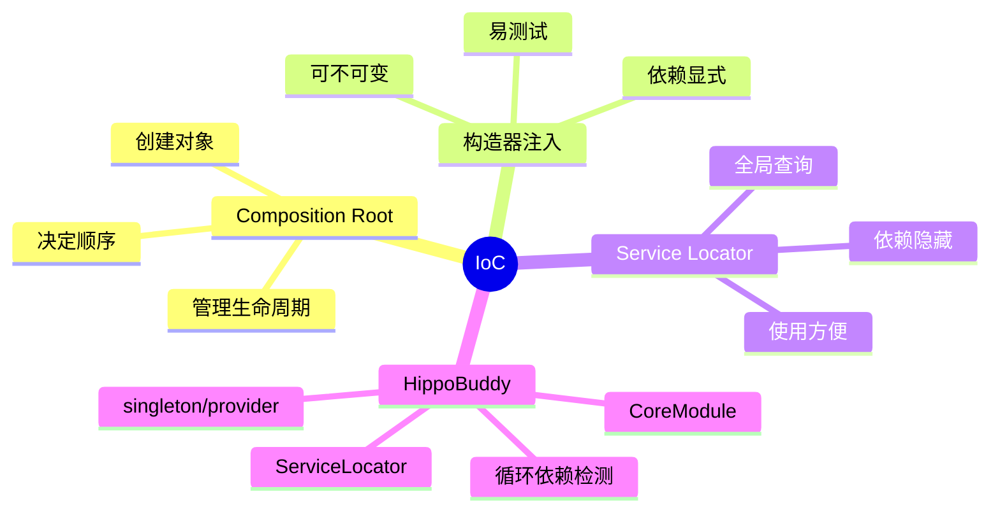

# IoC、DI 与 Service Locator

## 学习目标

理解对象创建、依赖提供和业务执行为什么要分开，并能评价 HippoBuddy 手写容器的优点与局限。

## 1. 概念

- **IoC**：对象图的控制权从业务对象交给外部组合根；
- **DI**：外部通过构造器、方法或字段把依赖传入；
- **Service Locator**：对象主动向全局注册表查询依赖；
- **Composition Root**：应用启动时唯一负责组装对象图的位置。

DI 是实现 IoC 的方式之一。Service Locator 也实现了控制反转，但会隐藏真实依赖。



## 2. 底层原理

容器维护 `type → instance/provider` 映射。获取对象时：先查 singleton；没有则调用 provider；仍没有则尝试构造。singleton 的关键不是 Map，而是要保证并发下只创建一次、构造失败不污染缓存、依赖环被检测。

HippoBuddy 使用 ConcurrentHashMap 保存实例/Provider，并用 ThreadLocal 构造栈识别 `A → B → A`。`freeze()` 后禁止注册，防止运行期覆盖已经被其他单例捕获的旧实例。

## 3. 项目初始化顺序

```text
ObjectMapper / Config / RetryPolicy
  → TokenEstimator / Metrics / Health
  → Rule / Skill / Todo
  → LlmClient
  → Prompt
  → ToolRegistry
  → SubAgentManager
  → ConcurrentToolExecutor
```

顺序重要：SubAgentManager 构造时要获得 LlmClient；ToolRegistry 注册 Todo 工具时需要 TodoManager。若先取依赖再覆盖 singleton，会产生“容器里是新对象，旧消费者还握着旧对象”的 split-brain。

## 4. 最小 Demo

```java
import java.util.Map;
import java.util.concurrent.ConcurrentHashMap;
import java.util.function.Supplier;

final class MiniContainer {
    private final Map<Class<?>, Object> singletons = new ConcurrentHashMap<>();
    private final Map<Class<?>, Supplier<?>> providers = new ConcurrentHashMap<>();

    <T> void singleton(Class<T> type, T value) {
        singletons.put(type, value);
    }

    <T> void provider(Class<T> type, Supplier<T> supplier) {
        providers.put(type, supplier);
    }

    @SuppressWarnings("unchecked")
    <T> T get(Class<T> type) {
        Object value = singletons.get(type);
        if (value != null) return (T) value;
        Supplier<?> supplier = providers.get(type);
        if (supplier == null) throw new IllegalStateException("Missing: " + type);
        return (T) supplier.get();
    }
}
```

练习：分别注册 `provider(() -> new Client())` 和 singleton，连续 get 两次，观察对象身份区别。

## 5. 构造器注入为何更优

```java
final class AgentService {
    private final LlmClient llm;
    AgentService(LlmClient llm) { this.llm = llm; }
}
```

编译器能看到依赖，字段可 final，测试直接传 Fake。若方法内部 `ServiceLocator.get(LlmClient.class)`，测试必须修改全局状态，并且类签名看不出依赖。

## 6. 面试题与边界

**为什么不用 Spring？** 本地单进程应用不需要完整 MVC/ORM/事务生态，手写容器轻量且初始化可控；但规模扩大后应以构造器注入代替广泛 Locator。

**ConcurrentHashMap 是否保证 singleton 只构造一次？** 只有把创建放入 `computeIfAbsent` 或显式同步才保证；先 get 再 put 在竞争下可能构造多个对象。

**循环依赖为什么危险？** 两个对象都要求对方在自己完成前存在，通常说明职责边界错误。字段注入能绕过构造期，但得到半初始化对象。

## 7. 掌握检查

- [ ] 能区别 IoC、DI、容器和 Locator；
- [ ] 能解释 CoreModule 为什么是组合根；
- [ ] 能描述覆盖已使用 singleton 的风险；
- [ ] 能将一个 Locator 调用改为构造器注入。

## 8. Singleton 创建的并发语义

以下写法不是严格单例：

```java
T value = (T) instances.get(type);
if (value == null) {
    value = provider.get();       // 两个线程都可能执行
    instances.put(type, value);
}
```

`ConcurrentHashMap` 只保证 Map 操作安全，不把 check-then-act 变成原子操作。`computeIfAbsent` 可以使映射建立原子化，但 mapping function 也不能递归更新同一个 key，构造异常时要确保不缓存半成品。若对象创建有外部副作用，即使最终 Map 只有一份，竞争中多构造出的实例也可能泄漏连接。

## 9. 循环依赖的形成与诊断

```text
ConversationService
  → SubAgentManager
    → ConversationService
```

ThreadLocal 构造栈可输出完整路径，而不是只说“StackOverflow”。循环通常说明：两个模块职责纠缠、事件方向不清或缺少更小的接口。解决顺序应是提取端口/事件，而不是用 setter 注入半初始化对象。Provider/Lazy 可以打破创建时环，但逻辑环依旧存在，只有确实允许延迟依赖时才使用。

## 10. Scope 与对象图

容器不仅决定如何创建，还必须决定缓存在哪个 scope。进程 singleton LlmClient 不能直接持有 session Conversation；session component 不应注册成全局 singleton。成熟容器用 child scope；当前项目由 ConversationService 自己创建 per-session 组件，相当于手工 scope factory。

可以明确设计：

```java
record SessionScope(Conversation conversation,
                    TokenBudget budget,
                    SessionTranscript transcript) implements AutoCloseable {
    public void close() { transcript.close(); }
}
```

## 11. 测试替换的陷阱

若 A singleton 构造时已拿到真实 LlmClient，测试随后 `registerSingleton(LlmClient, fake)`，A 仍持真实客户端。这就是 late override。正确做法是每个测试先 reset 容器、注册全部 fake，再构造被测对象；更理想是不用全局容器，直接构造器传入。

并行测试时修改同一静态容器会互相污染，应禁止并行或让容器成为实例对象。

## 12. 替代方案

| 方案 | 优点 | 缺点 |
|---|---|---|
| 手写 Locator | 轻、无依赖、可控 | 隐藏依赖、scope 弱 |
| Dagger | 编译期对象图、快速 | 生成代码和学习成本 |
| Guice | 运行期灵活 | 反射、错误较晚 |
| Spring | 完整生命周期/生态 | 启动、包体和抽象较重 |
| 纯手工构造 | 最显式 | 大型对象图样板多 |

## 13. 源码实验与追问

1. 为 ServiceLocator 写两个线程同时 `get()` 的构造计数测试；
2. 构造 A→B→A，检查错误是否给出路径；
3. 搜索全部 `ServiceLocator.get`，按“边界层允许/核心层应注入”分类；
4. 验证生产入口是否调用 `freeze()`，解释未冻结的影响；
5. 面试追问“为什么 Service Locator 是反模式”时，回答依赖可见性、测试隔离、生命周期，而不是简单说全局变量不好。

## 项目源码精读

源码入口：[CoreModule.java](../../../src/main/java/com/example/agent/core/di/CoreModule.java)、[ServiceLocator.java](../../../src/main/java/com/example/agent/core/di/ServiceLocator.java)。HippoBuddy 的 Composition Root 按依赖层级显式注册：

```java
Config config = Config.getInstance();
ThreadPools.initialize();

ObjectMapper objectMapper = createConfiguredObjectMapper();
ServiceLocator.registerSingleton(ObjectMapper.class, objectMapper);
ServiceLocator.registerSingleton(Config.class, config);
ServiceLocator.registerSingleton(RetryPolicy.class, RetryPolicy.defaultPolicy());

TokenEstimator tokenEstimator = TokenEstimatorFactory.getDefault();
ServiceLocator.registerSingleton(TokenEstimator.class, tokenEstimator);

LlmClient llmClient = LlmClientFactory.create(
    config, ServiceLocator.get(RetryPolicy.class));
ServiceLocator.registerSingleton(LlmClient.class, llmClient);
```

容器内部用 `ConcurrentHashMap<Class<?>, Object>` 保存单例，并通过 `volatile FROZEN` 禁止启动后覆写。`get()` 先查显式单例，再查 provider/自动构造；`INIT_STACK` 用 ThreadLocal 记录当前解析链，从而发现 A→B→A 循环。这套实现解决了“在哪里创建对象”，但没有自动解决 scope、销毁顺序和依赖图验证。

> [!IMPORTANT]
> **疑难点：DI 与 Service Locator 的差异发生在使用端。** `CoreModule` 里调用 Locator 属于装配代码，问题较小；领域/应用类内部随时 `ServiceLocator.get()` 则隐藏依赖。另一个难点是 `ConcurrentHashMap` 只保证 Map 操作安全，若 `get()` 的“检查→反射创建→put”没有完整原子协议，两个线程仍可能各构造一次。`freeze()` 也必须由所有生产入口真实调用，类里存在该方法不等于容器已经被冻结。

## 14. 源码级实现原理解读

`ServiceLocator.get(type)` 的关键不是 Map 查询，而是“并发下只构造一次对象图”。项目实现可拆成五步：

1. 先读 `SINGLETONS`，命中就直接返回；这是 fast path。
2. 用线程本地 `INIT_STACK` 判断当前解析链中是否已经出现同一类型，形成 `A → B → A` 时立即失败。
3. `SINGLETONS.computeIfAbsent(type, ...)` 把同一个 key 的创建合并为一次；其他线程等待已开始的计算。
4. provider 存在就执行 provider；否则反射遍历 public constructor，并递归解析参数。
5. `finally` 弹出解析栈，栈空时 remove ThreadLocal，避免线程池线程长期持有初始化链。

`ConcurrentHashMap` 只保证容器内部 Map 的并发安全，不自动保证被发布对象内部线程安全。安全发布能保证其他线程看到构造完成的字段，但 singleton 如果有可变 `ArrayList`，它仍需要自己的同步策略。

当前实现还有两个值得面试时主动指出的边界：`getOrNull()` 调 provider 时不写入 singleton，因此 provider 的 scope 语义可能是“每次创建”；而 `createInstance()` 选择第一个参数均可解析的 public 构造器，构造器反射顺序没有业务优先级，多个可用构造器会产生不透明选择。生产容器通常要求唯一注入构造器或显式注解。

## 15. 可运行完整实现：带循环依赖检测的构造器容器

```java
import java.lang.reflect.Constructor;
import java.util.*;
import java.util.concurrent.ConcurrentHashMap;
import java.util.function.Supplier;

public final class MiniContainerDemo {
    static final class Container {
        private final Map<Class<?>, Supplier<?>> providers = new ConcurrentHashMap<>();
        private final Map<Class<?>, Object> singletons = new ConcurrentHashMap<>();
        private final ThreadLocal<Deque<Class<?>>> resolving =
                ThreadLocal.withInitial(ArrayDeque::new);

        <T> void bind(Class<T> type, Supplier<? extends T> supplier) {
            if (providers.putIfAbsent(type, supplier) != null)
                throw new IllegalStateException("duplicate binding: " + type.getName());
        }
        <T> T get(Class<T> type) {
            Object value = singletons.computeIfAbsent(type, this::create);
            return type.cast(value);
        }
        private Object create(Class<?> type) {
            Deque<Class<?>> stack = resolving.get();
            if (stack.contains(type)) {
                var chain = new ArrayList<>(stack);
                Collections.reverse(chain);
                chain.add(type);
                throw new IllegalStateException("cycle: " + chain);
            }
            stack.push(type);
            try {
                Supplier<?> provider = providers.get(type);
                if (provider != null) return Objects.requireNonNull(provider.get());
                Constructor<?>[] constructors = type.getDeclaredConstructors();
                if (constructors.length != 1)
                    throw new IllegalStateException("need exactly one constructor: " + type);
                Constructor<?> ctor = constructors[0];
                ctor.setAccessible(true);
                Object[] args = Arrays.stream(ctor.getParameterTypes()).map(this::get).toArray();
                return ctor.newInstance(args);
            } catch (ReflectiveOperationException e) {
                throw new IllegalStateException("cannot construct " + type, e);
            } finally {
                stack.pop();
                if (stack.isEmpty()) resolving.remove();
            }
        }
    }

    interface Clock { long millis(); }
    static final class Service {
        final Clock clock;
        Service(Clock clock) { this.clock = clock; }
    }
    public static void main(String[] args) {
        Container c = new Container();
        c.bind(Clock.class, () -> () -> 42L);
        Service a = c.get(Service.class), b = c.get(Service.class);
        if (a != b || a.clock.millis() != 42L) throw new AssertionError();
    }
}
```

这份实现故意采用“每类型只能有一个构造器”和“重复绑定直接失败”，因为显式失败比静默选择/覆盖更容易维护。它仍不是完整 DI 框架：没有 qualifier、scope、生命周期回调、代理、泛型 key 和跨线程循环等待检测。掌握 DI 的标准不是能写出 Spring，而是能解释对象图解析、scope、发布、循环检测和销毁责任。

## 延伸学习：博客与电子书

- [Martin Fowler：Inversion of Control Containers and Dependency Injection](https://martinfowler.com/articles/injection.html)：重点比较构造器注入与 Service Locator 的依赖可见性。
- [Patterns of Enterprise Application Architecture](https://martinfowler.com/books/eaa.html)：结合 Registry 模式理解 Locator 为什么方便、又为什么会扩大隐藏全局状态。

## 思维导图节点学习博客

本专题思维导图中的 13 个末级知识点均已展开为独立博客：[进入节点博客目录](../mindmap-blogs/01-architecture/02-ioc-di-service-locator/README.md)。
