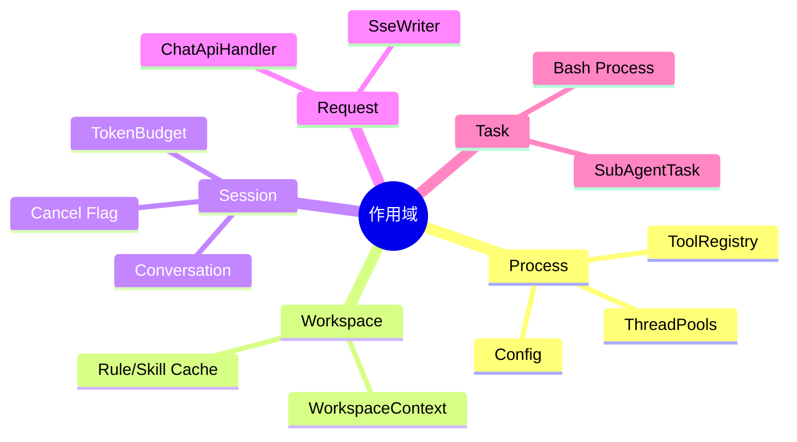

# 对象作用域、全局状态与生命周期

## 1. 核心概念

作用域回答“这份状态属于谁、应该活多久”。常见作用域：process、workspace、session、request/connection、task。生命周期则是 create → start → use → stop → close。



## 2. 本质

状态的拥有者决定隔离边界。如果把 session 状态放进全局 singleton，就必须再用 sessionId Map 人工分区；忘记清理会泄漏，取错 key 会串数据。作用域越大，共享越方便，但隔离、测试和回收越困难。

## 3. 项目映射与风险

- Config、ToolRegistry：进程级合理；
- WorkspaceContext：逻辑上 workspace 级，但用全局状态表达，切换目录必须让 Rule/Skill/Path 缓存失效；
- Conversation/ContextWindow：严格 session 级；
- SseWriter：连接级，结束后必须关闭；
- MemoryModule 静态字段：简化访问，但多 workspace 和测试隔离困难；
- 部分模块自建 static executor：生命周期不再由一个地方统一掌握。

## 4. 优雅关闭原理

正确关闭不是立刻 `shutdownNow()`：

```text
拒绝新请求
  → 标记 Agent 取消
  → 等待/终止外部进程与 HTTP 流
  → flush Transcript/Memory
  → close MCP/Client
  → executor.shutdown
  → await deadline
  → shutdownNow 兜底
```

关闭顺序通常与创建依赖顺序相反。先关 executor 再 flush 依赖它的队列，可能永远刷不完。

## 5. Demo：可关闭的应用上下文

```java
import java.util.ArrayDeque;
import java.util.Deque;

final class AppContext implements AutoCloseable {
    private final Deque<AutoCloseable> resources = new ArrayDeque<>();

    <T extends AutoCloseable> T manage(T resource) {
        resources.push(resource); // 后创建的先关闭
        return resource;
    }

    @Override public void close() throws Exception {
        Exception first = null;
        while (!resources.isEmpty()) {
            try { resources.pop().close(); }
            catch (Exception e) { if (first == null) first = e; }
        }
        if (first != null) throw first;
    }
}
```

这个 Demo 的重点是所有权：创建资源的上下文负责按逆序关闭，同时即使一个 close 失败也继续关闭其余资源。

## 6. 常见误区

- daemon thread 会随 JVM 退出，不等于数据会安全刷盘；
- `shutdown()` 不会等待完成，必须 `awaitTermination()`；
- static Map 的 value 删除了，key 对应的锁/缓存也可能继续增长；
- ThreadLocal 在线程池中不清理会污染下一任务；
- singleton 线程安全只说明实例唯一，不说明其内部可变状态安全。

## 7. 面试题

**如何避免 session 内存泄漏？** 在完成/过期时统一 cleanup：Conversation、lock、cancel flag、pending confirmation、token stats、tool snapshot 一起移除，并用定时扫描兜底。

**shutdown hook 能做多久？** 不应依赖无限时间；设置明确 deadline，关键数据先同步刷盘。强杀、断电时 hook 甚至不会运行，所以仍需崩溃恢复设计。

## 8. 掌握检查

- [ ] 能为主要对象标注作用域；
- [ ] 能画出正确关闭顺序；
- [ ] 能解释 daemon、shutdown、shutdownNow 的区别；
- [ ] 能列出一个 session 完成时需要清理的状态。

## 9. 所有权模型

资源关闭最可靠的原则是“谁创建，谁拥有；所有者关闭”。共享 singleton 则由 ApplicationContext 拥有，session 组件由 SessionScope 拥有，单次 SSE 由 Handler 的 try-with-resources 拥有。若创建者把资源交给别的对象，需要显式 transfer ownership，否则双方都以为对方会关闭。

生命周期依赖图要求逆拓扑关闭：Tool/Agent 使用 executor 和 Transcript，所以先停止提交 Tool，再 drain Transcript，最后关 executor。只按“想到哪个关哪个”会产生关闭竞态。

## 10. Session 清理的竞态

定时清理线程可能认为 session 空闲，同时新请求刚取得引用。直接从 Map remove 并 close，会让正在运行请求使用已关闭 Transcript。解决方式包括：

- session entry 保存 active request 计数和 lastAccess；
- 清理先 CAS 状态 ACTIVE→CLOSING，拒绝新 acquire；
- activeCount 归零后真正 close；
- 已取得 lease 的请求 finally release。

```java
final class Lease implements AutoCloseable {
    private final java.util.concurrent.atomic.AtomicInteger active;
    Lease(java.util.concurrent.atomic.AtomicInteger active) { this.active = active; active.incrementAndGet(); }
    public void close() { active.decrementAndGet(); }
}
```

## 11. 关闭期间的异常策略

关闭是 best effort，但关键数据要区分优先级。若 MCP close 失败，继续关 Transcript；若 Transcript flush 失败，记录明确告警/恢复标志。收集所有异常，结束后报告第一个并附 suppressed，比遇到第一个就停止更安全。

shutdown hook 不应启动复杂新工作、等待无界网络或依赖已经关闭的日志系统。Windows 强杀、`Runtime.halt`、断电都不会可靠执行 hook，所以正常关闭不能代替原子写/恢复。

## 12. 内存泄漏审计清单

对每个 `Map<sessionId,...>` 搜索对应 remove：conversation、lock、cancel、pending confirmation、token stats、tool snapshot、cache hit stats、remaining tool calls、subagent callbacks。再检查 scheduled task、listener、EventBus subscriber 是否持有 session 对象。Java GC 只能回收不可达对象，static Map 和线程回调会让对象一直可达。

## 13. 源码实验

1. 创建/关闭 10,000 个 session，用 heap histogram 观察 Map 是否回落；
2. 在请求与 cleanup 之间用 CyclicBarrier 制造竞态；
3. 模拟 Transcript.close 抛异常，确认其他资源仍被关闭；
4. 为 ApplicationContext 写重复 close 测试，close 应幂等；
5. 画出 process/workspace/session/request/task 五级所有权树。

## 项目源码精读

源码入口：[WorkspaceContext.java](../../../src/main/java/com/example/agent/desktop/WorkspaceContext.java)、[WebSessionManager.java](../../../src/main/java/com/example/agent/web/session/WebSessionManager.java)、[GracefulShutdown.java](../../../src/main/java/com/example/agent/core/concurrency/GracefulShutdown.java)。项目同时存在 process 与 session 两类状态：

```java
// WorkspaceContext：进程级可变状态
private static volatile String currentFolder;

public static void setCurrentFolder(String path) {
    String oldFolder = currentFolder;
    currentFolder = path;
    logger.info("工作区切换: {} -> {}", oldFolder, path);
}

// WebSessionManager：sessionId -> 会话资源
private static final Map<String, Conversation> sessions = new ConcurrentHashMap<>();
private static final Map<String, PendingToolCall> pendingToolCalls = new ConcurrentHashMap<>();
private static final Map<String, SessionTokenStats> sessionTokenStats = new ConcurrentHashMap<>();
```

`volatile` 让工作区引用的最新写对其他线程可见，但不会自动把与工作区相关的缓存、Prompt 和锁一起切换；项目用“会话创建时固化 system prompt”降低跨 workspace 漂移。Session 的生命周期则横跨多个 Map：创建时写入多个资源，关闭时必须按逆依赖顺序取消运行、关闭 transcript、移除 pending 和统计项。

> [!IMPORTANT]
> **疑难点：线程安全容器不等于生命周期原子。** `sessions.remove(id)` 与 `pendingToolCalls.remove(id)` 各自原子，但两者之间存在可观察中间态。需要 per-session lock、统一 `SessionState` 聚合或 Actor mailbox 才能维护“关闭后没有迟到 callback、所有子资源恰好关闭一次”的不变量。另一个难点是 static Map 会把对象提升为 process scope，遗漏清理就形成逻辑内存泄漏。

## 14. 源码级实现原理解读

HippoBuddy 至少存在四种生命周期：进程级 `ThreadPools/Config/MemoryStore`、Server 级 `DashboardServer`、Session 级 `ConversationComponents`、请求或任务级的 Tool 执行。对象 scope 必须与其持有资源的最短安全生命周期一致：把 SessionTranscript 做成全局对象会串写会话；每次请求创建线程池又会造成线程和队列泄漏。

`ConversationService.create()` 先构造 Conversation，再创建 warning、compact、memory、transcript 等配套组件，最后放入 registry，这个顺序避免正常调用通过 registry 观察到半初始化对象。但 `cleanupIdleSessions()` 只从 `componentRegistry/sessionLastAccessTime` 移除记录，没有像 `destroy()` 一样 flush/close transcript，也没有从 `conversationRegistry` 删除 Conversation；因此“从 Map 删除”不等于“生命周期正确结束”。

正确关闭是一个状态机而不是单个 `close()`：

```text
RUNNING --CAS--> CLOSING
  拒绝新请求
  停止生产新任务
  等待/取消在途任务
  flush transcript
  关闭进程/网络/文件
  逆序关闭 executor
CLOSING --------> CLOSED
```

逆序是关键：对象 A 依赖 B，启动顺序是 B→A，关闭应是 A→B。否则先关 Transcript executor，再要求 Session flush，就会丢任务或收到 rejection。

## 15. 可运行完整实现：幂等且逆序的生命周期容器

```java
import java.util.*;
import java.util.concurrent.*;
import java.util.concurrent.atomic.AtomicReference;

public class LifecycleDemo implements AutoCloseable {
    enum State { RUNNING, CLOSING, CLOSED }
    private final AtomicReference<State> state = new AtomicReference<>(State.RUNNING);
    private final Deque<AutoCloseable> resources = new ArrayDeque<>();
    private final ExecutorService executor = Executors.newFixedThreadPool(2);

    LifecycleDemo() { resources.push(this::stopExecutor); }

    synchronized <T extends AutoCloseable> T own(T resource) {
        if (state.get() != State.RUNNING) throw new RejectedExecutionException("closing");
        resources.push(resource);               // 后注册的依赖方先关闭
        return resource;
    }
    void submit(Runnable task) {
        if (state.get() != State.RUNNING) throw new RejectedExecutionException("closing");
        executor.submit(task);
    }
    private void stopExecutor() throws InterruptedException {
        executor.shutdown();
        if (!executor.awaitTermination(2, TimeUnit.SECONDS)) {
            executor.shutdownNow();
            if (!executor.awaitTermination(2, TimeUnit.SECONDS))
                throw new IllegalStateException("executor did not stop");
        }
    }
    @Override public void close() {
        if (!state.compareAndSet(State.RUNNING, State.CLOSING)) return; // 幂等
        RuntimeException failure = null;
        while (!resources.isEmpty()) {
            try { resources.pop().close(); }
            catch (Exception e) {
                if (failure == null) failure = new RuntimeException("close failed");
                failure.addSuppressed(e);       // 一个失败不能阻止后续资源关闭
            }
        }
        state.set(State.CLOSED);
        if (failure != null) throw failure;
    }

    public static void main(String[] args) {
        try (LifecycleDemo app = new LifecycleDemo()) {
            app.own(() -> System.out.println("session closed"));
            app.submit(() -> System.out.println("work"));
        }
    }
}
```

验证时应同时调用两次 `close()`、让某个 resource.close 抛异常、让任务忽略 interrupt，并观察是否仍能关闭其他资源。真正的疑难点是“终止权”和“资源所有权”必须一致：谁创建并注册资源，谁就要能阻止新工作并最终释放它。

## 延伸学习：博客与电子书

- [Java SE 21 Concurrency Guide](https://docs.oracle.com/en/java/javase/21/core/concurrency.html)：重点理解并发容器、锁与可见性并不能替代业务生命周期协议。
- [Java Language Specification §17](https://docs.oracle.com/javase/specs/jls/se21/html/jls-17.html)：精读 volatile 与 happens-before，解释 `currentFolder` 为什么“可见但非复合原子”。

## 思维导图节点学习博客

本专题思维导图中的 12 个末级知识点均已展开为独立博客：[进入节点博客目录](../mindmap-blogs/01-architecture/03-scope-lifecycle/README.md)。
