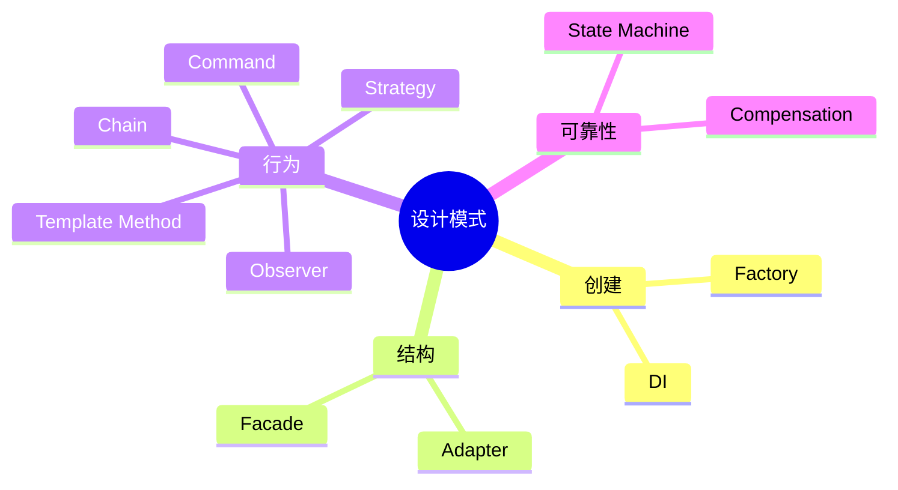

# HippoBuddy 中的设计模式

## 1. 概念与本质

设计模式是经过反复验证的设计问题解法词汇。它不是类名后缀，而是对重复设计矛盾的命名；本质是隔离变化、约束协作。判断模式是否有价值，要看它隔离了哪个变化轴。



## 2. 项目模式对照

| 模式 | 源码 | 被隔离的变化 |
|---|---|---|
| Factory | `LlmClientFactory` | provider 选择 |
| Adapter | `McpToolAdapter`、Provider Client | 外部协议差异 |
| Template Method | `AbstractLlmClient` | 请求骨架稳定、供应商步骤变化 |
| Strategy | `TruncationStrategy` | 内容类型对应算法变化 |
| Command | `ToolExecutor` | 动作种类变化 |
| Registry | `ToolRegistry` | 名称到能力的动态发现 |
| Chain of Responsibility | `BlockerChain` | 安全规则增删和短路 |
| Observer | `TokenBudget` Listener、EventBus | 状态变化的响应者变化 |
| State Machine | Agent Loop、SubAgentStatus | 合法状态迁移 |
| Compensation | File Snapshot/Undo | 无事务副作用的恢复 |

## 3. 原理详解

Factory 把创建决策集中，但如果 Factory 巨大，它只是 switch 搬家；Adapter 应把外部模型完全转换成内部模型，不能让 provider 字段继续泄漏；Strategy 要有真正不同的算法，而不是多个空壳类；Command 使动作可排队、审计、授权；责任链适合无共享复杂状态的检查；Observer 降耦但要考虑订阅者异常和执行线程。

模式经常组合：ToolExecutor 是 Command，ToolRegistry 是 Registry，执行前走 Blocker Chain，结果再通过 Observer 回调进度。

## 4. Demo：Strategy + Factory

```java
interface Truncator { String truncate(String value, int max); }

final class HeadTail implements Truncator {
    public String truncate(String v, int max) {
        if (v.length() <= max) return v;
        int half = Math.max(1, (max - 5) / 2);
        return v.substring(0, half) + " ... " + v.substring(v.length() - half);
    }
}

final class TailOnly implements Truncator {
    public String truncate(String v, int max) {
        return v.length() <= max ? v : "..." + v.substring(v.length() - max + 3);
    }
}

enum ContentType { TEXT, LOG }

final class TruncatorFactory {
    static Truncator forType(ContentType type) {
        return type == ContentType.LOG ? new TailOnly() : new HeadTail();
    }
}
```

LOG 保存尾部是因为异常堆栈通常位于最后；这就是领域知识驱动 Strategy，而非为了模式而模式。

## 5. 反模式与边界

- 每个 if/else 都不需要 Strategy；变化不独立时拆类只增加跳转；
- Service Locator 常被称为模式，但广泛使用会成为隐藏依赖反模式；
- EventBus 不应代替清晰的同步调用链；
- State Machine 如果只存在于注释而没有显式状态/迁移，维护价值有限；
- 模式不能替代测试，抽象层过多反而让错误路径不透明。

## 6. 面试表达

不要说“项目用了很多设计模式”。说：

> Tool 层把模型动作封装为 Command，通过 Registry 动态发现，执行前组合责任链安全检查。这样新增工具通常不修改 Agent Loop，安全规则也可以独立测试。

## 7. 掌握检查

- [ ] 每个模式都能说出变化轴；
- [ ] 能举出模式组合而非孤立类名；
- [ ] 能指出一种过度设计风险；
- [ ] 能把一个 switch 重构成 Strategy，并说明何时不该重构。

## 8. 模式的结构与运行时行为

仅看类图会忽略关键语义。例如 Strategy Map 是线程安全的吗、运行期能否替换；Observer 同步还是异步；Command 是否可重试/序列化；State 的迁移是否原子。模式的完整描述必须包含数据结构、调用顺序和失败语义。

以 Tool 为例：Registry 的不变量是名称唯一；Command 的不变量是同一 callId 的执行语义明确；Chain 的不变量是检查顺序稳定且 deny 短路；Observer 的不变量是回调异常不能破坏核心结果。模式组合后还要明确哪个组件拥有最终决策。

## 9. Template Method 与组合

继承式 Template Method 容易让 Provider 子类依赖父类内部步骤。若供应商差异越来越大，可改用组合流水线：RequestEncoder、Transport、StreamDecoder、ErrorMapper 四个策略对象。组合比继承更易独立测试，但对象图更复杂。

```java
record Pipeline(Encoder encoder, Transport transport, Decoder decoder) {
    Response execute(Request input) {
        byte[] request = encoder.encode(input);
        byte[] raw = transport.send(request);
        return decoder.decode(raw);
    }
}
```

## 10. Observer 的一致性问题

TokenBudget Listener 若同步执行，慢 listener 延迟 addMessage；若异步执行，状态可能在回调前继续变化，阈值动作顺序也不确定。对“阻断请求”这类核心规则应同步，对 metrics/log 可异步。EventBus handler 异常应逐个隔离，不能让一个失败阻止后续订阅者。

## 11. State、Workflow 与 Chain 的边界

- Chain 回答“现在是否允许”；
- State Machine 回答“当前处于什么状态、下一步是否合法”；
- Workflow 编排跨时间、跨请求的暂停与恢复。

确认弹窗涉及 WAITING_CONFIRMATION 和恢复，不能仅靠 Blocker warning；SubAgent dependsOn 是调度工作流，不只是状态枚举。选错模式会把长期状态塞进无状态检查器。

## 12. 模式选择练习

1. 新增供应商：Adapter + Factory；
2. 新增一种工具输出：Strategy；
3. 新增高危路径检查：Chain；
4. 保存等待确认并跨请求恢复：State Machine/Workflow；
5. 记录 Tool 指标：Decorator 或 Observer；
6. 支持工具重放审计：Command + Event Log。

对每题继续问：如果只有一个实现，是否值得抽象？变化概率和错误成本是否超过抽象成本？

## 项目源码精读

源码入口：[LlmClientFactory.java](../../../src/main/java/com/example/agent/llm/client/LlmClientFactory.java)、[BlockerChain.java](../../../src/main/java/com/example/agent/core/blocker/BlockerChain.java)、[TruncationStrategy.java](../../../src/main/java/com/example/agent/domain/truncation/TruncationStrategy.java)、[EventBus.java](../../../src/main/java/com/example/agent/core/event/EventBus.java)。Factory 的真实分派如下：

```java
Provider provider = parseProvider(providerName);
switch (provider) {
    case DASHSCOPE:
    case OPENAI:
        return new OpenAiLlmClient(config, retryPolicy);
    case OLLAMA:
        return new OllamaLlmClient(config, retryPolicy);
    case DEEPSEEK_RESPONSES:
        return new ResponsesLlmClient(config, retryPolicy);
    case CUSTOM:
        return createCustomClient(config, retryPolicy);
    default:
        throw new IllegalArgumentException("不支持的 Provider: " + providerName);
}
```

这里 Factory 隔离“Provider 名称→具体 Adapter”的创建变化；`TruncationStrategy` 隔离按内容类型变化的算法；`BlockerChain` 顺序执行安全检查，遇 deny 短路、warning 暂存；`EventBus` 用 Observer 解耦执行路径和指标/记忆副作用。模式的本质都是把可变轴放到稳定接口背后，但它们处理的是不同变化：创建、算法、审批链和一对多通知。

> [!IMPORTANT]
> **疑难点：识别模式不能只看类名。** `switch + new` 仍然可以是 Simple Factory；只有调用方不再知道具体类，Factory 才真正提供价值。BlockerChain 中 warning 继续传播而 deny 立即返回，是项目特有合并语义，不能只套“责任链每个节点决定是否传递”的教科书描述。模式过度使用会把一次简单调用拆成无法追踪的间接层。

## 13. 源码级实现原理解读

设计模式的实现基础只有三类机制：对象组合、动态分派和状态封装。项目中的具体对应关系如下：

| 运行时动作 | Java 机制 | 项目落点 | 真正解决的问题 |
|---|---|---|---|
| 按 provider 选择客户端 | Factory + Adapter | `LlmClientFactory`、各 `*LlmClient` | 把厂商协议差异挡在统一模型之外 |
| 按内容选择截断算法 | Strategy | `TruncationStrategy`、`CodeTruncation` 等 | 算法可替换且调用方稳定 |
| 顺序执行安全规则 | Chain of Responsibility | `BlockerChain` | 规则独立演化并统一短路/聚合语义 |
| Token 变化通知动作 | Observer | `TokenBudget`、`BudgetListener` | 计量状态不依赖 warning/compact 策略 |
| Tool 名称映射 executor | Command + Registry | `ToolExecutor`、`ToolRegistry` | 把请求描述与执行对象解耦 |
| Agent Loop 分支 | 隐式 State | `WebAgentOrchestrator` | 根据 pending/stream/tool/confirm 选择迁移 |

模式不是类名贴标签。例如 `switch(provider)` 本身可以是一个简单工厂；只有当每个 provider adapter 都把外部请求/响应转换为内部稳定模型时，才同时构成 Adapter。`BlockerChain` 如果遍历后让“最后一个 warning 覆盖前面的 warning”，这属于组合语义缺陷，不能因为用了 Chain 就自动正确。

## 14. 可运行完整实现：Command + Chain + Strategy 的一次工具调用

```java
import java.util.*;

public class PatternPipelineDemo {
    record Request(String name, Map<String, String> args) {}
    record Decision(boolean allowed, String reason) {
        static Decision allow() { return new Decision(true, "ok"); }
        static Decision deny(String why) { return new Decision(false, why); }
    }
    interface Policy { Decision check(Request request); }
    interface Command { String execute(Map<String, String> args); }

    static final class CommandBus {
        private final Map<String, Command> commands;
        private final List<Policy> policies;
        CommandBus(Map<String, Command> commands, List<Policy> policies) {
            this.commands = Map.copyOf(commands);      // 冻结一次调用看到的能力集
            this.policies = List.copyOf(policies);
        }
        String dispatch(Request request) {
            Command command = commands.get(request.name());
            if (command == null) throw new IllegalArgumentException("unknown command");
            for (Policy policy : policies) {
                Decision d = policy.check(request);
                if (!d.allowed()) throw new SecurityException(d.reason());
            }
            return command.execute(Map.copyOf(request.args()));
        }
    }

    public static void main(String[] args) {
        Policy noParentTraversal = r -> r.args().values().stream().anyMatch(v -> v.contains(".."))
                ? Decision.deny("path traversal") : Decision.allow();
        Command read = a -> "reading " + Objects.requireNonNull(a.get("path"));
        var bus = new CommandBus(Map.of("read", read), List.of(noParentTraversal));
        System.out.println(bus.dispatch(new Request("read", Map.of("path", "README.md"))));
        try {
            bus.dispatch(new Request("read", Map.of("path", "../secret")));
            throw new AssertionError("must be denied");
        } catch (SecurityException expected) { System.out.println(expected.getMessage()); }
    }
}
```

从 JVM 角度看，`Policy.check` 和 `Command.execute` 是 `invokeinterface` 动态分派；从架构角度看，Pipeline 冻结输入并先完成所有授权决策，再产生副作用。若新增审计、锁或重试，可用装饰器围绕 Command，但顺序必须明确：通常是解析 → 认证/授权 → 锁 → 执行 → 记录，重试不能包住非幂等副作用。

## 延伸学习：博客与电子书

- [Refactoring.Guru 设计模式目录](https://refactoring.guru/design-patterns/catalog)：重点对照 Factory、Strategy、Chain of Responsibility、Observer。
- [Patterns of Enterprise Application Architecture](https://martinfowler.com/books/eaa.html)：学习模式的适用条件和代价，而不是只记 UML。

## 思维导图节点学习博客

本专题思维导图中的 11 个末级知识点均已展开为独立博客：[进入节点博客目录](../mindmap-blogs/01-architecture/04-design-patterns/README.md)。
