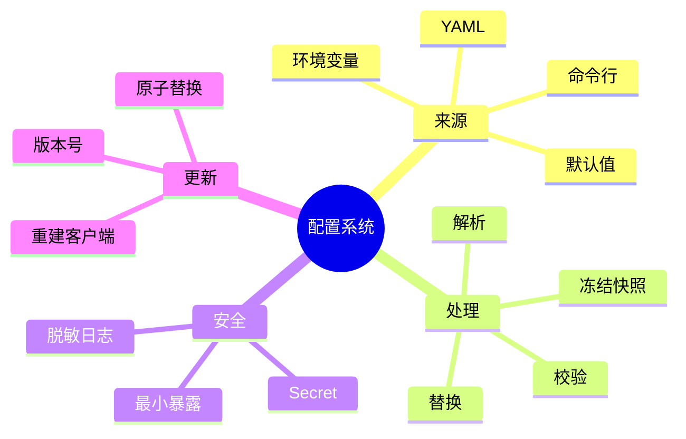

# 配置系统与不可变快照

## 1. 概念

配置把运行策略从代码中分离。完整配置系统需要处理：来源、优先级、默认值、类型转换、变量替换、校验、秘密、动态刷新和版本。



## 2. 项目实现

`ConfigLoader` 使用 Jackson YAML 映射到 Config 及 LLM、Tools、Web、Memory、MCP 等子对象；`EnvVariableResolver` 替换环境变量；Config 同时作为 singleton 和 ServiceLocator 注册对象。

## 3. 本质与原理

一次业务操作需要看到一致配置。如果请求开始时 model=A，进行到一半 URL 变成 B，会破坏语义。安全方案是：读取全部来源 → 合并优先级 → 校验 → 创建不可变 ConfigSnapshot → 原子发布整个引用。需要刷新 LlmClient 的配置变化，不应只改字段，而应构造新客户端后整体切换。

典型优先级：命令行 > 环境变量 >用户配置 >默认值。必须写进文档，否则同一键出现多处时行为不可预测。

## 4. Demo：不可变配置

```java
import java.net.URI;
import java.util.Map;
import java.util.concurrent.atomic.AtomicReference;

record LlmConfig(URI baseUrl, String model, String apiKey) {
    LlmConfig {
        if (baseUrl == null || model == null || model.isBlank())
            throw new IllegalArgumentException("invalid llm config");
    }
}

final class ConfigCenter {
    private final AtomicReference<LlmConfig> current;
    ConfigCenter(LlmConfig initial) { current = new AtomicReference<>(initial); }
    LlmConfig snapshot() { return current.get(); }
    void replace(LlmConfig next) { current.set(next); }
}
```

请求开始时调用一次 `snapshot()` 并持有该 record，整个请求期间配置一致。

## 5. Secret 原则

- API Key 用环境变量或系统 Secret Store；
- `toString()`、异常、HTTP debug 日志必须脱敏；
- 配置 API 返回前删除 key；
- 子进程环境变量只传 MCP 必需项；
- Secret 更新后旧客户端和旧 char[]/String 可能仍在内存，Java 无法完全保证擦除。

## 6. 常见错误

- 只有 YAML 解析，没有组合校验，如 provider=Anthropic 却缺 API Key；
- 默认值让错误配置“悄悄工作在错误模式”；
- 环境变量未设置时把 `${KEY}` 原样当 Key；
- 热更新 mutable singleton，读线程看到半更新状态；
- 配置健康检查输出敏感值。

## 7. 面试题

**哪些配置可热更新？** 日志级别、部分阈值可原子更新；模型 URL/Key、线程池大小、MCP 进程命令通常需要重建相关资源；监听端口可能要重启 Server。

**为什么 Config singleton 不理想？** 全局可变状态使测试隔离、多 workspace 和快照一致性困难。更合理是不可变 snapshot 通过构造器注入。

## 8. 掌握检查

- [ ] 能给出配置来源优先级；
- [ ] 能说明变量替换、解析、校验的顺序；
- [ ] 能解释不可变快照解决的问题；
- [ ] 能列出至少四个 Secret 泄漏位置。

## 9. 配置合并算法

配置不是简单 Map 覆盖。对象字段需要区分“未提供”和“显式提供 false/0/空列表”；否则用户无法关闭默认 true。Jackson POJO 的 primitive boolean 无法表达 missing，可使用 wrapper、JsonNode merge 或单独 override DTO。

合并后再做变量替换和类型校验，还是先替换再合并，要形成一致规则。通常每个来源先解析/替换，再按字段合并，最后执行跨字段校验。API Key `${LLM_KEY}` 未解析应直接报 CONFIG_MISSING，不能把占位符发给供应商。

## 10. 跨字段与能力校验

单字段合法不代表组合合法：

- `provider=ollama` 可不要求 API Key，但需要 baseUrl；
- `webSearch.enabled=true` 必须有相应 provider/endpoint；
- `mcp.autoReconnect=true` 时 maxAttempts 和 delay 必须为正；
- `globalHardLimit` 不应大于模型 context，也不应小于 perTool limit；
- relaxed tool mode 应伴随明显安全告警。

可让每个 config section 实现 `List<Violation> validate()`，启动一次性报告所有问题，而不是修一个重启一次。

## 11. 热更新的两阶段发布

```text
读取新文件
  → 解析/替换/校验
  → 构造新 LlmClient/资源
  → 健康探测
  → AtomicReference 切换 snapshot
  → 等旧请求完成
  → 关闭旧资源
```

这与 blue-green 类似。若新客户端构造失败，旧配置继续服务。已有 session 是否切换模型要有策略；中途切会影响 Prompt cache 和行为一致性。

## 12. 文件监听陷阱

WatchService 可能合并/丢事件，编辑器常用临时文件 rename，不能假设只收到一次 MODIFY。使用 debounce 后重新读取整个文件；读取到半写内容时保留旧 snapshot 并重试。配置版本/hash 应进入日志，便于定位某次请求使用哪份配置。

## 13. 深度实验

1. 写 YAML：显式 `enabled: false`，验证不会被默认 true 覆盖；
2. 制造缺失环境变量，确保错误不包含 Secret；
3. 两线程连续读取 snapshot，另一个线程整体 replace，验证读者只看到旧/新完整对象；
4. 新 LlmClient 健康失败时验证旧实例仍服务；
5. 搜索 Config 的 setter，判断哪些运行期修改会破坏快照语义。

## 14. 方案取舍与深层面试追问

**集中 Config 对象还是按模块配置？** 集中对象便于一次加载，却让任意模块可能读取全部 Secret；按模块注入最小 section 能缩小依赖和泄漏面。组合根持完整 snapshot，各组件只拿 `LlmConfig`/`ToolConfig`。

**为什么不能所有配置都热更新？** 监听端口、线程池、进程命令和客户端连接具有资源生命周期。修改字段不等于资源已切换；若无法做到构造新资源、健康验证、原子替换和旧资源 drain，就应明确要求重启。

**环境变量一定安全吗？** 比代码提交安全，但同机进程、诊断 dump、子进程继承和错误日志仍可能暴露。高等级 Secret 应用 OS Keychain/Vault，环境变量只作为注入渠道。

**默认值越多越友好吗？** 关键安全/供应商字段的默认可能掩盖误配置。可用性默认与安全默认分开：端口可默认，relaxed mode/API provider 应显式。

对 HippoBuddy 可进一步把 Config 单例替换成带 `version/hash` 的不可变 record，在每次 AgentRun 保存版本；这样一次线上行为能准确复现其配置上下文。

## 项目源码精读

源码入口：[ConfigLoader.java](../../../src/main/java/com/example/agent/config/ConfigLoader.java)、[Config.java](../../../src/main/java/com/example/agent/config/Config.java)、[EnvVariableResolver.java](../../../src/main/java/com/example/agent/config/EnvVariableResolver.java)、[ModelSnapshot.java](../../../src/main/java/com/example/agent/config/ModelSnapshot.java)。环境变量替换的核心代码是：

```java
private static final Pattern ENV_VAR_PATTERN = Pattern.compile("\\$\\{([^}]+)}");
private static final Pattern ENV_VAR_WITH_DEFAULT = Pattern.compile("^([^:]+):-(.*)$");

public static String resolve(String value) {
    if (value == null || value.isEmpty()) return value;
    StringBuilder result = new StringBuilder();
    Matcher matcher = ENV_VAR_PATTERN.matcher(value);
    while (matcher.find()) {
        String replacement = resolveEnvExpression(matcher.group(1));
        matcher.appendReplacement(result, Matcher.quoteReplacement(replacement));
    }
    matcher.appendTail(result);
    return result.toString();
}
```

加载链是：确定数据目录→按 YAML/YML/JSON 顺序查找→反序列化→解析 `${NAME:-default}`→校验/提供默认值。`Config.getInstance()` 用 synchronized 延迟加载；`reload()` 读取新对象后逐字段写回当前单例；`ModelSnapshot.from/applyTo` 保存一次模型选择所需字段。

> [!IMPORTANT]
> **疑难点：当前 reload 不是原子快照替换。** 它依次修改 `llm/tools/session/...`，并发 reader 可能短暂观察到新旧混合配置；`ModelSnapshot` 名为 Snapshot 但仍有 setter，也不是语言层不可变对象。更强实现应构造并完整校验 `ImmutableConfig(version, hash, ...)`，最后用一次 `AtomicReference.set()` 发布。还要注意 `ConfigLoader` 会记录 API Key 前缀，这仍扩大了 Secret 暴露面。

## 15. 源码级实现原理解读

`ConfigLoader.load()` 的实际优先级是 `config.yaml → config.yml → config.json`，找到第一个能反序列化的文件就返回；若都不存在，尝试复制 example，最后创建默认配置。解析 YAML/JSON 后才执行 `EnvVariableResolver`，所以环境变量在这里是“字符串占位符替换”，不是任意字段都自动由同名环境变量覆盖。

一次可靠配置发布应包含四个阶段：

1. **Parse**：文本到候选对象，只处理语法和类型错误。
2. **Resolve**：解析环境变量/secret reference，但日志永远不能输出明文 secret。
3. **Validate**：检查单字段范围与跨字段不变量，例如 provider=openai 时 apiKey/baseUrl 的组合。
4. **Publish**：用一次原子引用替换不可变快照；正在执行的请求继续用旧快照，新请求获得新快照。

当前 `ConfigLoader.resolveEnvVariables()` 会打印 API Key 的前十个字符，这比打印全部好，但仍扩大 secret 泄漏面；`saveDefaultConfig` 直接写目标文件也没有 temp + fsync + atomic move。`ModelSnapshot` 是 mutable bean，而且包含完整 apiKey，因此名字叫 snapshot 并不意味着天然不可变、安全或适合长期持久化。

## 16. 可运行完整实现：校验后原子发布配置

```java
import java.net.URI;
import java.util.*;
import java.util.concurrent.atomic.AtomicReference;

public class AtomicConfigDemo {
    record LlmSettings(String provider, URI baseUrl, String model,
                       char[] apiKey, int maxTokens) {
        LlmSettings {
            Objects.requireNonNull(provider); Objects.requireNonNull(baseUrl);
            Objects.requireNonNull(model); Objects.requireNonNull(apiKey);
            apiKey = apiKey.clone();
            if (maxTokens <= 0) throw new IllegalArgumentException("maxTokens <= 0");
            if (!baseUrl.getScheme().equals("https") && !baseUrl.getHost().equals("localhost"))
                throw new IllegalArgumentException("remote endpoint must use https");
        }
        @Override public char[] apiKey() { return apiKey.clone(); }
    }

    static final class ConfigRef {
        private final AtomicReference<LlmSettings> current;
        ConfigRef(LlmSettings initial) { current = new AtomicReference<>(initial); }
        LlmSettings snapshot() { return current.get(); }
        void reload(Map<String, String> raw, Map<String, String> env) {
            String keyExpr = require(raw, "apiKey");
            String key = keyExpr.startsWith("${")
                    ? require(env, keyExpr.substring(2, keyExpr.length() - 1)) : keyExpr;
            LlmSettings candidate = new LlmSettings(
                    require(raw, "provider"), URI.create(require(raw, "baseUrl")),
                    require(raw, "model"), key.toCharArray(),
                    Integer.parseInt(require(raw, "maxTokens")));
            current.set(candidate);              // 验证全部成功之后只发布一次
        }
        private static String require(Map<String, String> m, String key) {
            String value = m.get(key);
            if (value == null || value.isBlank()) throw new IllegalArgumentException("missing " + key);
            return value;
        }
    }

    public static void main(String[] args) {
        var initial = new LlmSettings("openai", URI.create("https://api.example"),
                "m1", "secret".toCharArray(), 2048);
        var ref = new ConfigRef(initial);
        try { ref.reload(Map.of("provider", "openai"), Map.of()); }
        catch (IllegalArgumentException expected) { /* 旧快照仍有效 */ }
        if (ref.snapshot() != initial) throw new AssertionError("partial publish");
    }
}
```

这段代码的核心不在 `AtomicReference`，而在“候选对象完全构造和校验成功以后才发布”。热更新还要定义哪些字段可变：线程池大小可以重建后交换，当前会话的 system prompt/tool snapshot 则不应悄悄变化，否则同一个 session 的行为不可复现。

## 延伸学习：博客与电子书

- [The Twelve-Factor App：Config](https://www.12factor.net/config)：理解配置与代码分离，也要结合桌面应用本地文件场景判断边界。
- [The Twelve-Factor App EPUB](https://12factor.net/12factor.epub)：电子书版，重点读 Config、Build/Release/Run 和 Disposability。

## 思维导图节点学习博客

本专题思维导图中的 14 个末级知识点均已展开为独立博客：[进入节点博客目录](../mindmap-blogs/01-architecture/05-configuration/README.md)。
