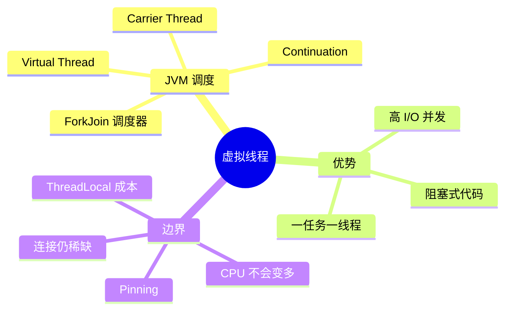

# Java 21 虚拟线程

## 学习目标

理解虚拟线程解决的问题、JVM 调度模型、阻塞卸载、pinning 和为什么仍需限流。

## 1. 概念

平台线程通常映射到操作系统线程，创建和栈内存成本较高。虚拟线程是 JVM 管理的轻量线程，大量虚拟线程复用少量 carrier 平台线程。



## 2. 原理

虚拟线程执行到 JDK 可识别的阻塞 I/O 时，JVM 保存它的 continuation 状态并从 carrier 卸载；carrier 可以运行其他虚拟线程。I/O 就绪后，虚拟线程重新被调度。它减少等待期间对 OS 线程的占用，保持顺序式栈和异常处理。

如果虚拟线程在某些 `synchronized` 临界区或 native 调用中阻塞，可能无法卸载，carrier 被 pin。Java 新版本持续改善，但原则仍是：不要在持有重量级监视器时做慢 I/O。

## 3. 项目实现

- `DashboardServer` 每个 HTTP 请求一个虚拟线程；
- `ThreadPools.TOOL_EXECUTOR` 和 ASYNC_GENERAL 使用 per-task 虚拟线程；
- `ConcurrentToolExecutor` 为可后台工具创建虚拟线程 executor；
- 子 Agent 使用有界平台线程池，因为限制对象是 LLM quota/Token，而非线程。

## 4. Demo

```java
import java.time.Duration;
import java.util.concurrent.Executors;

public class VirtualThreadDemo {
    public static void main(String[] args) throws Exception {
        long start = System.nanoTime();
        try (var executor = Executors.newVirtualThreadPerTaskExecutor()) {
            for (int i = 0; i < 10_000; i++) {
                executor.submit(() -> {
                    Thread.sleep(Duration.ofMillis(100)); // 模拟 I/O 等待
                    return null;
                });
            }
        }
        System.out.println(Duration.ofNanos(System.nanoTime() - start));
    }
}
```

用 `Executors.newFixedThreadPool(100)` 对比：固定池需要约 10 批，虚拟线程能让大量等待任务同时存在。注意这不代表真实服务可以同时建立 10,000 个 LLM 连接。

## 5. 选择原则

适合：HTTP 调用、文件 I/O、数据库等待、SSE 长连接。慎用：长时间 CPU 密集循环、无限并发外部服务、依赖大量 ThreadLocal 的框架。

虚拟线程推荐“一任务一线程”，不要为了复用虚拟线程再建小固定池。要限制业务资源时用 Semaphore、有界队列或供应商级 rate limiter。

## 6. 面试题

**虚拟线程比异步回调快吗？** 不一定。两者都能避免 OS 线程等待；虚拟线程主要改善代码结构、栈追踪和可维护性。最终吞吐仍受 I/O、CPU 和下游容量限制。

**如何发现 pinning？** 压测结合 JFR virtual thread pinned 事件、线程 dump 和持锁 I/O 审查。

## 7. 掌握检查

- [ ] 能画出 virtual → carrier 的调度关系；
- [ ] 能解释阻塞卸载而非“异步魔法”；
- [ ] 能列举三个仍需限流的资源；
- [ ] 能运行 Demo 并对比固定线程池。

## 8. Continuation 与栈的更深理解

平台线程通常预留较大连续栈；虚拟线程的栈以可增长 chunk 保存在堆中，挂起时 continuation 保存执行位置和局部状态。恢复不保证回到原 carrier，因此把 carrier/OS thread id 当业务身份是错误的。`Thread.currentThread()` 仍返回同一个 VirtualThread 对象，ThreadLocal 语义仍在，但百万虚拟线程各自保存大量 ThreadLocal 会消耗巨大内存。

阻塞卸载只发生在 JVM/JDK 知道的挂起点。Socket、LockSupport、队列等待通常友好；长 native 调用、某些文件系统调用或持 monitor 的阻塞可能占住 carrier。pinning 不等于数据死锁，而是可伸缩性退化。

## 9. 与 CompletableFuture/Reactor 的对比

| 模型 | 优点 | 代价 |
|---|---|---|
| 虚拟线程 | 顺序代码、自然异常栈、易迁移 | 每任务仍有栈/ThreadLocal，需防 pinning |
| CompletableFuture | 组合异步结果、无独占线程语义 | 异常/取消传播复杂，链条可读性下降 |
| Reactor | 背压流和算子生态 | 上下文/调试/阻塞边界学习成本高 |

SSE 服务端写流用虚拟线程很自然；处理真正高吞吐的连续事件流，Reactive Streams 的显式 demand 仍可能更合适。

## 10. Little's Law 下的虚拟线程

假设每秒 100 个 LLM 请求、平均等待 20 秒，系统平均有约 2000 个在途请求。平台线程模型需要大量 OS 线程；虚拟线程能承载这些等待。但下游若只允许 50 并发，其余 1950 个仍应在有界队列/信号量等待，否则会占内存、连接和费用预算。

## 11. 项目源码审计

1. 找到所有 `newVirtualThreadPerTaskExecutor`，确认 executor 是否关闭；
2. 搜索 `synchronized`，检查临界区内是否调用网络/文件/Process.waitFor；
3. 检查虚拟线程任务中的 MDC/ThreadLocal 数量；
4. 通过 JFR 观察 VirtualThreadStart/End/Pinned；
5. 压测 SSE 断开时虚拟线程是否及时结束。

## 12. 进阶追问

**虚拟线程调度公平吗？** 不应依赖严格公平；长 CPU 任务应主动避免占用或放专用池。**能设置池大小吗？** per-task executor 不以线程数限流，业务并发应另设 Semaphore。**为何子 Agent 用平台池？** 需要的是有界调度语义，线程类型不是核心。

## 13. 深度实验与面试追问

编写三个基准：10k sleep、10k localhost socket、CPU Fibonacci。比较固定池/虚拟线程的墙钟、平台线程数、heap 和 CPU；结果应显示虚拟线程只在等待型负载显著改善可伸缩性。再在 `synchronized(lock){ socket.read(); }` 中制造 pinning，用 JFR观察。

**虚拟线程会让 synchronized 失效吗？** 不会，互斥/JMM语义相同；问题是持 monitor阻塞可能 pin carrier。**虚拟线程是否总比平台线程省内存？** 单个通常小，但数量巨大且每个带 ThreadLocal/深栈时总量仍大。**为何仍需连接池？** 连接是服务器/数据库资源，不因线程轻量而无限。

源码继续追踪 `ThreadPools.initialize()`：哪些池是 virtual、哪些 scheduled/platform，为什么 MCP scheduler 需要少量稳定线程；再检查 shutdownAll 直接 `shutdownNow` 是否给任务 drain机会。

## 项目源码精读

源码入口：[ThreadPools.java](../../../src/main/java/com/example/agent/core/concurrency/ThreadPools.java)。项目没有把所有线程机械替换成虚拟线程，而是按工作类型区分：

```java
EXECUTORS.put(Names.TOOL_EXECUTOR,
        Executors.newVirtualThreadPerTaskExecutor());
EXECUTORS.put(Names.ASYNC_GENERAL,
        Executors.newVirtualThreadPerTaskExecutor());

EXECUTORS.put(Names.MCP_SCHEDULER,
        Executors.newSingleThreadScheduledExecutor(
            namedThreadFactory("mcp-scheduler", true)));
EXECUTORS.put(Names.JSONRPC_CLEANUP,
        Executors.newSingleThreadScheduledExecutor(
            namedThreadFactory("jsonrpc-cleanup", true)));
```

Tool/普通异步任务是大量彼此独立、以阻塞 I/O 为主的 task-per-thread，适合虚拟线程；定时调度器需要稳定的时间顺序与少量常驻 worker，因此仍用单平台线程。虚拟线程在阻塞 JDK I/O 时会卸载 carrier，真正提升的是“相同硬件允许等待更多任务”，不是让某个 Tool 更快。

> [!IMPORTANT]
> **疑难点：虚拟线程便宜不等于下游资源无限。** `newVirtualThreadPerTaskExecutor()` 自身不提供并发上限，如果一万个 Tool 同时打 LLM、磁盘或子进程，瓶颈只是从线程转移到连接、内存和配额。项目仍需 Semaphore/有界任务入口。另一个源码问题是 `shutdownAll()` 直接 `shutdownNow()`，它发出 interrupt 但未等待任务真正退出，不是完整 graceful shutdown。

## 14. 源码级实现原理解读

虚拟线程的创建、挂起和恢复可以拆成三个不同对象：`VirtualThread` 保存 Java Thread 身份；continuation 保存可恢复的 Java 栈片段；carrier 是实际执行机器指令的平台线程。任务调用支持虚拟线程的阻塞 API 时，JDK 把 continuation 从 carrier 卸载，注册 I/O 等待，carrier 转去运行别的 continuation。就绪后只是重新进入调度队列，并不保证回到原 carrier。

`ThreadPools` 把 Tool 和普通异步任务交给 `newVirtualThreadPerTaskExecutor()`，意味着 executor 的 submit 不会像固定池那样通过有限 worker 数形成背压：每个已接纳任务都能拥有一个虚拟线程。因此它解决的是“等待占用平台线程”，不是“限制请求数”。MCP cleanup/scheduler 使用单平台线程，则是因为定时任务需要少量稳定 worker 和串行时间语义。

Pinning 的本质是 continuation 暂时不能从 carrier 分离。它不破坏互斥正确性，却让等待重新占用稀缺 OS 线程。诊断必须结合负载：看到 `synchronized` 不是问题，持有 monitor 后做长网络等待才是问题；短临界区通常没有实际危害。

## 15. 可运行完整实现：虚拟线程 + 业务并发闸门

```java
import java.time.Duration;
import java.util.concurrent.*;

public class BoundedVirtualThreadsDemo {
    static final class Client implements AutoCloseable {
        private final ExecutorService tasks = Executors.newVirtualThreadPerTaskExecutor();
        private final Semaphore permits;
        Client(int maxConcurrentCalls) { permits = new Semaphore(maxConcurrentCalls, true); }

        Future<String> call(int id, Duration deadline) {
            return tasks.submit(() -> {
                if (!permits.tryAcquire(deadline.toMillis(), TimeUnit.MILLISECONDS))
                    throw new TimeoutException("queue deadline exceeded: " + id);
                try {
                    Thread.sleep(100);                 // 模拟可卸载的远程 I/O
                    return "ok-" + id;
                } finally {
                    permits.release();
                }
            });
        }
        public void close() throws InterruptedException {
            tasks.shutdown();
            if (!tasks.awaitTermination(2, TimeUnit.SECONDS)) tasks.shutdownNow();
        }
    }

    public static void main(String[] args) throws Exception {
        try (Client client = new Client(10)) {
            var futures = new java.util.ArrayList<Future<String>>();
            for (int i = 0; i < 100; i++) futures.add(client.call(i, Duration.ofSeconds(2)));
            for (Future<String> f : futures) System.out.println(f.get());
        }
    }
}
```

完整原理链是：100 个任务对应 100 个虚拟线程，但只有 10 个同时穿过 Semaphore 访问下游；等待 permit 和 sleep 都不会要求 100 个 carrier。把 `finally` 中的 release 删除会产生 permit 泄漏；把 `tryAcquire` 换成无限 `acquire` 会让请求失去端到端 deadline。这两个失败实验比只对比线程数更能证明掌握。

## 延伸学习：博客与电子书

- [OpenJDK JEP 444：Virtual Threads](https://openjdk.org/jeps/444)：重点读 Goals、Non-Goals、Scheduling 和不要池化虚拟线程的原因。
- [Oracle Java 21 Virtual Threads Guide](https://docs.oracle.com/en/java/javase/21/core/virtual-threads.html)：重点学习 pinning、JFR 事件和 thread dump。

## 思维导图节点学习博客

本专题思维导图中的 11 个末级知识点均已展开为独立博客：[进入节点博客目录](../mindmap-blogs/02-concurrency-network/01-virtual-threads/README.md)。
