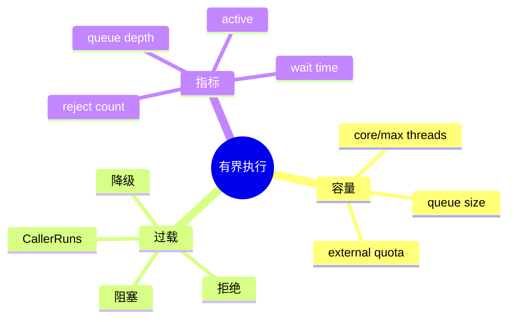

# 有界线程池、队列与背压

## 1. 概念与本质

线程池管理执行资源，队列吸收短期流量差，背压让上游感知下游过载。队列只能推迟问题，不能创造吞吐。



Little's Law：稳定系统中 `L = λW`。到达率长期大于处理率时，排队长度或等待时间必然增长。无界队列把拒绝变成 OOM 和超长尾延迟。

## 2. 项目实现

`SubAgentManager` 使用固定并行度 `max(2, CPU/2)` 和容量 100 的 LinkedBlockingQueue；每个任务还设超时。这个池限制的是昂贵的 Agent 工作，不只是平台线程数量。

## 3. Demo：显式拒绝

```java
import java.util.concurrent.*;

public class BoundedPoolDemo {
    public static void main(String[] args) {
        var pool = new ThreadPoolExecutor(
            2, 2, 0, TimeUnit.SECONDS,
            new ArrayBlockingQueue<>(4),
            new ThreadPoolExecutor.AbortPolicy());

        for (int i = 0; i < 10; i++) {
            int id = i;
            try {
                pool.submit(() -> {
                    try { Thread.sleep(1000); } catch (InterruptedException e) {
                        Thread.currentThread().interrupt();
                    }
                    System.out.println("done " + id);
                });
            } catch (RejectedExecutionException e) {
                System.out.println("rejected " + id);
            }
        }
        pool.shutdown();
    }
}
```

2 个运行、4 个排队，其余立即拒绝。实际 API 应把拒绝转换为“系统繁忙，请稍后重试”，而不是吞掉。

## 4. 拒绝策略

- Abort：快速失败，语义清晰；
- CallerRuns：让提交线程执行，自然减慢上游，但可能阻塞 HTTP/SSE 线程；
- Discard：只适合可丢遥测，不能用于会话数据；
- 自定义：记录指标、按优先级降级或持久化任务。

## 5. 容量设计

CPU 密集约接近核心数；I/O 密集可更大，但需要依据供应商并发、内存、文件句柄和 p95 延迟。子 Agent 最合理的限制可能是 provider semaphore + session budget，而非单一 CPU 公式。

## 6. 面试题

**有虚拟线程为什么还要有界？** 虚拟线程只降低线程成本，LLM 限流、Token 费用、内存和文件冲突仍稀缺。

**队列越大越好吗？** 否。大队列降低短期拒绝，但放大等待时间、过期任务和取消成本。

## 7. 掌握检查

- [ ] 能用 Little's Law 解释积压；
- [ ] 能比较四种拒绝策略；
- [ ] 能为子 Agent 选出至少三个容量指标；
- [ ] 能修改 Demo 观察 CallerRuns。

## 8. 队列等待时间与超时预算

任务总 timeout 若从开始执行才计时，排队 5 分钟后仍获得 5 分钟执行，会让用户等待不可控。应记录 submittedAt，deadline 从提交时开始；开始执行前若已过期直接取消。队列里还需要支持删除已取消任务，否则它仍占容量直到被消费者取出。

```java
record TimedTask(long deadlineNanos, Runnable action) {
    boolean expired() { return System.nanoTime() >= deadlineNanos; }
}
```

## 9. 多级限流

一个全局 pool 无法表达所有资源：

- 全局 Agent 并发保护进程；
- 每 provider Semaphore 保护 API quota；
- 每 session 上限防单用户垄断；
- Tool/Bash 单独限制进程数；
- Token bucket 控制每分钟请求/Token。

请求需按固定顺序获得配额，finally 释放，避免 quota 泄漏。多个限流器同时获取也可能死锁，应建立顺序或使用非阻塞尝试。

## 10. 背压传播

真正背压要让最上游改变行为：SubAgent 队列满 → ForkAgentsTool 返回结构化 busy → 主 Agent 减少 fork/稍后重试 → SSE 告知用户。仅在日志里写“队列满”而仍接受任务不算背压。

不同优先级可用多个队列或 PriorityBlockingQueue，但优先队列也要有界并防低优先级饥饿。交互式用户任务通常优先于后台 memory consolidation。

## 11. 容量推导示例

Provider 允许 60 RPM，平均单任务 30 秒，理论稳定并发约 30；若每个子 Agent 平均发 5 轮，任务到达率上限约每分钟 12 个。只按 CPU/2 可能大于或小于真实容量，应从供应商限制和实际 turn 数据反推。

## 12. 实验与指标

1. 逐步增加提交速率，绘制 queue depth 与 p95 wait；
2. 验证到达率超过处理率后队列线性增长；
3. 比较 Abort/CallerRuns 的吞吐和 HTTP 延迟；
4. 取消排队任务，确认容量立即释放；
5. 验证 shutdown 时队列任务是 drain 还是 reject。

## 13. 排队论原理、方案取舍与深层追问

利用率接近 100% 时，平均等待时间会非线性上升。容量设计不能把 executor 长期跑满；应保留突发余量，并以 queue wait SLO 自动拒绝/降级。超大队列会让任务在执行前已失去业务价值，尤其用户已取消或代码版本已改变。

**固定线程数公式为何不可靠？** `CPU×(1+wait/compute)` 只适合粗估，Agent 的 provider quota、每任务多轮和文件冲突更关键。**CallerRuns 会发生什么？** 若提交者是 HttpServer 虚拟线程，它被迫执行子 Agent，产生自然背压但也让请求生命周期和任务耦合。**如何公平？** per-session quota +分层队列，而非一个 FIFO 让大客户占满。

项目实验应为 SubAgentManager 暴露 active/queued/rejected/wait histogram；把 queue 从100改为1，在 fake LLM慢响应下验证 ForkAgentsTool返回的错误是否能让主 Agent理解，而非只在 executor抛异常。

## 14. 用 Little 定律校准容量

稳定系统近似满足 `L = λW`：平均到达率每秒 2 个任务、平均系统停留 10 秒，就会有约 20 个 in-flight。若 Provider 只允许 8 并发，其余必须排队或拒绝；把队列设成 100 只是允许请求等待约 50 秒，并没有提升吞吐。容量应从可接受 queue wait/截止时间反推，并在进入队列前检查剩余 deadline 与 Token 预算。

拒绝也是业务协议：返回稳定的 `QUEUE_FULL/RETRY_AFTER`，释放已预留预算，主 Agent 可退化为自己执行或减少拆分。关闭过程先停止接收，再取消/排空队列，最后等待 active 有界结束；否则 application shutdown 会遗留 Future 和未结算任务。

## 项目源码精读

源码入口：[SubAgentManager.java](../../../src/main/java/com/example/agent/subagent/SubAgentManager.java)。SubAgent 使用固定 worker 数和有界队列：

```java
private static final int MAX_PARALLEL_TASKS =
    Math.max(2, Runtime.getRuntime().availableProcessors() / 2);
private static final int MAX_QUEUED_TASKS = 100;

this.executor = new ThreadPoolExecutor(
    MAX_PARALLEL_TASKS,
    MAX_PARALLEL_TASKS,
    60L, TimeUnit.SECONDS,
    new LinkedBlockingQueue<>(MAX_QUEUED_TASKS),
    r -> {
        Thread t = new Thread(r, "subagent-" + queuedTaskCount.incrementAndGet());
        t.setDaemon(true);
        return t;
    }
);
```

队列容量把内存风险变成确定上界；固定 worker 控制 active 数。但默认拒绝策略是 `AbortPolicy`，第 101 个排队任务会在 `submit()` 抛 `RejectedExecutionException`。如果调用链没有转换成稳定 ToolResult，模型只看到内部异常，背压就没有成为业务协议。

> [!IMPORTANT]
> **疑难点：CPU/2 不是 LLM 并发的正确容量公式。** SubAgent 大部分时间等待 Provider，限制因素可能是 QPS、429、Token 预算或 workspace 文件冲突。应把 Provider semaphore、per-parent 配额、queue deadline 分开设计。源码中的 `queuedTaskCount` 实际只在创建线程时递增，用它命名线程可以，但不能代表当前排队数。

## 15. 源码级实现原理解读

`ThreadPoolExecutor.execute()` 的核心决策不是“先入队”：worker 数小于 corePoolSize 时优先创建 worker；达到 core 后尝试入队；队列满且 worker 少于 maximumPoolSize 时再扩 worker；两者都失败才进入 RejectedExecutionHandler。使用无界队列时 maximumPoolSize 基本失去意义，因为队列几乎不会满。

背压只有传播到生产者才成立。若 HTTP Handler 把任务放入另一个无界 CompletableFuture、再由它提交有界池，真正的入口仍可无限堆积。队列容量也不是越大越稳：到达率 `λ` 持续大于服务率 `μ` 时，队列只是把立即拒绝变成长尾超时。Little 定律 `L = λW` 可以用实际吞吐和允许等待反推在途容量。

项目中 SubAgentManager 的固定并行度和 100 容量队列提供了单进程有界接纳，但还要把 Provider 429、Token burn rate、文件冲突纳入业务限制；CPU/2 并不等价于适合的 LLM 并发度。

## 16. 可运行完整实现：带剩余时间预算的接纳控制

```java
import java.time.*;
import java.util.concurrent.*;
import java.util.concurrent.atomic.LongAdder;

public class BackpressureDemo implements AutoCloseable {
    private final ThreadPoolExecutor pool;
    private final LongAdder rejected = new LongAdder();

    BackpressureDemo(int workers, int queueCapacity) {
        pool = new ThreadPoolExecutor(workers, workers, 0, TimeUnit.MILLISECONDS,
                new ArrayBlockingQueue<>(queueCapacity), r -> Thread.ofPlatform().name("worker").unstarted(r),
                (task, executor) -> { rejected.increment(); throw new RejectedExecutionException("overloaded"); });
    }
    <T> CompletableFuture<T> submit(Callable<T> action, Instant deadline) {
        var result = new CompletableFuture<T>();
        pool.execute(() -> {
            if (Instant.now().isAfter(deadline)) {
                result.completeExceptionally(new TimeoutException("expired in queue"));
                return;
            }
            try { result.complete(action.call()); }
            catch (Throwable e) { result.completeExceptionally(e); }
        });
        return result;
    }
    public void close() { pool.shutdownNow(); }
    long rejectedCount() { return rejected.sum(); }

    public static void main(String[] args) {
        try (var service = new BackpressureDemo(1, 1)) {
            service.submit(() -> { Thread.sleep(500); return 1; }, Instant.now().plusSeconds(1));
            service.submit(() -> 2, Instant.now().minusMillis(1));
            try { service.submit(() -> 3, Instant.now().plusSeconds(1)); }
            catch (RejectedExecutionException expected) { System.out.println("fast reject"); }
        }
    }
}
```

这里区分了两个失败：第三个任务在入口被拒绝，调用方应返回 overload/稍后重试；第二个任务已经入队但开始时 deadline 已耗尽，不应再调用下游。只设置 `Future.get(timeout)` 会让调用方停止等待，却不自动阻止排队任务稍后执行，这是常见的“表面超时”。

## 延伸学习：博客与电子书

- [Java `ThreadPoolExecutor` API](https://docs.oracle.com/en/java/javase/21/docs/api/java.base/java/util/concurrent/ThreadPoolExecutor.html)：精读 queue、saturation policy 与 shutdown 状态。
- [Java Concurrency in Practice](https://jcip.net/)：重点读 Task Execution、Cancellation and Shutdown、Liveness/Performance。

## 思维导图节点学习博客

本专题思维导图中的 11 个末级知识点均已展开为独立博客：[进入节点博客目录](../mindmap-blogs/02-concurrency-network/02-bounded-pool-backpressure/README.md)。
