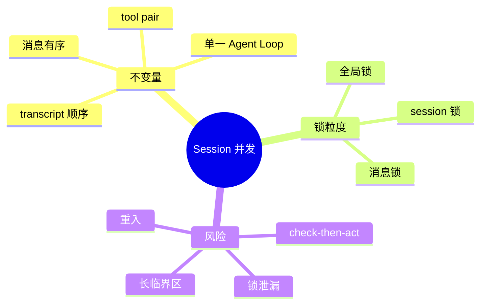

# Session 锁、原子性与临界区

## 1. 概念

原子性表示一组操作对其他并发者不可分割。临界区是必须在同一互斥边界中完成的复合操作。锁保护的是业务不变量，不是某个变量。



## 2. 本质与原理：为什么线程安全集合不够

`ConcurrentHashMap` 或 synchronized list 只保证单次 get/add 安全。对话流程是：读历史 → 调 LLM → 添加 assistant → 执行工具 → 添加 result。两个请求穿插时，每个单次操作都安全，整体历史仍会分叉。

## 3. 项目实现

ChatApiHandler 为每个 session 获取 lock，try/finally 释放。同一 session 串行，不同 session 并发。这个粒度与冲突域匹配：用户 A 的会话无需阻塞用户 B。

临界区很长，因为包含网络 LLM 调用。这样保证强顺序，但第二个相同 session 请求会等待较久。另一种方案是 session mailbox/actor：请求只入队，由单一消费者执行，取消和排队状态更易观测。

## 4. Demo：check-then-act

```java
import java.util.concurrent.ConcurrentHashMap;
import java.util.concurrent.locks.ReentrantLock;

final class SessionCounter {
    private final ConcurrentHashMap<String, Integer> values = new ConcurrentHashMap<>();
    private final ConcurrentHashMap<String, ReentrantLock> locks = new ConcurrentHashMap<>();

    int increment(String id) {
        var lock = locks.computeIfAbsent(id, ignored -> new ReentrantLock());
        lock.lock();
        try {
            int old = values.getOrDefault(id, 0);
            int next = old + 1;
            values.put(id, next);
            return next;
        } finally {
            lock.unlock();
        }
    }
}
```

计数可直接 `merge`，但 Demo 展示跨多个步骤时需要同一锁。

## 5. 锁生命周期

per-session lock Map 也要清理。不能在 unlock 后立刻无条件 remove：另一线程可能已取得同一个 lock 引用，第三线程随后创建新锁，导致同 session 同时存在两把锁。可使用带引用计数的 lock entry、striped locks，或 session 完整生命周期结束时统一清理。

## 6. 面试题

**为何不用全局 synchronized？** 正确但吞吐差；冲突只发生在同一 session，锁应按业务 key 分片。

**能否让同 session 两个只读请求并发？** 要看它们是否真的不改变 token stats、cache、last access、pending 状态。读写锁只有在读操作严格无副作用时才安全。

## 7. 掌握检查

- [ ] 能给出线程安全容器仍不够的例子；
- [ ] 能指出完整会话临界区；
- [ ] 能解释 per-key lock 清理竞态；
- [ ] 能比较 lock 与 actor/mailbox。

## 8. Java Memory Model 与可见性

锁除了互斥，还建立 happens-before：线程 A unlock 前的写，对随后成功 lock 的线程 B 可见。若只用普通 HashMap/boolean cancel 而没有锁、volatile 或原子变量，另一个线程可能长期读到旧值。线程安全设计必须同时回答原子性、可见性和有序性。

ConcurrentHashMap.get 返回的 Conversation 内部字段不自动线程安全；容器安全不传递到 value。Session lock 必须覆盖 value 的复合读写，或者 Conversation 自身封装同步。

## 9. 锁中执行远程 I/O 的取舍

持 session lock 调 LLM 能保证强顺序，但锁等待时间等于完整 Agent task。替代方案：

1. 每 session mailbox，所有 command 入队；
2. 用 version 乐观提交 LLM 结果，冲突时丢弃/重算；
3. 明确拒绝 session 已运行的新 chat，而非排队；
4. 允许 cancel command 走旁路，不能被同一长锁阻塞。

当前如果取消接口也需要同一 lock，用户将无法及时取消，应确保 cancel flag 是独立并发状态。

## 10. 可重入与回调

ReentrantLock 允许同线程再次取得，但跨异步回调通常换线程，不能依赖重入。持锁期间调用未知 listener/EventBus 可能回调 session 方法，造成长临界区或锁顺序反转。安全做法是在锁内只更新状态，复制待发布事件，解锁后通知外部。

## 11. 公平性与超时

非公平锁允许新线程插队，吞吐较高；交互会话通常请求很少，不需公平锁。`tryLock(timeout)` 能避免永久等待，并让 API 返回 session busy。等待超时与 Agent 执行超时应区分错误码。

## 12. 并发测试

用 CountDownLatch 让两个线程同时读旧 messageCount，再竞争追加；没有 session lock 时验证分叉，有锁时验证顺序。用第三线程设置 cancel，证明不依赖 session lock即可观察。测试中不要靠 `sleep(100)` 猜时序。

## 13. 深层面试追问

**为何不能只用 `synchronized(conversation)`？** 可以保护对象，但 session关联的 pending/tool snapshot/token stats 分散在多个 Manager，同一 monitor未覆盖全部不变量；需要统一 SessionState 或明确锁协议。

**锁粒度如何证明正确？** 列出共享状态和每个操作的读写集，任何交集必须由同一同步机制覆盖。只凭“看起来可能冲突”会过度加锁，也容易漏状态。

**如果 LLM 调用 2 分钟，锁等 2 分钟是否合理？** 强顺序下合理但体验差；可以第二请求立即返回 409 SESSION_BUSY，而非隐式长等。Actor mailbox则能返回排队位置并让 cancel成为高优先消息。

进一步实验：把 confirmation callback、cleanup scheduler和chat请求放在三个线程，通过 barrier重现 close/use竞态；用 JCStress 或重复万次检验 happens-before，而不是一次通过就认为安全。

## 14. Session Actor 的替代实现

可以为每个 session 建一个 mailbox，所有 `Chat/Confirm/Cancel/Close` 命令由单个 actor 顺序处理。这样状态迁移天然串行，跨 manager 共享锁减少；但 LLM/Tool 长 I/O 不能阻塞 mailbox，否则 Cancel 也无法处理。Actor 应启动异步 effect，完成后把带 `runEpoch` 的结果消息投回；若 epoch 已变化，迟到结果丢弃。

无论使用锁还是 Actor，都要维护同一不变量：同一 session 至多一个 active run；每个 Tool call 恰好一个终结结果；close 后不再接受新 effect；旧 callback 不得作用于新 run。锁是机制，不变量才是设计本质。

面试取舍：粗锁实现小而正确性直观，适合单机低并发；Actor 更适合复杂取消/确认状态，但引入 mailbox 容量、公平、生命周期与恢复问题。不要为“无锁”而引入 Actor。

## 项目源码精读

源码入口：[WebSessionManager.java](../../../src/main/java/com/example/agent/web/session/WebSessionManager.java)。当前 session 锁的超时分支如下：

```java
ReentrantLock lock = sessionLocks.computeIfAbsent(sessionId, k -> new ReentrantLock());
if (!lock.tryLock(timeout, unit)) {
    logger.warn("获取会话锁超时，可能发生死锁，强制清理：sessionId={}", sessionId);
    sessionLocks.remove(sessionId);
    lock = sessionLocks.computeIfAbsent(sessionId, k -> new ReentrantLock());
    lock.lock();
    return true;
}
return true;
```

正常路径通过同一 `ReentrantLock` 为一个 session 建立互斥和 happens-before；但超时分支把 lock identity 换掉了。旧线程可能仍持有旧锁，新线程却拿到新锁，于是两个线程同时进入本应互斥的临界区。这不是“强制解除死锁”，而是破坏了锁协议。

> [!IMPORTANT]
> **疑难点：锁不能由非持有线程强制删除来解锁。** 正确超时策略是返回 `SESSION_BUSY`、记录持锁诊断并由取消协议终止 owner；绝不能创建第二把锁。`releaseSessionLock()` 中“无等待者就 remove”也有引用竞态：另一个线程可能已取得旧 lock 引用但尚未进入等待队列。最简单安全方案是保留锁条目，或把 lock/refCount/removing 放入一次 `compute` 协议。

## 15. 源码级实现原理解读

`ConcurrentHashMap` 保证的是单次 `get/put/compute` 的结构安全，不会把“检查 session 未运行 → 标记运行 → 修改 Conversation → 清除标记”合并成一个事务。任何跨多个字段、集合或远程调用的不变量，都需要一个更大的串行化边界。

锁同时提供互斥与 Java Memory Model 的 happens-before：线程 A 对同一把锁 unlock 之前的写，对随后成功 lock 的线程 B 可见。但这条关系只覆盖被同一锁保护的状态。若写 Conversation 时持 sessionLock，读方完全不加锁，读方不能因为 Map 是并发容器就自动获得整个 Conversation 的一致快照。

按 session 串行化可选择 Lock 或 Actor。Lock 允许调用栈同步访问但容易把慢 I/O 放在临界区；Actor 把 command 投递到每 session mailbox，天然保持顺序，但所有读写都必须经过 mailbox。当前 Web 请求对同一 session 的 execute 应保持一轮级别的唯一所有者，否则两条 LLM 流会交错写历史。

## 16. 可运行完整实现：每 Session 串行执行器

```java
import java.util.*;
import java.util.concurrent.*;

public class SessionSerialExecutorDemo implements AutoCloseable {
    private final ExecutorService carriers = Executors.newVirtualThreadPerTaskExecutor();
    private final ConcurrentHashMap<String, Semaphore> gates = new ConcurrentHashMap<>();

    <T> Future<T> submit(String sessionId, Callable<T> action) {
        Objects.requireNonNull(sessionId);
        Semaphore gate = gates.computeIfAbsent(sessionId, ignored -> new Semaphore(1, true));
        return carriers.submit(() -> {
            gate.acquire();
            try { return action.call(); }
            finally { gate.release(); }
        });
    }
    void destroySession(String id) {
        Semaphore gate = gates.get(id);
        if (gate == null) return;
        if (!gate.tryAcquire()) throw new IllegalStateException("session still active");
        try { gates.remove(id, gate); }
        finally { gate.release(); }
    }
    public void close() { carriers.shutdownNow(); }

    public static void main(String[] args) throws Exception {
        try (var serial = new SessionSerialExecutorDemo()) {
            List<Integer> order = Collections.synchronizedList(new ArrayList<>());
            CountDownLatch firstStarted = new CountDownLatch(1);
            Future<?> a = serial.submit("s", () -> {
                order.add(1); firstStarted.countDown(); Thread.sleep(50); order.add(2); return null;
            });
            firstStarted.await();                         // 确认第一个任务已持有 session gate
            Future<?> b = serial.submit("s", () -> { order.add(3); return null; });
            a.get(); b.get();
            if (!order.equals(List.of(1, 2, 3))) throw new AssertionError(order);
        }
    }
}
```

代码没有在每次 release 后立刻删除 gate，因为“检查无人等待 → remove”与另一个线程取得旧 gate 存在竞态，可能让同一 session 同时出现两把锁。这里只允许显式销毁时删除，并要求调用方先停止新请求。若要支持安全自动回收，需要带引用计数的 lock entry，并在 map.compute 中原子增减所有者/等待者。

## 延伸学习：博客与电子书

- [JLS §17.4：Java Memory Model](https://docs.oracle.com/javase/specs/jls/se21/html/jls-17.html#jls-17.4)：掌握 unlock→lock 的 happens-before，而不只会调用 API。
- [Java `Lock` API](https://docs.oracle.com/en/java/javase/21/docs/api/java.base/java/util/concurrent/locks/Lock.html)：重点读内存同步、可中断获取和结构化释放要求。

## 思维导图节点学习博客

本专题思维导图中的 11 个末级知识点均已展开为独立博客：[进入节点博客目录](../mindmap-blogs/02-concurrency-network/03-session-lock-atomicity/README.md)。
