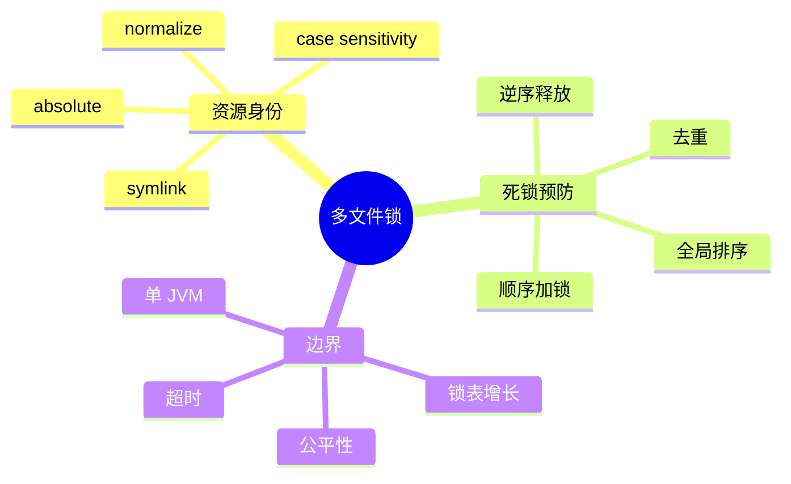

# 多文件锁与死锁

## 1. 概念

死锁通常需要四个条件：互斥、占有并等待、不可剥夺、循环等待。破坏其中任意一个即可避免死锁。多资源加锁最实用的方法是建立全局锁顺序，破坏循环等待。



## 2. 项目实现

`FileLockManager` 将路径转绝对路径并 normalize，去重后按字符串排序，依次获取 ReentrantLock，finally 逆序释放。所有任务遵循同一个全序，无法形成 A→B→A 环。

## 3. Demo

```java
import java.util.*;
import java.util.concurrent.*;
import java.util.concurrent.locks.ReentrantLock;

final class OrderedLocks {
    private final ConcurrentMap<String, ReentrantLock> locks = new ConcurrentHashMap<>();

    void withLocks(Collection<String> resources, Runnable action) {
        var names = resources.stream().distinct().sorted().toList();
        var acquired = new ArrayList<ReentrantLock>();
        try {
            for (String name : names) {
                var lock = locks.computeIfAbsent(name, k -> new ReentrantLock());
                lock.lock();
                acquired.add(lock);
            }
            action.run();
        } finally {
            for (int i = acquired.size() - 1; i >= 0; i--) acquired.get(i).unlock();
        }
    }
}
```

用两个线程分别传 `[A,B]` 和 `[B,A]`，内部都会变成 `[A,B]`。

## 4. 路径作为锁 key 的难点

`a/../b` 与 `b` 应归一；Windows 大小写不敏感；硬链接/符号链接可能让两个字符串指向同一文件；尚不存在的目标不能 `toRealPath()`。严格方案需统一 workspace 语义、解析最近存在祖先，并在真正写入时再次校验。

## 5. 边界与改进

- 这是进程内锁，两个 HippoBuddy 实例仍会冲突；
- lock Map 无界增长，可用弱引用、引用计数或 striped lock；
- `lock()` 无限等待，可提供 `tryLock(timeout)` 和取消；
- ReentrantLock 默认非公平，吞吐高但可能饥饿；
- “read lock” 如果仍用同一互斥锁，没有并行读收益。

## 6. 面试题

**数据库死锁和文件锁死锁本质相同吗？** 都是资源等待图产生环；数据库能检测并回滚一个事务，应用锁通常要靠顺序或超时预防。

**为什么逆序释放？** 不是消除死锁的必要条件，但符合栈式资源管理，减少持有外层资源时暴露内层状态。

## 7. 掌握检查

- [ ] 能写出死锁四条件；
- [ ] 能证明全序加锁消除循环等待；
- [ ] 能说明 normalize 与 real path 区别；
- [ ] 能指出跨进程场景的不足。

## 8. Wait-for Graph 证明

把任务作为节点、等待的锁作为边：T1 持 A 等 B，T2 持 B 等 A，形成环。全序要求任何任务只能从较小资源等待较大资源，因此沿等待边资源序严格递增，有限集合不可能回到更小的 A，环被消除。这是比“排序看起来安全”更严格的证明。

去重同样重要：非可重入锁重复申请同一资源会自锁；ReentrantLock 虽可重入，却需要对应次数释放。先 distinct 简化语义。

## 9. 锁 key 的统一身份

Windows `C:\A.txt` 与 `c:\a.TXT`、Unix hard link、symlink 都可能代表相同文件。若安全校验、并发版本和锁管理各自计算 key，会出现“安全认为一个文件，锁认为两个文件”。应有统一 `ResourceIdentity` 服务，返回 normalized path、real ancestor、fileKey 等。

## 10. 跨进程方案

`FileChannel.lock()` 提供 OS advisory lock，但是否被其他程序遵守、网络文件系统语义、同 JVM overlapping lock 都有限制。更强方案包括：SQLite transaction、Git/worktree 隔离、集中式 lease 服务、每文件 version compare。Coding Agent 更实用的是独立 worktree +合并，而非把所有写入串在全局锁上。

## 11. 超时与部分获取

获取 A 成功、B 超时，必须释放 A。使用统一 deadline，后续每把锁只等待 remaining time。收到 interruption 同样逆序释放并恢复中断标记。日志记录等待最久的资源，但不要在热路径输出完整敏感路径。

## 12. 实验

1. 先写不排序版本，用 `[A,B]`/`[B,A]` 和 barrier 复现死锁；
2. 打开排序确认线程结束；
3. 创建 symlink 指向同一文件，观察当前锁 key 是否一致；
4. 访问十万随机路径，观察 lock Map 大小；
5. 设计引用计数删除，并证明不会同时生成两把锁。

## 13. 失败模式与面试追问

失败不仅是死锁：长时间持锁导致 convoy；非公平锁造成饥饿；异常路径漏 unlock；路径别名绕过互斥；任务取消但仍持锁；锁表泄漏。所有锁获取必须与 try/finally相邻，不能在一个方法 lock、另一个方法 unlock。

**`ConcurrentHashMap<String,ReentrantLock>` 如何安全删除？** 仅当无持有者、无等待者且不会有线程刚拿到引用时删除，条件很难原子满足。Striped locks用固定数量换碰撞，避免删除复杂度；精确锁可用 entry refCount+compute 协调。

**数据库是否能替代文件锁？** 只保护数据库记录，无法自动保护用户直接编辑的工作区文件。可把版本 token存库，提交时 compare；最终文件写仍需进程锁/原子替换。

源码审查 `normalizePath` 对 Windows大小写、workspace切换和 symlink 的处理；再验证 `withReadLock` 实际使用 ReentrantLock，因此名称不代表读并发语义。

## 14. 锁的原理：真正提供了什么

互斥锁同时提供 mutual exclusion 与 happens-before：线程 A 在 unlock 前的写，对随后成功 lock 的线程 B 可见。它不自动保证跨进程、磁盘耐久或业务版本正确；若用户用 IDE 直接改文件，JVM 内的 `ReentrantLock` 完全感知不到，所以提交仍需 hash/version 校验。

锁身份必须来自 canonical resource identity，而不是调用者原始字符串；`a/../b`、大小写别名、symlink 若映射到同一文件却拿到不同锁，会形成“看似加锁但仍并发”。多资源操作先解析全部身份、去重并按稳定全序获取；中途失败逆序释放，任何 Tool 执行期间都不得再以相反顺序临时加锁。

实验用 barrier 让 T1 持 A 等 B、T2 持 B 等 A，证明无序版本会卡死而排序版本完成；结合 `ThreadMXBean.findDeadlockedThreads()` 做检测。再让异常、取消和 timeout 在临界区每个阶段触发，断言锁最终可被另一线程获取。

## 项目源码精读

源码入口：[FileLockManager.java](../../../src/main/java/com/example/agent/tools/concurrent/FileLockManager.java)。多文件锁采用“规范化→去重→排序→正序获取→逆序释放”：

```java
for (String p : filePaths) {
    String n = normalizePath(p);
    if (!normalized.contains(n)) normalized.add(n);
}
normalized.sort(String::compareTo);

try {
    for (String n : normalized) {
        ReentrantLock lock = fileLocks.computeIfAbsent(n, k -> new ReentrantLock());
        lock.lock();
        acquired.add(lock);
    }
    return action.run();
} finally {
    for (int i = acquired.size() - 1; i >= 0; i--) acquired.get(i).unlock();
}
```

稳定全序打破了 Coffman 条件中的 circular wait；finally 保证异常路径释放。逆序释放不是防死锁的核心，但与栈式资源所有权一致，便于未来嵌套锁维护。

> [!IMPORTANT]
> **疑难点：当前 normalize 只做 absolute+lexical normalize，没有 `toRealPath()`。** symlink、Windows junction、大小写别名可能指向同一真实文件却拿到不同 key。`withReadLock` 也使用 `ReentrantLock`，因此名称虽叫 read，实际不支持并行读。最后，Map 永不删除 lock 会增长；贸然删除又会产生 lock identity 竞态，需要 striped lock 或带引用计数的 entry。

## 15. 源码级实现原理解读

死锁需要同时满足互斥、持有并等待、不可抢占、循环等待。多文件编辑无法消除前三个条件，通常通过全局锁顺序消除第四个条件：所有任务先把路径变成同一种 canonical identity，再按稳定字典序获取，释放时逆序。

排序之前必须完成身份统一。`a/../b.txt`、大小写差异、符号链接和 Windows 盘符可能指向同一文件；若它们生成不同 lock key，Java 锁保护的只是字符串而不是底层文件。进程内 `ReentrantLock` 也不约束编辑器、Git 或另一个 HippoBuddy 进程，因此执行写入前仍需版本/内容 hash 校验。

`FileLockManager` 的价值是协调同进程 Tool，但真正的提交协议应是：解析路径 → sandbox 验证 → 规范化并排序 → 获取锁 → 重新验证路径/版本 → 写 temp → 原子替换 → 记录快照 → 释放锁。锁前检查会受到 TOCTOU，不能替代锁后的重新检查。

## 16. 可运行完整实现：有序、超时、逆序释放的多键锁

```java
import java.nio.file.*;
import java.time.*;
import java.util.*;
import java.util.concurrent.*;
import java.util.concurrent.locks.ReentrantLock;

public final class OrderedFileLocks {
    private final ConcurrentHashMap<Path, ReentrantLock> locks = new ConcurrentHashMap<>();

    <T> T withLocks(Collection<Path> input, Duration timeout, Callable<T> action) throws Exception {
        List<Path> keys = input.stream().map(p -> p.toAbsolutePath().normalize()).distinct()
                .sorted(Comparator.comparing(Path::toString)).toList();
        List<ReentrantLock> acquired = new ArrayList<>();
        long deadline = System.nanoTime() + timeout.toNanos();
        try {
            for (Path key : keys) {
                ReentrantLock lock = locks.computeIfAbsent(key, ignored -> new ReentrantLock());
                long remaining = deadline - System.nanoTime();
                if (remaining <= 0 || !lock.tryLock(remaining, TimeUnit.NANOSECONDS))
                    throw new TimeoutException("cannot lock " + key);
                acquired.add(lock);
            }
            return action.call();                       // 锁内必须重新校验文件版本
        } finally {
            for (int i = acquired.size() - 1; i >= 0; i--) acquired.get(i).unlock();
        }
    }
}
```

使用单调时钟 `System.nanoTime()` 计算剩余预算，避免系统时间回拨；每次获取使用同一个总 deadline，避免 N 把锁各等 timeout 导致总等待放大 N 倍。此 Demo 只做 lexical normalize，生产环境还要在允许存在的路径上处理 `toRealPath()`、符号链接和 Windows 大小写语义。

## 延伸学习：博客与电子书

- [Oracle Java Concurrency Guide](https://docs.oracle.com/en/java/javase/21/core/concurrency.html)：结合锁、原子变量和并发集合理解每种机制的保证范围。
- [Java Concurrency in Practice](https://jcip.net/)：重点读 Liveness Hazards、Deadlock、Lock Ordering。

## 思维导图节点学习博客

本专题思维导图中的 12 个末级知识点均已展开为独立博客：[进入节点博客目录](../mindmap-blogs/02-concurrency-network/04-file-lock-deadlock/README.md)。
