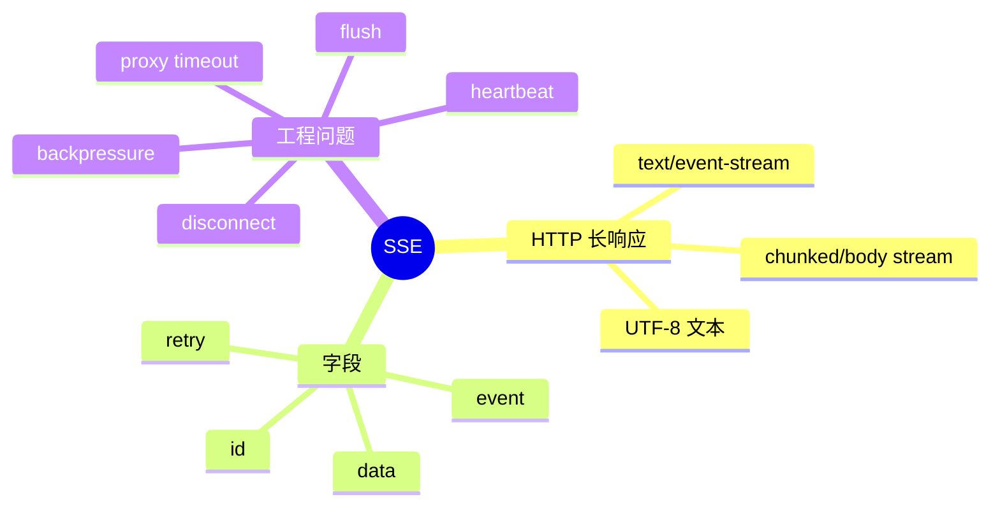

# SSE 协议与流式响应

## 1. 概念

Server-Sent Events 是基于 HTTP 的服务端单向事件流。响应 Content-Type 为 `text/event-stream`，每个事件由若干字段和一个空行结束。

```text
event: content
id: 42
data: {"text":"hello"}

```



## 2. 原理

SSE 没有新的传输层，它只是约定 HTTP body 的文本帧格式。连接顺序天然保证事件顺序；浏览器 EventSource 可以按 id 重连。服务端必须保持响应不结束并及时 flush，否则缓冲区可能迟迟不把 Token 发出。

## 3. 项目实现

`ChatApiHandler` 设置 SSE Header，`SseWriter` 将 reasoning、content、tool_start/result/confirmation、token_update、error 串行写入。确认和取消仍通过独立 HTTP POST，符合 SSE 单向模型。

## 4. Demo：JDK HttpServer

```java
import com.sun.net.httpserver.HttpServer;
import java.net.InetSocketAddress;
import java.nio.charset.StandardCharsets;

public class SseDemo {
    public static void main(String[] args) throws Exception {
        var server = HttpServer.create(new InetSocketAddress(8080), 0);
        server.createContext("/events", exchange -> {
            exchange.getResponseHeaders().set("Content-Type", "text/event-stream; charset=utf-8");
            exchange.getResponseHeaders().set("Cache-Control", "no-cache");
            exchange.sendResponseHeaders(200, 0);
            try (var out = exchange.getResponseBody()) {
                for (int i = 1; i <= 5; i++) {
                    String event = "id: " + i + "\nevent: tick\ndata: " + i + "\n\n";
                    out.write(event.getBytes(StandardCharsets.UTF_8));
                    out.flush();
                    Thread.sleep(500);
                }
            }
        });
        server.start();
    }
}
```

用 `curl -N http://localhost:8080/events` 观察流式输出。删除 flush，观察不同环境的缓冲表现。

## 5. SSE vs WebSocket：方案取舍

SSE：单向、文本、HTTP 语义简单、自动重连；WebSocket：全双工、支持二进制、更适合音频/协作。LLM 文本流由服务端主导，SSE 通常足够。

## 6. 生产问题

- 用注释行 `: heartbeat\n\n` 保活；
- 代理可能缓冲响应，需要关闭 buffering；
- EventSource 断线重连会重复事件，需 id/幂等；
- 客户端慢会阻塞写或撑大队列，必须限制缓冲；
- CORS、Origin、认证 Token 仍必须处理；
- 连接关闭时传播取消，避免后台继续计费。

## 7. 掌握检查

- [ ] 能手写一帧合法 SSE；
- [ ] 能解释空行和 flush 的作用；
- [ ] 能比较 SSE 与 WebSocket；
- [ ] 能列出代理、重连和背压问题。

## 8. Wire Format 细节

一个事件可有多行 `data:`，客户端用换行拼接；以冒号开头是注释，可作 heartbeat；`id:` 更新重连的 Last-Event-ID；`retry:` 建议客户端重连间隔。数据中包含换行时必须拆成多行 data，不能直接破坏空行分帧。

SSE 规范使用 UTF-8。HTTP/1.1 常用 chunked transfer，HTTP/2 下仍是 response stream。`Connection: keep-alive` 在 HTTP/2 无意义，代理设置比应用 Header 更关键。

## 9. 事件语义设计

content token 是增量事件，tool_result 是事实事件，error/complete 是终止事件。每类 payload 应有稳定 schema/version。若客户端断线重连，是否重放取决于服务端保存 event buffer；单纯设置 id 而不保存历史没有恢复能力。

可以定义 sessionSequence 单调递增，客户端忽略重复、检测缺口。LLM token 本身通常无需完整重放，但 confirmation/result 不能丢，应可通过 session state API 补拉。

## 10. 背压和断开检测

OutputStream.write 阻塞时，SseWriter 队列会增长。设置队列上限；对可合并的 token 合批；关键事件不可丢；超过阈值可取消 Agent 并关闭连接。Java HttpServer 对客户端断开通常在 write/flush 抛 IOException，捕获后必须通知 SessionCancelManager。

## 11. 安全

浏览器 EventSource 原生 Header 定制有限，认证可使用 HttpOnly cookie 或短期 query token，但 URL token 会进入日志/历史。CORS `*` 与 credentials 不兼容，也不适合本地高权限 Tool API。需要校验 Origin、CSRF 和 session ownership。

## 12. 实验

1. 用 curl `-N` 与不加 `-N` 比较客户端缓冲；
2. 在反向代理后验证是否聚合 chunk；
3. 客户端限速，观察服务端队列/线程；
4. 中途断网，确认 LLM/工具取消；
5. 发送 data 多行、Unicode、空字符串和超大 payload；
6. 为 confirmation 设计断线后的状态补拉。

## 13. 故障矩阵与面试追问

故障点包括响应 Header前失败、Header后首事件前失败、输出中断、终止事件丢失、客户端断开但服务端未感知、代理缓冲/超时、队列满。每个阶段的重试语义不同：Header前可返回普通错误；已发 token后不能透明重放；confirmation丢失靠状态API恢复。

**SSE有背压协议吗？** 没有类似 Reactive Streams demand；最终依赖 TCP窗口和服务端有界缓冲。**为何不是每个 Token一个事件？** 写/flush系统调用和JSON开销高，可微批但要平衡首字延迟。**如何知道正常结束？** 发送明确 complete事件并关闭；仅连接关闭无法区分完成和断线。

对项目应检查 `SseWriter` queue容量、writer线程异常如何通知 producer、close是否drain、JSON是否统一 ObjectMapper。用浏览器刷新、curl断开和慢读取三种客户端验证 SessionCancelManager与资源释放。

## 项目源码精读

源码入口：[SseWriter.java](../../../src/main/java/com/example/agent/web/util/SseWriter.java)。项目把 Agent 线程与可能阻塞的 socket writer 隔离：

```java
private final BlockingQueue<String> queue = new LinkedBlockingQueue<>(2048);
private volatile boolean disconnected = false;

public void sendSseEvent(String event, String data) {
    if (closed || disconnected) return;
    String payload = "event: " + event + "\n" + "data: " + data + "\n\n";
    if (!queue.offer(payload)) {
        disconnected = true;
        queue.clear();
        return;
    }
    enqueued.incrementAndGet();
}
```

后台 `drainLoop()` 单消费者顺序执行 `write+flush`；IOException 后置 `disconnected` 并清队列。这样慢客户端不会阻塞 Agent/Transcript，代价是客户端落后过多时放弃实时事件。SSE wire format 中空行终结事件，多行 `data:` 才由浏览器拼接；项目当前每个 data 作为单行，JSON 中真实换行必须先正确转义。

> [!IMPORTANT]
> **疑难点：SSE 投递成功不等于业务成功。** `queue.offer` 只代表进入进程内存，`processed` 也只代表发送线程处理过，即便写失败仍递增。可靠真源应是 Transcript，前端断线后通过 session 重放恢复。另需区分“浏览器主动 abort”“TCP 写失败”“队列满”，它们对 Agent 是否取消可以有不同产品语义。

## 14. 源码级实现原理解读

SSE 是一条长期存在的 HTTP response body。服务端写入的是 UTF-8 文本记录，空行结束一个事件；一个事件可有多个 `data:` 行，客户端会用换行连接。`id:` 供浏览器重连发送 `Last-Event-ID`，`retry:` 是客户端重试建议，冒号开头是 comment/heartbeat。

HippoBuddy 的 `SseWriter` 把 Agent 内部事件投影为前端流，真正的不变量是“同一连接的一整个 frame 不得与另一个线程的 frame 字节交错”。即使底层 OutputStream 单次 write 看似原子，多次写 `event/data/blank-line` 仍需在同一临界区完成。写后 flush 降低可见延迟，但每个 token 都 flush 会增加 syscall 和代理开销，可在语义事件或短时间批次上权衡。

HTTP 200 已经发送以后，LLM/Tool 失败不能再改成 500，只能发送结构化 `event: error` 后关闭。客户端断开通常首先表现为 write/flush 的 IOException，Handler 应把它翻译为 session cancellation，继续在后台生成内容会浪费 Token 和留下迟到副作用。

## 15. 可运行核心实现：安全构造 SSE Frame

```java
import java.io.*;
import java.nio.charset.StandardCharsets;
import java.util.concurrent.locks.ReentrantLock;

final class SseEmitter implements Closeable {
    private final OutputStream out;
    private final ReentrantLock writeLock = new ReentrantLock();
    SseEmitter(OutputStream out) { this.out = out; }

    void send(String event, String id, String data) throws IOException {
        if (event != null && (event.contains("\r") || event.contains("\n")))
            throw new IllegalArgumentException("invalid event name");
        if (id != null && (id.contains("\r") || id.contains("\n")))
            throw new IllegalArgumentException("invalid id");
        StringBuilder frame = new StringBuilder();
        if (event != null) frame.append("event: ").append(event).append('\n');
        if (id != null) frame.append("id: ").append(id).append('\n');
        String normalized = data == null ? "" : data.replace("\r\n", "\n").replace('\r', '\n');
        for (String line : normalized.split("\n", -1)) frame.append("data: ").append(line).append('\n');
        frame.append('\n');

        byte[] bytes = frame.toString().getBytes(StandardCharsets.UTF_8);
        writeLock.lock();
        try { out.write(bytes); out.flush(); }
        finally { writeLock.unlock(); }
    }
    public void close() throws IOException { out.close(); }

    public static void main(String[] args) throws Exception {
        var bytes = new ByteArrayOutputStream();
        try (var sse = new SseEmitter(bytes)) { sse.send("delta", "7", "a\nb"); }
        String wire = bytes.toString(StandardCharsets.UTF_8);
        if (!wire.equals("event: delta\nid: 7\ndata: a\ndata: b\n\n")) throw new AssertionError(wire);
    }
}
```

数据必须逐行添加 `data:`；直接把包含换行的 JSON 拼到一行会产生非法/歧义 frame。事件名和 id 禁止 CR/LF，防止字段注入。生产版还应设置 `Content-Type: text/event-stream; charset=utf-8`、禁缓存、代理 buffering 策略、heartbeat、最大连接时长和每连接出站队列上限。

## 延伸学习：博客与电子书

- [MDN：Using server-sent events](https://developer.mozilla.org/en-US/docs/Web/API/Server-sent_events/Using_server-sent_events)：精读 event stream format、断线重连和连接数限制。
- [OpenAI Streaming Events API](https://platform.openai.com/docs/api-reference/responses-streaming)：对照 typed event、sequence number 和终态事件设计。

## 思维导图节点学习博客

本专题思维导图中的 12 个末级知识点均已展开为独立博客：[进入节点博客目录](../mindmap-blogs/02-concurrency-network/05-sse/README.md)。
