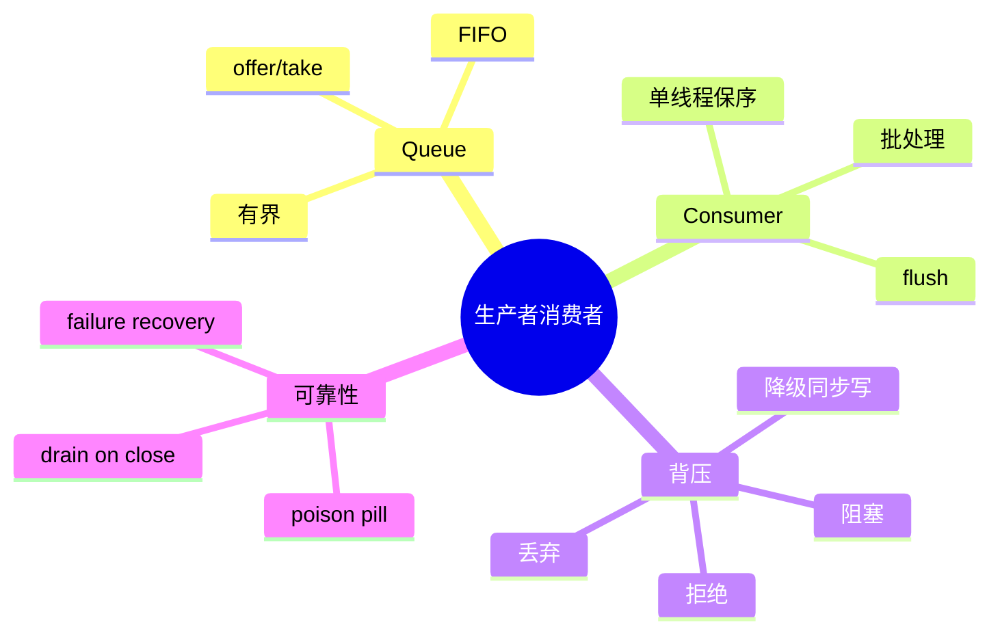

# 生产者—消费者、批处理与背压

## 1. 概念、原理与本质

生产者生成工作，消费者处理工作，队列解耦二者的时间和线程。队列是缓冲器，不是吞吐放大器。长期 `produce rate > consume rate` 必然积压。



## 2. 项目实例

- SseWriter：多个逻辑事件生产者，单一网络消费者保证写顺序；
- SessionTranscript：业务线程 enqueue，后台线程批量 append JSONL；
- SubAgent：提交者生产任务，线程池消费者执行。

Transcript 使用容量 10,000、batch 50、500ms flush，在吞吐、延迟和丢失窗口之间折中。

## 3. Demo

```java
import java.util.*;
import java.util.concurrent.*;

public class BatchConsumerDemo {
    public static void main(String[] args) throws Exception {
        var queue = new ArrayBlockingQueue<String>(100);
        var consumer = Thread.startVirtualThread(() -> {
            var batch = new ArrayList<String>(10);
            try {
                while (!Thread.currentThread().isInterrupted()) {
                    String first = queue.poll(500, TimeUnit.MILLISECONDS);
                    if (first == null) continue;
                    batch.add(first);
                    queue.drainTo(batch, 9);
                    System.out.println("flush " + batch);
                    batch.clear();
                }
            } catch (InterruptedException e) {
                Thread.currentThread().interrupt();
            }
        });

        for (int i = 0; i < 25; i++) queue.put("event-" + i);
        Thread.sleep(1000);
        consumer.interrupt();
        consumer.join();
    }
}
```

## 4. 关键设计

单消费者易保序，多消费者提高吞吐但需要 sequence 重排。批量越大系统调用越少，但单条事件等待越久。关闭时要停止生产、drain 队列、flush 剩余数据；直接 interrupt 可能丢尾批。

队列满时：普通 telemetry 可丢；会话恢复日志不应轻易丢。Transcript 更稳妥的降级是同步写或把 session 标记为 incomplete。

## 5. 面试题

**为什么不用无界 LinkedBlockingQueue？** 它把下游过载隐藏为内存增长和不可控延迟。

**如何保证 SSE 事件顺序？** 单消费者串行写，或每个事件带 sequence 并在发送前重排；不能让多个线程直接写同一 OutputStream。

## 6. 掌握检查

- [ ] 能解释队列为何不能提高消费者吞吐；
- [ ] 能列出队列满的四种策略；
- [ ] 能设计安全 drain/close；
- [ ] 能说明 batch size 与延迟的取舍。

## 7. 队列语义与内存可见性

BlockingQueue 的 put/take 建立 happens-before：生产者在 put 前写入的对象状态，对消费者 take 后可见。但放入队列后继续修改可变对象仍会产生数据竞争，因此事件应 immutable 或在入队前深复制。

FIFO 只保证入队顺序。多个生产线程真正的业务顺序若依赖外部 sequence，必须显式编号；线程调度决定谁先 put。SseWriter 若由 content/tool 线程同时提交，应由 Orchestrator 定义逻辑顺序。

## 8. 批量消费者失败

一批 50 条写到第 20 条磁盘失败：哪些已成功？是否重试整批会重复？可靠方案是每条有 UUID/sequence，消费者记录成功边界；重新追加允许 dedupe。若 BufferedWriter 失败后状态未知，关闭并重新打开，不要继续在可能损坏的 writer 上写。

## 9. At-most/at-least/exactly-once

- 丢弃队列：at-most-once；
- 失败重试：at-least-once，需要幂等；
- exactly-once 通常是“至少一次传输 +业务去重/事务提交”的效果，不是队列魔法。

Transcript 当前有 UUID 去重，但有限缓存和文件写入决定它更接近进程窗口内幂等，不应宣称分布式 exactly-once。

## 10. 自适应批量

低流量时按 flush interval 保证延迟，高流量时达到 batch size 立即刷。还可限制 batch bytes，避免 50 个超大 ToolResult 占用内存。SSE token 可按 10~30ms 聚合字符降低 write 系统调用，同时不明显损害体验。

## 11. 实验

1. 消费者每条 sleep，验证队列满的策略；
2. 在批次中间注入 IOException，统计重复/丢失；
3. 使用 mutable event，入队后修改，观察错误；
4. 比较 batch=1/50/500 的吞吐与 p95 延迟；
5. shutdown 时先 interrupt 与先 drain，比较尾数据。

## 12. 项目源码追踪与深层追问

沿 `SessionTranscript.append()` 追踪 offer timeout、writer loop、batch drain、flush、disabled/recovery和 close；列出每个状态下事件是阻塞、丢弃还是写盘。沿 `SseWriter.sendSseEvent()` 比较同样问题：会话日志重可靠性，Token事件重实时性，因此策略不应完全相同。

**单消费者一定不会丢吗？** 只保证串行，进程崩溃、队列满、consumer异常仍会丢。**多个消费者如何保序？** 按 session/key分区到固定消费者，或带 sequence重排。**Poison pill和interrupt哪个好？** Poison pill可在正常队列顺序drain，队列满/producer未停时复杂；interrupt适合强取消但要处理尾批。

进阶实现给 batch 写入返回最高 durable sequence，producer/SessionState只在确认后更新 metadata；这样能定位 crash后 metadata超前/落后。

## 13. 背压必须跨越组件边界

Queue 只能表达本进程某一段压力。如果 SSE consumer 变慢，事件发送层要合并 token/progress、设置每连接上限并最终断开慢客户端，不能继续把无限事件堆进上游；如果 Transcript writer 变慢，关键事件的 producer 应阻塞或失败关闭，而非静默 drop。不同事件类别必须有不同策略。

对一个队列至少观测 enqueue rate、dequeue rate、depth、oldest age、offer wait、drop/reject 和 batch size。depth 瞬时为零不代表健康，oldest age 和端到端 durable latency 更能发现 consumer 卡顿。面试中 producer-consumer 的本质不是“用了 BlockingQueue”，而是明确所有权、容量、顺序、关闭和过载语义。

## 项目源码精读

源码入口：[SessionTranscript.java](../../../src/main/java/com/example/agent/session/SessionTranscript.java)。Transcript 的生产与消费边界非常明确：

```java
private final LinkedBlockingQueue<String> writeQueue;
private final int batchSize;
private final long flushIntervalMs;

// producer
if (!writeQueue.offer(jsonLine, 100, TimeUnit.MILLISECONDS)) {
    logger.warn("Transcript 队列已满，跳过消息: {}", sessionId);
}

// consumer
if (writeQueue.size() >= batchSize ||
    (!writeQueue.isEmpty() && now - lastFlushTime >= flushIntervalMs)) {
    doFlushBatch();
}
```

有界队列隔离短暂突发，batch size 提升写吞吐，flush interval 限制低流量时延。这是“数量阈值或时间阈值”的双触发批处理。`writeLock` 串行化初始化、刷盘和关闭，但真正的 durable 语义还取决于 writer flush/force。

> [!IMPORTANT]
> **疑难点：当前队列满会跳过 Transcript 消息。** 对 token progress 可以丢，对 user message、Tool 副作用记录则可能破坏恢复和审计。必须按事件等级选择 block、sync fallback 或 fail closed。`writeQueue.size()` 只是近似快照，适合触发优化，不能作为正确性判断；关闭时还需先阻止 producer，再 drain，避免最后一批竞态。

## 14. 源码级实现原理解读

生产者—消费者不只是“一个线程 put、另一个 take”。队列定义了三种系统语义：容量决定最大内存与在途任务；入队策略决定 overload 是阻塞、拒绝还是丢弃；确认时机决定崩溃后是丢失还是重复。

`BlockingQueue.put` 成功前对任务对象的写 happens-before 消费者从队列取出该对象后的读，因此不需要再用 volatile 发布任务内容。但任务引用入队后仍被生产者修改，会产生普通数据竞争；最佳实践是入队不可变 command/event。

`SessionTranscript` 的异步批量写入属于典型单 writer：业务线程只追加不可变 entry，writer 负责排序和磁盘。若内存队列 take 成功后、文件 flush 前进程崩溃，entry 会丢；若外部 broker 在落库后、ack 前崩溃，entry 会重复。Exactly-once 通常是“至少一次投递 + 幂等消费”的组合，不是队列自动提供的属性。

## 15. 可运行完整实现：有界批处理、毒丸与失败策略

```java
import java.time.Duration;
import java.util.*;
import java.util.concurrent.*;
import java.util.function.Consumer;

public final class BatchingWorker<T> implements AutoCloseable {
    private sealed interface Envelope<T> permits Item, Stop {}
    private record Item<T>(T value) implements Envelope<T> {}
    private record Stop<T>() implements Envelope<T> {}
    private final BlockingQueue<Envelope<T>> queue;
    private final Thread worker;
    private final Consumer<List<T>> sink;

    BatchingWorker(int capacity, Consumer<List<T>> sink) {
        this.queue = new ArrayBlockingQueue<>(capacity);
        this.sink = sink;
        this.worker = Thread.ofPlatform().name("batch-writer").start(this::run);
    }
    boolean offer(T value, Duration wait) throws InterruptedException {
        return queue.offer(new Item<>(Objects.requireNonNull(value)), wait.toMillis(), TimeUnit.MILLISECONDS);
    }
    private void run() {
        List<T> batch = new ArrayList<>(64);
        try {
            boolean stopping = false;
            while (!stopping) {
                Envelope<T> first = queue.take();
                if (first instanceof Stop<?>) break;
                batch.add(((Item<T>) first).value());
                List<Envelope<T>> drained = new ArrayList<>(63);
                queue.drainTo(drained, 63);
                for (Envelope<T> e : drained) {
                    if (e instanceof Stop<?>) stopping = true;
                    else batch.add(((Item<T>) e).value());
                }
                sink.accept(List.copyOf(batch));         // 失败时明确 fail-stop，不静默丢弃
                batch.clear();
            }
        } catch (InterruptedException e) { Thread.currentThread().interrupt(); }
    }
    public void close() throws InterruptedException {
        queue.put(new Stop<>()); worker.join(2_000);
        if (worker.isAlive()) { worker.interrupt(); throw new IllegalStateException("worker stuck"); }
    }
}
```

这个 Demo 的难点是 stop marker 也必须经过同一 FIFO 队列，才能保证 marker 前已接纳的数据先处理。`sink.accept` 失败后当前实现让 worker 终止，生产者随后会遇到队列塞满；生产系统必须增加 failed 状态并立即拒绝新数据，或把未确认 batch 写入 durable retry log，绝不能 catch 后清空 batch 假装成功。

## 延伸学习：博客与电子书

- [Java `java.util.concurrent` 包说明](https://docs.oracle.com/en/java/javase/21/docs/api/java.base/java/util/concurrent/package-summary.html)：重点读 BlockingQueue 的内存一致性与不同队列实现。
- [Enterprise Integration Patterns](https://www.enterpriseintegrationpatterns.com/)：重点学习 Message Channel、Competing Consumers、Message Sequence 和 Idempotent Receiver。

## 思维导图节点学习博客

本专题思维导图中的 13 个末级知识点均已展开为独立博客：[进入节点博客目录](../mindmap-blogs/02-concurrency-network/06-producer-consumer/README.md)。
