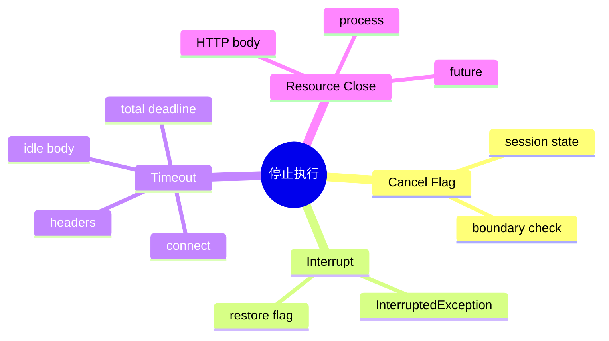

# 取消、超时、线程中断与 Watchdog

## 1. 核心概念

- 取消：请求任务停止的协作协议；
- 超时：基于时间触发取消/失败的策略；
- 中断：Java 线程的协作信号，不会安全强杀代码；
- Deadline：整个操作的绝对截止时间；
- Idle timeout：两次数据活动之间的最大间隔。



## 2. 取消传播原理与本质

任何取消只有到达“可观察边界”才生效。CPU 死循环不检查中断就不会停；阻塞 read 若底层不响应中断，需要 close 资源使其退出。因此完整取消要同时传播意图和释放资源。

## 3. 项目实现

SessionCancelManager 保存取消标记；Orchestrator 在 LLM、工具和轮次边界检查；BashProcessManager 管理进程。`IdleTimeoutInputStream` 用 daemon watchdog 每 500ms 检查最后读取时间，超时就 close 底层流，让阻塞 read 抛出异常。

Java HttpRequest timeout 主要约束请求/响应头阶段，不能完全覆盖响应头后 SSE body 静默，所以 idle watchdog 必要。

## 4. Demo：中断 + 资源关闭

```java
import java.io.*;
import java.net.*;

public class CancelDemo {
    public static void main(String[] args) throws Exception {
        var socket = new Socket();
        socket.connect(new InetSocketAddress("example.com", 80), 1000);
        Thread reader = Thread.startVirtualThread(() -> {
            try (socket; var in = socket.getInputStream()) {
                while (in.read() != -1) { /* read */ }
            } catch (IOException e) {
                System.out.println("read stopped: " + e);
            }
        });

        Thread.sleep(500);
        socket.close(); // 关闭资源，使阻塞 read 退出
        reader.join();
    }
}
```

## 5. 正确处理中断

```java
try {
    queue.take();
} catch (InterruptedException e) {
    Thread.currentThread().interrupt();
    return;
}
```

捕获 InterruptedException 会清除标志，若当前层不完全处理取消，应恢复标志传给上层。

## 6. 重试交互

用户主动取消不应重试；网络 idle timeout 可以按 RetryPolicy 重试；总 deadline 到期后即使单次重试策略允许，也不能再发请求。重试每次都要使用剩余时间，而不是重新获得完整 timeout。

## 7. 掌握检查

- [ ] 能区分 connect、request、idle 和 total timeout；
- [ ] 能解释中断为何不是强杀；
- [ ] 能说明 close 如何解除阻塞 read；
- [ ] 能设计取消不触发重试。

## 8. 结构化取消树

一个 chat request 派生 LLM 流、多个 Tool、Bash 进程、SubAgent。取消应从父 scope 向全部子任务传播，父任务只有在子任务终止/隔离后才结束。若只设置 session flag，正在阻塞的 HTTP read 和 Process.waitFor 不检查标志，仍会泄漏。

可以用 CancellationToken 注册回调：cancel 时原子切换状态并逐个 close/cancel。回调必须幂等、快速，异常逐个隔离。

## 9. Watchdog 竞态

watchdog 判断 idle 超时的同时，reader 可能刚收到数据。`lastReadTime` 访问需要可见性/同步；超时 close 与正常 close/EOF 会竞争，状态要原子化。若 close 导致 IOException，上层只有在 `timedOut=true` 时翻译成 Timeout，否则保留原始断开错误。

每个流一个平台 watchdog 线程会昂贵；项目使用 daemon thread，规模扩大后可用共享 ScheduledExecutor 检查 deadline heap，或底层客户端原生 read timeout。

## 10. Deadline 传播 Demo

```java
record Deadline(long atNanos) {
    static Deadline after(java.time.Duration d) {
        return new Deadline(System.nanoTime() + d.toNanos());
    }
    java.time.Duration remaining() {
        return java.time.Duration.ofNanos(Math.max(0, atNanos - System.nanoTime()));
    }
    void throwIfExpired() throws java.util.concurrent.TimeoutException {
        if (System.nanoTime() >= atNanos) throw new java.util.concurrent.TimeoutException();
    }
}
```

所有重试、排队和工具使用同一 Deadline，而不是各自重新计时。

## 11. Bash 取消

先请求正常终止，等待短 grace period，再 destroyForcibly；子进程可能继续存活，需要进程树处理。Windows/Unix 信号语义不同。取消后仍应收集有限 stdout/stderr并写失败 ToolResult，让会话协议闭合。

## 12. 实验

1. Fake SSE 发 header 后沉默，验证 idle timeout；
2. 超时边界同时发送数据，重复运行找竞态；
3. 用户 cancel 后确保 RetryPolicy 不重试；
4. 启动带子进程的脚本，验证整个进程树终止；
5. 检查中断捕获点是否恢复 flag。

## 13. 深层面试追问

**Future.cancel(true) 是否保证任务停止？** 只设置中断/取消状态，任务忽略中断或卡 native call仍运行。**为什么 watchdog close stream 而不只 interrupt reader？** 某些阻塞 I/O 对中断响应有限，资源关闭能使 read 失败。**timeout错误可否统一？** 需要保留 phase，connect timeout与stream idle的重试和诊断不同。

取消还涉及结果竞态：LLM完成与用户cancel同时发生。用原子状态决定谁先进入终态；若完成已持久化，晚到cancel返回 already completed；若cancel先赢，晚到chunk丢弃且不得执行Tool。

项目源码审查 `IdleTimeoutInputStream` 的 daemon watchdog是否在EOF/close结束、timedOut可见性、每流线程成本；检查 Bash取消失败是否生成失败ToolResult；检查 SubAgent timeout从提交还是执行开始计算。

## 项目源码精读

源码入口：[SessionCancelManager.java](../../../src/main/java/com/example/agent/web/session/SessionCancelManager.java)、[IdleTimeoutInputStream.java](../../../src/main/java/com/example/agent/llm/stream/IdleTimeoutInputStream.java)、[BashProcessManager.java](../../../src/main/java/com/example/agent/tools/BashProcessManager.java)。流读取看门狗的关键机制是主动关闭底层资源：

```java
if (idle > timeoutMs) {
    timedOut = true;
    try {
        in.close(); // 让阻塞中的 read() 退出
    } catch (IOException ignored) {
    }
    return;
}

private IOException translateIfTimedOut(IOException e) {
    if (timedOut) {
        return new SocketTimeoutException("流式响应读取空闲超时");
    }
    return e;
}
```

仅设置 `cancelled=true` 无法唤醒正在 native/socket read 的线程；关闭拥有的流才把取消转换成可观察异常。`volatile timedOut/closed/eof` 提供 watchdog 与 reader 间可见性，`lastReadTime` 在 monitor 内读写以保持一致。

> [!IMPORTANT]
> **疑难点：timeout、deadline、cancel 是三种语义。** idle timeout 判断连接是否静默；总 deadline 限制整个 run；用户 cancel 表达不再需要结果。它们最终都要传播到 Future、socket、Process 和 Tool 子任务，但错误码与是否重试不同。`SessionCancelManager.reset(sessionId)` 还存在旧 run callback 污染新 run 的可能，更强设计应使用 `runId/epoch` 而不是只按 sessionId 存 Boolean。

## 14. 源码级实现原理解读

Timeout 是调用方停止等待的时间政策；cancellation 是请求任务停止的信号；interrupt 是 Java 对阻塞线程的一种协作机制；关闭 Socket/Process 是解除具体阻塞的资源动作。它们不能混为一个 `future.get(3, SECONDS)`：get 超时并不会自动取消 future，更不会关闭底层 HTTP body 或子进程。

一个端到端 deadline 应在入口只计算一次绝对截止时间，每一层传递“剩余时间”。若 LLM 用 8 秒、Tool 又重新获得完整 10 秒，整体 SLA 会被层数倍增。内部应使用 `System.nanoTime()` 做持续时间计算；墙钟用于审计时间戳，不适合超时差值。

HippoBuddy 需要从 SSE 断开/abort 接口传播到 SessionCancelManager，再传播到 Orchestrator、LLM stream、BashProcessManager。只在 Loop 顶部轮询 cancelled，会让当前正在阻塞的 read/process 一直不退出；必须组合 interrupt、resource close 和子进程 destroy。

## 15. 可运行完整实现：共享 Deadline 与资源级取消

```java
import java.time.Duration;
import java.util.concurrent.*;
import java.util.concurrent.atomic.AtomicBoolean;

public class CancellationDemo {
    static final class Deadline {
        private final long end = System.nanoTime();
        private final long timeoutNanos;
        Deadline(Duration timeout) { timeoutNanos = timeout.toNanos(); }
        long remainingNanos() { return Math.max(0, timeoutNanos - (System.nanoTime() - end)); }
        void throwIfExpired() throws TimeoutException {
            if (remainingNanos() == 0) throw new TimeoutException("deadline exceeded");
        }
    }
    static final class Cancellation {
        private final AtomicBoolean cancelled = new AtomicBoolean();
        private volatile Thread owner;
        void attachCurrentThread() { owner = Thread.currentThread(); }
        void cancel() { cancelled.set(true); Thread t = owner; if (t != null) t.interrupt(); }
        void check() throws InterruptedException {
            if (cancelled.get() || Thread.currentThread().isInterrupted())
                throw new InterruptedException("cancelled");
        }
    }
    static String work(Deadline d, Cancellation c) throws Exception {
        c.attachCurrentThread();
        for (int i = 0; i < 100; i++) {
            c.check(); d.throwIfExpired();
            long wait = Math.min(TimeUnit.NANOSECONDS.toMillis(d.remainingNanos()), 50);
            Thread.sleep(Math.max(1, wait));
        }
        return "done";
    }
    public static void main(String[] args) throws Exception {
        Cancellation c = new Cancellation();
        try (ExecutorService e = Executors.newVirtualThreadPerTaskExecutor()) {
            Future<String> f = e.submit(() -> work(new Deadline(Duration.ofSeconds(5)), c));
            c.cancel();
            try { f.get(); } catch (ExecutionException expected) {
                if (!(expected.getCause() instanceof InterruptedException)) throw expected;
            }
        }
    }
}
```

捕获 `InterruptedException` 后若不能继续向上抛，必须 `Thread.currentThread().interrupt()` 恢复标志。对于不响应 interrupt 的 I/O，需要 cancellation callback 主动 close channel；对于 Bash，要先温和 destroy、等待 grace period，再 destroyForcibly，并处理整个进程树。

## 延伸学习：博客与电子书

- [Java `Future` API](https://docs.oracle.com/en/java/javase/21/docs/api/java.base/java/util/concurrent/Future.html)：重点理解 `cancel(true)` 只是尝试中断，并不保证任务已经停止。
- [Java Concurrency in Practice](https://jcip.net/)：重点读 Cancellation、Interruption、Shutdown 和处理不可中断阻塞。

## 思维导图节点学习博客

本专题思维导图中的 11 个末级知识点均已展开为独立博客：[进入节点博客目录](../mindmap-blogs/02-concurrency-network/07-cancellation-timeout-watchdog/README.md)。
