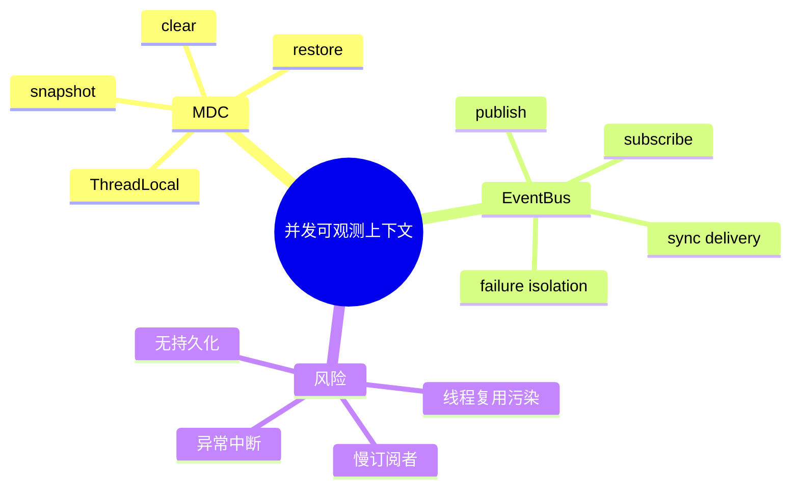

# MDC 上下文传播与 EventBus

## 1. 概念与本质：两个知识点的联系

MDC 解决“事件属于哪条业务链路”，EventBus 解决“事件发生后由谁响应”。一个负责关联上下文，一个负责解耦通知。



## 2. MDC 原理

SLF4J MDC 通常基于 ThreadLocal 保存键值。线程池任务换线程后不会自动携带；平台线程复用时旧值又可能残留。因此提交任务时 snapshot，执行开始 restore，finally clear。

项目的 `LoggingContext` 正是这样做，ConcurrentToolExecutor 在工具虚拟线程中恢复 session/tool 信息。

## 3. MDC Demo

```java
import org.slf4j.MDC;
import java.util.Map;
import java.util.concurrent.Executor;

static Runnable propagate(Runnable task) {
    Map<String, String> captured = MDC.getCopyOfContextMap();
    return () -> {
        if (captured != null) MDC.setContextMap(captured);
        try { task.run(); }
        finally { MDC.clear(); }
    };
}
```

本质上 security context、trace context、locale 也面临相同传播问题。

## 4. EventBus 原理与项目实现

EventBus 保存 event type → handlers。Publisher 不直接认识 Metrics/Logger；调用 publish 后同步遍历订阅者。项目用 ConcurrentHashMap + CopyOnWriteArrayList，适合“订阅少变、发布频繁”。

```java
import java.util.*;
import java.util.concurrent.*;
import java.util.function.Consumer;

final class MiniBus {
    private final Map<Class<?>, CopyOnWriteArrayList<Consumer<Object>>> handlers =
        new ConcurrentHashMap<>();

    <T> void on(Class<T> type, Consumer<T> handler) {
        handlers.computeIfAbsent(type, k -> new CopyOnWriteArrayList<>())
            .add(value -> handler.accept(type.cast(value)));
    }

    void publish(Object event) {
        for (var h : handlers.getOrDefault(event.getClass(), new CopyOnWriteArrayList<>()))
            h.accept(event);
    }
}
```

## 5. EventBus 边界

当前是同步、进程内、无持久化：慢 handler 会拖慢 publisher；异常隔离粒度应做到每个 handler；没有重试和跨进程语义。它不是 Kafka，也不应拿来隐藏核心调用顺序。

## 6. 面试题

**为何 CopyOnWriteArrayList 合适？** 订阅变更少、遍历多；读无需锁，但每次 add 都复制数组，不适合频繁注册。

**异步 EventBus 更好吗？** 不一定。异步会引入顺序、丢失、关闭、重试和上下文传播问题。关键业务流程应显式调用，非关键指标通知才适合事件解耦。

## 7. 掌握检查

- [ ] 能解释 MDC 在线程池中的污染；
- [ ] 能实现 snapshot/restore/clear；
- [ ] 能说明同步 EventBus 的语义；
- [ ] 能区分 EventBus 与消息队列。

## 8. MDC 的快照时机

上下文必须在“提交任务”时捕获，而不是在线程开始时捕获；开始时已经处于另一个线程，看不到提交者 ThreadLocal。捕获 Map 后应复制为不可变值，不能共享可变 Map。嵌套任务若添加 toolName，应保存旧上下文并在 finally 恢复，而不只是 clear，否则外层虚拟线程后续日志丢失 sessionId。

```java
Map<String,String> previous = MDC.getCopyOfContextMap();
try {
    MDC.put("tool", name);
    action.run();
} finally {
    MDC.clear();
    if (previous != null) MDC.setContextMap(previous);
}
```

## 9. EventBus 的一致性与递归

同步 handler 可以在 publish 中再次 publish，形成递归事件风暴。需要限制深度、明确允许的事件方向，或把派生事件排入队列。订阅者列表 CopyOnWrite 保证遍历快照，但 unsubscribe/clear 与发布的语义要测试。

关键业务不能只依赖“可能失败但被吞掉”的 EventBus。例如 Transcript 持久化不应作为 MessageEvent 的非可靠订阅者；Metrics 可以，因为丢一个指标不破坏业务状态。

## 10. 异步事件的语义成本

一旦异步，必须选择执行器、队列上限、顺序、重试、关闭 drain 和 MDC 传播。按 session 分区的单消费者能保序；全局池不保证同 session 事件顺序。若需要跨进程/持久化，就应使用消息队列或直接从 JSONL 事件构建投影。

## 11. 事件 Schema

Event 应 immutable，带 occurredAt、sessionId、eventId 和必要字段，不要直接暴露可变 Conversation。Metrics subscriber 只依赖公共字段；新增字段向后兼容。事件名表达已发生事实，如 ToolExecuted，而不是含糊命令 DoTool。

## 12. 实验

1. 在线程池不传播 MDC，观察 session 字段丢失；
2. 故意不 clear，观察下一任务串号；
3. 让第一个 EventBus handler 抛异常，确认后续是否执行；
4. 构造递归 publish 并增加深度保护；
5. 将 metrics 异步化，设置有界队列并测试关闭。

## 13. 深层追问与设计取舍

**ScopedValue 能替代 MDC 吗？** ScopedValue适合结构化、不可变上下文传播，但日志框架仍读取MDC，需要桥接；它比可变ThreadLocal更安全，具体取决于Java版本/preview策略。**InheritableThreadLocal够吗？** 只在创建子线程时复制，线程池复用和后续修改语义不可靠。

**EventBus为何用 CopyOnWrite？** publish频繁、subscribe少；若每session动态订阅会复制成本/泄漏，应改 immutable registry或其他结构。**handler异常应怎样？** 每个handler独立catch，关键handler失败由业务显式处理，EventBus只承载非关键通知。

源码实验给两个handler：第一个抛异常、第二个计数，验证当前 `publish` 的整体 try/catch是否导致第二个不执行；这会形成一个具体改进点，而不是泛泛说“事件总线解耦”。

## 项目源码精读

源码入口：[LoggingContext.java](../../../src/main/java/com/example/agent/core/logging/LoggingContext.java)、[ThreadPools.java](../../../src/main/java/com/example/agent/core/concurrency/ThreadPools.java)、[EventBus.java](../../../src/main/java/com/example/agent/core/event/EventBus.java)。异步任务提交前捕获 MDC，执行时恢复并最终清理：

```java
public static Runnable wrapWithMdc(Runnable runnable) {
    Map<String, String> snapshot = LoggingContext.snapshot();
    return () -> {
        LoggingContext.restore(snapshot);
        try {
            runnable.run();
        } finally {
            MDC.clear();
        }
    };
}
```

MDC 本质是线程上下文，不会自动跟随任务从请求线程迁移到 worker；snapshot/restore 把隐式线程状态变成显式任务上下文。`EventBus` 用 `ConcurrentHashMap + CopyOnWriteArrayList` 保存订阅者，publish 同步调用 handler，因此发布者承担 handler 延迟。

> [!IMPORTANT]
> **疑难点：当前 EventBus 的 try/catch 包住整个遍历。** 第一个 handler 抛异常后，后续 handler 不会执行；这与“观察者彼此隔离”的常见期待不同。若事件只用于非关键指标，应逐 handler catch；若用于关键持久化，就不应依赖 best-effort EventBus。MDC 另一个陷阱是 `restore(empty)` 当前什么也不做，若复用平台线程且调用前有旧 MDC，可能残留；恢复前应 clear 或完整 set 空上下文。

## 14. 源码级实现原理解读

MDC 通常基于 ThreadLocal Map。提交异步任务时真正需要传播的是“提交瞬间的不可变副本”，不是把父线程 Map 引用共享出去。任务运行前保存 worker 原上下文、安装父快照，finally 恢复/清空；否则线程池复用会把 session A 的 traceId 泄漏到 session B。虚拟线程仍有独立 ThreadLocal 语义，但海量任务携带大 Map 会增加内存。

EventBus 则处理对象之间的通知。同步 bus 中 publisher 的调用栈直接执行 listener，因此 listener 延迟、异常和递归发布都会反向影响业务线程；异步 bus 解耦延迟，却引入排队、丢失、重排和 shutdown drain。项目若用 `CopyOnWriteArrayList` 保存 listener，读多写少场景遍历稳定，但注册/注销会复制数组。

事件是“已经发生的事实”，命令是“希望发生的动作”。`ToolExecutedEvent` 可以被多个指标/日志订阅者观察；要求某个 listener 必须成功才能允许 Tool 执行，则它不应只是 best-effort event listener，而应进入同步主链或事务 outbox。

## 15. 可运行完整实现：上下文快照与隔离监听器

```java
import java.util.*;
import java.util.concurrent.*;
import java.util.concurrent.CopyOnWriteArrayList;
import java.util.function.Consumer;

public class ContextEventBusDemo implements AutoCloseable {
    static final ThreadLocal<Map<String,String>> CTX = ThreadLocal.withInitial(Map::of);
    private final ExecutorService executor = Executors.newFixedThreadPool(2);
    private final CopyOnWriteArrayList<Consumer<String>> listeners = new CopyOnWriteArrayList<>();

    void subscribe(Consumer<String> listener) { listeners.add(listener); }
    CompletableFuture<Void> publish(String event) {
        Map<String,String> captured = Map.copyOf(CTX.get());
        return CompletableFuture.runAsync(() -> {
            Map<String,String> previous = CTX.get();
            CTX.set(captured);
            try {
                for (Consumer<String> listener : listeners) {
                    try { listener.accept(event); }
                    catch (RuntimeException ex) { System.err.println("listener failed: " + ex); }
                }
            } finally { CTX.set(previous); }
        }, executor);
    }
    public void close() { executor.shutdownNow(); }

    public static void main(String[] args) {
        try (var bus = new ContextEventBusDemo()) {
            bus.subscribe(e -> System.out.println(CTX.get().get("session") + ":" + e));
            CTX.set(Map.of("session", "s1"));
            bus.publish("tool-completed").join();
            CTX.remove();
        }
    }
}
```

本例选择“一个 listener 失败不阻止其他 listener”，适合指标/日志；关键业务通知可能需要 fail-fast 或聚合异常。异步发布的 future 让调用方可以选择等待，但这仍不是 durable delivery：进程崩溃时队列事件会丢，需要 outbox/持久 broker 才能跨崩溃恢复。

## 延伸学习：博客与电子书

- [SLF4J Manual](https://www.slf4j.org/manual.html)：重点理解 MDC 与日志门面的职责边界。
- [OpenTelemetry Context and Traces](https://opentelemetry.io/docs/concepts/signals/traces/)：学习跨线程/跨进程 context propagation，以及 MDC 与 trace context 的区别。

## 思维导图节点学习博客

本专题思维导图中的 12 个末级知识点均已展开为独立博客：[进入节点博客目录](../mindmap-blogs/02-concurrency-network/08-mdc-eventbus/README.md)。
