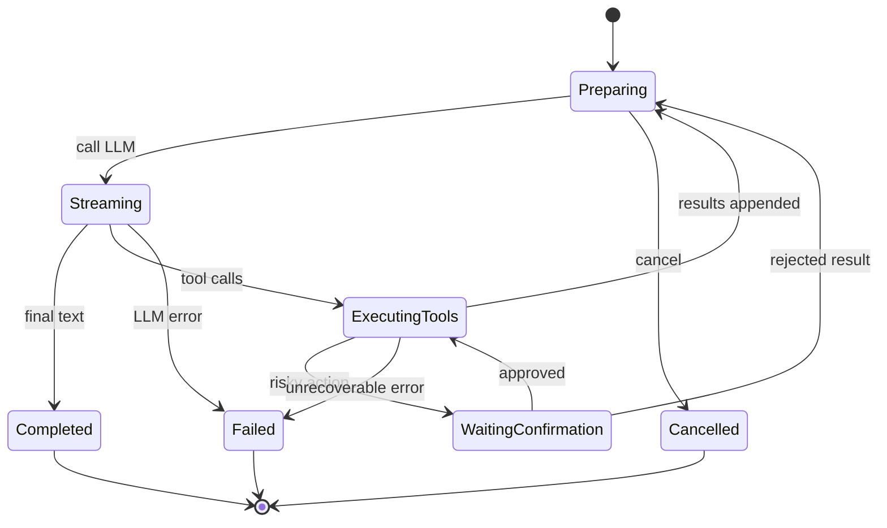
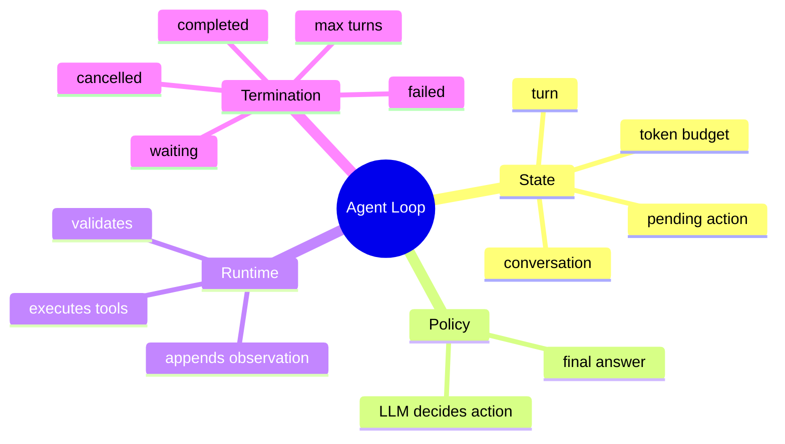

# Agent Loop 与状态机

## 1. 概念

普通聊天是 request → response；Agent 将模型输出解释为动作，执行动作并把 observation 反馈给模型，形成闭环。





## 2. 本质

Agent 是“策略与环境”的分离：LLM 是不可靠的策略函数，Runtime 是可信执行环境。模型只提出 `Action`，Runtime 掌握权限、校验、状态和终止权。

形式化表示：`(state, goal) → policy → action → environment → observation → new state`。Conversation 是状态日志，ToolCall 是 action，ToolResult 是 observation。

## 3. 项目实现

`WebAgentOrchestrator.execute()` 最多 50 轮：准备消息和工具 → `chatStream` → 合并响应 →持久化 assistant → 无工具则完成 → 有工具则逐个执行并写 result → 下一轮。取消、pending ask_user、Bash/Delete confirmation 和 StopHook 都是终止/暂停条件。

## 4. 关键不变量

- 每轮使用一致的 session/mode/tool snapshot；
- assistant tool_call 后必须有对应 tool result；
- 等待确认时不能偷偷开始下一轮；
- 失败工具也要形成 observation；
- 终态不能再次迁移；
- MAX_TURNS 是硬安全阀，不是正常完成机制。

## 5. Demo：显式状态机

```java
sealed interface State permits Ready, WaitingTool, Done, Failed {}
record Ready(int turn) implements State {}
record WaitingTool(int turn, String tool) implements State {}
record Done(String answer) implements State {}
record Failed(String reason) implements State {}

sealed interface ModelOutput permits Text, ToolAction {}
record Text(String value) implements ModelOutput {}
record ToolAction(String name) implements ModelOutput {}

static State transition(State state, ModelOutput output) {
    if (!(state instanceof Ready ready))
        throw new IllegalStateException("illegal transition from " + state);
    if (ready.turn() >= 50) return new Failed("max turns");
    return switch (output) {
        case Text text -> new Done(text.value());
        case ToolAction action -> new WaitingTool(ready.turn(), action.name());
    };
}
```

Java 21 sealed interface + pattern switch 能让非法状态更显式。真实系统还需要把 WaitingConfirmation/PendingUserInput 持久化。

## 6. 为什么当前大 Orchestrator 难维护

状态散落在循环变量、多个 session Map、return 值和 pending object 中。重构时可引入 `AgentRunState`、`AgentStepResult` 和纯 transition，I/O 由 effect handler 执行。这样能用表驱动测试覆盖每个合法/非法迁移。

## 7. 面试题

**ReAct 是什么？** 模型交替进行 reasoning/action/observation 的 Agent 范式。工程实现重点不是展示思考文本，而是可靠保存 action/observation 并控制副作用。

**如何防无限循环？** 语义 StopHook、重复动作检测、连续失败上限、Token/费用预算、deadline 和最大轮数多层兜底。

## 8. 掌握检查

- [ ] 能画出完整 Agent 状态机；
- [ ] 能列出全部终止/暂停条件；
- [ ] 能解释模型不是执行器；
- [ ] 能为非法状态迁移写测试。

## 9. Agent State 的完整拆分

状态不只是 messages。至少包括：runId/sessionId、当前 turn、mode/tool snapshot、context version、LLM request id、流式累积器、pending action、remaining calls、cancel/deadline、Token/费用和最后进展指纹。把这些散落在多个 Map 中会产生无法原子恢复的组合状态。

可以把持久状态与瞬时状态分开：Conversation/confirmation 可恢复；HTTP OutputStream/正在连接的 socket 不可恢复。进程重启后应把 RUNNING 转为 INTERRUPTED，补齐 tool failure，等待新请求继续，而不是假装恢复旧 TCP 流。

## 10. Step Function

理想 Loop 可拆为纯 `decide(state,event) → transition + effects`。State transition 先验证，Effect 执行 LLM/Tool，结果作为新 event 回到状态机。这样 I/O 失败不会让状态“改了一半”。

```java
record Transition(State next, java.util.List<Effect> effects) {}
sealed interface Effect permits CallLlm, RunTool, Persist, EmitSse {}
```

实际系统未必完全函数式，但这个模型能帮助识别持久化点和恢复边界。

## 11. 进展与停滞检测

MAX_TURNS 只防无界，不识别浪费。StopHook 可对最近 N 轮的 `(toolName, normalizedArgs, resultHash)` 建指纹：连续重复且状态未改变，说明停滞。不能仅因同工具重复就停止，例如分页 grep 的参数不同、编译修复需要多次 test。

进展信号包括：文件 diff、Todo 状态变化、新错误减少、新信息读取。检测器应返回 warning/stop reason 并写入 observation，让模型有一次自我修正机会。

## 12. 确认后的恢复一致性

等待确认时必须冻结原 ToolCall 和剩余列表。用户批准后先提交被批准调用，再按原序执行剩余；若期间 mode/config/workspace 变化，应重新授权。确认请求重复到达只能有一个成功，其他返回 already consumed。

## 13. 深度实验

1. 对每个 State 列出允许 Event，生成 transition table；
2. 随机事件序列做 property test，证明终态不再迁移；
3. 在 assistant persist 后、tool execute 前模拟崩溃并恢复；
4. 构造重复无效 grep 触发 StopHook；
5. 统计任务 turn 分布，判断 50 是否合理，而非凭感觉。

## 项目源码精读

源码入口：[WebAgentOrchestrator.java](../../../src/main/java/com/example/agent/web/orchestrator/WebAgentOrchestrator.java)、[AgentTurnResult.java](../../../src/main/java/com/example/agent/execute/AgentTurnResult.java)、[MessageSanitizer.java](../../../src/main/java/com/example/agent/web/util/MessageSanitizer.java)。主循环的骨架是：

```java
private static final int MAX_TURNS = 50;

for (int turn = 0; turn < MAX_TURNS; turn++) {
    if (cancelManager.isCancelled(sessionId)) return;
    if (sessionManager.hasPendingBashConfirmation(sessionId)
            || sessionManager.hasPendingDeleteConfirmation(sessionId)) return;

    List<Message> messages = new ArrayList<>(
        getConversationService().getContextForInference(conversation));
    messages = ensureSystemMessageFirst(messages);
    MessageSanitizer.removeOrphanToolCalls(messages);

    ChatResponse response = llmClient.chatStream(messages, tools, onChunk);
    getConversationService().addAssistantMessage(
        conversation, response.getFirstMessage(), response.getUsage());
    if (response.getFirstMessage().getToolCalls().isEmpty()) return;
    executeToolCalls(response.getFirstMessage().getToolCalls(),
        conversation, sseWriter, sessionId, mode);
}
```

状态演进不是单纯 while：`READY→CALLING_LLM→ASSEMBLING→PERSISTING_ASSISTANT→EXECUTING_TOOL→READY`，确认工具会进入 `WAITING_CONFIRMATION`，最终回答进入 `COMPLETED`。Assistant tool call 必须先持久化，再执行副作用并追加 ToolResult，才能在崩溃恢复时知道“意图已产生、结果是否缺失”。

> [!IMPORTANT]
> **疑难点：方法 `return` 同时代表多种终态。** 正常完成、用户取消、等待确认、空响应和错误目前主要靠分支/SSE 区分，类型系统没有强制合法迁移。更深实现应让 `AgentRunState + runId + turn` 成为显式状态机，并把每次迁移写事件。`MessageSanitizer.removeOrphanToolCalls` 是恢复兜底，不应掩盖持久化协议持续制造孤儿消息。

## 14. 源码级实现原理解读

`WebAgentOrchestrator.execute()` 本质上实现的是一个解释器：Conversation 与 pending confirmation 构成状态，LLM 输出构成不可信指令，ToolRegistry 是受控环境，ToolResult 是 observation。一次循环至少要维护 `stepNo、pendingToolCalls、assistantText、usage、cancelled、terminalReason`，不能只用一个 while(true) 表达全部语义。

正确的一步转移顺序是：冻结本步输入快照 → 调 LLM → 完整组装 assistant/tool call → 先把 assistant 决策写入历史 → 校验并执行工具 → 把每个 tool result 用原 callId 闭合 → 再进入下一步。若先执行副作用、后记录 assistant tool call，崩溃恢复时就无法解释副作用从何而来。

终止条件不只“没有 tool call”：还包括 maxSteps、用户取消、上下文预算阻断、等待人工确认、LLM 不可重试失败、无进展检测。等待确认不是普通 return；必须持久化 continuation 所需的 callId、工具名、规范化参数、会话版本和过期时间，批准后才能从确定状态继续。

## 15. 可运行完整实现：显式 Step Function

```java
import java.util.*;

public class AgentLoopDemo {
    sealed interface Decision permits FinalText, Calls {}
    record FinalText(String text) implements Decision {}
    record ToolCall(String id, String name, Map<String,String> args) {}
    record Calls(List<ToolCall> calls) implements Decision {}
    record Observation(String callId, String result) {}
    record State(List<Object> history, int step, boolean cancelled) {}
    interface Policy { Decision decide(List<Object> immutableHistory); }
    interface Environment { Observation execute(ToolCall call); }

    static String run(State initial, Policy policy, Environment env, int maxSteps) {
        List<Object> history = new ArrayList<>(initial.history());
        for (int step = initial.step(); step < maxSteps; step++) {
            if (initial.cancelled()) throw new IllegalStateException("cancelled");
            Decision decision = policy.decide(List.copyOf(history));
            history.add(decision);                      // 先记录决策，再产生副作用
            if (decision instanceof FinalText answer) return answer.text();
            Calls calls = (Calls) decision;
            if (calls.calls().isEmpty()) throw new IllegalStateException("no progress");
            Set<String> ids = new HashSet<>();
            for (ToolCall call : calls.calls()) {
                if (!ids.add(call.id())) throw new IllegalStateException("duplicate call id");
                Observation observation = env.execute(call);
                if (!observation.callId().equals(call.id())) throw new IllegalStateException("unclosed call");
                history.add(observation);
            }
        }
        throw new IllegalStateException("max steps exceeded");
    }

    public static void main(String[] args) {
        Policy p = h -> h.stream().anyMatch(Observation.class::isInstance)
                ? new FinalText("done")
                : new Calls(List.of(new ToolCall("c1", "read", Map.of("path", "README.md"))));
        Environment e = c -> new Observation(c.id(), "content");
        if (!run(new State(List.of("user: inspect"), 0, false), p, e, 4).equals("done"))
            throw new AssertionError();
    }
}
```

这个 Demo 刻意把“决策”和“执行”分开，从而可测试每个状态转移。生产版还应给 ToolCall 增加幂等键，对不可逆动作采用确认/日志先行，并把 State 持久化。测试必须覆盖重复 callId、工具部分成功、最后一步仍请求工具、取消与完成同时发生、确认后参数被篡改。

## 延伸学习：博客与电子书

- [OpenAI Agents Guide](https://platform.openai.com/docs/guides/agents)：重点学习 Agent loop、tools、handoff、guardrails 与 tracing 的协作关系。
- [ReAct: Synergizing Reasoning and Acting](https://arxiv.org/abs/2210.03629)：理解“推理—动作—观察”循环的研究基础，并与项目的显式 ToolResult 状态对照。

## 思维导图节点学习博客

本专题思维导图中的 14 个末级知识点均已展开为独立博客：[进入节点博客目录](../mindmap-blogs/03-agent-llm/01-agent-loop-state-machine/README.md)。
