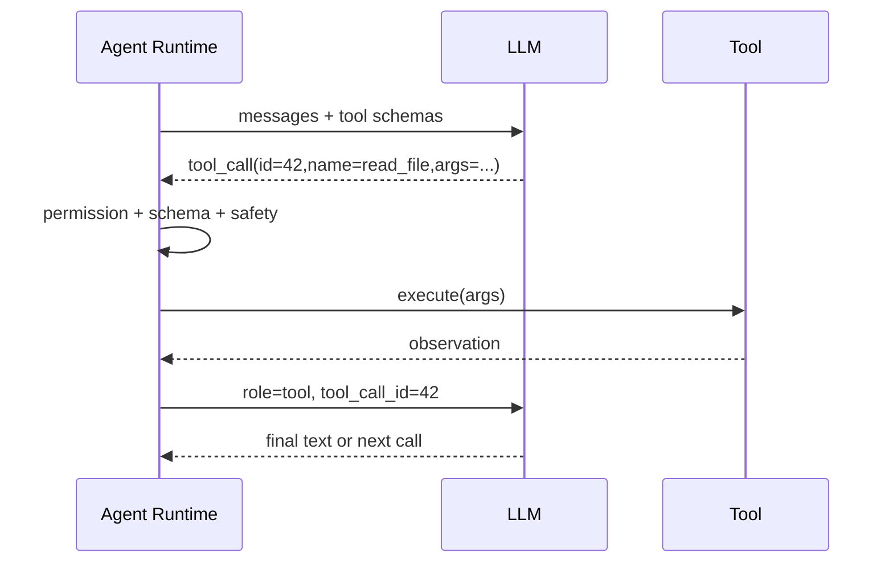
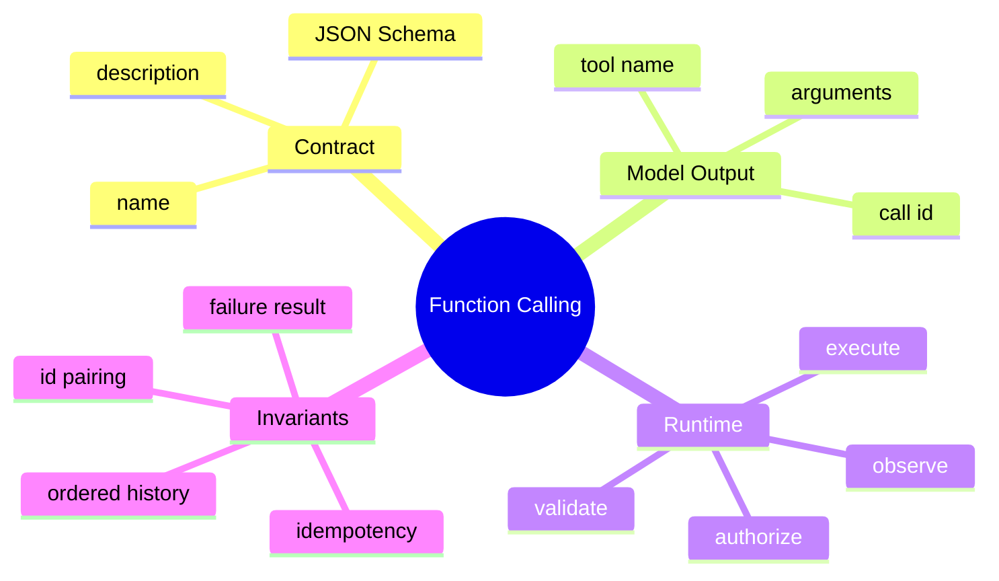

# Function Calling 与工具协议

## 1. 概念

Function Calling 让模型不直接输出“请读取 a.java”，而是输出结构化动作：工具名、调用 id 和 JSON arguments。后端执行后用相同 id 返回 ToolResult。





## 2. 本质

它把自然语言意图与真实副作用分离。JSON Schema 只提高结构可靠性，Runtime 仍必须授权和校验。LLM 的输出永远是不可信输入。

## 3. 项目实现

`ToolExecutor` 描述名称、说明、参数 Schema 和 execute；`ToolRegistry.toTools()` 生成模型协议；`SseParser`/Client 合并 ToolCall；Orchestrator 根据 AgentMode/Blocker 执行，并通过 ConversationService 追加 tool result。

## 4. 协议不变量

1. Tool name 当前可见且唯一；
2. arguments 完整、符合 Schema 和业务约束；
3. tool_call_id 唯一并精确关联结果；
4. 每个调用都有结果，包括拒绝、失败、取消；
5. 历史压缩不能拆开调用/结果；
6. 重放同一调用必须考虑幂等。

## 5. Demo

```java
import java.util.Map;

record ToolCall(String id, String name, Map<String, Object> arguments) {}
record ToolResult(String callId, boolean success, String content) {}

interface Tool {
    String name();
    ToolResult execute(ToolCall call);
}

final class ToolRuntime {
    private final Map<String, Tool> tools;
    ToolRuntime(Map<String, Tool> tools) { this.tools = Map.copyOf(tools); }

    ToolResult dispatch(ToolCall call) {
        Tool tool = tools.get(call.name());
        if (tool == null) return new ToolResult(call.id(), false, "unknown tool");
        try { return tool.execute(call); }
        catch (Exception e) { return new ToolResult(call.id(), false, e.getMessage()); }
    }
}
```

注意异常也被转换成 ToolResult，而不是让历史留下悬空调用。

## 6. 描述和 Schema 的工程影响

工具描述是模型选择工具的“接口文档”。名称相近、说明含糊、参数可选过多会增加误调用。Schema 应尽量窄：enum、min/max、required、additionalProperties=false；但安全路径和命令风险仍必须在执行期检查。

## 7. 面试题

**为什么不让模型输出 shell 文本直接执行？** 自由文本难可靠解析、无法统一权限和审计。结构化 ToolCall 建立可验证边界，真正执行仍由 Runtime 控制。

**工具失败后应否终止 Agent？** 通常把失败作为 observation，让模型修正；连续相同失败、不可恢复安全错误或预算耗尽时才停止。

## 8. 掌握检查

- [ ] 能写出调用/结果配对规则；
- [ ] 能解释 Schema 不等于安全；
- [ ] 能设计失败结果结构；
- [ ] 能指出工具描述如何影响模型行为。

## 9. Tool Schema 如何影响采样

模型看到的工具名称、描述和字段都是 Prompt token。description 不仅是文档，也是选择工具的判别特征。两个工具语义重叠会让概率分散；参数过度嵌套增加生成无效 JSON 的概率。工程上应测试 tool selection accuracy，而不是只验证 Schema 能解析。

枚举应列出闭集；数值有上下限；路径说明相对 workspace；mutually exclusive 参数 JSON Schema 可用 oneOf，但供应商支持度不同，必要时在业务校验中补充。

## 10. 多 ToolCall 的协议序列

一次 assistant 可返回多个 call。下一条消息序列需为每个 id 提供 ToolResult；不同供应商对顺序要求可能不同，内部统一按 call index 输出最安全。若第二个工具需要第一个结果，模型不应同一批并行提出，Runtime 也可默认串行。

失败结果建议包含稳定 code、用户可读 summary、有限 detail 和 retryable，而不是把 Java stack trace塞进上下文。结果过长需截断，但不能截掉错误 code/关键路径。

## 11. 幂等与审计

执行前在 session log 记录 CALL_PROPOSED/APPROVED，执行后记录 TOOL_COMPLETED。以 `(sessionId, toolCallId)` 做幂等 key：若已有完成结果，返回旧 observation，不再次执行。对于 Bash 等无法确认结果的崩溃窗口，应标记 UNKNOWN，不自动重放。

## 12. Tool 注入攻击

ToolResult/网页可能包含“调用 delete_file”。这些是 observation data，不拥有改变 system policy 的权限。Prompt 应明确数据边界，但最终仍依赖 AgentMode/Blocker。工具描述本身来自 MCP 时也不可信，远端 server 可能写诱导文本；需限制、标注来源并套本地策略。

## 13. 进阶 Demo：结果闭合

```java
ToolResult safeExecute(ToolCall call) {
    try {
        authorize(call);
        validate(call);
        return dedupe.getOrCompute(call.id(), () -> execute(call));
    } catch (SecurityException e) {
        return new ToolResult(call.id(), false, "DENIED: " + e.getMessage());
    } catch (Exception e) {
        return new ToolResult(call.id(), false, "TOOL_FAILED");
    }
}
```

## 14. 实验

设计 20 个自然语言任务，记录模型选错工具/字段的比例；逐步修改 name/description/Schema。再构造执行成功但响应丢失，验证同 callId 不重复写文件。

## 项目源码精读

源码入口：[ToolRegistry.java](../../../src/main/java/com/example/agent/tools/ToolRegistry.java)、[ToolExecutor.java](../../../src/main/java/com/example/agent/tools/ToolExecutor.java)、[ToolCall.java](../../../src/main/java/com/example/agent/llm/model/ToolCall.java)。统一执行入口先解析、授权，再调用执行器：

```java
public String execute(String toolName, String argumentsJson)
        throws ToolExecutionException {
    ToolExecutor executor = executors.get(toolName);
    if (executor == null) {
        throw new ToolExecutionException("未找到工具: " + toolName);
    }

    JsonNode arguments = ToolArgumentParser.parse(argumentsJson, toolName);
    HookResult hookResult = blockerChain.check(toolName, arguments);
    if (!hookResult.isAllowed()) {
        throw new ToolExecutionException(hookResult.formatErrorMessage());
    }
    return executeWithFileLock(executor, arguments);
}
```

LLM 输出的 `name/arguments` 只是“不可信执行计划”。Registry 才是 capability namespace；JSON Schema 约束语法形状；Blocker/AgentMode 校验当前授权；FileLock 保护资源冲突；ToolResult 把观察返回下一轮。五层缺一不可，Schema 合法绝不等于业务安全。

> [!IMPORTANT]
> **疑难点：Function Calling 不是 RPC 已执行。** 模型只生成调用建议，应用可能拒绝、确认、超时或执行失败。每个 `tool_call_id` 必须和恰好一个结果配对；有副作用工具还需 idempotency key/operation journal，防止“执行成功但响应丢失”后的重试重复写。工具描述也是 Prompt 的一部分，动态变化会同时影响选工具行为和前缀缓存。

## 15. 源码级实现原理解读

Function Calling 是一个跨轮协议，不是 Java 反射调用。模型产生 `tool_call{id,name,arguments}`；Runtime 以 name 找工具、以 Schema 验证 arguments、以 callId 建立关联；执行完成后追加 `role=tool, tool_call_id=原id`。下一轮模型依赖这个关联理解每个 observation 属于哪个动作。

Schema 只描述结构，不能表达所有权限。例如 `path: string` 能校验类型，却不能证明路径位于 workspace；`command: string` 更不能证明命令安全。执行链必须分为 JSON 语法 → Schema → 业务不变量 → capability/policy → 锁/版本 → 副作用。任何来自历史 transcript、MCP 或客户端的 ToolCall 都要走相同入口。

项目的 `ToolRegistry.toTools(mode)` 是模型可见能力投影，而 `execute(name,args)` 是真正的 enforcement point。两者若使用不同快照会出现模型按旧 Schema 生成参数、运行时按新 Schema 拒绝的问题，所以 session 需要冻结 toolset version，或为历史 call 做显式迁移。

## 16. 可运行完整实现：调用闭合、重复检测和执行校验

```java
import java.util.*;
import java.util.concurrent.ConcurrentHashMap;
import java.util.function.Function;

public class FunctionCallingDemo {
    record Call(String id, String name, Map<String,Object> arguments) {}
    record ToolMessage(String callId, String name, String content, boolean error) {}
    interface Validator { void validate(Map<String,Object> args); }
    record Tool(Validator validator, Function<Map<String,Object>,String> action) {}

    static final class Runtime {
        private final Map<String,Tool> tools;
        private final Set<String> completed = ConcurrentHashMap.newKeySet();
        Runtime(Map<String,Tool> tools) { this.tools = Map.copyOf(tools); }
        ToolMessage invoke(Call call) {
            if (call.id() == null || call.id().isBlank()) throw new IllegalArgumentException("missing id");
            if (!completed.add(call.id())) throw new IllegalStateException("duplicate call: " + call.id());
            Tool tool = tools.get(call.name());
            if (tool == null) return new ToolMessage(call.id(), call.name(), "unknown tool", true);
            try {
                Map<String,Object> frozen = Map.copyOf(call.arguments());
                tool.validator().validate(frozen);
                return new ToolMessage(call.id(), call.name(), tool.action().apply(frozen), false);
            } catch (RuntimeException e) {
                return new ToolMessage(call.id(), call.name(), e.getMessage(), true);
            }
        }
    }
    public static void main(String[] args) {
        Validator readSchema = a -> {
            Object path = a.get("path");
            if (!(path instanceof String s) || s.isBlank()) throw new IllegalArgumentException("path required");
            if (s.contains("..")) throw new SecurityException("outside workspace");
        };
        Runtime rt = new Runtime(Map.of("read", new Tool(readSchema, a -> "data:" + a.get("path"))));
        ToolMessage m = rt.invoke(new Call("call-1", "read", Map.of("path", "README.md")));
        if (!m.callId().equals("call-1") || m.error()) throw new AssertionError(m);
    }
}
```

这里 `completed.add` 只能防同进程重复，不能提供 durable idempotency；进程崩溃后仍会忘记。对于写文件、支付等副作用，需要把 callId 与执行结果原子落库，并区分 `STARTED/COMPLETED/UNKNOWN`，否则超时后的重试可能重复执行。

## 延伸学习：博客与电子书

- [OpenAI Function Calling Guide](https://platform.openai.com/docs/guides/function-calling)：重点读 tool schema、strict mode、并行调用和调用结果回传。
- [JSON Schema Learn](https://json-schema.org/learn/getting-started-step-by-step)：掌握 required、additionalProperties、组合约束与 Schema 验证边界。

## 思维导图节点学习博客

本专题思维导图中的 14 个末级知识点均已展开为独立博客：[进入节点博客目录](../mindmap-blogs/03-agent-llm/02-function-calling/README.md)。
