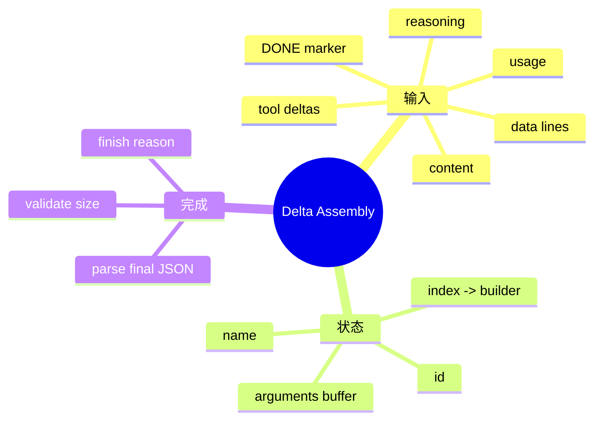

# SSE Delta 解析与增量合并

## 1. 概念、原理与本质

Delta 是逻辑消息的一次增量更新。网络返回的是任意切分的增量片段；其本质是把传输层的片段序列，通过有状态归并还原成应用层完整对象。一次 ToolCall 的 name、id、arguments 可能跨多帧，帧边界不等于 JSON token 或字符语义边界。



## 2. 项目实现

`SseParser` 负责单帧 JSON → StreamChunk；`AbstractLlmClient` 跨帧累积。ToolCallDelta 使用 index 定位逻辑调用，字符串字段追加，结束后构造完整 ToolCall。Parser 限制最大 index=1000、arguments 长度=100000，避免异常流耗尽内存。

## 3. 为什么不能逐帧解析 arguments

```text
frame 1: {"index":0,"arguments":"{\"pa"}
frame 2: {"index":0,"arguments":"th\":\"a"}
frame 3: {"index":0,"arguments":".java\"}"}
```

逻辑 arguments 是 `{"path":"a.java"}`，前两段都不是合法 JSON。Parser 只负责取出字符串片段，Assembler 完成后再 parse。

## 4. Demo

```java
import java.util.*;

record Delta(int index, String id, String name, String arguments) {}
record Call(String id, String name, String arguments) {}

final class Assembler {
    private static final class Mutable {
        String id, name;
        final StringBuilder args = new StringBuilder();
    }
    private final Map<Integer, Mutable> calls = new HashMap<>();

    void accept(Delta d) {
        if (d.index() < 0 || d.index() > 1000) throw new IllegalArgumentException();
        Mutable m = calls.computeIfAbsent(d.index(), i -> new Mutable());
        if (d.id() != null) m.id = d.id();
        if (d.name() != null) m.name = d.name();
        if (d.arguments() != null) m.args.append(d.arguments());
        if (m.args.length() > 100_000) throw new IllegalStateException("too large");
    }

    List<Call> finish() {
        return calls.entrySet().stream().sorted(Map.Entry.comparingByKey())
            .map(e -> new Call(e.getValue().id, e.getValue().name,
                              e.getValue().args.toString())).toList();
    }
}
```

## 5. 错误处理

- 忽略空白/心跳行；
- `[DONE]` 结束，不当 JSON 解析；
- 单帧 JSON 损坏要记录受限原文；
- 流中断时不执行不完整 ToolCall；
- 重复 delta 是否追加取决于协议，通常没有 sequence，重连不能盲拼；
- UTF-8 解码应在 Reader 层完成，避免按 byte 错切多字节字符。

## 6. 测试设计

用同一个逻辑响应生成所有可能拆分：逐字符、随机 chunk、多工具交错、空 arguments、reasoning 与 content 交错、usage 只在尾帧。属性测试可以验证任意拆分后结果等于完整输入。

## 7. 掌握检查

- [ ] 能解释传输帧与逻辑消息的区别；
- [ ] 能写 index-based assembler；
- [ ] 能设计长度和下标防御；
- [ ] 能列出五种拆帧测试。

## 8. 三层边界

网络 byte → UTF-8 char → SSE event → provider JSON delta →内部 logical chunk。每层都可能跨边界：多字节字符跨 byte read、SSE data 跨多行、JSON arguments 跨多个 event。正确设计为每层只处理自己的 framing，不把 byte buffer 直接当完整 JSON。

BufferedReader.readLine 会去掉换行；SSE 多行 data 需要按规范重新用 `\n` 拼接。`data:` 后可有一个可选空格，不能只匹配固定 `"data: "` 而拒绝 `data:{}`，需要结合供应商实际兼容要求。

## 9. 增量状态机

Assembler 对每个 tool index 的状态可以是 EMPTY→SEEN_ID/NAME→ACCUMULATING→COMPLETE/INVALID。若同一 index 后续出现不同 id/name，应拒绝或记录协议异常，不能静默覆盖。index 稀疏时用 Map 比扩容 List 安全。

content/reasoning 也要区分 null 与空字符串；finish reason 可能在无 delta 的尾帧出现；usage 可能只在最后出现。最终 response 应由多个累积器共同完成。

## 10. 内存与 Unicode

StringBuilder 长度按 UTF-16 code unit，不等于 UTF-8 bytes/Token。参数限制最好同时设字符和最终 JSON 深度/节点数。攻击者可发送深层嵌套 JSON造成 parser stack/CPU 问题，Jackson 需设置 StreamReadConstraints。

## 11. 重连语义

上游 LLM SSE 通常没有可重放 event id。连接断开后无法确认最后 delta 是否完整，不能把新重试流拼到旧 Builder；应丢弃当前未完成 response，按 RetryPolicy 发一个全新请求。若上一请求可能已计费，要记录 attempt。

## 12. 属性测试思路

给定完整逻辑响应，随机在每个字符边界切分，保持 event JSON 合法，再断言 assemble 等于原始。进一步生成两个 tool call 交错 delta、重复空帧、极限 index/length。失败时保存 seed 便于复现。

## 13. 源码跟踪

从 `AbstractLlmClient.chatStream` 找到读取行的位置，追到 SseParser.parse，再追到 mergeToolCallDeltas。记录每层输入/输出类型和异常。检查 Anthropic/Responses 是否复用相同 framing，避免把 OpenAI 假设强加给所有 provider。

## 14. 深层面试追问与实验

**为什么用 index而不是call id聚合？** 首个delta可能只有index，id/name稍后才出现；index是流内位置标识。**StringBuilder线程安全吗？** 不安全，但单个响应读取线程串行accept即可；若回调并行必须同步。**流结束没有finish reason怎么办？** 结合EOF/DONE/是否有完整逻辑输出分类为协议异常，不能执行半成品。

实验实现随机切分器：把完整 arguments 按任意位置分片，交错两个 index，再注入重复空frame/中断。运行1万随机seed并保存失败case。另用UTF-8 emoji在byte中间切分，验证Reader层不会产生替换字符。

## 项目源码精读

源码入口：[SseParser.java](../../../src/main/java/com/example/agent/llm/stream/SseParser.java)、[AbstractLlmClient.java](../../../src/main/java/com/example/agent/llm/client/AbstractLlmClient.java)、[ToolCallDelta.java](../../../src/main/java/com/example/agent/llm/stream/ToolCallDelta.java)。真正的参数合并发生在 Adapter 层：

```java
Integer deltaIndex = delta.getIndex();
int index = (deltaIndex != null && deltaIndex >= 0)
    ? deltaIndex : toolCalls.size();
while (toolCalls.size() <= index) {
    toolCalls.add(new ToolCall());
}

ToolCall toolCall = toolCalls.get(index);
if (delta.getId() != null) toolCall.setId(delta.getId());
if (delta.getFunction() != null) {
    FunctionCall func = ensureFunction(toolCall);
    String current = func.getArguments() != null ? func.getArguments() : "";
    func.setArguments(current + delta.getFunction().getArguments());
}
```

`SseParser` 只完成一帧 JSON→`StreamChunk`；`mergeToolCallDeltas` 才维护跨帧状态。按 index 聚合是因为 id/name 可能只在首帧出现，后续帧只有 arguments 片段。arguments 在终态前只是字符串，必须完整合并后才能做一次 JSON parse，不能逐帧解析半个转义序列。

> [!IMPORTANT]
> **疑难点：源码截断 arguments 可能制造合法性未知的半 JSON。** 当前超过 `MAX_ARGUMENTS_LENGTH` 时按字符 substring，日志会检查合法性，但后续绝不能执行截断结果。应该把该 ToolCall 标成 `OVERSIZED/INVALID` 并生成失败 ToolResult。另一个问题是无 index delta 默认追加到 `toolCalls.size()`，如果供应商省略 index 的续帧，可能错误创建新调用；必须按 Provider 契约或 last-active index 处理。

## 15. 源码级实现原理解读

网络层先把任意 TCP byte chunk 还原成 SSE event；协议层再把每个 event 的 JSON 解成 provider delta；语义层最后按 choice/tool index 合并文本、tool id、function name 和 arguments。三层不能混在一个“读一行就 parse Tool arguments”的循环中，因为 TCP/SSE/JSON 的边界并不重合。

Function arguments 本身是一个 JSON 字符串，它可能被拆在反斜杠、Unicode surrogate、字段名甚至 UTF-8 多字节之间。每个 delta 只能 append 原始片段，直到 finish reason 表明 tool_calls 完成后再做一次 JSON 解析。按 `index` 而非到达顺序维护 accumulator，才能正确合并多个并行 ToolCall。

项目 `AbstractLlmClient` 的合并逻辑需要维持：同一 index 的 id/name 只能从空变为确定值或重复相同值；arguments 只追加不覆盖；流结束时每个 ToolCall 都有 id/name 且 JSON 完整；异常/取消时不能把半成品当成可执行调用。

## 16. 可运行完整实现：多 ToolCall 增量合并器

```java
import java.util.*;

public class DeltaAssemblerDemo {
    record Delta(int index, String idPart, String namePart, String argumentsPart) {}
    record ToolCall(String id, String name, String argumentsJson) {}
    static final class Partial {
        String id, name;
        final StringBuilder args = new StringBuilder();
    }
    static final class Assembler {
        private final NavigableMap<Integer,Partial> calls = new TreeMap<>();
        void accept(Delta d) {
            if (d.index() < 0) throw new IllegalArgumentException("negative index");
            Partial p = calls.computeIfAbsent(d.index(), ignored -> new Partial());
            p.id = mergeStable("id", p.id, d.idPart());
            p.name = mergeStable("name", p.name, d.namePart());
            if (d.argumentsPart() != null) p.args.append(d.argumentsPart());
        }
        List<ToolCall> finish() {
            List<ToolCall> result = new ArrayList<>();
            calls.forEach((index, p) -> {
                if (p.id == null || p.name == null) throw new IllegalStateException("incomplete call " + index);
                String json = p.args.toString();
                if (!(json.startsWith("{") && json.endsWith("}")))
                    throw new IllegalStateException("incomplete arguments " + index + ": " + json);
                result.add(new ToolCall(p.id, p.name, json));
            });
            return List.copyOf(result);
        }
        private static String mergeStable(String field, String old, String part) {
            if (part == null || part.isEmpty()) return old;
            if (old == null) return part;
            if (!old.equals(part)) throw new IllegalStateException(field + " changed");
            return old;
        }
    }
    public static void main(String[] args) {
        Assembler a = new Assembler();
        a.accept(new Delta(1, "b", "write", "{\"text\":"));
        a.accept(new Delta(0, "a", "read", "{\"path\":"));
        a.accept(new Delta(0, null, null, "\"x\"}"));
        a.accept(new Delta(1, null, null, "\"y\"}"));
        if (!a.finish().get(0).id().equals("a")) throw new AssertionError();
    }
}
```

示例末尾只用括号做教学完整性检查，生产实现必须交给受限 JSON parser，并设置单调用和整条流的最大字节数。还应测试每个可能切分点：把一条完整 JSON arguments 在第 0..N 个字符逐一切开，最终结果必须相同，这类属性测试比几个手写 frame 更能发现问题。

## 延伸学习：博客与电子书

- [OpenAI Streaming Events API](https://platform.openai.com/docs/api-reference/responses-streaming)：逐项对照 delta/done、sequence number 和终态 usage。
- [MDN SSE Event Stream Format](https://developer.mozilla.org/en-US/docs/Web/API/Server-sent_events/Using_server-sent_events#event_stream_format)：先掌握传输帧，再理解业务 delta 合并。

## 思维导图节点学习博客

本专题思维导图中的 13 个末级知识点均已展开为独立博客：[进入节点博客目录](../mindmap-blogs/03-agent-llm/03-stream-delta-assembly/README.md)。
