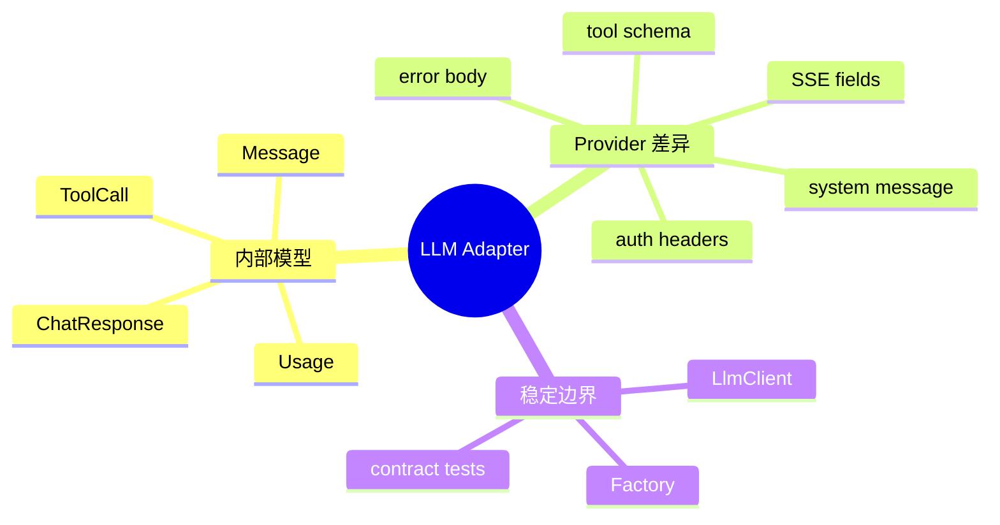

# 多供应商 Adapter 与统一模型

## 1. 概念

Adapter 将不同外部接口转换成内部统一接口；Anti-Corruption Layer 防止外部概念污染核心模型。



## 2. 项目实现

`LlmClient` 定义 chat/chatStream；`LlmClientFactory` 按 provider 创建客户端；大量 OpenAI-compatible 供应商复用 OpenAi Client；Anthropic、Ollama、Responses 处理独特协议；内部统一 Message、Tool、ToolCall、Usage。

## 3. 适配原理与本质

核心不是“换 URL”，而是语义归一：

- OpenAI/Anthropic 的 system 表达不同；
- reasoning 字段和可见性不同；
- usage/cache token 字段不同；
- tool result 消息格式不同；
- finish reason 和 error code 不同。

正确 Adapter 要把这些差异在边界消化，使 Agent Loop 只理解内部语义。

## 4. Demo

```java
record InternalRequest(String system, String user) {}
record InternalResponse(String text, int inputTokens, int outputTokens) {}

interface LlmClient { InternalResponse chat(InternalRequest request) throws Exception; }

final class VendorAClient implements LlmClient {
    public InternalResponse chat(InternalRequest r) {
        // Vendor A: {messages:[{role:"system"...}]}
        var vendorResponse = callVendorA(r);
        return new InternalResponse(vendorResponse.content(),
            vendorResponse.promptTokens(), vendorResponse.completionTokens());
    }
    private VendorAResponse callVendorA(InternalRequest r) { return new VendorAResponse("ok", 2, 1); }
    private record VendorAResponse(String content, int promptTokens, int completionTokens) {}
}
```

内部调用方不应拿到 VendorAResponse，否则 Adapter 边界失效。

## 5. Factory 边界

Factory 负责选择和组装，不应包含流解析业务。新增 provider 的完成标准：请求映射、流事件、工具调用、usage、错误和超时契约测试通过，而且 Orchestrator 无修改。

## 6. 能力协商

不同模型不一定支持 tools、images、reasoning、server web search。比大量 `instanceof` 更好的方式是客户端暴露 immutable capabilities，调用前校验或降级。

## 7. 面试题

**为何不只做 OpenAI-compatible？** 兼容协议通常只覆盖基本字段，Anthropic/Responses 等在消息、工具和流事件上有实质差异。强行统一 URL 会把条件分支泄漏到核心。

**统一模型会不会丢能力？** 会有 lowest-common-denominator 风险。解决办法是核心公共模型 +明确 capability/extension，而不是让 provider JSON 直接穿透。

## 8. 掌握检查

- [ ] 能列出五类 provider 差异；
- [ ] 能解释 Anti-Corruption Layer；
- [ ] 能定义 capability 模型；
- [ ] 能说明新增 provider 的测试标准。

## 9. Canonical Model 的设计

内部 Message 应表达语义而非供应商字段：role、content parts、tool calls、tool result、reasoning visibility。Usage 需允许缺失字段，因为有的 provider 不返回 cache detail。未知 finish reason 不能反序列化失败，可保留 raw +映射后的 enum UNKNOWN。

统一模型过窄会丢能力，过宽则所有调用方充满 null。可分核心必需字段和 capability-specific extension；扩展只能在明确支持时使用。

## 10. 请求映射的细节

- system 是独立字段还是 message；
- 图片使用 URL/base64/content part；
- tool_choice、parallel tool calls、response format；
- temperature 在某些 reasoning model 不支持；
- max_tokens 可能叫 max_completion_tokens；
- Authorization、x-api-key、api-version 差异。

Builder 应根据 capability 过滤/拒绝不支持参数，不能把所有字段原样发送后依赖 400。

## 11. 流与非流一致性

同一 provider 的 `chat()` 和 `chatStream()` 最终应产生语义等价 ChatResponse。建立共享 fixture：同一内容/tool/usage 分别以普通 JSON 和 SSE 表达，断言 canonical result 相同。否则应用层在流式/非流式路径行为会漂移。

## 12. Provider Fallback

自动切 provider 只适用于兼容模型/能力，且可能改变数据驻留、成本和输出。认证错误不应 fallback 到未知账号；rate limit 可按 policy 切；Tool/图片能力必须匹配。Conversation 应记录每轮实际 provider/model，方便恢复与审计。

## 13. 契约 Fixture

保存去敏后的真实响应样本，覆盖正常、工具、reasoning、usage、400/401/429/500 和流断开。Fixture 带 provider/API version；Parser 改动运行全部契约测试。少量真实 smoke test 验证供应商未改协议。

## 14. 源码实验

新增一个 FakeProvider，故意把 system 独立编码、usage 改字段；要求只修改 Adapter/Factory。若 Orchestrator 需要 provider 分支，说明内部模型或 capability 不足。

## 15. 深层面试追问

**Adapter会不会成为最低公共能力？** 核心模型保存共同语义，扩展能力通过Capabilities和受控extension，不把raw JSON泄漏。**OpenAI-compatible为何仍需单独配置？** URL/认证、SSE reasoning、usage和工具兼容程度不同，兼容只是协议家族。

**如何切换Provider而不中断会话？** 每轮记录实际provider/model；新客户端能力必须覆盖当前Tool/图片；Prompt token计数和cache会变化；切换只发生在轮次边界并写事件。**Factory越来越大怎么办？** provider descriptor/ServiceLoader注册，但动态插件也带安全和版本治理。

源码应逐个对照 OpenAi/Anthropic/Ollama/Responses 的 build request、auth header、stream decoder、error mapper，形成能力矩阵；不能仅从 Factory enum推断“全部功能一致”。

## 项目源码精读

源码入口：[LlmClient.java](../../../src/main/java/com/example/agent/llm/client/LlmClient.java)、[AbstractLlmClient.java](../../../src/main/java/com/example/agent/llm/client/AbstractLlmClient.java)、[AnthropicLlmClient.java](../../../src/main/java/com/example/agent/llm/client/AnthropicLlmClient.java)、[ResponsesLlmClient.java](../../../src/main/java/com/example/agent/llm/client/ResponsesLlmClient.java)。抽象层只冻结稳定契约：

```java
protected abstract String getDefaultModel();
protected abstract String getDefaultBaseUrl();
public abstract String getProviderName();
protected abstract String getChatCompletionsPath();
protected abstract String getAuthorizationHeader();

public ChatResponse chatStream(List<Message> messages,
        List<Tool> tools, Consumer<StreamChunk> onChunk) throws LlmException {
    // canonical request、retry、stream 生命周期
}
```

Anthropic Adapter 把 system 从 messages 分离，并把 tools 转成自己的字段；Responses Adapter 把消息转为 input items，解析 `response.output_*` typed events；OpenAI-compatible 使用 choices/delta。Adapter 的工作是双向防腐：Canonical Model→供应商请求，以及供应商响应/错误→Canonical Model。

> [!IMPORTANT]
> **疑难点：统一接口容易制造“能力假象”。** Provider 不支持 reasoning、图片、parallel tools、stream usage 时，不能静默丢字段；需要 capability matrix，在请求前 fail fast 或明确降级。Factory 中多个 Provider 共用 `OpenAiLlmClient` 只说明协议近似兼容，不代表错误码、模型能力和计费语义一致。

## 16. 源码级实现原理解读

Provider Adapter 要做的是双向语义映射：内部 `ChatRequest/Message/Tool` 转成供应商字段，供应商的同步/流式响应再归一成 `ChatResponse/StreamChunk/Usage/LlmError`。只统一方法签名而把 provider-specific JSON、finish reason 或错误码泄漏给 Orchestrator，属于“名义适配”。

真正困难的是不可等价能力：有的 provider 支持 parallel tool calls、prompt cache、reasoning effort、图片或 strict schema，有的没有。统一模型不应假装所有能力存在，而应显式暴露 capability set，并在请求构造前协商：required capability 缺失则失败；optional capability 可降级并记录。

`LlmClientFactory` 决定具体 Adapter，`AbstractLlmClient` 复用 HTTP/重试/SSE 骨架，各子类负责 wire mapping。Factory 选错 provider 是启动配置错误；远程返回未知 finish reason 是运行时兼容问题，两者要用不同错误语义。

## 17. 可运行完整实现：Canonical Model 与能力协商

```java
import java.util.*;

public class ProviderAdapterDemo {
    enum Capability { TOOLS, VISION, PROMPT_CACHE }
    record CanonicalRequest(List<String> messages, boolean requireTools) {}
    record CanonicalResponse(String text, long inputTokens, long outputTokens) {}
    interface Provider {
        Set<Capability> capabilities();
        CanonicalResponse complete(CanonicalRequest request);
    }
    static abstract class CheckedProvider implements Provider {
        public final CanonicalResponse complete(CanonicalRequest request) {
            if (request.requireTools() && !capabilities().contains(Capability.TOOLS))
                throw new UnsupportedOperationException("provider has no tool calling");
            WireRequest wire = encode(request);
            return decode(send(wire));
        }
        record WireRequest(Map<String,Object> body) {}
        record WireResponse(Map<String,Object> body) {}
        abstract WireRequest encode(CanonicalRequest request);
        abstract WireResponse send(WireRequest request);
        abstract CanonicalResponse decode(WireResponse response);
    }
    static final class FakeOpenAi extends CheckedProvider {
        public Set<Capability> capabilities() { return Set.of(Capability.TOOLS, Capability.PROMPT_CACHE); }
        WireRequest encode(CanonicalRequest r) { return new WireRequest(Map.of("messages", r.messages())); }
        WireResponse send(WireRequest r) { return new WireResponse(Map.of("text", "ok", "in", 10L, "out", 2L)); }
        CanonicalResponse decode(WireResponse r) { return new CanonicalResponse(
                (String) r.body().get("text"), (long) r.body().get("in"), (long) r.body().get("out")); }
    }
    public static void main(String[] args) {
        Provider p = new FakeOpenAi();
        var response = p.complete(new CanonicalRequest(List.of("hello"), true));
        if (response.inputTokens() != 10) throw new AssertionError();
    }
}
```

模板方法把 invariant（能力检查、统一返回）放在父类，wire 差异留给子类。契约测试应对每个 Adapter 运行同一组 fixture：文本、空响应、多个 ToolCall、usage 缺失、未知字段、429/401、流中错误和取消；不能只分别写“能返回 ok”的单元测试。

## 延伸学习：博客与电子书

- [Refactoring.Guru：Adapter Pattern](https://refactoring.guru/design-patterns/adapter)：理解防腐层如何隔离外部协议变化。
- [OpenAI API Reference](https://platform.openai.com/docs/api-reference) 与 [Anthropic API Docs](https://docs.anthropic.com/en/api/getting-started)：对照同一消息、工具和流事件在两套协议中的差异。

## 思维导图节点学习博客

本专题思维导图中的 12 个末级知识点均已展开为独立博客：[进入节点博客目录](../mindmap-blogs/03-agent-llm/04-provider-adapter/README.md)。
