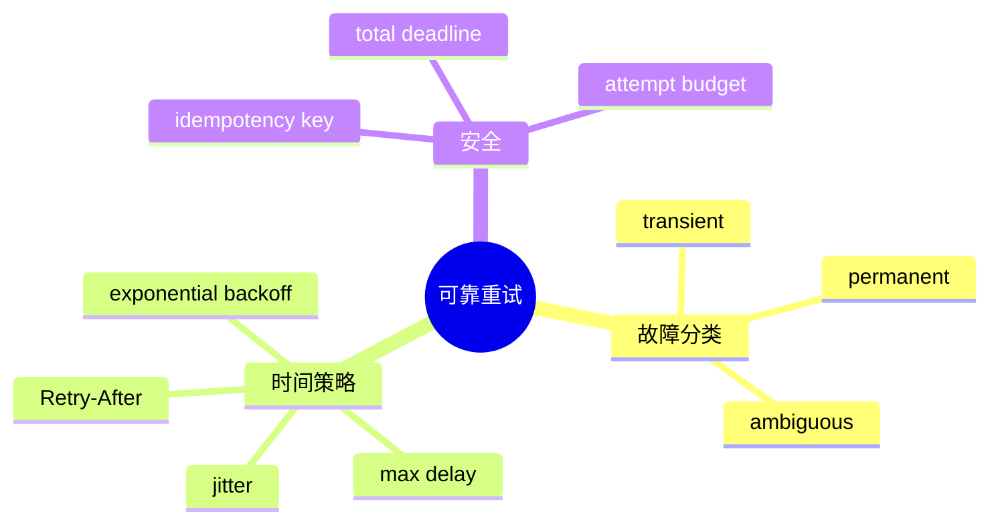

# 重试、指数退避与幂等

## 1. 概念

重试把一次失败操作重新执行。指数退避让等待随次数增长；jitter 加随机量避免大量客户端同时重试。幂等保证重复执行与执行一次产生相同业务效果。



## 2. 项目实现

`RetryPolicy` 默认 maxRetries=3、initial=1s、multiplier=2、max=10s；连接、超时、5xx、rate limit 重试，认证和参数错误不重试。

## 3. 原理

第 n 次延迟 `min(maxDelay, initial × multiplier^n)`。没有 jitter 时，成千客户端会在 1/2/4 秒同时撞击恢复中的服务，称 thundering herd。Full jitter 可用 `[0, calculatedDelay]` 随机值。

## 4. Demo

```java
import java.time.Duration;
import java.util.concurrent.ThreadLocalRandom;
import java.util.function.Supplier;

static <T> T retry(Supplier<T> action, int maxAttempts) throws Exception {
    Exception last = null;
    for (int attempt = 0; attempt < maxAttempts; attempt++) {
        try { return action.get(); }
        catch (RuntimeException e) {
            last = e;
            if (!isTransient(e) || attempt == maxAttempts - 1) throw e;
            long cap = Math.min(10_000L, 1_000L << attempt);
            Thread.sleep(Duration.ofMillis(ThreadLocalRandom.current().nextLong(cap + 1)));
        }
    }
    throw last;
}

static boolean isTransient(Exception e) { return e instanceof TemporaryException; }
class TemporaryException extends RuntimeException {}
```

## 5. 模糊结果

超时不代表服务端没执行。LLM 可能已经生成并计费，写文件/远程 Tool 可能已成功但响应丢失。重试前要判断操作是否无副作用，或使用 request/tool idempotency key 查询/去重。

整个 Agent turn 的自动重放尤其危险：可能重复 Bash、发消息或删除。应只重试 LLM HTTP 的安全阶段，工具由 callId 去重并记录结果。

## 6. Deadline

每次重试不能重新获得完整 timeout。总 deadline=30s，第一次花 20s，第二次最多只剩 10s。还要尊重供应商 `Retry-After` 和 rate-limit headers。

## 7. 面试题

**HTTP 429 为什么可重试？** 限流通常是临时状态，但应等待 Retry-After；无限立即重试会恶化限流。

**POST 能重试吗？** 方法名不决定业务幂等；带 idempotency key 的 POST 可以安全重放，无 key 的扣款/工具执行通常不能。

## 8. 掌握检查

- [ ] 能区分 transient/permanent/ambiguous；
- [ ] 能写 full jitter；
- [ ] 能解释 timeout 不代表未执行；
- [ ] 能设计 ToolCall 幂等键。

## 9. Backoff 算法比较

- Exponential no jitter：确定但惊群；
- Full jitter：随机 `[0, cap]`，分散最好；
- Equal jitter：`cap/2 + random(0, cap/2)`，避免过短；
- Decorrelated jitter：下一次依赖上次延迟，适合长重连。

初始 attempt 的定义要统一：第一次失败后用 initial，而不是 initial×2。计算需防指数溢出，项目对 attempt>30 返回 maxDelay。

## 10. Retry Budget 与熔断

单请求 maxRetries 防局部无限，但全站故障时每个请求都乘 4 倍流量。全局 Retry Budget 限制重试流量占比；Circuit Breaker 在连续失败后 OPEN，快速失败，冷却后 HALF_OPEN 少量探测。熔断按 provider/endpoint/model 分组，不能一个模型故障拖累全部。

## 11. 幂等记录的原子性

```text
if result not exists:
    execute side effect
    save result
```

这仍有执行成功、保存前崩溃窗口。数据库可用唯一 key +事务/outbox；文件工具可先写 operation journal，或依赖 compare/snapshot 判断结果。对无法确认的 Bash，安全策略是 UNKNOWN +人工检查，不自动重跑。

## 12. 流式响应何时可重试

未向用户发出任何内容时重试最透明；已经输出一半再重试会产生重复/矛盾文本。可以在服务端缓冲到首个有效 chunk 后再宣布 attempt，或发 retry event 并让客户端丢弃旧 attempt 的 token。ToolCall 已开始执行后绝不能重新发整轮。

## 13. Retry-After 解析

HTTP Retry-After 可能是秒数或 HTTP date；需考虑时钟偏差并设置最大等待。若超过用户 deadline，直接失败。供应商自定义 `x-ratelimit-reset` 也可支持，但 Adapter 层转成统一 retryAt。

## 14. 实验

用 fake server 前两次 500、第三次 200，断言次数/延迟；加入 401 断言只请求一次；100 个客户端同时失败，比较无 jitter 与 full jitter 的请求时间分布；模拟副作用成功后断连，验证不会自动重放。

## 15. 源码推演与深层追问

`RetryPolicy.shouldRetry(exception, attempt)` 的 attempt边界要用表测试：maxRetries=3到底是总3次还是初次+3次。项目语义是 attempt达到maxRetries停止，需要结合调用循环确认。Delay的Thread.sleep应响应interrupt；取消不能被catch成连接故障再重试。

**幂等Key存多久？** 至少覆盖客户端可能重试窗口；支付类更久，ToolCall通常覆盖session生命周期。**GET一定幂等吗？** 规范语义应幂等，但某些错误服务有副作用；业务事实优先。**重试和hedging区别？** Hedging在原请求未失败时并发第二请求降低尾延迟，费用和重复副作用风险更高，LLM生成通常不适合默认启用。

进一步给 RetryPolicy加入Clock/Sleeper依赖，测试无需真实等待；解析Retry-After；记录每attempt usage/requestId，避免把多次费用合成一次隐藏。

## 项目源码精读

源码入口：[RetryPolicy.java](../../../src/main/java/com/example/agent/llm/retry/RetryPolicy.java)、[AbstractLlmClient.java](../../../src/main/java/com/example/agent/llm/client/AbstractLlmClient.java)。退避和值域保护如下：

```java
public long getDelayMs(int attempt) {
    if (attempt < 0) return initialDelayMs;
    if (attempt > 30) return maxDelayMs;
    double delay = initialDelayMs * Math.pow(backoffMultiplier, attempt);
    if (delay > maxDelayMs || delay < 0
            || Double.isInfinite(delay) || Double.isNaN(delay)) {
        return maxDelayMs;
    }
    return Math.min((long) delay, maxDelayMs);
}

public boolean shouldRetry(LlmException e, int attempt) {
    if (attempt >= maxRetries) return false;
    return e instanceof LlmTimeoutException
        || e instanceof LlmConnectionException
        || (e instanceof LlmApiException api
            && (api.isServerError() || api.isRateLimited()));
}
```

指数退避减少故障期间同步洪峰，cap 防止等待无限增长；分类器把确定性 4xx 与瞬态 timeout/5xx/429 分开。完整公式还应加入 random jitter，并把 `Retry-After` 视为服务端下限。总 deadline 必须覆盖所有 attempt 与 sleep，不能每次重试重置计时。

> [!IMPORTANT]
> **疑难点：连接异常不代表请求没到服务端。** LLM 生成通常只读，但 Tool/外部 API 可能已产生副作用；只有携带稳定 idempotency key 且服务端记账，才可安全自动重试。当前 Policy 对所有连接/超时统一重试，还没有按 operation idempotency 决策，也没有 jitter，多个会话同时失败时可能形成 synchronized retry storm。

## 16. 源码级实现原理解读

RetryPolicy 的第一职责不是计算 sleep，而是判断错误是否可重试。连接建立失败、408、429、部分 5xx 通常可能重试；401/403、Schema 错误、上下文超限通常不会因等待而恢复。流已经向上游交付任何可见 token 后，自动重试还会产生重复前缀，除非协议支持 resume 或调用方能丢弃整次 attempt。

指数退避把第 n 次上限放大为 `min(cap, base * 2^n)`；full jitter 从 `[0, upper]` 随机，避免大量客户端同一时刻重试形成同步风暴。`Retry-After` 若合法，应与本地 backoff、剩余 deadline 一起决策，而不是无条件 sleep。

幂等必须围绕业务副作用定义。LLM 纯生成可以再次请求但费用会重复；read tool 天然接近幂等；write tool 即使写相同内容，也可能更新 mtime/审计/触发器。请求超时代表结果未知，不代表服务端没执行，必须用 idempotency key 查询/去重。

## 17. 可运行完整实现：分类、Full Jitter 与总 Deadline

```java
import java.time.*;
import java.util.concurrent.*;
import java.util.function.Supplier;

public class RetryDemo {
    static final class RemoteException extends RuntimeException {
        final int status;
        RemoteException(int status) { this.status = status; }
    }
    static <T> T execute(Supplier<T> call, int maxAttempts, Duration totalTimeout) {
        long deadline = System.nanoTime() + totalTimeout.toNanos();
        RuntimeException last = null;
        for (int attempt = 0; attempt < maxAttempts; attempt++) {
            try { return call.get(); }
            catch (RemoteException e) {
                last = e;
                if (!(e.status == 408 || e.status == 429 || e.status >= 500)) throw e;
            }
            long upperMillis = Math.min(5_000L, 100L << Math.min(attempt, 10));
            long sleepMillis = ThreadLocalRandom.current().nextLong(upperMillis + 1);
            long remaining = deadline - System.nanoTime();
            if (remaining <= TimeUnit.MILLISECONDS.toNanos(sleepMillis)) break;
            try { Thread.sleep(sleepMillis); }
            catch (InterruptedException e) { Thread.currentThread().interrupt(); throw new CancellationException(); }
        }
        throw last != null ? last : new IllegalStateException("no attempt");
    }
    public static void main(String[] args) {
        var count = new java.util.concurrent.atomic.AtomicInteger();
        String value = execute(() -> {
            if (count.incrementAndGet() < 3) throw new RemoteException(503);
            return "ok";
        }, 4, Duration.ofSeconds(3));
        if (!value.equals("ok") || count.get() != 3) throw new AssertionError();
    }
}
```

代码每次 sleep 前检查剩余 deadline，避免“重试策略超过用户总超时”。生产实现还应把 attempt、错误类别、退避、idempotency key 记入 trace，并把 Retry Budget 作为全局比例限制：当依赖整体故障时，不能允许所有原始流量都乘以最大尝试次数。

## 延伸学习：博客与电子书

- [AWS：Exponential Backoff and Jitter](https://aws.amazon.com/blogs/architecture/exponential-backoff-and-jitter/)：重点理解 full/equal/decorrelated jitter 对拥塞的影响。
- [Release It!（O’Reilly）](https://www.oreilly.com/library/view/release-it-2nd/9781680504552/)：重点读 Timeout、Circuit Breaker、Bulkhead 和稳定性模式。

## 思维导图节点学习博客

本专题思维导图中的 10 个末级知识点均已展开为独立博客：[进入节点博客目录](../mindmap-blogs/03-agent-llm/05-retry-backoff-idempotency/README.md)。
