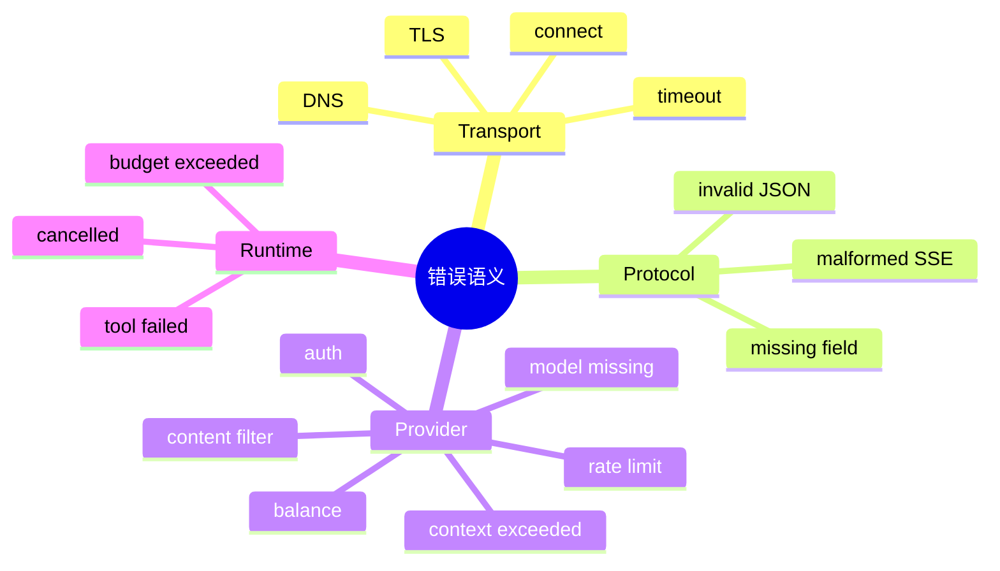

# 错误分类与异常语义

## 1. 概念、原理与本质

错误分类法是把大量底层异常映射为少量稳定的业务语义。其目标不是换一段中文，而是让系统做决策：重试、提示更新 Key、缩短上下文、切模型、停止或降级。



## 2. 项目实现

`LlmErrorClassifier` 依次尝试 provider-specific、body type/code、文本关键词、HTTP status，得到 AUTH_FAILED、RATE_LIMITED、CONTEXT_LENGTH_EXCEEDED、SERVER_BUSY 等统一 code；`LlmApiException` 同时保留 status/body/detail。

优先顺序重要：HTTP 400 既可能是普通参数错，也可能在 body 中明确写 context length exceeded，后者需要触发压缩而不是泛化提示。

## 3. Demo：可决策错误

```java
sealed interface LlmFailure permits AuthFailure, RateLimited, ContextTooLong, TemporaryServer {}
record AuthFailure(String detail) implements LlmFailure {}
record RateLimited(long retryAfterMs) implements LlmFailure {}
record ContextTooLong(int estimatedTokens) implements LlmFailure {}
record TemporaryServer(int status) implements LlmFailure {}

static String action(LlmFailure failure) {
    return switch (failure) {
        case AuthFailure ignored -> "ask-user-to-update-key";
        case RateLimited r -> "retry-after-" + r.retryAfterMs();
        case ContextTooLong ignored -> "compact-context";
        case TemporaryServer ignored -> "retry-with-backoff";
    };
}
```

类型系统让新增错误时 switch 需要更新，比到处比较 message 字符串可靠。

## 4. 原始信息与安全

内部需要原始 status/body 排查，但前端和日志应截断、脱敏，防止 Key、Prompt 或供应商内部信息泄漏。用户消息应告诉“如何行动”，日志保留 correlation id 和有限 detail。

## 5. 异常边界

底层抛 IOException，LLM Adapter 翻译为 LlmConnectionException；应用层再转换为稳定 error event。不要在最底层直接生成前端中文，也不要让 Handler 解析供应商 body。

## 6. 面试题

**为什么不能只按 HTTP status 分类？** 多个业务错误共享 400，同一 provider 还可能用 200 流内返回错误；必须结合 body/code 和协议阶段。

**错误应该 checked 还是 unchecked？** 外部可恢复故障可用明确结果/异常层次强迫调用方处理；编程错误适合 unchecked。关键是边界一致而非绝对规则。

## 7. 掌握检查

- [ ] 能画出 transport/protocol/provider/runtime 四层错误；
- [ ] 能为每类错误给出系统动作；
- [ ] 能解释分类优先级；
- [ ] 能设计安全的用户错误与内部 detail。

## 8. 错误对象需要哪些字段

稳定 code、category、retryable、userMessage、internalDetail、provider/status、requestId、retryAfter、cause、timestamp。不要让调用方通过中文 message substring 决策。code 需要版本稳定；detail 可变化，仅诊断。

错误还要区分责任方：USER_CONFIG、CLIENT_INPUT、PROVIDER_TEMPORARY、RUNTIME_BUG、SECURITY_POLICY、CANCELLED。这样指标和告警不会把用户 Key 错误算成服务可用性故障。

## 9. 流内错误

HTTP 200 不代表成功：SSE 中可能出现 error event、空响应、finishReason=content_filter。Parser/Adapter 应在协议完成时检查：是否收到有效内容/ToolCall、是否有 provider error、是否正常 DONE。空 200 可分类 EMPTY_RESPONSE，而非普通 success。

## 10. 异常转换边界

Transport 把 SocketTimeoutException 转 LlmTimeout；Provider Adapter 把 status/body 转 LlmApiException；Application 把它映射成 AgentStep Failed/Retry；Web 层生成 SSE error DTO。每层补充上下文但保留 cause，避免重复记录同一 stack trace。

## 11. 监控与告警

按稳定 code 计数；AUTH_FAILED 通知用户配置，不触发平台 pager；SERVER_ERROR/RATE_LIMIT 影响 provider 健康；CONTEXT_LENGTH 触发压缩指标；UNKNOWN 高于阈值说明分类规则落后。错误 label 不包含完整 detail，防高基数。

## 12. 兼容未知错误

供应商随时新增 code。Classifier 必须有 UNKNOWN fallback，保留有限 raw detail，系统安全失败。不要枚举反序列化直接抛异常丢掉真正错误。文本关键词匹配是最后兜底，容易语言/文案变化，不应最高优先。

## 13. 实验

构造同为 400 的 invalid request/context exceeded/content filter，验证动作不同；构造 200+error event；错误 body 中放伪 API Key，验证日志脱敏；新增未知 provider code，确保前端仍收到稳定 UNKNOWN。

## 14. 错误因果链与深层追问

Java exception cause保留技术链，业务 error object提供决策链。重试最终失败时顶层应显示最终code并附attempt count，suppressed保留各attempt异常，但避免日志重复打印四次完整stack。

**429一定是系统过载吗？** 可能账户RPM、TPM、并发或余额策略，结合header/detail；动作可能等待、降并发、换模型或提示充值。**Context exceeded为什么不直接重试？** 输入不变会确定失败，必须先压缩。**Content filter应否把原文回显？** 可能再次暴露敏感内容，只给安全摘要和requestId。

检查 `LlmErrorClassifier` 中文/英文关键词、provider specific顺序和body截断；为每个稳定code定义owner、retryable和前端action，生成测试矩阵，防新增分类只改文案未改策略。

## 项目源码精读

源码入口：[LlmErrorClassifier.java](../../../src/main/java/com/example/agent/llm/exception/LlmErrorClassifier.java)、[LlmError.java](../../../src/main/java/com/example/agent/llm/exception/LlmError.java)、[LlmApiException.java](../../../src/main/java/com/example/agent/llm/exception/LlmApiException.java)。归一化采用从可靠到模糊的优先级：

```java
public static LlmError classify(String provider, int statusCode, String body) {
    LlmError error = classifyProviderSpecific(provider, statusCode, body);
    if (error != null) return error;
    error = classifyFromBodyType(body);
    if (error != null) return error;
    error = classifyByText(body);
    if (error != null) return error;
    error = classifyByStatus(statusCode, body);
    if (error != null) return error;
    return new LlmError(CODE_UNKNOWN, fallbackMessage(body, statusCode), detail(body));
}
```

Provider 特例（如 Anthropic 529、DeepSeek 402）优先；结构化 `error.type/code` 比关键词可靠；文本只作兼容兜底；最后才用 HTTP status。稳定业务 code 供 UI、retry、告警和统计使用，原始 detail 只供受控诊断。

> [!IMPORTANT]
> **疑难点：错误分类不是文案翻译。** 同一个 429 可能要等待、降并发、换账号或提示余额；因此 Canonical Error 还应携带 `retryable/retryAfter/category/providerRequestId`。关键词分类可能把用户内容中的 “rate limit” 误判为限流，必须只解析可信错误字段并限制 body。未知错误不能默认 retry，否则确定性协议错误会形成成本循环。

## 15. 源码级实现原理解读

错误分类的目标是让上层能做决定，而不是创造更多 Exception 类。一个可决策错误至少包含 `category、retryable、providerStatus、requestId、safeMessage、cause`；category 保持稳定，供应商原始 code 可以新增。用户展示、日志诊断和控制流不能共用一段原始 message，否则可能泄漏 API key、Prompt 或文件内容。

项目的典型边界是：HTTP/JSON 层捕获网络与解析异常 → `LlmErrorClassifier` 归类 → client 抛统一 `LlmException` → Orchestrator 决定 retry/terminal SSE → Handler 只负责协议输出。若每层 catch Exception 后重新 new 一个无 cause 的异常，根因链和 requestId 会丢失；若顶层直接把 `cause.getMessage()` 返回浏览器，又会泄密。

流式请求在响应头 200 后仍可能失败，此时 transport 成功而应用事件失败。错误模型必须允许“HTTP 成功 + stream 内 error”，并记录是否已经交付部分输出，重试决策才能避免重复。

## 16. 可运行完整实现：稳定错误码与安全投影

```java
import java.util.*;

public class ErrorTaxonomyDemo {
    enum Category { AUTH, RATE_LIMIT, TIMEOUT, NETWORK, INVALID_REQUEST, PROVIDER, INTERNAL }
    record AppError(Category category, boolean retryable, Integer status,
                    String requestId, String safeMessage, Throwable cause) {}

    static AppError classify(int status, String requestId, String rawBody, Throwable cause) {
        return switch (status) {
            case 401, 403 -> new AppError(Category.AUTH, false, status, requestId,
                    "模型服务认证失败，请检查配置", cause);
            case 408 -> new AppError(Category.TIMEOUT, true, status, requestId,
                    "模型服务响应超时", cause);
            case 429 -> new AppError(Category.RATE_LIMIT, true, status, requestId,
                    "请求过于频繁，请稍后重试", cause);
            default -> status >= 500
                    ? new AppError(Category.PROVIDER, true, status, requestId, "模型服务暂时不可用", cause)
                    : new AppError(Category.INVALID_REQUEST, false, status, requestId, "请求不受支持", cause);
        };
    }
    static Map<String,Object> publicView(AppError e) {
        Map<String,Object> out = new LinkedHashMap<>();
        out.put("code", e.category().name()); out.put("message", e.safeMessage());
        if (e.requestId() != null) out.put("requestId", e.requestId());
        out.put("retryable", e.retryable());
        return Map.copyOf(out);                         // 不包含 rawBody/cause
    }
    public static void main(String[] args) {
        AppError e = classify(401, "req-7", "api-key=secret", null);
        String shown = publicView(e).toString();
        if (shown.contains("secret") || e.retryable()) throw new AssertionError(shown);
    }
}
```

`rawBody` 只能进入受控、脱敏、限长的诊断日志；不能默认写入 SSE 或 transcript。未知供应商 code 应保留原值并落入稳定兜底 category，而不是反序列化失败。面试时应能解释 category 是控制面契约，message 是展示文本，两者的兼容性要求不同。

## 延伸学习：博客与电子书

- [OpenAI API Error Codes](https://platform.openai.com/docs/guides/error-codes)：对照 HTTP 状态、原因和推荐动作。
- [Anthropic API Errors](https://docs.anthropic.com/en/api/errors)：重点比较 429、500、529 及 request-id，完善 Provider 特例测试。

## 思维导图节点学习博客

本专题思维导图中的 16 个末级知识点均已展开为独立博客：[进入节点博客目录](../mindmap-blogs/03-agent-llm/06-error-taxonomy/README.md)。
