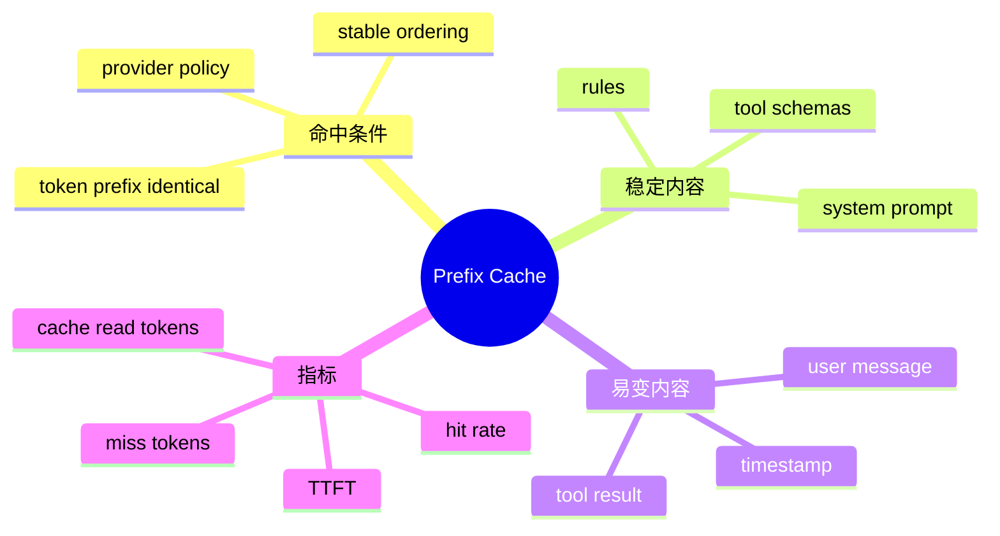

# Prompt 前缀缓存

## 1. 概念

自回归模型处理长 Prompt 时会计算中间注意力状态。部分供应商缓存相同 Token 前缀的计算结果，后续请求若前缀完全一致，可减少首 Token 延迟和输入成本。



## 2. 缓存原理与本质

这是函数前缀 memoization。任何早期 token 变化都会使其后的缓存无法复用。因此优化不是“少写几个字”，而是让稳定内容按确定顺序放在前部，变化内容追加到尾部。

## 3. 项目实现

WebAgentOrchestrator 为同 session 冻结当前 AgentMode 的 Tool Schema 快照，避免动态注册/Map 顺序导致每轮工具前缀变化；Usage 记录 cache read/miss 和命中率，异常低时告警。

## 4. Demo：稳定序列化

```java
import java.util.*;

record Tool(String name, String schema) {}

static String stablePrefix(String system, Collection<Tool> tools) {
    var ordered = tools.stream()
        .sorted(Comparator.comparing(Tool::name))
        .toList();
    var out = new StringBuilder(system).append('\n');
    for (Tool t : ordered) out.append(t.name()).append(':').append(t.schema()).append('\n');
    return out.toString();
}
```

HashMap 遍历、随机 UUID、当前时间、动态统计都不应进入稳定前缀。JSON 序列化还要固定字段顺序和空值策略。

## 5. 权衡

冻结工具提高缓存，却使会话中途新接入 MCP 工具不可见。可选择新 session 生效、显式 refresh 并接受缓存失效，或把工具集版本化。

缓存命中由 provider 控制，不能仅凭本地字符串相同保证；模型、账号、区域、TTL 都可能影响。

## 6. 指标

`hitRate = cacheRead / (cacheRead + cacheMiss)` 只在有可缓存历史时有意义。新会话首轮 cacheRead=0 不应告警。还应联合观察 TTFT 和实际账单，而不是把 90% 当绝对 KPI。

## 7. 掌握检查

- [ ] 能解释为何早期一个 Token 变化影响后续；
- [ ] 能列出稳定/易变内容；
- [ ] 能写稳定排序序列化；
- [ ] 能说明冻结工具的产品取舍。

## 8. Token 级一致而非字符串级

供应商缓存基于 Token/内部请求结构。两个 Java String 视觉相同也可能因 Unicode normalization、换行、JSON 空格/字段顺序不同而产生不同 bytes/token。反之部分无关传输字段可能不进入模型输入。应用可计算 canonical prompt hash 辅助诊断，但最终以 provider cache usage 为准。

## 9. 前缀布局设计

```text
[稳定] base system
[稳定] mode prompt
[稳定] tool schemas（固定排序）
[较稳定] project rules / persistent memory
[增长] conversation history
[变化] latest user/tool result
```

持久记忆更新会让其后整个历史失效。可把高频变化的动态提醒放尾部，或只在新 session 应用。不能为了缓存牺牲正确性：安全 Rule 更新需要立即生效时必须接受 miss。

## 10. Cache 指标解释

分母应只包含可缓存前缀 token；新会话和短 Prompt 不告警。观察每 turn 的 cacheRead 曲线，正常长会话应随稳定前缀增长。突然降为 0 时比较 prompt hash/tool version/rule version。还要结合 input price，因为不同 provider cache discount 不同。

## 11. Tool Snapshot 版本

记录 `toolsetHash`：按名称排序后对 schema canonical JSON hash。session 首轮保存，后续复用。MCP 动态变化时标记 availableVersion，但旧 session 仍用旧 snapshot；用户显式 refresh 创建新 version并告知缓存/能力影响。

## 12. A/B 实验

固定任务集比较随机 Map 顺序与 canonical order：cache hit、TTFT、输入费用和答案一致性。第一次请求作为 warm-up，后续至少多轮；区分供应商缓存 TTL 和自然波动。不要仅用本地 hash 宣称省钱。

## 13. 深层追问

缓存是否泄露数据取决于供应商隔离策略；应用不能跨用户自行共享完整 Prompt 缓存。模型/参数变化通常使缓存失效。temperature 影响生成但不一定影响前缀计算，仍以供应商说明为准。

## 14. 项目级源码与失败分析

沿 Orchestrator查找 session tool snapshot建立、清理和mode变化。确认 ToolRegistry导出的顺序由稳定排序而非Map迭代；PromptLibrary/Rule/Skill片段顺序也要稳定。cache告警Map在session cleanup时应删除，防内存泄漏。

典型失败：system加入当前时间；Memory每轮顺序不同；ObjectMapper字段顺序变化；MCP工具中途加入；模型名改变；供应商TTL过期。对每类记录prompt/tool hash和版本，不能在日志保存完整敏感Prompt。

## 15. 深层追问与实验

**缓存命中会改变答案吗？** 理论上只复用前缀计算，不改变采样语义；实际仍受供应商实现。**为何缓存率低不一定是bug？** 新会话、短Prompt、TTL、provider不支持。**缓存和KV cache是同一概念吗？** 供应商prefix cache通常复用推理KV/预计算，但应用只看到计费指标，不能控制内部细节。

实验连续10轮固定工具，记录cacheRead；逐次只改变工具顺序、Rule时间戳、Memory顺序，比较命中/TTFT/费用，形成具体优化证据。

## 16. 缓存身份、规范化与边界

前缀缓存的身份不是“内容差不多”，而是 Provider 定义范围内的 Token 序列完全一致，通常还受 model、账号、工具 schema、TTL 和最小长度约束。应用侧可计算 `prefixHash = H(modelVersion || canonicalSystem || canonicalTools || stableMemory)` 用于诊断，但它不能代替 Provider 的真实 cache key。

所谓 canonicalization 只能消除无语义波动：工具按稳定 key 排序、JSON 字段序列化稳定、Rule 使用内容 hash、Memory 固定排序。不能为了命中把真实变化抹掉，例如权限模式、workspace 规则或工具 schema 已改变却继续复用旧前缀，那会让缓存优化破坏正确性。

缓存边界宜放在“稳定且较长的可信前缀”之后：系统规则、固定工具、相对稳定项目知识在前，当前时间、请求 ID、用户消息和本轮检索在后。若 Provider 支持显式 cache marker，标记位置还要满足它的最小 Token/分段规则。

## 17. 成本模型与安全

优化收益近似 `命中Token×(普通输入单价-缓存读取单价) - 为稳定化付出的额外Token/工程成本`，同时观察 TTFT。不要只报 hit rate：大量短提示的高命中可能几乎不省钱。缓存内容可能驻留于供应商基础设施，应遵守数据保留和敏感信息政策；不能因为“只是缓存”就把 Secret 放进稳定前缀。

## 项目源码精读

源码入口：[WebAgentOrchestrator.java](../../../src/main/java/com/example/agent/web/orchestrator/WebAgentOrchestrator.java)、[Usage.java](../../../src/main/java/com/example/agent/llm/model/Usage.java)、[ToolsSnapshotTest.java](../../../src/test/java/com/example/agent/web/orchestrator/ToolsSnapshotTest.java)。项目用 session 级工具快照稳定前缀：

```java
List<Tool> getOrCreateToolsSnapshot(String sessionId, AgentMode mode) {
    FrozenToolsEntry existing = toolsSnapshots.get(sessionId);
    if (existing != null && existing.mode() == mode) {
        return existing.tools();
    }
    List<Tool> tools = toolRegistry.toTools(mode);
    FrozenToolsEntry entry = new FrozenToolsEntry(mode, List.copyOf(tools));
    toolsSnapshots.put(sessionId, entry);
    return entry.tools();
}
```

缓存依赖 Token 前缀一致，工具名称、描述、Schema、顺序任何变化都可能使后续长历史失去复用。`List.copyOf` 冻结列表结构；Usage 同时兼容 nested `prompt_tokens_details.cached_tokens` 与 DeepSeek 顶层 hit/miss 字段，再计算命中率告警。

> [!IMPORTANT]
> **疑难点：`List.copyOf` 只是浅不可变。** 如果 `Tool` 对象本身可变，列表不变仍不能保证序列化字节稳定；更强做法是拍规范化 JSON 字节/hash。当前 snapshot 不持久化，重启后依赖工具描述“确定性重建”；MCP 注册时机不同仍可能改变集合。缓存命中优化必须服从权限正确性，mode/Rule 真变化时必须失效。

## 18. 源码级实现原理解读

Prompt 前缀缓存命中的对象通常是 token 序列前缀，不是 Java String 的 `equals`。system prompt 多一个时间戳、Tool 顺序由 HashMap 迭代改变、JSON Schema 字段顺序变化、动态 Memory 插入到前部，都可能让后续大量 token 失去共同前缀。

HippoBuddy 因此冻结 session 的 system prompt 和 Tool snapshot：首次 execute 确定后，同 session 不应随当前 workspace/rule/skill 热变化。恢复历史 session 应从 transcript 读取当时 system message，而不是用今天的配置重算。这个设计同时服务缓存命中和行为可复现性。

缓存身份至少由 `provider/model/tokenizerVersion/systemPromptHash/toolsetVersion/ruleSnapshot/skillSnapshot` 构成。Hash 用于观测和版本判断，不应把 API key 等 secret 混入；序列化必须 canonical，List 保序、Map 排序、禁止随机 ID/时间戳进入稳定前缀。

## 19. 可运行完整实现：稳定序列化与前缀指纹

```java
import java.nio.charset.StandardCharsets;
import java.security.MessageDigest;
import java.util.*;

public class PromptFingerprintDemo {
    record Tool(String name, SortedMap<String,String> schema) {}
    static String canonical(String model, String system, Collection<Tool> tools) {
        StringBuilder out = new StringBuilder();
        out.append("model=").append(model).append('\n');
        out.append("system.len=").append(system.length()).append('\n').append(system).append('\n');
        tools.stream().sorted(Comparator.comparing(Tool::name)).forEach(t -> {
            out.append("tool=").append(t.name()).append('\n');
            t.schema().forEach((k,v) -> out.append(k.length()).append(':').append(k)
                    .append('=').append(v.length()).append(':').append(v).append('\n'));
        });
        return out.toString();
    }
    static String sha256(String value) throws Exception {
        byte[] hash = MessageDigest.getInstance("SHA-256")
                .digest(value.getBytes(StandardCharsets.UTF_8));
        return java.util.HexFormat.of().formatHex(hash);
    }
    public static void main(String[] args) throws Exception {
        Tool a = new Tool("read", new TreeMap<>(Map.of("type", "object", "path", "string")));
        Tool b = new Tool("grep", new TreeMap<>(Map.of("query", "string")));
        String x = sha256(canonical("m", "stable", List.of(a,b)));
        String y = sha256(canonical("m", "stable", List.of(b,a)));
        if (!x.equals(y)) throw new AssertionError("order was not canonicalized");
    }
}
```

长度前缀避免简单连接产生 `ab+c` 与 `a+bc` 的歧义。此指纹只能判断本地“期望前缀相同”，最终 cache hit 仍以供应商 usage 为真值。监控要同时看 cache-read tokens、cache-write tokens、普通 input tokens、首 token 延迟与费用，单看命中率可能掩盖缓存写入成本。

## 延伸学习：博客与电子书

- [OpenAI Prompt Caching Guide](https://platform.openai.com/docs/guides/prompt-caching)：重点学习前缀匹配、cached tokens、cache key 与保留策略。
- [OpenAI API Data Controls](https://platform.openai.com/docs/models/default-usage-policies-by-endpoint)：理解扩展缓存与数据保留/Zero Data Retention 的安全取舍。

## 思维导图节点学习博客

本专题思维导图中的 13 个末级知识点均已展开为独立博客：[进入节点博客目录](../mindmap-blogs/03-agent-llm/07-prompt-cache/README.md)。
