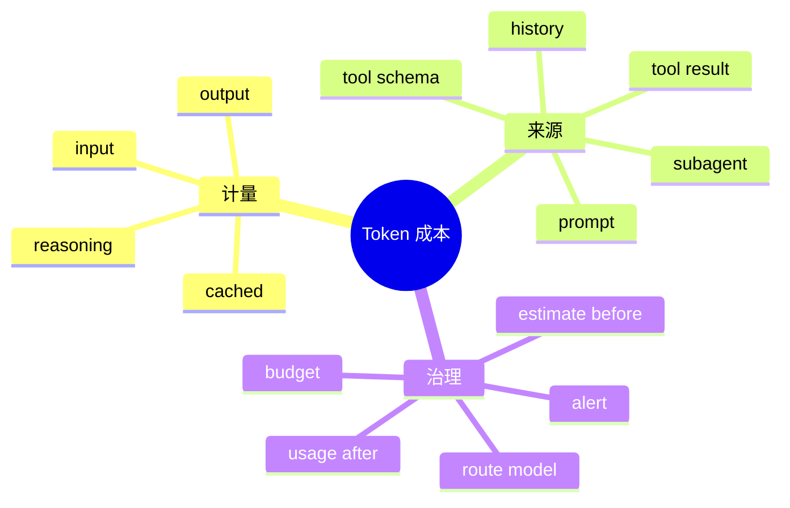

# Token Usage、价格与成本治理

## 1. 概念、原理与本质

Token 是 tokenizer 输出的离散单元。成本治理的本质是把模型计算资源转换为可归因、可预算、可优化的业务度量。模型成本可能区分 input、output、cache read/write、reasoning；Agent 一次用户任务包含多轮请求和子 Agent，不能只看请求数。



## 2. 项目实现

SseParser 读取 Usage；SessionTokenStats 聚合会话数据；CostMetricsCollector 结合 LlmPricing 估算金额；ContextWindow 用 TokenEstimator 做请求前预算。

## 3. 估算与记账

请求前只能估算，用于拒绝/压缩；请求后 provider usage 才是计费近似真相。二者差异来自 tokenizer、隐藏 reasoning、图片、工具 Schema 和供应商计数规则。

成本公式示意：

```text
cost = inputTokens × inputPrice
     + outputTokens × outputPrice
     + cacheReadTokens × cacheReadPrice
     + cacheWriteTokens × cacheWritePrice
```

价格通常按百万 Token，必须注意单位和币种。

## 4. Demo

```java
import java.math.BigDecimal;

record Usage(long input, long output, long cacheRead) {}
record Price(BigDecimal inputPerMillion,
             BigDecimal outputPerMillion,
             BigDecimal cacheReadPerMillion) {}

static BigDecimal cost(Usage u, Price p) {
    BigDecimal million = BigDecimal.valueOf(1_000_000);
    return p.inputPerMillion().multiply(BigDecimal.valueOf(u.input())).divide(million)
        .add(p.outputPerMillion().multiply(BigDecimal.valueOf(u.output())).divide(million))
        .add(p.cacheReadPerMillion().multiply(BigDecimal.valueOf(u.cacheRead())).divide(million));
}
```

金额使用 BigDecimal，避免 double 累计误差。

## 5. Agent 成本治理

- session/task 设置 Token 和金额上限；
- 每轮计算剩余预算；
- 工具输出先截断；
- 子 Agent 独立预算并汇总父任务；
- 重复失败/循环调用触发 StopHook；
- 简单任务路由便宜模型，复杂规划用强模型；
- 记录价格表版本，避免历史成本被新价格重算。

## 6. 面试题

**为什么 output Token 往往更贵？** 生成阶段逐 Token 自回归，计算与延迟成本更高；具体定价由供应商决定。

**如何评估优化有效？** 同时观察任务成功率、TTFT、总延迟、Token 和费用；只压成本可能降低完成质量并增加重试。

## 7. 掌握检查

- [ ] 能区分估算和 usage；
- [ ] 能正确处理每百万 Token 单位；
- [ ] 能列出 Agent 的五个成本来源；
- [ ] 能设计父子 Agent 预算汇总。

## 8. Token 归因模型

把每轮 input 分为 basePrompt、toolSchema、rulesMemory、history、latestObservation，输出分为 visible/reasoning/toolArguments。没有归因就只知道“贵”，不知道优化哪部分。可在请求构造阶段分别估算，并用总 usage 按比例校准。

ToolResult 经常是最大增长源；每轮历史会重复发送，边际成本近似随 turn 累积。一个 10k Token 结果若参与后续 5 轮，可能贡献约 50k 输入，而非只计一次。

## 9. 父子预算

父任务拥有 total budget，fork 时分配子预算 reservation。子 Agent 完成后实际消费结算，未用额度返还。并行子任务必须原子 reserve，防多个子都看到相同余额。

```java
boolean reserve(long amount) {
    long old;
    do {
        old = remaining.get();
        if (old < amount) return false;
    } while (!remaining.compareAndSet(old, old - amount));
    return true;
}
```

## 10. 价格表与账单准确性

价格按 provider/model/region/effectiveFrom 版本化；请求记录 priceVersion。缓存读、批处理、图片和搜索可能另收费。估算用于产品展示，不应替代供应商账单对账。BigDecimal 明确 rounding mode，聚合时统一币种。

## 11. 成本与质量的 Pareto 及方案取舍

压缩 Prompt、换小模型可能增加失败/重试，最终更贵。评估任务级 `cost per successful task`、成功率、延迟，而不是单请求成本。模型路由先用小模型分类/简单任务，困难或失败升级强模型，但升级条件要防无限。

## 12. 异常检测

turn 数、Token/turn、工具结果大小、子 Agent 数突然偏离基线时告警并停止；价格/usage 缺失不能默认 0，应标记 cost unknown。缓存命中下降也是成本异常原因。

## 13. 实验

选 20 个任务记录每个归因段；分别启用工具截断、Skill 按需加载、Context compaction，比较成功任务成本；模拟两个子 Agent 并发 reserve；验证价格更新不改变历史账单。

## 14. 深层面试追问与源码校准

**本地估算比真实usage高怎么办？** 安全预算宁可略高；持续按model/content type记录误差分布，校准margin，不直接用平均误差。**为什么费用不能用double？** 货币聚合和百万单位除法会有二进制误差，BigDecimal指定scale/rounding。

**缓存Token同时算input吗？** 供应商字段/价格不同，Canonical Usage要避免重复计数；保存raw和归一字段。**子Agent预算超支如何处理？** 在每轮前检查remaining，停止并返回partial result，不等账单后才发现。

源码追踪 Usage从SseParser→ChatResponse→SessionTokenStats→CostMetricsCollector，验证流中usage只出现尾帧时不会重复累计，重试attempt如何计费，未知model价格是否标记unknown而非0。

## 项目源码精读

源码入口：[Usage.java](../../../src/main/java/com/example/agent/llm/model/Usage.java)、[LlmPricing.java](../../../src/main/java/com/example/agent/llm/pricing/LlmPricing.java)、[SessionTokenStats.java](../../../src/main/java/com/example/agent/web/session/SessionTokenStats.java)、[CostMetricsCollector.java](../../../src/main/java/com/example/agent/logging/CostMetricsCollector.java)。缓存 Token 的归一逻辑是：

```java
public int getCacheReadInputTokens() {
    if (promptCacheHitTokens > 0) return promptCacheHitTokens;
    return promptTokensDetails != null
        ? promptTokensDetails.getCachedTokens() : 0;
}

public double getCacheHitRate() {
    int cacheRead = getCacheReadInputTokens();
    if (cacheRead == 0 || promptTokens == 0) return 0.0;
    return ((double) cacheRead / promptTokens) * 100;
}
```

`LlmPricing` 把每百万 Token 单价换算为 per-token `BigDecimal`，分别乘 input/output 后相加；未知模型返回 `Cost.unknown` 而不是伪造价格。正确归因链应保留 run→turn→attempt→provider/model→prompt/cache/completion/reasoning，UI 聚合只是投影。

> [!IMPORTANT]
> **疑难点：源码价格表是会过期的业务数据。** 还混合 USD/CNY，却只通过 provider 决定符号，不能直接跨币种汇总；缓存读取/写入、reasoning tokens 也可能有独立价格。生产记账应保存 `priceVersion/currency/rawUsage`，账单变化时可重算。重试 attempt 即使最终失败也可能收费，不能只统计最终 ChatResponse。

## 15. 源码级实现原理解读

成本记账需要把“请求前估算”和“响应后账本”分开。TokenEstimator 用于阻止超限和预估费用；Provider 返回的 Usage 才是已发生请求的主要计量依据。流被取消、usage 缺失或 provider 不报告 cache token 时，账本要标记 estimated/partial，不能悄悄写 0。

一次 Agent Turn 的总成本不是最后一条回答：它包含每个 LLM attempt 的普通 input、cache read/write、output/reasoning，重试也单独收费；父子 Agent 再按 trace/task 归属汇总。工具本身还可能有搜索/API/计算成本，不能全部换算成模型 token 后丢失维度。

货币计算应使用 `BigDecimal` 或最小货币单位，避免 double 累积误差。价格表必须带 provider、model、effectiveFrom/version；模型未知时拒绝精确报价或明确标记估算，不能默认为零成本。

## 16. 可运行完整实现：分项 Usage 与精确价格

```java
import java.math.*;
import java.util.*;

public class TokenCostDemo {
    record Usage(long input, long cachedInput, long output, boolean estimated) {
        Usage { if (input < 0 || cachedInput < 0 || output < 0 || cachedInput > input) throw new IllegalArgumentException(); }
    }
    record Price(BigDecimal inputPerMillion, BigDecimal cachedPerMillion,
                 BigDecimal outputPerMillion, String version) {}
    record Charge(BigDecimal amount, boolean estimated, String priceVersion) {}

    static Charge charge(Usage u, Price p) {
        BigDecimal million = BigDecimal.valueOf(1_000_000);
        long uncached = u.input() - u.cachedInput();
        BigDecimal amount = BigDecimal.valueOf(uncached).multiply(p.inputPerMillion())
                .add(BigDecimal.valueOf(u.cachedInput()).multiply(p.cachedPerMillion()))
                .add(BigDecimal.valueOf(u.output()).multiply(p.outputPerMillion()))
                .divide(million, 12, RoundingMode.HALF_UP);
        return new Charge(amount, u.estimated(), p.version());
    }
    public static void main(String[] args) {
        Price p = new Price(new BigDecimal("3.00"), new BigDecimal("0.30"),
                new BigDecimal("15.00"), "2026-01-01");
        Charge c = charge(new Usage(1_000_000, 200_000, 100_000, false), p);
        if (c.amount().compareTo(new BigDecimal("3.96")) != 0) throw new AssertionError(c);
    }
}
```

计算过程是 `800k*3/M + 200k*0.3/M + 100k*15/M = 3.96`。实际系统应把原始 Usage、价格版本和最终 Charge 一起保存，使价格表更新后仍能审计旧账。预算控制用 reservation：启动子 Agent 前预留上限，完成后按实际 usage 结算并释放差额，避免多个并发任务各自看到“预算还有很多”而共同超支。

## 延伸学习：博客与电子书

- [OpenAI API Pricing](https://platform.openai.com/docs/pricing)：对照输入、缓存输入、输出和工具计费，校准价格版本。
- [OpenAI Token Counting Cookbook](https://github.com/openai/openai-cookbook/blob/main/examples/How_to_count_tokens_with_tiktoken.ipynb)：理解本地估算与服务端真实 usage 的差异。

## 思维导图节点学习博客

本专题思维导图中的 14 个末级知识点均已展开为独立博客：[进入节点博客目录](../mindmap-blogs/03-agent-llm/08-token-cost/README.md)。
