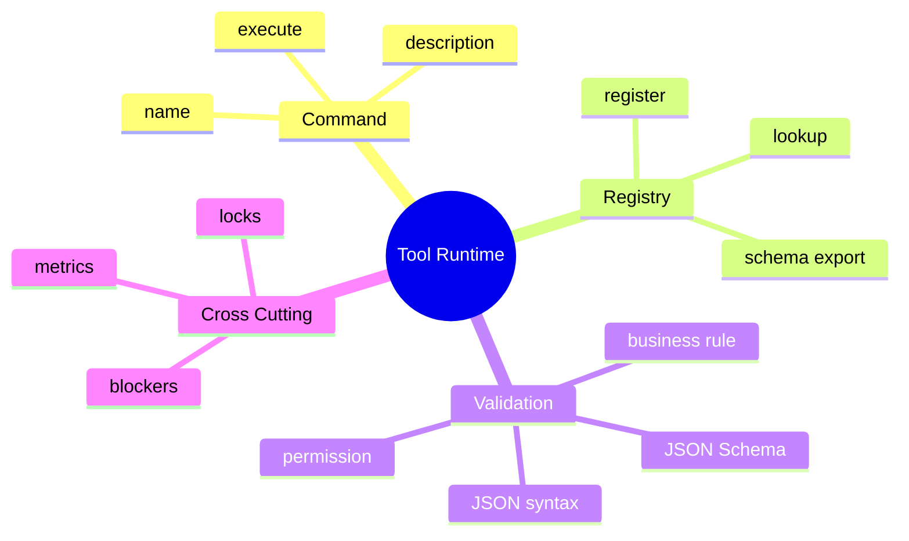

# Command、Tool Registry 与 JSON Schema

## 1. 概念

Command 把动作封装成对象；Registry 负责按名称发现 Command；JSON Schema 描述参数结构。三者组合成 Agent 工具插件体系。



## 2. 项目实现

`ToolExecutor` 提供工具元数据和 execute；`ToolRegistry` 保存 name→executor、生成 LLM Tool Schema、解析 arguments、执行 Blocker，并在工具声明需要时通过 FileLockManager 保护受影响路径。

## 3. 注册与分派原理、本质

模型只依赖工具契约，不依赖 Java 类。Registry 把静态类集合转成运行时能力目录，使权限过滤、MCP 动态工具和指标都能统一处理。

验证有五层：JSON 可解析 → Schema 类型/必填 → 业务范围 → 权限/安全 → 执行期并发状态。Schema 证明 `path` 是字符串，不证明路径安全。

## 4. Demo

```java
import java.util.*;

interface Command {
    String name();
    Map<String, Object> schema();
    String execute(Map<String, Object> args);
}

final class Registry {
    private final Map<String, Command> commands = new HashMap<>();
    void register(Command c) {
        if (commands.putIfAbsent(c.name(), c) != null)
            throw new IllegalArgumentException("duplicate tool: " + c.name());
    }
    String execute(String name, Map<String, Object> args) {
        Command c = Objects.requireNonNull(commands.get(name), "unknown tool");
        validate(c.schema(), args);
        return c.execute(args);
    }
    private void validate(Map<String,Object> schema, Map<String,Object> args) {
        if (!args.keySet().containsAll((Collection<?>) schema.getOrDefault("required", List.of())))
            throw new IllegalArgumentException("missing required field");
    }
}
```

## 5. Schema 设计

优先使用窄契约：required、enum、min/max、pattern、additionalProperties=false。描述说明意图和边界，避免“做任何操作”这类含糊工具。工具太多会增加 Prompt Token 和选择混淆，应按 AgentMode/任务动态暴露稳定子集。

## 6. 边界

Bash/Delete/AskUser 仍在 Orchestrator 特判，说明副作用和挂起语义尚未完全进入统一 Command 模型。可让 execute 返回 `Completed | NeedsConfirmation | NeedsUserInput | Failed`，由统一工作流处理。

## 7. 掌握检查

- [ ] 能区分 Command、Registry、Schema；
- [ ] 能列出五层验证；
- [ ] 能设计窄参数 Schema；
- [ ] 能解释特殊工具为何暴露抽象缺口。

## 8. Registry 的并发与版本语义

注册表名称必须唯一且大小写策略固定。运行中动态注册 MCP Tool 时，正在构造 Prompt 的线程可能看到半更新集合；应使用 immutable snapshot 或读写锁。对 session 冻结 toolset 后，Registry 当前版本与 session 版本并存，执行旧 ToolCall 时要明确仍允许旧工具还是要求刷新。

取消注册也不能立即销毁正在执行的 executor。可以让 registry entry 包含 version/status/refCount，标记 DRAINING 后拒绝新调用，等待 active=0 再 close。

## 9. Schema 的表达能力与供应商差异

JSON Schema 可表达 object/array/enum/range/pattern/oneOf，但模型供应商通常只支持子集。复杂 oneOf 可能降低生成正确率；可以把一个高度多态工具拆成多个窄工具。`additionalProperties:false` 防模型生成幻觉字段，但向后兼容时需版本化。

Schema 验证器还要限制 JSON 深度、数组长度、字符串长度和数字范围，防 CPU/内存 DoS。Jackson 解析成功不代表输入规模安全。

## 10. Command 生命周期

Command 对象最好无 session 可变状态，执行上下文通过参数传入；否则 singleton ToolExecutor 会把不同 session 串线。上下文包括 sessionId、workspace、deadline、capability、FileChangeTracker、event sink。相比 ThreadLocal，显式 context 更易测试和异步传播。

```java
record ToolContext(String sessionId, java.nio.file.Path workspace,
                   Deadline deadline, Capability capability) {}
```

## 11. 装饰器流水线

统一执行可构建：lookup → validate → authorize → observe start → lock → execute → truncate → persist → observe finish。每层用 Decorator/Middleware，特殊工具返回 effect 而非 Orchestrator if。无论哪层失败，最终都生成稳定 ToolResult并记录耗时。

## 12. 实验

1. 并发注册/导出工具，验证 snapshot 一致；
2. 构造深度 1000 的 JSON，验证 parser constraint；
3. 注册重复 name，必须启动失败；
4. singleton 工具故意保存 lastSessionId，写测试暴露串线；
5. 把 AskUser 改为返回 `NeedsInput` effect，消除一个编排特判。

## 13. 深层面试追问

**Registry与依赖注入容器区别？** DI按Java类型提供内部服务；ToolRegistry按模型可见名称提供受控业务能力，还带Schema/权限/执行语义。**工具实例应单例吗？** 无状态executor可单例；持进程/会话状态的工具应把状态放context/manager，不能存在singleton字段。

**Schema升级如何兼容旧ToolCall？** 会话冻结toolsetVersion；旧call按旧Schema校验或迁移，不能用新required字段拒绝已持久化pending。**为什么参数parse采用lenient有风险？** 宽容单引号/无引号可提升模型兼容，却扩大语法，必须在Schema/业务层严格并记录；不能启发式修改路径/命令含义。

沿 `ToolRegistry.execute` 精确画出 JSON parse、Blocker、FileLock、executor 的异常转换，确认 SchemaValidation在哪一层；检查ConcurrentToolExecutor先解析一次、Registry又解析字符串是否重复以及ObjectMapper配置是否被全局修改。

## 项目源码精读

源码入口：[ToolRegistry.java](../../../src/main/java/com/example/agent/tools/ToolRegistry.java)

```java
public ToolRegistry register(ToolExecutor executor) {
    executors.put(executor.getName(), executor);
    return this;
}

public List<Tool> toTools(AgentMode mode) {
    for (ToolExecutor executor : executors.values()) {
        if (mode != null && !mode.isToolAllowed(executor.getName())) continue;
        JsonNode schema = objectMapper.readTree(executor.getParametersSchema());
        tools.add(Tool.of(executor.getName(), executor.getDescription(), schema));
    }
}
```

这段代码同时实现了三件事：Registry 用名称完成运行时派发，`ToolExecutor` 是 Command，`toTools` 把内部命令投影成模型能看到的能力清单。其本质是把“不受信任的模型输出”翻译成“受控的本地函数调用”。Schema 只是结构契约；真正执行时仍要重新解析、做业务校验、权限检查和资源锁定，不能把模型在 Prompt 中看见的 Schema 当作安全边界。

`ConcurrentHashMap.put` 使单次注册线程安全，却没有“工具集版本”的原子快照：一边遍历 `values()`、一边动态注册 MCP 工具时，导出的集合可能对应一个弱一致视图。另一个语义缺口是同名注册会静默覆盖旧 executor；生产设计通常应拒绝重复、记录版本并让会话冻结其 toolset version。

> [!IMPORTANT]
> **疑难点：Schema 校验与权限校验不是一回事。** `toTools(mode)` 只控制模型“看见什么”；攻击者、旧会话或程序 Bug 仍可直接构造 `execute(name,args)`。因此执行入口必须再次校验 mode/capability。还要限制 JSON 深度、字符串与数组长度，否则“合法 JSON”仍可能制造解析型 DoS。

## 14. 源码级实现原理解读

`ToolRegistry` 同时维护两个视图：Runtime view 是 `name → ToolExecutor`，Model view 是 `List<Tool>{name,description,parametersSchema}`。前者决定真正可调用能力，后者只是 Prompt 中的声明。安全要求两者来自同一不可变版本，并且执行入口重新检查 mode/capability；仅在 `toTools(mode)` 隐藏工具属于 UI 级约束。

注册阶段应完成名称唯一、描述稳定、Schema 可解析、顶层 object、required/property 一致等 fail-fast 校验。若等到一次 LLM 请求才 parse schema，单个坏工具会让整次对话失败。当前 ConcurrentHashMap 提供弱一致遍历且同名 `put` 静默覆盖，因此动态 MCP 注册时最好构造新 snapshot 后原子交换。

运行时顺序应固定为：名称解析 → 冻结参数 → Schema/尺寸校验 → capability → Blocker → 资源锁 → executor → 截断/持久化。任何装饰器次序变化都可能改变安全语义，例如先执行再审计已无法阻止副作用。

## 15. 可运行完整实现：冻结版本且执行时再授权的 Registry

```java
import java.util.*;
import java.util.concurrent.atomic.AtomicReference;
import java.util.function.Function;

public class VersionedToolRegistryDemo {
    enum Mode { READ_ONLY, FULL }
    record Call(String name, Map<String,Object> args) {}
    record ToolDef(String name, boolean mutating, Function<Map<String,Object>,String> action) {}
    record Snapshot(long version, Map<String,ToolDef> tools) {}
    static final class Registry {
        private final AtomicReference<Snapshot> current =
                new AtomicReference<>(new Snapshot(0, Map.of()));
        synchronized void replace(Collection<ToolDef> definitions) {
            Map<String,ToolDef> next = new TreeMap<>();
            for (ToolDef d : definitions)
                if (next.putIfAbsent(d.name(), d) != null)
                    throw new IllegalArgumentException("duplicate tool: " + d.name());
            current.set(new Snapshot(current.get().version() + 1, Map.copyOf(next)));
        }
        Snapshot snapshot() { return current.get(); }
        String execute(Snapshot frozen, Mode mode, Call call) {
            ToolDef tool = frozen.tools().get(call.name());
            if (tool == null) throw new IllegalArgumentException("unknown tool");
            if (mode == Mode.READ_ONLY && tool.mutating()) throw new SecurityException("mode denied");
            if (call.args().size() > 32) throw new IllegalArgumentException("too many fields");
            return tool.action().apply(Map.copyOf(call.args()));
        }
    }
    public static void main(String[] args) {
        Registry r = new Registry();
        r.replace(List.of(new ToolDef("read", false, a -> "ok")));
        Snapshot sessionTools = r.snapshot();
        if (!r.execute(sessionTools, Mode.READ_ONLY, new Call("read", Map.of())).equals("ok"))
            throw new AssertionError();
    }
}
```

会话保存 `Snapshot` 后，后续 registry 更新不会改变本会话工具语义。生产实现还要给 snapshot 持久化 version/hash、限制嵌套 JSON 深度和字符串长度，并在反序列化后根据具体 Tool 做业务类型转换；`Map<String,Object>` 只适合展示分派机制。

## 延伸学习：博客与电子书

- [OpenAI Function calling 指南](https://platform.openai.com/docs/guides/function-calling)：重点学习工具定义、参数 Schema、调用 ID 和严格模式。
- [JSON Schema 官方学习站](https://json-schema.org/learn)：重点掌握 `required`、`enum`、组合约束及 `additionalProperties`。
- [Refactoring.Guru：Command](https://refactoring.guru/design-patterns/command)：把 ToolExecutor 与命令模式的意图、接收者和调用者逐一对应。

## 思维导图节点学习博客

本专题思维导图中的 13 个末级知识点均已展开为独立博客：[进入节点博客目录](../mindmap-blogs/04-tools-security/01-command-registry-schema/README.md)。
