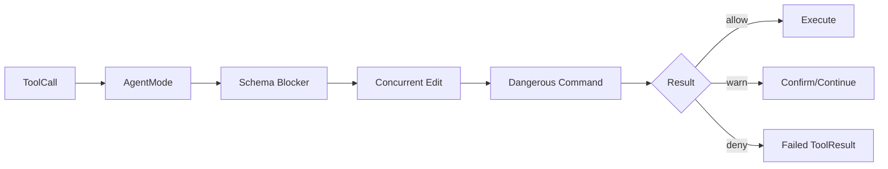
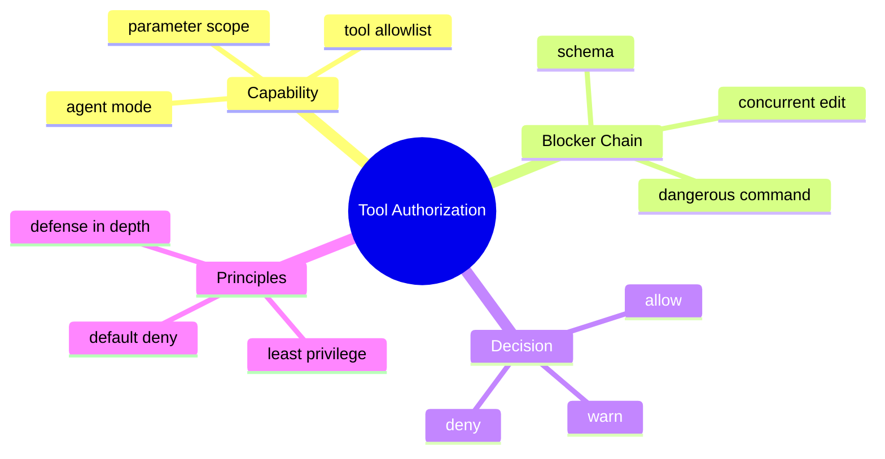

# Blocker 责任链与能力权限

## 1. 概念

责任链把多个检查器按顺序组合；Capability 表示调用方被授予的具体能力。最小权限原则要求只暴露完成当前任务所需能力。





## 2. 项目实现

AgentMode.CHAT 仅允许读/搜索/询问；CODING/OFFICE 开放写、Bash、Delete 和 SubAgent。ToolRegistry 内的 BlockerChain 组合 SchemaValidation、ConcurrentEdit、BashDangerous 等，HookResult 表达 allow/warn/deny。Chain 还记录耗时和拦截统计。

## 3. 原理

责任链适合独立、可短路的前置规则。先执行便宜且确定的结构校验，再执行磁盘/命令分析。deny 立即返回；warning 是否继续取决于产品策略。

Capability 比角色更底层：角色只是 capability 集合。仅按 tool name 授权仍粗粒度，例如 Bash 能力内部应继续限制 command、path、network 和 duration。

## 4. Demo

```java
enum Decision { ALLOW, WARN, DENY }
record Check(Decision decision, String reason) {}
interface Blocker { Check check(String tool, Map<String,Object> args); }

static Check run(List<Blocker> chain, String tool, Map<String,Object> args) {
    Check warning = null;
    for (Blocker blocker : chain) {
        Check result = Objects.requireNonNull(blocker.check(tool, args));
        if (result.decision() == Decision.DENY) return result;
        if (result.decision() == Decision.WARN) warning = result;
    }
    return warning != null ? warning : new Check(Decision.ALLOW, "ok");
}
```

## 5. 安全原则

- 默认拒绝未知工具；
- 模式过滤既影响发给模型的 Schema，也在执行时再次检查；
- 不信任模型“我已经获得允许”的文本；
- 检查参数摘要时脱敏；
- Blocker 超时/异常应 fail closed 还是 fail open 必须按风险选择，高危操作通常 fail closed。

## 6. 面试题

**为什么前面已过滤工具，执行时还要检查？** 防止伪造请求、旧 ToolCall 重放、模式变化或程序缺陷。安全边界不能只依赖 Prompt 可见性。

**责任链能处理审批状态吗？** 它适合判断；审批的暂停/恢复是状态机，应由工作流管理。

## 7. 掌握检查

- [ ] 能解释 role 与 capability；
- [ ] 能给责任链排序；
- [ ] 能说明 fail-open/fail-closed；
- [ ] 能设计 Bash 的参数级权限。

## 8. Policy Decision 与 Enforcement

安全架构区分 PDP（Policy Decision Point）和 PEP（Policy Enforcement Point）。AgentMode/Blocker 计算允许与否，ToolRegistry/Orchestrator 在实际副作用前强制执行。只有 Prompt 中告诉模型“不要写文件”既不是 PDP 也不是 PEP。

决策输入应包括主体（session/user/agent）、动作、资源、环境（mode/deadline）和参数，而非只有 toolName。输出除 allow/deny 还可包含 obligations，例如“需要确认”“结果必须脱敏”“只能访问该 path”。

## 9. 规则组合语义

多个 warning 当前只保留最后一个可能丢信息；可以累计 reasons。deny-overrides 通常最安全：任意 deny 即拒绝；permit-overrides 适合白名单体系但容易被宽规则覆盖。规则顺序既影响性能，也可能影响返回原因，不应让安全结果依赖偶然注册顺序。

## 10. Fail Closed 的细节

安全 Blocker 抛异常时高危 Tool 应 deny；纯可用性检查可能 warning。若 ConcurrentEdit 检查因文件不可读失败，写入应拒绝；Metrics Blocker 失败不应阻止。为每个规则声明 criticality，而不是全局 catch 后 allow。

## 11. Bash 参数级能力

更细模型可限制 executable allowlist、cwd、env、network、maxDuration、maxOutput、read/write roots。解析 shell 字符串非常复杂，`mvn test && curl ...` 包含多个命令；优先使用 argv 数组和禁用 shell，确需 shell 时放容器并人工确认。

## 12. Policy 测试矩阵

主体×mode×tool×path×risk 构成矩阵。至少测试：CHAT 写文件、未知工具、relaxed 模式、symlink、危险 Bash、Blocker 异常、执行入口绕过 Prompt、旧 ToolCall 在 mode 改变后重放。安全测试应直接调用 PEP，不能只测 UI 不显示按钮。

## 13. 面试深问

“为什么双重检查不是重复？”回答 Prompt 可见性降低误选，执行 PEP 提供真正安全；TOCTOU 使执行前还需最终检查。“RBAC够吗？”工具参数和资源是 ABAC/capability 范畴，角色只做粗分组。

## 14. 实战实验与源码定位

为每个 AgentMode导出Tools并断言CHAT不含写/Bash；然后绕过Prompt直接调用ToolRegistry，仍必须deny。让一个critical Blocker抛RuntimeException，验证高危工具fail closed。构造两个warning，观察当前Chain是否只保留最后reason，并设计聚合返回。

检查 Bash在Orchestrator预检后，ToolRegistry内是否再次走DangerousBlocker；双重检查的参数和配置必须一致，否则可能预览allow、执行deny或反过来。检查 `require_confirmation=false` 会跳过哪一层，硬deny是否仍不可绕过。

安全规则增加性能预算：Schema<1ms、路径/版本检查有限I/O、命令分析有timeout。BlockerChain已有慢操作统计，可通过故意sleep验证告警和周期统计，同时确认日志arguments截断/脱敏。

## 项目源码精读

源码入口：[BlockerChain.java](../../../src/main/java/com/example/agent/core/blocker/BlockerChain.java)、[ToolRegistry.java](../../../src/main/java/com/example/agent/tools/ToolRegistry.java)

```java
HookResult lastWarning = null;
for (Blocker blocker : blockers) {
    HookResult result = Objects.requireNonNull(blocker.check(toolName, arguments));
    if (result.isWarning()) {
        lastWarning = result;
        continue;
    }
    if (!result.isAllowed()) return result;
}
return lastWarning != null ? lastWarning : HookResult.allow();
```

这是典型责任链：每个 Blocker 是一个策略判定点，deny 具有短路优先级，warning 不阻塞，全部通过才 allow。它解决的是“决策组合”，而 `ToolRegistry.execute` 在副作用发生前调用这条链，才构成执行点。安全本质可以写成 `Decision = f(subject, action, resource, environment)`；当前签名只有 `toolName + arguments`，主体、会话 mode 和授权期限若不在 arguments/context 中，就无法做完整的 ABAC 判定。

源码使用普通 `ArrayList` 存规则，适合启动期组装、运行期只读；若热更新规则，会同时遇到并发安全和策略版本不一致。它只保存 `lastWarning`，前面的 warning 会丢失。更重要的是 `blocker.check` 抛异常会直接中断链：高危规则的异常应明确 fail closed，而观测型规则可降级，不能由一个全局 catch 笼统决定。

> [!IMPORTANT]
> **疑难点：Policy Decision Point 与 Policy Enforcement Point 必须成对出现。** Prompt 过滤、UI 隐藏和 `AgentMode.isToolAllowed` 都只能减少误调用；只有紧贴文件写入、命令启动之前的强制检查才是安全边界。还要避免在 Blocker 日志中记录未经脱敏的 arguments，否则权限系统反而成为密钥泄漏通道。

## 15. 源码级实现原理解读

Blocker 是 Policy Enforcement Point 前的一组 Policy Decision。决定不应只用 boolean，因为至少存在 `ALLOW、DENY、REQUIRE_CONFIRMATION、WARN`，还要携带 ruleId、原因和审计字段。组合时 DENY 优先级最高；确认应聚合全部原因；warning 不应被后一个 allow 覆盖。

项目 `BlockerChain` 逐个调用 blocker。若保存一个可变 result 并持续覆盖，多个 warning/confirmation 的信息会丢失。更稳健的组合是把所有 decision 收集成不可变列表，再由确定性的 reducer 计算最终 effect。规则抛异常时安全敏感操作应 fail closed，同时把“策略引擎故障”与“策略拒绝”分开记录。

Capability 是不可伪造的授权上下文，不只是工具名。它应绑定 subject/session、允许的 action、资源范围、过期时间和约束。模型文本、Tool 参数或客户端传来的 mode 都不能自己提升 capability。

## 16. 可运行完整实现：可解释的策略归并器

```java
import java.nio.file.Path;
import java.time.Instant;
import java.util.*;

public class PolicyEngineDemo {
    enum Effect { ALLOW, WARN, CONFIRM, DENY }
    record Capability(String subject, Set<String> actions, Path root, Instant expiresAt) {}
    record Request(String action, Path target) {}
    record Decision(Effect effect, String ruleId, String reason) {}
    interface Rule { Decision evaluate(Capability c, Request r); }

    static Decision evaluate(List<Rule> rules, Capability cap, Request req) {
        List<Decision> all = new ArrayList<>();
        for (Rule rule : rules) {
            try { all.add(rule.evaluate(cap, req)); }
            catch (RuntimeException e) { all.add(new Decision(Effect.DENY, "policy-error", e.getClass().getSimpleName())); }
        }
        Effect finalEffect = all.stream().map(Decision::effect).max(Comparator.comparingInt(Enum::ordinal))
                .orElse(Effect.DENY);
        String reasons = all.stream().filter(d -> d.effect() == finalEffect)
                .map(d -> d.ruleId() + ":" + d.reason()).reduce((a,b) -> a + "; " + b).orElse("no rule");
        return new Decision(finalEffect, "combined", reasons);
    }
    public static void main(String[] args) {
        Rule capability = (c,r) -> c.expiresAt().isBefore(Instant.now()) || !c.actions().contains(r.action())
                ? new Decision(Effect.DENY, "capability", "not authorized")
                : new Decision(Effect.ALLOW, "capability", "authorized");
        Rule destructive = (c,r) -> r.action().equals("delete")
                ? new Decision(Effect.CONFIRM, "destructive", "deletion requires approval")
                : new Decision(Effect.ALLOW, "destructive", "safe action");
        Capability c = new Capability("user", Set.of("delete"), Path.of("."), Instant.now().plusSeconds(60));
        if (evaluate(List.of(capability, destructive), c, new Request("delete", Path.of("x"))).effect()
                != Effect.CONFIRM) throw new AssertionError();
    }
}
```

Enum ordinal 在本 Demo 中显式按风险从低到高排列；生产代码更适合写清晰的优先级映射，避免重排枚举改变安全语义。路径规则必须使用安全解析后的 canonical target，不能直接对原始字符串 startsWith。

## 延伸学习：博客与电子书

- [OWASP AI Agent Security Cheat Sheet](https://cheatsheetseries.owasp.org/cheatsheets/AI_Agent_Security_Cheat_Sheet.html)：学习最小权限、工具验证、人工审批与审计。
- [OWASP Authorization Cheat Sheet](https://cheatsheetseries.owasp.org/cheatsheets/Authorization_Cheat_Sheet.html)：重点理解 deny-by-default、每请求校验和 ABAC。
- [Enterprise Integration Patterns：Message Filter](https://www.enterpriseintegrationpatterns.com/patterns/messaging/Filter.html)：对照责任链中的过滤、拒绝与路由语义。

## 思维导图节点学习博客

本专题思维导图中的 12 个末级知识点均已展开为独立博客：[进入节点博客目录](../mindmap-blogs/04-tools-security/02-blocker-capability/README.md)。
