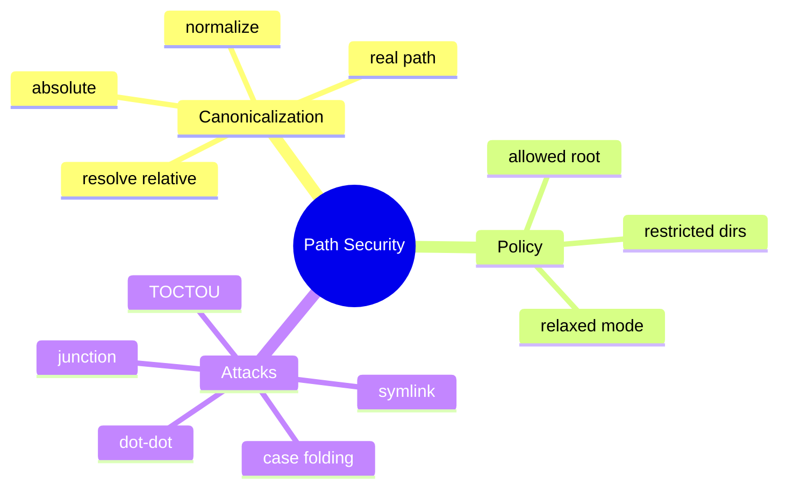

# 路径规范化、Sandbox 与符号链接

## 1. 概念与威胁模型

路径 Sandbox 是把进程可见的巨大文件系统收缩为受允许根目录控制的能力空间。模型/用户可提供 `../../secret`、绝对路径、大小写变体、符号链接或 Windows junction，目标是逃出 workspace。



## 2. 项目实现

`PathSecurityUtils` 以 WorkspaceContext 或 user.dir 为 root；相对路径 resolve 到 root，absolute + normalize 后用 `startsWith(root)` 判断；严格模式再拒绝系统敏感目录，relaxed 模式允许全路径。

## 3. 原理

字符串前缀不安全：`/work/project2` 也以 `/work/project` 字符串开头；Path.startsWith 按路径组件比较更正确。normalize 去掉 `.`/`..`，但不访问文件系统，所以不会解析 symlink。

若 `/work/link -> /etc`，`/work/link/passwd` normalize 后仍在 `/work`，真实访问却越界。对已存在路径应 `toRealPath()`；创建新文件时检查最近存在祖先的 real path，并尽量以目录句柄/openat 风格避免检查与使用分离。

## 4. Demo

```java
import java.nio.file.*;

static Path safeResolve(Path root, String input) throws Exception {
    Path realRoot = root.toRealPath();
    Path candidate = realRoot.resolve(input).normalize();
    Path parent = candidate.getParent();
    if (parent == null) throw new SecurityException("no parent");
    Path realParent = parent.toRealPath(); // Demo 仅适合 parent 已存在
    if (!realParent.startsWith(realRoot)) throw new SecurityException("escape");
    return realParent.resolve(candidate.getFileName());
}
```

## 5. TOCTOU

检查完成后，攻击者可能把目录替换成 symlink，再执行写入。纯 Java 路径检查难彻底消除。强安全应把 Agent 放入容器/低权限账号，让 OS 从根本上看不到敏感目录；应用检查作为第二层。

## 6. Windows 注意

盘符、UNC、junction、大小写不敏感和保留设备名都会增加复杂度。锁 key 和安全 key 应使用一致的 canonical 规则，不能一边大小写折叠、一边不折叠。

## 7. 掌握检查

- [ ] 能演示 `../` 规范化；
- [ ] 能解释 normalize 与 toRealPath；
- [ ] 能描述 symlink/TOCTOU；
- [ ] 能说明 OS sandbox 为什么更强。

## 8. Canonicalization 顺序

1. 拒绝 null/NUL/无效编码；
2. 选择明确 base root；
3. resolve relative；
4. absolute + normalize；
5. 对存在祖先 realPath；
6. 按 OS 规则比较 root；
7. 执行前重新检查；
8. 打开文件后若可行验证 file identity。

顺序错误会出漏洞。例如先检查字符串 startsWith 再 normalize，`root/../secret` 可越界；先 realPath 整个新文件会因不存在失败。

## 9. Windows 特殊攻击面

UNC `\\server\share` 可触发网络访问；junction/reparse point 类似 symlink；`CON`/`NUL` 等设备名不是普通文件；尾随空格/点和大小写规范化复杂；ADS `file.txt:stream` 可隐藏数据。宽松模式允许全路径时仍应考虑设备/UNC 策略。

## 10. TOCTOU 深入

安全检查与 `Files.write` 是两个系统调用，中间目录可被替换。Java SecureDirectoryStream 在支持的平台可相对已打开目录句柄操作，降低竞态，但跨平台有限。强方案是在不可由攻击者修改的 workspace/container 中运行，或把文件服务隔离为受控进程。

## 11. 读写权限分离的方案取舍

只读 Agent 也可能读取 `.env`/SSH Key 并通过 LLM 外传。allowed root 只是第一步；还需 sensitive glob denylist、文件大小/类型、secret scanner 和模型上传政策。写权限应进一步限制可执行脚本、Git hooks、IDE config 等间接执行点。

## 12. 实验

1. 测试 `a/../../x`、绝对路径、相似前缀 root2；
2. 在 workspace 建 symlink/junction 指向外部；
3. 检查大小写路径的锁/权限一致性；
4. 两线程在检查后替换目录复现 TOCTOU；
5. Windows 测试 UNC/ADS/保留名；
6. 设计 OS sandbox 后验证即使应用检查被绕过也看不到外部文件。

## 13. 深层面试追问与项目缺口

**Path.startsWith为什么比String.startsWith安全？** 它比较路径组件，`/root2`不是`/root`子路径；但仍不解析link。**黑名单还是白名单？** workspace root allowlist为主，系统目录denylist为辅；黑名单无法枚举全部敏感位置。**relaxed mode是否应完全跳过检查？** 产品可允许全路径，但设备/UNC/极危险目标仍可保留硬限制并显著告警。

项目 `PROJECT_ROOT` 在类加载时固定user.dir，WorkspaceContext运行期变化；应验证effective root和旧缓存/锁不会混用。`getRelativePath`只用于显示，绝不能把显示路径再当安全身份。

更深测试用 Jimfs无法完全模拟Windows junction/真实link语义，应在对应OS集成测试。对delete递归，验证每个遍历到的real path仍在root，防目录内部link逃逸。

## 14. 安全解析算法与 TOCTOU

一个稳健流程是：锁定 session 对应的 workspace root；将用户输入按 API 规则解析，拒绝 NUL、非法 scheme 和不允许的绝对/UNC/设备路径；对已存在目标计算 `toRealPath()`，对待创建目标解析最近存在祖先的 real path；用 `Path.startsWith(realRoot)` 做组件级包含判断；再检查 AgentMode、操作类型与敏感路径策略。Windows 还要统一盘符/大小写语义并显式处理 junction。

检查通过到真正 open/delete 之间仍有 TOCTOU：攻击者可把父目录替换为 link。更强实现使用相对已打开目录句柄的安全文件 API、`NOFOLLOW_LINKS`、创建时原子选项，或在持有 workspace/file lock 时操作并在提交前重新验证。Java 跨平台 API 无法消除所有底层竞态时，应通过 OS sandbox 限制进程本身可见目录，把应用检查当第一层而不是唯一层。

安全不变量不是“输入路径字符串看起来在 root 下”，而是“本次实际访问的文件系统对象属于授权根，且从检查到使用没有被替换”。这也是为什么 normalize、canonicalize、authorize 和 use 必须作为一条协议审计。

## 项目源码精读

源码入口：[PathSecurityUtils.java](../../../src/main/java/com/example/agent/tools/PathSecurityUtils.java)

```java
Path path = Paths.get(filePath);
if (!path.isAbsolute()) path = getEffectiveRoot().resolve(path);
path = path.normalize();
if (!isWithinAllowedPath(path)) throw new ToolExecutionException(...);
if (isRelaxedMode()) return path;

Path normalizedPath = path.toAbsolutePath().normalize();
if (normalizedPath.startsWith(PROJECT_ROOT)) return true;
```

`normalize()` 只做词法消解，例如去掉 `a/../`；`Path.startsWith` 按路径组件比较，比字符串前缀安全，但二者都不会解析 symlink/junction。也就是说，`workspace/link/secret` 字面位于 workspace 内，link 的真实目标却可能在外部。对已存在目标要比较 `toRealPath()` 与真实根；对待创建文件要解析最近存在祖先，再用受控根下的相对句柄创建。

源码同时接受静态 `PROJECT_ROOT` 和运行期 `WorkspaceContext` 根，这意味着切换 workspace 后旧启动目录仍是允许范围。宽松模式在 `isWithinAllowedPath` 开头直接返回 true，之后又跳过敏感目录黑名单，所以它不是“扩大到指定根”，而是基本撤除应用层路径边界。

> [!IMPORTANT]
> **疑难点：检查通过不等于使用时安全。** `validateAndResolve` 返回 Path 后，到 `Files.write/delete` 之间，父目录可能被替换成链接，这就是 TOCTOU。文件锁只能约束遵守同一锁协议的本进程线程，无法阻止外部进程；最终防线应是 OS sandbox/容器权限，并在操作时使用 `NOFOLLOW_LINKS`、真实路径校验或安全目录句柄。

## 15. 源码级实现原理解读

安全路径解析不是一次 `normalize().startsWith(root)`。normalize 只消除词法上的 `.`/`..`，无法识别 root 内的符号链接指向 root 外；`toRealPath()` 能解析已存在对象，却不能直接处理准备创建的新文件。正确算法必须分别处理 existing target 和 non-existing target。

读取已有文件：root 与 target 都 `toRealPath()`，再判断 targetReal.startsWith(rootReal)。创建新文件：先找到最近的已存在父目录并 realpath，验证它在 rootReal 内；随后逐段创建时禁止跟随意外 symlink，并在真正 open/write 前重新检查。`Files.isSymbolicLink` 后再 open 仍有 TOCTOU，强隔离要依赖 OS sandbox、directory handle/openat 或容器，而不是只靠 Java 字符串检查。

项目 `PathSecurityUtils` 主要做 absolute/normalize/startsWith，并有 relaxed mode。它能拦截直观 `../`，但不能被描述为完整 sandbox；Windows 还要考虑大小写、junction、UNC、reserved device name 和不同盘符。

## 16. 可运行实现：区分读取与创建的安全解析

```java
import java.io.IOException;
import java.nio.file.*;

public final class SafePaths {
    private final Path rootReal;
    public SafePaths(Path root) throws IOException { rootReal = root.toRealPath(); }

    Path existing(String userPath) throws IOException {
        Path lexical = rootReal.resolve(userPath).normalize();
        if (!lexical.startsWith(rootReal)) throw new SecurityException("lexical escape");
        Path real = lexical.toRealPath();
        if (!real.startsWith(rootReal)) throw new SecurityException("symlink escape");
        return real;
    }
    Path forCreate(String userPath) throws IOException {
        Path target = rootReal.resolve(userPath).normalize();
        if (!target.startsWith(rootReal)) throw new SecurityException("lexical escape");
        Path ancestor = target.getParent();
        while (ancestor != null && !Files.exists(ancestor, LinkOption.NOFOLLOW_LINKS))
            ancestor = ancestor.getParent();
        if (ancestor == null) throw new SecurityException("no existing ancestor");
        Path ancestorReal = ancestor.toRealPath();
        if (!ancestorReal.startsWith(rootReal)) throw new SecurityException("parent symlink escape");
        return target;
    }
    public static void main(String[] args) throws Exception {
        Path temp = Files.createTempDirectory("safe-root-");
        SafePaths safe = new SafePaths(temp);
        if (!safe.forCreate("a/b.txt").startsWith(temp.toRealPath())) throw new AssertionError();
        try { safe.forCreate("../secret"); throw new AssertionError(); }
        catch (SecurityException expected) {}
    }
}
```

本实现适合解释校验层次，但 `forCreate()` 返回 Path 到实际写入之间仍有竞争窗口。生产代码应把校验、目录创建、文件打开和写入尽量放入同一受控操作，并用应用级锁/版本校验；若攻击者能并发替换目录项，必须增加 OS 级隔离。

## 延伸学习：博客与电子书

- [OWASP Path Traversal](https://owasp.org/www-community/attacks/Path_Traversal)：系统学习编码绕过、规范化和根目录约束。
- [Oracle Java Secure Coding Guidelines](https://www.oracle.com/java/technologies/javase/seccodeguide.html)：重点看输入验证、权限最小化与文件系统安全原则。
- [Java Path API](https://docs.oracle.com/en/java/javase/21/docs/api/java.base/java/nio/file/Path.html)：精读 `normalize`、`toRealPath`、`startsWith` 的精确定义。

## 思维导图节点学习博客

本专题思维导图中的 12 个末级知识点均已展开为独立博客：[进入节点博客目录](../mindmap-blogs/04-tools-security/03-path-sandbox/README.md)。
