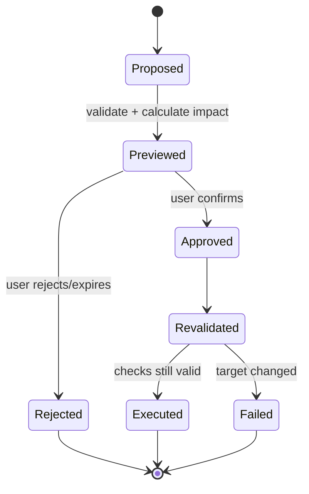
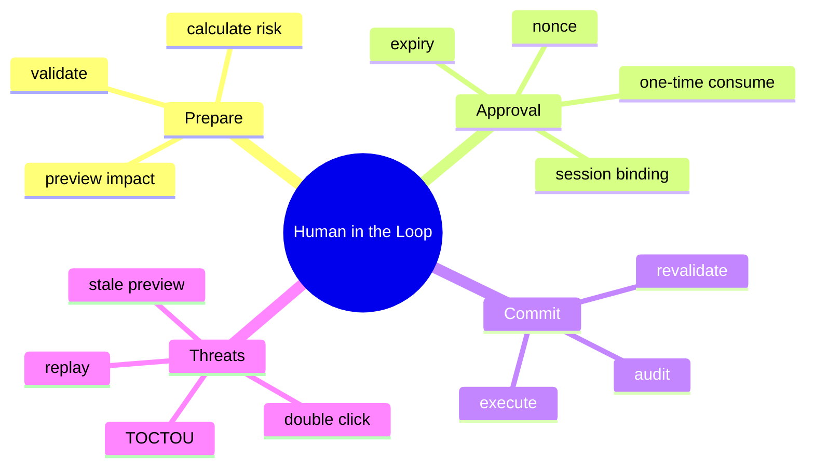

# Human-in-the-loop 与两阶段执行

## 1. 概念与本质

Human-in-the-loop 是在自动决策链中插入可信人的授权点。本质是把“模型建议”与“真实权限”分离：高风险动作先准备预览，再由人授权提交。它类似两阶段工作流：Prepare 不产生不可逆副作用，Commit 重新校验后执行。





## 2. 项目实现

Bash/Delete 发现风险后保存 PendingBashConfirmation/PendingDeleteConfirmation，通过 SSE 发 `tool_confirmation`，暂停 Agent Loop并暂存剩余 ToolCalls。确认接口执行动作，再恢复剩余调用和下一轮。AskUser 使用 PendingToolCall 表达等待输入。

## 3. 必须持久化/绑定的状态

confirmationId、sessionId、toolCallId、原始参数、预览摘要、创建时间、过期时间、状态、一次性 nonce。确认必须原子地从 PENDING 变为 CONSUMED，防止双击/重放。

## 4. Demo

```java
import java.time.Instant;
import java.util.concurrent.ConcurrentHashMap;

record Pending(String id, String sessionId, String command, Instant expiresAt) {}

final class ApprovalStore {
    private final ConcurrentHashMap<String, Pending> pending = new ConcurrentHashMap<>();
    void put(Pending p) { pending.put(p.id(), p); }
    Pending consume(String id, String sessionId) {
        Pending p = pending.remove(id); // 原子一次性消费
        if (p == null || !p.sessionId().equals(sessionId)) throw new SecurityException();
        if (Instant.now().isAfter(p.expiresAt())) throw new IllegalStateException("expired");
        return p;
    }
}
```

## 5. TOCTOU 与重新校验

预览 delete 时看到 3 个文件，确认前目录可能变成 300 个文件；Bash 目标脚本也可能被替换。Commit 前必须重新解析参数、路径和版本，若影响变化就要求重新确认。

## 6. UX 与安全

展示具体目标、风险等级、预计影响、不可恢复性；默认拒绝；不要用“同意所有后续命令”的模糊授权；低风险动作可配置跳过，但配置改变安全模型，必须显眼。

## 7. 掌握检查

- [ ] 能画出审批状态机；
- [ ] 能解释一次性 consume；
- [ ] 能给出 TOCTOU 示例；
- [ ] 能设计安全的确认 payload。

## 8. 审批是授权而非免责声明

让用户点击“确认”不意味着系统可以展示模糊信息。授权必须具体到 action/resource/impact，且用户有能力理解。`bash: npm install` 与完整展开的脚本、cwd、网络/文件影响不同。审批界面不得把风险隐藏在折叠默认项。

## 9. 状态持久化与恢复

若 pending 只在内存，进程重启后 Conversation 里有 tool call 却无 pending 状态。应把 confirmation proposed/approved/rejected/expired 作为事件落盘。恢复时 PENDING 重新展示或安全标记失败；不能自动视为批准。

多个桌面窗口同时确认需要 compare-and-set。`remove` 是一次性消费，但执行失败后是否可重试要另建 execution status，不能把 approval token 放回 Map，否则可能重复副作用。

## 10. 两阶段并非数据库 2PC

这里 Prepare/Commit 是产品工作流，没有参与者 prepare lock 和协调者日志，不具备分布式原子性。调用它“两阶段执行”比“两阶段提交协议”准确。Commit 中仍可能部分失败，需要 Snapshot/Compensation。

## 11. 风险分级

低风险只读可自动；中风险新建文件/安装依赖可摘要确认或配置；高风险删除、凭据、网络发布必须逐次确认；极高风险系统目录/持久化机制即使确认也应 deny。用户确认不能突破系统硬边界。

## 12. 审批疲劳

频繁弹窗会让用户机械同意。合并同一计划内、目标明确的操作；展示 diff/数量；避免每条安全读都确认。也不能提供永久“全部允许”而没有 scope/期限。可授权“本 session 对 workspace/src 的 write_file”，但 Bash/Delete 保留逐次。

## 13. 实验

测试双击确认、过期、跨 session id、参数被篡改、预览后文件变化、重启恢复、执行失败后重复确认。审计日志应能回答谁、何时、看到了什么、批准了什么、实际执行结果。

## 14. 深层面试追问

**审批能否授权一组工具？** 可以，但scope必须具体：session、tool types、path、expiry、最大影响；执行每项仍重校验。**用户拒绝后模型怎么办？** 写结构化DENIED ToolResult，让模型提供替代方案，不能反复请求同一危险动作。**审批服务故障？** 高危操作fail closed，pending保持可恢复，不默认批准。

**如何避免前端伪造预览？** 服务端保存canonical参数/影响摘要和hash，前端只展示；确认只提交confirmationId/nonce，不能回传一份可被篡改的新command。Commit从服务端pending取原参数。

项目还应统一Bash/Delete/AskUser的pending workflow；当前多个Pending类型和remainingToolCalls Map容易产生清理差异。抽象AwaitingAction记录type/payload/state/version可减少分支，但不同风险预览仍由专门策略生成。

## 项目源码精读

源码入口：[ToolConfirmHandler.java](../../../src/main/java/com/example/agent/web/handler/ToolConfirmHandler.java)

```java
PendingBashConfirmation pending = sessionManager.pollPendingBashConfirmation(sessionId);
if (pending.isExpired(CONFIRM_TIMEOUT_MS)) { /* 写入超时结果 */ }
if (!pending.confirmId.equals(confirmId)) { /* 拒绝 */ }

if ("allow".equals(decision)) {
    ToolExecutor executor = toolRegistry.getExecutor(pending.toolName);
    JsonNode arguments = objectMapper.readTree(pending.arguments);
    String result = executor.execute(arguments);
}
```

这是一种“暂停—恢复”状态机：提案阶段把 canonical arguments 存进 session pending；确认请求只提交 sessionId、confirmId 和 decision；服务端找到原提案、校验超时和 nonce 后再执行。安全本质不是多一个弹窗，而是发放一个范围窄、一次性、短时有效的授权能力。

当前 handler 先 `poll` 取走 pending，天然接近一次性消费，可降低双击重放；但它按“先 bash，找不到再 delete”定位，而不是直接按 confirmId 索引，多个 pending 类型会让状态组合迅速复杂化。`confirmId` 不匹配后 pending 已被 poll，合法确认也可能无法再执行；这是 fail-closed，但 UX 与恢复语义必须明确。执行时直接调用 executor，还应确认路径、mode、Blocker 和版本校验没有被确认分支绕过。

> [!IMPORTANT]
> **疑难点：批准的是快照，不是一个工具名字。** 确认页面展示后，文件、cwd、命令解析结果或权限模式都可能改变。pending 应绑定参数 hash、workspace identity、风险摘要、过期时间和 toolset/policy version；执行前重新验证硬边界。用户批准永远不能覆盖系统级 deny。

## 15. 源码级实现原理解读

Human-in-the-loop 是授权状态机：Runtime 先把拟执行动作规范化并冻结，计算摘要、风险和版本，生成一次性 confirmationId；用户批准的对象是这个确定动作，而不是一句“允许删除”；执行阶段原子消费 confirmation，并重新校验 workspace/session/文件版本/过期时间。

HippoBuddy 用 PendingToolCall/PendingBashConfirmation/PendingDeleteConfirmation 保存待确认动作，`ToolConfirmHandler` 接收批准后继续。核心风险是待确认参数与最终执行参数不是同一快照，或同一个确认请求能被重复调用。approval token 必须绑定 session、tool、canonical arguments hash、资源版本和 expiry，并做 compare-and-remove。

确认前后的业务状态也要持久化：assistant tool call 已写入但 tool result 尚未产生。拒绝不是删除这段历史，而是追加一个与 callId 闭合的 rejected ToolResult，让下一轮模型知道动作没有执行。

## 16. 可运行完整实现：一次性、绑定参数的确认票据

```java
import java.nio.charset.StandardCharsets;
import java.security.MessageDigest;
import java.time.*;
import java.util.*;
import java.util.concurrent.ConcurrentHashMap;

public class ConfirmationDemo {
    record Ticket(String id, String session, String tool, String argsHash,
                  long resourceVersion, Instant expiresAt) {}
    static final class Confirmations {
        private final ConcurrentHashMap<String,Ticket> pending = new ConcurrentHashMap<>();
        Ticket issue(String session, String tool, String canonicalArgs, long version) throws Exception {
            Ticket t = new Ticket(UUID.randomUUID().toString(), session, tool, hash(canonicalArgs),
                    version, Instant.now().plusSeconds(60));
            pending.put(t.id(), t); return t;
        }
        void consume(String id, String session, String tool, String canonicalArgs, long currentVersion)
                throws Exception {
            Ticket t = pending.remove(id);              // 原子地只允许消费一次
            if (t == null) throw new SecurityException("unknown or already used ticket");
            boolean valid = t.session().equals(session) && t.tool().equals(tool)
                    && t.argsHash().equals(hash(canonicalArgs))
                    && t.resourceVersion() == currentVersion && Instant.now().isBefore(t.expiresAt());
            if (!valid) throw new SecurityException("ticket binding mismatch");
        }
        private static String hash(String s) throws Exception {
            return HexFormat.of().formatHex(MessageDigest.getInstance("SHA-256")
                    .digest(s.getBytes(StandardCharsets.UTF_8)));
        }
    }
    public static void main(String[] args) throws Exception {
        Confirmations confirmations = new Confirmations();
        Ticket ticket = confirmations.issue("s1", "delete", "{path:a.txt}", 7L);
        confirmations.consume(ticket.id(), "s1", "delete", "{path:a.txt}", 7L);
        try {
            confirmations.consume(ticket.id(), "s1", "delete", "{path:a.txt}", 7L);
            throw new AssertionError("ticket must be one-shot");
        } catch (SecurityException expected) {}
    }
}
```

先 remove 再校验意味着恶意错误尝试会烧掉 ticket，这是安全优先的选择；如果需要允许用户纠正输错，应在 Map.compute 中原子校验并仅成功时删除，但仍必须防并发双消费。canonicalArgs 必须由服务端规范化，不能信任客户端回传字符串。

## 延伸学习：博客与电子书

- [OWASP AI Agent Security Cheat Sheet](https://cheatsheetseries.owasp.org/cheatsheets/AI_Agent_Security_Cheat_Sheet.html)：重点看 Human-in-the-loop、工具权限与高风险动作控制。
- [NIST AI Risk Management Framework](https://www.nist.gov/itl/ai-risk-REDACTED-EXAMPLE)：学习治理、测量、管理风险的完整框架。
- [Martin Fowler：Saga](https://martinfowler.com/articles/patterns-of-distributed-systems/saga.html)：理解长流程的暂停、失败与补偿；注意这里不是数据库 2PC。

## 思维导图节点学习博客

本专题思维导图中的 14 个末级知识点均已展开为独立博客：[进入节点博客目录](../mindmap-blogs/04-tools-security/04-human-in-the-loop/README.md)。
