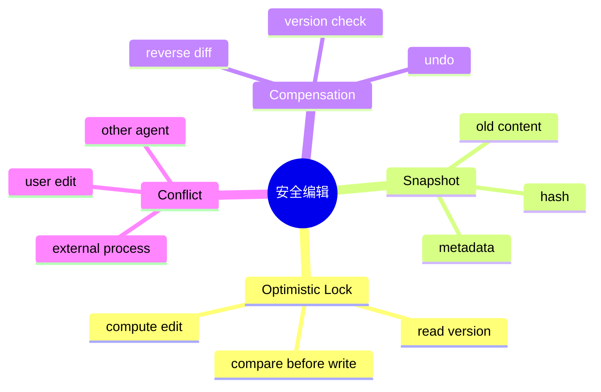

# 乐观并发、快照与补偿事务

## 1. 概念与本质

乐观并发不长期持锁，提交时验证资源版本；快照保存操作前状态；补偿事务在副作用完成后用反向动作恢复，而非真正 ACID rollback。本质是在缺少跨文件事务时，用版本不变量避免覆盖、用可逆记录降低失败损失。



## 2. 项目实现

`FileSnapshotService`/`FileChangeTracker` 记录编辑前后状态和 diff；`ConcurrentEditBlocker` 防止基于旧版本覆盖；UndoFileTool 使用快照补偿。

Agent 读取文件后可能思考数秒，若全程持锁会阻塞用户，所以“读时记录版本、写时 compare”比悲观锁合理。

## 3. 版本选择

mtime+size 便宜但可能碰撞；hash 准确但大文件成本高；可使用 `(fileKey,size,mtime,hash-if-needed)`。版本必须在真正写入前最后一刻读取。

## 4. Demo：compare-and-write

```java
import java.nio.file.*;
import java.security.MessageDigest;

record Snapshot(Path path, byte[] content, byte[] hash) {}

static Snapshot read(Path path) throws Exception {
    byte[] bytes = Files.readAllBytes(path);
    return new Snapshot(path, bytes, MessageDigest.getInstance("SHA-256").digest(bytes));
}

static void writeIfUnchanged(Snapshot old, byte[] next) throws Exception {
    byte[] now = Files.readAllBytes(old.path());
    byte[] hash = MessageDigest.getInstance("SHA-256").digest(now);
    if (!MessageDigest.isEqual(old.hash(), hash)) throw new IllegalStateException("conflict");
    Files.write(old.path(), next);
}
```

## 5. Undo 与事务回滚的方案取舍

写 A 成功、写 B 失败，再用快照恢复 A，这是补偿。恢复本身也可能失败；如果用户已在 A 上继续编辑，盲目恢复会覆盖新内容。因此 Undo 前也要比较“当前版本是否等于工具写后的版本”，否则做三方合并或提示冲突。

## 6. 多文件一致性

可以先为所有目标建立快照、按顺序加锁、验证全部版本、写临时文件，再依次替换；仍无法获得跨文件原子 rename。强事务需求应使用数据库/版本控制/专门工作树。

## 7. 掌握检查

- [ ] 能区分悲观锁和乐观锁；
- [ ] 能设计版本 token；
- [ ] 能解释补偿为何可能失败；
- [ ] 能为 Undo 增加冲突保护。

## 8. 三方合并模型

Base 是 Agent 读取的版本，Ours 是 Agent 计划写入，Theirs 是提交时用户最新版本。若 Theirs=Base，可直接写 Ours；若 Ours 只改与 Theirs 不重叠区域，可三方合并；重叠则冲突。简单 hash 只能发现变化，三方 diff 才可能保留双方修改。

```text
Base:   int timeout = 10;
Ours:   int timeout = 30;
Theirs: int timeout = config.timeout();
```

这是真冲突，不能自动选择。

## 9. Snapshot 存储策略

小文本保存完整内容最可靠；大文件可存 hash +备份文件；二进制/Office 使用完整副本。Snapshot 需要 session/toolCall/createdAt/originalPath/version，并有配额、过期和敏感数据保护。写入 Snapshot 本身失败时，高风险 edit 应停止。

## 10. Compensation 顺序

多步 A→B→C，C 失败时通常按 C/B/A 逆序补偿。每个补偿也可能失败，记录状态 `COMPENSATION_FAILED` 并保留人工恢复材料。补偿要幂等：重复 undo 不应继续破坏。

## 11. 原子单文件编辑

比直接 Files.write 更安全：读取/验证版本 →在同目录生成 temp →写完整内容/force →最后再次验证目标版本 → atomic move。最后验证与 move 之间仍有竞态，需要持文件锁；同进程内锁 +版本校验结合。

## 12. Git 作为恢复层

Git 已追踪文本可用 worktree/index/diff 恢复，但不能假设用户已提交、也不能自动 reset 用户改动。Agent Snapshot 提供本次工具级 Undo，Git 提供长期版本历史；两者职责不同。

## 13. 实验

1. 读后让用户线程修改非重叠行，尝试三方合并；
2. 修改同一行，必须产生冲突；
3. 写成功后用户再修改，Undo 不得覆盖；
4. 补偿第二步故意失败，检查审计和剩余快照；
5. 大文件测试 Snapshot 配额。

## 14. 深层面试追问

**乐观锁与CAS相同吗？** 都是读版本、条件更新思想；CAS在内存原子指令，文件乐观锁需要version检查+受控写入，检查和写之间还需锁防TOCTOU。**为什么mtime不够？** 时间精度、保留mtime、同尺寸快速修改可能漏冲突。

**Undo和Git revert区别？** Undo恢复工具前快照，针对未提交工作区；Git revert生成反向commit，要求已有commit语义。Agent不能自动reset用户未提交改动。**补偿能保证一致吗？** 不能，它本身会失败，只是把不可回滚流程变成可追踪、可修复。

源码跟踪 FileChangeTracker context如何通过线程传播，Snapshot保存位置/清理，EditFileTool affectedPaths是否完整。特别测试一次工具改多个文件时只记录部分snapshot的异常路径。

## 15. 一次安全编辑的完整提交协议

把写文件视为小型事务：① 在 workspace lock 内解析 real path；② 读取原文件并计算 `beforeHash`；③ 生成候选内容到同目录临时文件；④ 运行语法/格式或业务校验；⑤ 提交前再次确认当前 hash 仍等于 `beforeHash`；⑥ 原子 replace；⑦ 记录 `afterHash`、snapshot 与操作 ID；⑧ 成功后才清理临时状态。步骤⑤解决“校验期间用户修改文件”的 lost update，不能只在开始时检查版本。

多文件修改无法仅靠多个 atomic move 获得整体原子性。可以先写 intention journal，列出 operationId、所有 before/after hash、temp/snapshot 路径和阶段；逐文件提交后更新进度。重启恢复根据 hash 判断某文件处于 before、after 还是未知状态，未知时停止并要求人工处理，绝不能盲目覆盖。

补偿必须满足幂等：同一个 operationId 重复执行 undo，已恢复的文件不能再次被反向修改；只有当前 hash 等于记录的 `afterHash` 才允许自动恢复 `before`，否则说明用户在工具之后又编辑过，应生成三方差异或冲突提示。这和数据库 rollback 的区别在于，外部文件世界无法被隔离，补偿只能在前置条件成立时安全执行。

## 16. 深度实验

在读取后、临时写后、第一文件 move 后、journal 更新前分别注入崩溃；重启 recovery 并断言不出现静默数据丢失。再让用户在 Agent 编辑后手工修改，调用 undo 必须拒绝覆盖。用两个并发 edit 对同一 beforeHash 提交，最终只能一个成功，另一个得到版本冲突。

## 项目源码精读

源码入口：[EditFileTool.java](../../../src/main/java/com/example/agent/tools/EditFileTool.java)、[FileChangeTracker.java](../../../src/main/java/com/example/agent/tools/FileChangeTracker.java)、[UndoFileTool.java](../../../src/main/java/com/example/agent/tools/UndoFileTool.java)

```java
long readTimestamp = Files.getLastModifiedTime(path).toMillis();
// 计算 newContent ...
if (Files.getLastModifiedTime(path).toMillis() != readTimestamp) {
    throw new ToolExecutionException("文件已被外部修改");
}
FileUtils.atomicWriteString(path, writeContent);
FileChangeTracker.recordChange(path.toString(), content, newContent,
                               "edit_file", false);
```

这里组合了三种机制：mtime 是乐观版本，`atomicWriteString` 使读者不会看到半个文件，`FileChangeTracker` 保存 before/after 内容供补偿。它们分别解决“是否有人抢先更新”“单文件提交是否撕裂”“提交后如何撤销”，不能互相替代。`old_text` 精确匹配本身也是一种语义前置条件，能避免对错误版本盲改。

源码在原子写成功之后才 `recordChange`：若进程恰在两者之间崩溃，文件已变但没有 undo 记录。反过来先记记录也会产生“记录成功、写入失败”的悬挂状态；要解决只能引入 operation journal 和 PREPARED/COMMITTED 阶段。mtime 也不是强版本号，同一时间粒度内的修改可能漏检，稳健方案是内容 hash，并在持锁的提交前再次比较。

`UndoFileTool` 直接调用 `rollback` 恢复最后一次记录，但还应验证当前内容 hash 等于记录的 afterHash；否则 Agent 修改之后的用户新改动会被静默覆盖。

> [!IMPORTANT]
> **疑难点：atomic move 只保证“单次替换不可分割”，不保证业务事务。** 多文件编辑、记录写入、语法校验和 UI 事件仍可能部分成功。Undo 是有前置条件的补偿，不是数据库 rollback；补偿自身也要幂等、可失败、可审计。

## 17. 源码级实现原理解读

安全编辑必须回答“我基于哪个版本修改”。读取时记录内容 hash/version，生成新内容后在锁内重新读取并比较；不一致则拒绝或进入三方合并，不能覆盖用户刚刚完成的编辑。mtime 只能做快速提示，因为时间精度、复制和原地修改都可能产生碰撞；内容 hash 更可靠但需要读文件。

单文件原子提交是把完整新内容写到同目录 temp，flush/force 后 `Files.move(temp,target,ATOMIC_MOVE,REPLACE_EXISTING)`。同目录提高同一文件系统原子 rename 的可能性。原子 move 防止读到半文件，但不等于电源故障后一定持久，需要考虑 file force 与 directory metadata force 的平台差异。

`FileSnapshotService/FileChangeTracker/UndoFileTool` 提供恢复层，但 undo 是新操作而非时间倒流：执行 undo 前仍要确认当前文件等于工具上次写出的 afterHash，否则会覆盖用户后续修改。多文件操作没有数据库事务，只能通过有序锁、write-ahead manifest、逐文件原子替换和逆序补偿降低风险。

## 18. 可运行核心实现：Compare-and-Swap 文件提交

```java
import java.io.IOException;
import java.nio.charset.StandardCharsets;
import java.nio.file.*;
import java.security.MessageDigest;
import java.util.HexFormat;

public final class AtomicEditor {
    record Snapshot(Path path, byte[] bytes, String hash) {}
    static Snapshot read(Path path) throws Exception {
        byte[] bytes = Files.readAllBytes(path);
        return new Snapshot(path.toAbsolutePath().normalize(), bytes, hash(bytes));
    }
    static Snapshot commit(Snapshot base, byte[] replacement) throws Exception {
        byte[] current = Files.readAllBytes(base.path());
        if (!hash(current).equals(base.hash())) throw new IllegalStateException("concurrent edit");
        Path parent = base.path().getParent();
        Path temp = Files.createTempFile(parent, ".hippo-edit-", ".tmp");
        try {
            Files.write(temp, replacement, StandardOpenOption.TRUNCATE_EXISTING);
            try {
                Files.move(temp, base.path(), StandardCopyOption.ATOMIC_MOVE,
                        StandardCopyOption.REPLACE_EXISTING);
            } catch (AtomicMoveNotSupportedException e) {
                throw new IOException("filesystem has no atomic replace", e); // 不静默降级
            }
            return new Snapshot(base.path(), replacement.clone(), hash(replacement));
        } finally { Files.deleteIfExists(temp); }
    }
    static void undo(Snapshot before, Snapshot after) throws Exception {
        Snapshot now = read(after.path());
        if (!now.hash().equals(after.hash())) throw new IllegalStateException("file changed after tool edit");
        commit(now, before.bytes());
    }
    static String hash(byte[] b) throws Exception {
        return HexFormat.of().formatHex(MessageDigest.getInstance("SHA-256").digest(b));
    }
    public static void main(String[] args) throws Exception {
        Path p = Files.createTempFile("edit-demo-", ".txt");
        Files.writeString(p, "old", StandardCharsets.UTF_8);
        Snapshot before = read(p), after = commit(before, "new".getBytes(StandardCharsets.UTF_8));
        undo(before, after);
        if (!Files.readString(p).equals("old")) throw new AssertionError();
    }
}
```

示例为了保持机制清楚省略了文件锁和 force；生产接线应在 `read current → compare → move` 的整个窗口持同一 canonical path lock，并在 snapshot 中保存权限、编码/BOM、换行风格。若目标是 Git 工作区，恢复前还应检查 index/working tree 状态，避免 undo 跨越用户 commit。

## 延伸学习：博客与电子书

- [Martin Fowler：Optimistic Offline Lock](https://martinfowler.com/eaaCatalog/optimisticOfflineLock.html)：理解版本检查为何阻止 lost update。
- [Refactoring.Guru：Memento](https://refactoring.guru/design-patterns/memento)：把 FileChangeTracker 的 before snapshot 对应到备忘录模式。
- [Release It!（O’Reilly）](https://www.oreilly.com/library/view/release-it-2nd/9781680502398/)：学习故障注入、恢复设计和生产级韧性。

## 思维导图节点学习博客

本专题思维导图中的 12 个末级知识点均已展开为独立博客：[进入节点博客目录](../mindmap-blogs/04-tools-security/05-edit-snapshot-compensation/README.md)。
