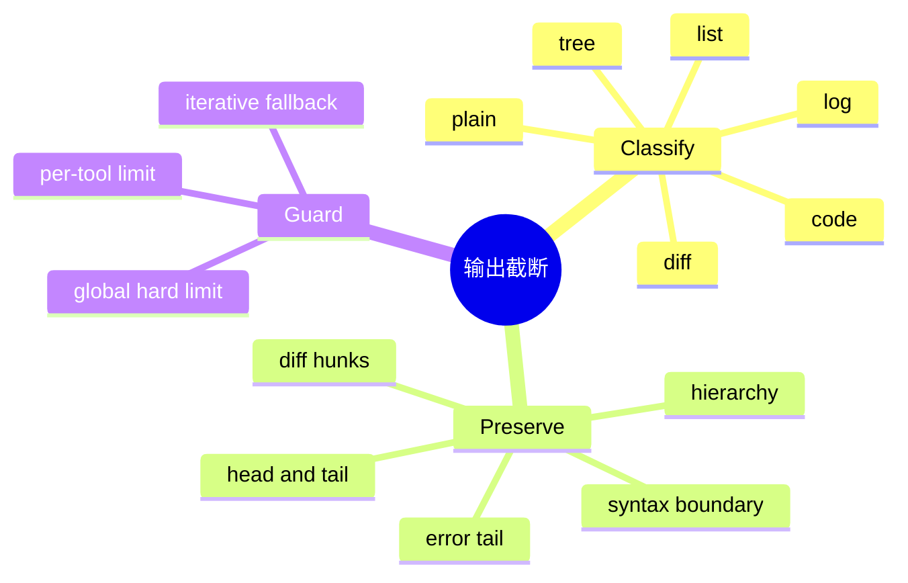

# 工具输出分类与截断策略

## 1. 概念与本质

输出截断是受预算约束的信息选择问题。工具输出大小不可控：日志、目录树、diff 或代码文件可能瞬间消耗整个模型上下文。其本质是在 Token 预算内最大化任务相关信息，而不是保留最多字符。



## 2. 项目实现

ContentClassifier 根据 tool name/content 判断类型；TruncationService 查找 Code/Log/Diff/List/Tree/HeadTail Strategy；先比较估算 Token，再执行类型策略；若仍超限，最多迭代 5 次强制缩短。perToolSafeLimit 和 globalHardLimit 双重限制。

## 3. 为什么要分类

日志关键异常多在尾部；代码需要函数签名和首尾上下文；diff 应保留完整 hunk；树结构要保留祖先路径。统一 `substring(0,n)` 会系统性丢失不同内容的高价值区域。

## 4. Demo

```java
interface Truncation { String apply(String text, int maxChars); }

final class LogTail implements Truncation {
    public String apply(String text, int max) {
        if (text.length() <= max) return text;
        return "[earlier log omitted]\n" + text.substring(text.length() - max);
    }
}

final class HeadTail implements Truncation {
    public String apply(String text, int max) {
        if (text.length() <= max) return text;
        int n = max / 2;
        return text.substring(0, n) + "\n... omitted ...\n" + text.substring(text.length() - n);
    }
}
```

生产实现应用 TokenEstimator，而非字符长度；还应优先在换行、hunk、语法节点边界切断。

## 5. 信息质量评估

除压缩率外，建立测试语料验证：错误行是否保留、关键文件路径是否存在、diff hunk 是否完整、JSON/代码 fence 是否闭合。可让下游问题答案作为任务级指标。

## 6. 边界

`read_file` 当前绕过通用截断，依赖读取工具自身范围控制；所有路径最终仍应经过全局 hard limit。截断标记要告诉模型内容不完整，并提供继续分页的方法。

## 7. 掌握检查

- [ ] 能解释不同内容的价值位置；
- [ ] 能实现两种 Strategy；
- [ ] 能区分字符和 Token 限制；
- [ ] 能设计截断质量测试。

## 8. 预算分配算法

总 Tool 预算不应被第一个结果独占。多个结果可先保留每项最小摘要，再按原始大小、重要度或依赖分配剩余。错误结果和执行摘要优先，重复日志降权。全局 hard limit 是最后安全阀，不是正常目标。

## 9. 结构感知算法

代码可用 AST 节点/函数边界，Diff 解析 `@@` hunk，Log 识别 level/stack trace，Tree 保留祖先路径，JSON 可提取 key 和数组头尾。截断后加入元数据：originalTokens、keptTokens、strategy、omittedRange、如何继续读取。

## 10. 语义完整性

简单切割可能留下未闭合 JSON/Markdown fence，模型误以为内容完整。策略应尽量在安全断点结束，并显式标记 `[TRUNCATED]`。绝不能让截断删除“命令失败”只保留普通输出，或删除路径导致模型编辑错误文件。

## 11. 二次截断问题

工具自身可能分页，Orchestrator 又全局截断。二次处理要识别已有 marker，避免 marker 嵌套和关键信息重复丢失。项目检测“输出过长，已截断”但仍在超限时继续强制截断，这是正确的 hard guard。

## 12. 结果外置

超大输出可完整保存到 tool-results 文件，只向模型返回摘要、路径/hash 和分页读取方式。这样审计不丢数据，上下文保持小。但模型再次 read 时仍需权限和预算，路径不能暴露到 workspace 外。

## 13. 评测实验

为每类内容准备 gold facts：异常类型/行号、函数名、diff 文件、树叶路径。截断后测 fact recall、格式有效性、Token 和下游答题准确率。比较 head、tail、head-tail、结构策略；不能只看压缩比例。

## 14. 深层面试追问与源码验证

**为什么read_file例外危险？** 文件读取工具可能已有行范围，但模型也可请求超大范围；最终统一hard limit仍应执行。**截断发生在持久化前还是后？** 完整raw可外置审计，送模型/Transcript的ToolResult使用截断版；若只存截断版无法排错，若全存JSONL又膨胀。

**摘要能替代截断吗？** 摘要更语义但需LLM/可能幻觉；Tool热路径优先确定性结构截断，必要时另建总结工具。**Token估算不准怎么办？** Strategy后再估算，迭代硬截断，服务端context error作为最后反馈。

跟踪 TruncationService 的 defaultStrategy为何Code而非HeadTail、alreadyTruncated marker语言耦合、forceTruncate按字符×2的fallback误差；为中文/base64/长单行日志补测试。

## 15. 三层数据模型与不可破坏的不变量

不要用一个 `String output` 同时承担全部职责。更清晰的模型分三层：`RawArtifact` 保存完整字节、hash、MIME 和受控下载引用；`DisplayResult` 面向 UI，可分页；`ModelResult` 面向上下文，必须满足 Token 硬预算。这样既能排障，又不会把几十 MB 日志塞进 Conversation。Raw 层本身也要有保留期、磁盘配额和访问控制，不能借“审计”之名无限保存 Secret。

截断算法的核心不变量是：最终大小必定不超过上限；明确声明发生过截断；保留诊断所需结构；结果可确定复现。普通文本可保留 head+tail，中间附原始字节数/hash；源码优先保留错误行周边和行号；JSON 应在节点边界裁剪并输出有效 JSON envelope，不能从字符中间切断转义或 UTF-8 code point。

大小必须分别理解：Java `String.length()` 是 UTF-16 code unit，网络/磁盘常看 UTF-8 byte，模型看 tokenizer token。安全实现先用 byte/char 快速预限，再用目标模型 tokenizer 精算；仍超限时迭代收缩。只采用“字符数×2”会对中文、emoji、代码和 base64 产生方向不同的误差。

## 16. 可运行的失败对照实验

让 FakeTool 返回：十万行日志且错误只在尾部、一个 5 MB 单行、包含 emoji 的中文、深层 JSON、base64、疑似 API key。断言 ModelResult 在预算内、错误尾部仍可见、JSON 可解析、没有半个 surrogate、截断标记带原始大小/hash、Secret 在落日志前已处理。随后让 Agent 根据截断结果继续请求 `read_range(offset, limit)`，验证渐进式取数比“一次截更多”更可靠。

面试时应强调：截断不是展示层小优化，而是上下文资源隔离。没有硬上限，一个低权限读工具也能通过巨大结果耗尽 Token、内存和持久化空间，形成应用层拒绝服务。

## 项目源码精读

源码入口：[TruncationService.java](../../../src/main/java/com/example/agent/domain/truncation/TruncationService.java)

```java
if ("read_file".equals(toolName)) return content;
int effectiveMax = Math.max(1, Math.min(maxTokens, globalHardLimit));
ContentType type = ContentClassifier.detect(toolName, content);
return forceTruncate(content, type, effectiveMax);

// 最终兜底
int safeLength = Math.max(50, maxTokens * 2);
result = result.substring(0, safeLength) + truncateMarker;
```

服务先分类，再选择 Code/Log/Diff/List/Tree/HeadTail 策略；策略后重新估算并迭代缩短，这是“软策略 + 硬守卫”的正确方向。其本质是资源隔离：每个工具结果必须服从会话 Token 预算，同时尽量保留能驱动下一步决策的信息。

但 `read_file` 在入口直接返回，绕过了 `globalHardLimit`；如果上游范围参数失效，就能把任意大文件塞进上下文。最后 `maxTokens * 2` 把 token 再次近似成字符，且只截一次，没有重新断言，因此不能数学上保证结果 ≤ maxTokens。`substring` 还可能切开 surrogate pair、JSON escape 或 Markdown fence。

> [!IMPORTANT]
> **疑难点：要同时定义 byte、UTF-16 char 和 token 三种上限。** 网络与磁盘防内存 DoS 看 byte，Java 字符串操作看 code point/code unit，模型上下文看特定 tokenizer token。硬不变量必须在函数出口重新计算并断言；超大原文应外置为受控 artifact，模型只拿摘要、hash 和分页句柄。

## 17. 源码级实现原理解读

截断不是 String.substring。Tool 原始输出、展示输出和喂给 LLM 的上下文是三个不同对象：原始结果应可审计或外置；展示可针对 UI；LLM 版本受 token budget 控制并保留完成任务需要的信息。若把截断后的文本覆盖原结果，后续无法恢复证据。

`ContentClassifier → TruncationStrategy` 是两阶段设计：先识别 code/diff/log/tree/list，再选择结构感知算法。Code 应尽量在行/语法节点边界切；diff 保留 header 与 hunk；log 保留首尾和 ERROR 周围；目录树保留层级。所有策略都要返回 metadata：original size、kept size、omitted count、strategy，以及获取完整结果的 handle。

项目 `TruncationService` 对 `read_file` 有 bypass，这意味着保护必须在更上层仍有总 token hard limit，否则一个巨大文件可绕过分类截断耗尽上下文。字符上限也不保证 token 上限，中文/JSON/base64 必须再经过 estimator 校验。

## 18. 可运行完整实现：保留首尾与截断元数据

```java
import java.util.*;

public class TruncationDemo {
    record Result(String text, int originalLines, int keptLines, int omittedLines) {}
    static Result headTail(String input, int maxLines) {
        if (maxLines < 3) throw new IllegalArgumentException("need room for marker");
        List<String> lines = Arrays.asList(input.split("\\R", -1));
        if (lines.size() <= maxLines) return new Result(input, lines.size(), lines.size(), 0);
        int head = (maxLines - 1 + 1) / 2;
        int tail = maxLines - 1 - head;
        int omitted = lines.size() - head - tail;
        List<String> out = new ArrayList<>(maxLines);
        out.addAll(lines.subList(0, head));
        out.add("... omitted " + omitted + " lines ...");
        out.addAll(lines.subList(lines.size() - tail, lines.size()));
        return new Result(String.join("\n", out), lines.size(), head + tail, omitted);
    }
    static Result fitTokens(String input, int maxLines, int maxEstimatedTokens) {
        Result r = headTail(input, maxLines);
        while (estimate(r.text()) > maxEstimatedTokens && maxLines > 3)
            r = headTail(input, --maxLines);
        if (estimate(r.text()) > maxEstimatedTokens) throw new IllegalArgumentException("marker exceeds budget");
        return r;
    }
    static int estimate(String s) { return Math.max(1, (s.codePointCount(0, s.length()) + 2) / 3); }
    public static void main(String[] args) {
        Result r = fitTokens(String.join("\n", java.util.stream.IntStream.range(0,100)
                .mapToObj(i -> "line-" + i).toList()), 10, 30);
        if (r.omittedLines() <= 0 || !r.text().contains("line-99")) throw new AssertionError(r);
    }
}
```

这里先按结构边界缩，再以 estimator 做 hard guard；真实 TokenEstimator 替换教学估算即可。失败实验应覆盖 CRLF、没有末尾换行、超长单行、emoji surrogate、二进制/base64、diff header 比预算还大以及 marker 本身超限。

## 延伸学习：博客与电子书

- [OpenAI Cookbook：使用 tiktoken 计数](https://cookbook.openai.com/examples/how_to_count_tokens_with_tiktoken)：理解不同模型 tokenizer 与估算误差。
- [tiktoken 源码](https://github.com/openai/tiktoken)：深入 BPE 编码、特殊 token 和性能实现。
- [Designing Data-Intensive Applications](https://dataintensive.net/)：从资源边界、日志与可靠数据流角度理解为什么不能无限保存原始结果。

## 思维导图节点学习博客

本专题思维导图中的 14 个末级知识点均已展开为独立博客：[进入节点博客目录](../mindmap-blogs/04-tools-security/06-output-truncation/README.md)。
