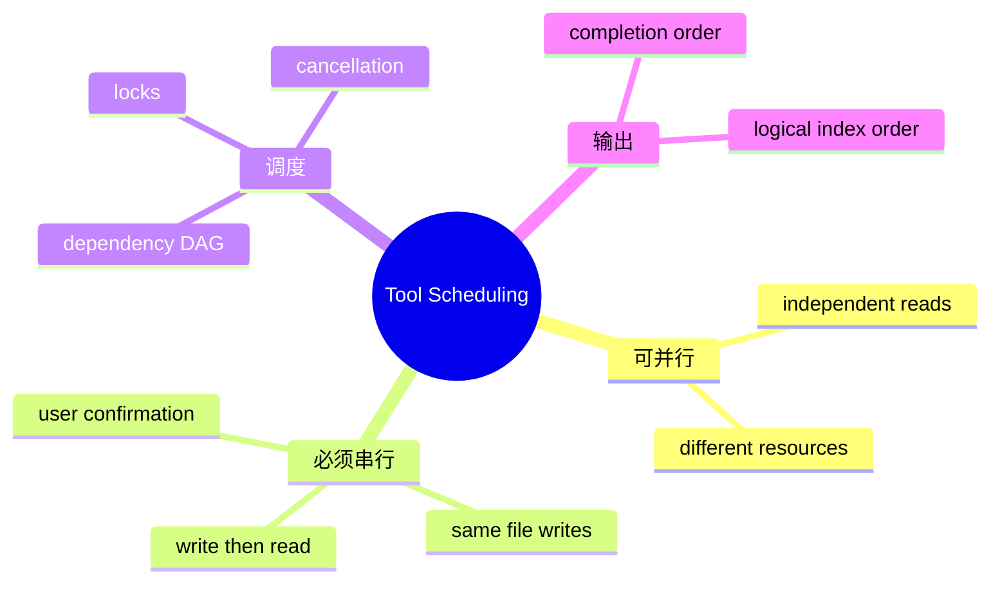

# 工具并发、依赖与结果排序

## 1. 概念与核心问题

工具并发调度是根据依赖和资源冲突决定执行偏序的过程。一次模型响应可能包含多个 ToolCall，它们是否能并行取决于数据依赖和副作用冲突，而不只是“有多个任务”。



## 2. 项目实现

`ConcurrentToolExecutor` 将前台工具直接执行，后台工具提交虚拟线程；结果带原始 index，收集后排序。FileLockManager 保护受影响路径。组件已注册，但 WebAgentOrchestrator 主链当前仍 for 循环逐个执行。

## 3. 并行执行原理与本质

并发执行与逻辑顺序分离：任务完成顺序是非确定的，但写回模型/前端可按原 ToolCall index 保持稳定。依赖 A→B 时，排序结果不能弥补错误的并行执行，必须在调度前识别依赖。

## 4. Demo

```java
import java.util.*;
import java.util.concurrent.*;

record Job(int index, Callable<String> task) {}
record Result(int index, String value) {}

static List<Result> run(List<Job> jobs) throws Exception {
    try (var executor = Executors.newVirtualThreadPerTaskExecutor()) {
        List<Future<Result>> futures = new ArrayList<>();
        for (Job job : jobs)
            futures.add(executor.submit(() -> new Result(job.index(), job.task().call())));
        List<Result> results = new ArrayList<>();
        for (var f : futures) results.add(f.get());
        results.sort(Comparator.comparingInt(Result::index));
        return results;
    }
}
```

## 5. 依赖判定

显式最好：工具声明 readSet/writeSet 或 dependsOn。两个调用仅在 `writeSetA` 与 `(readSetB ∪ writeSetB)` 无交集且反向也无交集时并行。Bash 的资源集合通常不可准确推断，应默认串行/高风险。

## 6. 失败和取消

Structured Concurrency 思想：一组并行工具属于一个 scope；主任务取消时取消所有子任务；是否 fail-fast 取决于工具独立性；所有子任务完成/取消后 scope 才结束。当前 Future 收集可进一步演进为结构化并发。

## 7. 掌握检查

- [ ] 能区分完成顺序和逻辑顺序；
- [ ] 能给出读写集冲突判定；
- [ ] 能解释排序不能解决依赖；
- [ ] 能说明当前 Web 主链真实状态。

## 8. 依赖图构建

工具声明 `readSet/writeSet`、显式 `dependsOn` 和 sideEffectClass。若 A.write 与 B.read/write 相交，则 A/B 有顺序约束；两个纯读可并行；unknown/Bash 默认冲突。生成 DAG 后用拓扑层并行执行，同层任务互不依赖。

动态路径可能来自前一个结果，提交时无法知道，这种 ToolCall 本应由模型下一轮生成而非同批。Runtime 不应猜测隐式数据引用。

## 9. Structured Concurrency

并行 ToolCalls 属于一个逻辑 scope：父取消→全部子取消；父等待全部完成或 fail-fast；异常按 index 聚合；scope 结束不留孤儿线程。Java 21 StructuredTaskScope 是 preview，可作为概念参考；当前 Future 方案需手动实现这些语义。

## 10. Fail-fast vs 收集全部：失败策略的方案取舍

独立 read 中一个失败仍可收集其他结果；写操作失败可能让后续结果无意义，应 cancel dependents。DAG 节点状态 SUCCESS/FAILED/SKIPPED_DEPENDENCY/CANCELLED，写回模型时解释被跳过原因。

## 11. 结果确定性

按 index 排序只保证输出顺序，不保证并发读取的文件快照一致。若需要同一时间视图，应在调度前 snapshot/version；否则两个 read 可能跨越用户编辑。Coding Agent 通常接受 eventual view，但必须在写时做乐观校验。

## 12. 限流与锁的顺序

先取得 provider/tool semaphore 还是文件锁会影响死锁和占用。不要持文件锁排队等待远程资源；一般先完成 LLM，再在短执行期获取 Tool quota 和文件锁。多个限制器建立统一获取顺序，finally 释放。

## 13. 实验

构造 3 个 read +2 个同文件 write，验证最大安全并行；让一个父任务 cancel，确认所有 Future 结束；制造依赖失败，检查 SKIPPED；对比串行/并行墙钟时间与结果一致性，并明确当前 Web 主链尚未调用并发组件。

## 14. 深层面试追问与接线方案

**模型一次返回多个call是否表示可并行？** 不一定，协议只表达同一assistant消息中的调用；Runtime根据副作用/依赖决定。**虚拟线程Future.get按提交顺序会不会失去并发？** 任务已并行运行，按顺序get只可能延迟收集早完成结果，不影响总依赖完成；若要实时SSE可CompletionService。

**如何接入Web主链？** 先把Bash/Delete/AskUser这类可挂起工具分组为barrier；纯读且无依赖批次交给ConcurrentToolExecutor；结果按index持久化/发SSE；一旦confirmation出现暂停后续；所有调用仍补ToolResult。接线前需证明ConversationService append线程安全或由主线程统一写回。

源码检查 `executeBackgroundTasks` 对单任务index设0是否会丢原始index，以及backgroundTasks筛选后局部index与原列表index映射；这是并发组件接线前必须修正/测试的细节。

## 15. 冲突图与确定性提交

仅用 `isReadOnly` 布尔值不足以判断并发。每个调用在执行前声明保守的资源集合：`R={path...}`、`W={path...}`、外部副作用域和 barrier 标记。若 `W1∩(R2∪W2)` 或 `W2∩R1` 非空，两调用存在冲突边；对冲突图做分层，同层可并行、层间按依赖执行。动态才知道路径的工具默认串行，安全性优先于并行率。

执行完成顺序可以非确定，但对 Conversation 的提交顺序必须稳定地对应模型原始 `tool_call` 顺序，每个 callId 恰好一个 ToolResult。否则同一输入在不同机器产生不同提示历史，调试和重放都不可靠。若 UI 需要实时展示，可先发送带 index 的 progress，最终持久化仍按稳定序列提交。

并行失败策略也要显式：独立读取某个失败不必取消其他读取；写操作失败后，尚未开始的依赖项取消，已经发生副作用的项进入补偿流程。请求取消需要向每个 child future 和底层 Tool 传播，并等待一个有界收尾期；只取消聚合 Future 会留下后台修改。

## 16. 并发收益验证

使用三个 500 ms FakeRead 与两个冲突 FakeWrite：读批总时长应接近 500 ms，冲突写接近 1 s；重复运行一千次，持久 ToolResult 顺序恒定。再插入 AskUser barrier，确认 barrier 后调用在确认前从未启动；取消时验证 active 数归零、文件无迟到写入。

## 项目源码精读

源码入口：[ConcurrentToolExecutor.java](../../../src/main/java/com/example/agent/tools/concurrent/ConcurrentToolExecutor.java)

```java
for (int i = 0; i < toolCalls.size(); i++) {
    if (executor != null && !executor.shouldRunInBackground())
        results.add(executeSingle(call, i, total));
    else
        backgroundTasks.add(call);
}
executeBackgroundTasks(backgroundTasks, results, total);

// backgroundTasks 内重新编号
for (int i = 0; i < toolCalls.size(); i++) {
    final int index = i;
    executor.submit(() -> executeSingle(call, index, total));
}
```

源码把“不可后台”的工具串行执行，把其余工具放到虚拟线程并发，最后按 index 排序。虚拟线程降低了阻塞任务的线程成本，却不决定哪些副作用可以并行；正确性仍取决于资源冲突、barrier、取消和确定性提交协议。

这里存在可复现的索引缺陷：筛选为 `backgroundTasks` 后丢失原始 index，后台列表从 0 重新编号；只有一个后台任务时也强制 index=0。假设原序列第 0 个是前台确认工具、第 1 个才是后台读，两个结果都可能 index=0，排序无法恢复模型原始 ToolCall 顺序。修复方法是传递 `IndexedToolCall(originalIndex, call)`，而不是只保存 call。

此外，宽容 JSON 解析分支会对共享 `ObjectMapper.configure(...)`，运行期改变全局解析器配置；并发请求可能彼此影响。应该使用预配置不可变 mapper/ObjectReader。

> [!IMPORTANT]
> **疑难点：一次返回多个 ToolCall 不代表它们无依赖。** 仅凭 `shouldRunInBackground` 会并行两个写同一文件的操作。调度器至少要建 readSet/writeSet 冲突图；Bash、Delete、AskUser 与未知副作用默认作为 barrier。每个 callId 必须恰好生成一个结果，并按原始序列持久化。

## 17. 源码级实现原理解读

工具能否并行取决于 effect set，而不只是工具名：两个 read 通常可并行；write(A) 与 read(A)、write(A) 与 write(A) 冲突；Bash 的读写集合难静态判断，应默认全局冲突或进入隔离环境。先构建依赖/冲突 DAG，再调度入度为零的节点，才能同时获得安全与并行。

`ConcurrentToolExecutor` 还必须保留输入 index/callId。若用 completion order 直接收集结果，模型看到的 ToolResult 顺序会随时序变化，测试与恢复不可复现。正确做法是并行执行、按原 index 存槽，全部完成后确定性提交；或者允许独立完成事件流，但最终 Conversation 的闭合顺序必须定义。

取消策略也要区分：fail-fast 适合原子工作流，但已发生副作用不能靠 cancel future 回滚；collect-all 适合独立读取；有依赖的节点在前驱失败时应标记 skipped/failed-dependency，而不是执行或永久等待。

## 18. 可运行完整实现：并行执行、确定性归位

```java
import java.util.*;
import java.util.concurrent.*;

public class DeterministicToolsDemo {
    record Call(int index, String id, Callable<String> task) {}
    record Result(int index, String id, String value, Throwable error) {}

    static List<Result> execute(List<Call> calls) throws InterruptedException {
        Result[] slots = new Result[calls.size()];
        BitSet usedIndexes = new BitSet(calls.size());
        for (Call call : calls) {
            if (call.index() < 0 || call.index() >= slots.length || usedIndexes.get(call.index()))
                throw new IllegalArgumentException("invalid or duplicate index: " + call.index());
            usedIndexes.set(call.index());
        }
        try (ExecutorService executor = Executors.newVirtualThreadPerTaskExecutor()) {
            List<Future<?>> futures = new ArrayList<>();
            for (Call call : calls) {
                futures.add(executor.submit(() -> {
                    try { slots[call.index()] = new Result(call.index(), call.id(), call.task().call(), null); }
                    catch (Throwable e) { slots[call.index()] = new Result(call.index(), call.id(), null, e); }
                }));
            }
            for (Future<?> f : futures) {
                try { f.get(); } catch (ExecutionException impossible) { throw new AssertionError(impossible); }
            }
        }
        if (Arrays.stream(slots).anyMatch(Objects::isNull)) throw new IllegalStateException("missing result");
        return List.of(slots);
    }
    public static void main(String[] args) throws Exception {
        List<Result> r = execute(List.of(
                new Call(0, "slow", () -> { Thread.sleep(100); return "a"; }),
                new Call(1, "fast", () -> "b")));
        if (!r.get(0).id().equals("slow") || !r.get(1).id().equals("fast")) throw new AssertionError(r);
    }
}
```

这个实现证明“完成顺序”和“协议顺序”可以解耦，但尚未处理文件冲突。生产调度器要先根据 canonical resource/effect 构图，同一冲突分量串行；获取多个资源锁仍需全局排序；Provider/Tool 类型还要有独立 Semaphore，不能让虚拟线程把配额打满。

## 延伸学习：博客与电子书

- [OpenJDK JEP 444：Virtual Threads](https://openjdk.org/jeps/444)：理解虚拟线程解决的是吞吐，不自动提供结构化并发或数据安全。
- [Java 21 Concurrency Guide](https://docs.oracle.com/en/java/javase/21/core/concurrency.html)：补齐 Executor、Future、取消和同步基础。
- [Java Concurrency in Practice](https://jcip.net/)：深入任务执行、取消策略、安全发布与复合操作。

## 思维导图节点学习博客

本专题思维导图中的 10 个末级知识点均已展开为独立博客：[进入节点博客目录](../mindmap-blogs/04-tools-security/07-concurrent-tools/README.md)。
