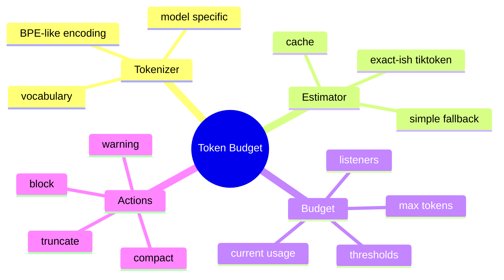

# Tokenizer、Token 估算与预算监听

## 1. 概念

Tokenizer 把文本编码成模型词表中的 token id。TokenBudget 维护当前上下文占用并在跨越阈值时通知策略组件。



## 2. 原理

字符与 Token 非线性：英文常见词可能一个 token，中文、代码和随机字符串比例不同；不同模型词表也不同。请求前只能估算，服务端 usage 用于事后校准。

Observer 模式把计数与策略分离。TokenBudget 只负责数值和阈值，WarningInjector、AutoCompactTrigger、BlockingGuard 分别响应。

## 3. 项目实现

`TokenEstimatorFactory` 优先 TiktokenEstimator，失败回退 Simple；ContextWindow 重算消息 Token 后更新 TokenBudget。阈值为 75%、85%、90%、95%、97.5%，每个阈值在 reset 前只触发一次。

## 4. Demo

```java
import java.util.*;
import java.util.concurrent.atomic.AtomicInteger;
import java.util.function.BiConsumer;

final class Budget {
    private final int max;
    private final AtomicInteger current = new AtomicInteger();
    private final Set<Integer> fired = new HashSet<>();
    private final List<BiConsumer<Integer,Integer>> listeners = new ArrayList<>();

    Budget(int max) { this.max = max; }
    synchronized void update(int value) {
        current.set(value);
        for (int percent : List.of(75, 85, 90, 95, 98)) {
            if (value * 100L >= max * (long) percent && fired.add(percent))
                listeners.forEach(l -> l.accept(percent, value));
        }
    }
    void onThreshold(BiConsumer<Integer,Integer> l) { listeners.add(l); }
}
```

用整数乘法避免浮点边界误差。真实 Listener 回调最好不在持锁期间执行，以免重入/慢处理阻塞更新。

## 5. 预算组成

模型输入不仅是聊天文本，还包括 system prompt、Tool Schema、图片估算、tool result、消息包装 token 和预留 output token。安全判断应满足：`estimatedInput + reservedOutput <= modelContextLimit`。

## 6. 边界

Tiktoken 对非 OpenAI 模型可能偏差；Simple 回退更粗。阈值是策略而非事实，应按模型上下文和实际错误反馈校准。97.5% 才阻断可能来不及预留输出，应在请求构造时单独保留 completion budget。

## 7. 掌握检查

- [ ] 能解释字符不等于 Token；
- [ ] 能列出完整输入组成；
- [ ] 能实现只触发一次的 Observer；
- [ ] 能说明估算与服务端 usage 的关系。

## 8. Tokenization 的内部过程

现代 tokenizer 常基于 BPE/unigram 类算法：文本规范化/预切分，再把字符/字节序列合并成词表 token。空格、大小写、换行和代码符号都会影响切分。图片、多模态和特殊 role/tool wrapper 可能有独立计数规则，不能仅对 content 字符串编码。

Tiktoken 使用某类 OpenAI encoding；model name 未映射时选择 fallback encoding 会产生偏差。Estimator 应暴露 `confidence/strategy`，在简单回退时增加更大 safety margin。

## 9. 增量计算与缓存

每次 addMessage 重算全部历史是 O(n²) 累计成本。可以每条 Message 缓存 tokenCount，ContextWindow 维护总和；replace/compact 时重算。Cache key 至少包含 model/tokenizerVersion/message content hash，模型切换后旧缓存失效。

Tool Schema/system prompt 也可缓存，但动态 Rules/Memory 更新要改变 hash。

## 10. 阈值越级

一次超大 ToolResult 可能从 70% 直接跳到 99%，update 应按顺序触发所有未触发阈值，或者只通知最高阈值但明确语义。Listener 触发过程中再 inject warning 会改变 Token 并递归 update，需要 isRecalculating/reentrancy guard；项目 ContextWindow 有相关防护。

## 11. 请求预算方程

```text
modelLimit
 - safetyMargin
 - reservedCompletion
 - fixedPromptAndTools
 = availableConversationBudget
```

若模型支持 128k，不能把 128k 全给 history。reservedCompletion 根据任务/配置设定；Tool calling arguments和 reasoning 也消耗输出。供应商可能在略低于标称值拒绝，保留 5%~10% margin并用真实 error 校准。

## 12. 实验

取中文、英文、Java、JSON、base64 各 1000 字符，用 Simple/Tiktoken/真实 usage 对比误差；测缓存命中；一次加入超大 ToolResult 观察阈值顺序；切换 model 验证 cache invalidation；验证 warning 注入不会无限递归。

## 13. 深层面试追问与源码检查

**Token估算为何不直接调用供应商接口？** 远程计数增加延迟/费用/故障，且请求前保护需要本地快速计算。**缓存按文本String够吗？** 还需model/encoding/消息包装类型，否则模型切换读旧值。**阈值Observer为什么不用轮询？** update时事件驱动更及时、成本低，但大跳跃/重入必须处理。

检查 `ContextWindow.recalculateBudget` 在消息列表并发修改时的同步；`isRecalculating` 是普通boolean还是只在同线程使用；TokenBudget listeners CopyOnWrite与threshold set锁的组合；Listener异常是否影响其他listener。为NaN/负数/max=0、超过100%写边界测试。

预算不仅保护请求，还可驱动用户体验：75%只提示、90%准备压缩、97.5%阻止Tool。动作应幂等，warning自身Token计入后不能反复触发。

## 项目源码精读

源码入口：[TokenBudget.java](../../../src/main/java/com/example/agent/context/TokenBudget.java)、[ContextWindow.java](../../../src/main/java/com/example/agent/context/ContextWindow.java)

```java
public void update(int newTokenCount) {
    int safeTokens = Math.max(0, newTokenCount);
    int oldTokens = currentTokens.getAndSet(safeTokens);
    if (oldTokens == safeTokens) return;
    double ratio = getUsageRatio();
    listeners.forEach(l -> l.onBudgetUpdated(safeTokens, maxTokens, ratio));
    checkThresholds(ratio);
    if (safeTokens > maxTokens) listeners.forEach(l -> l.onBudgetExceeded(...));
}
```

TokenBudget 是“计量状态 + 事件策略”：AtomicInteger 保存当前计量值，阈值集合保证一次触发，CopyOnWriteArrayList 允许监听器在遍历期间安全增删。ContextWindow 每次消息变化时重新估算整个 effective conversation，再调用 update；warning 也计入预算，所以 `isRecalculating` 防止监听器注入 warning 后递归重算。

真正可用预算并不等于模型标称窗口，而是 `limit - fixed prompt - tools - completion reserve - safety margin`。本地 estimator 是请求前保护，服务端 usage 是事后真值，两者要分开记。缓存键必须包含模型/encoding、role、tool schema 版本，不能只按文本缓存。

源码的 `checkThresholds` 只取 `BudgetThreshold.fromRatio(ratio)` 对应的一个阈值；若一次工具输出让占用率从 60% 跳到 98%，中间阈值是否触发完全取决于该方法的定义，面试时应明确测试“大步跃迁”。另外 `isRecalculating` 若非 volatile/锁保护，只适合单线程拥有 ContextWindow 的假设。

> [!IMPORTANT]
> **疑难点：Token 是模型相关编码后的单位，不是字符数。** 中文、代码、JSON、base64 的字符/token 比差异很大；估算误差会让系统在边界处被供应商拒绝。必须留 completion reserve，并用真实 usage/context-length error 校准安全余量。

## 14. 源码级实现原理解读

`ContextWindow` 是消息真相源的视图，`TokenBudget` 是由消息、system、tools 等计算出来的派生计量状态。正确更新不能由各调用方随手 `+= estimate(content)`，因为编辑、截断、压缩、模型切换都会让增量失效；项目选择重算保证正确，再通过 estimator cache 控制成本。

阈值通知的语义应是 crossing：`oldRatio < threshold && newRatio >= threshold`。一次从 60% 跳到 98% 时，是触发所有跨越阈值还是只触发最高动作，必须显式规定；否则 warning、compact、block 的组合依赖枚举实现细节。Listener 不应在持有 budget 内部锁时执行，因为 listener 可能添加 warning message，递归触发 ContextWindow 重算。

AtomicInteger 只保证 currentTokens 单值原子，不保证 `old/new/firedThresholds/listener callback` 整个状态机原子。实现要么在短锁内计算待通知事件、锁外回调，要么让单 session owner 线程串行更新。

## 15. 可运行完整实现：越级阈值与锁外通知

```java
import java.util.*;
import java.util.concurrent.CopyOnWriteArrayList;
import java.util.function.BiConsumer;

public final class TokenBudgetDemo {
    private final int max;
    private int current;
    private final NavigableSet<Integer> fired = new TreeSet<>();
    private final List<BiConsumer<Integer,Integer>> listeners = new CopyOnWriteArrayList<>();
    private static final List<Integer> THRESHOLDS = List.of(75, 85, 90, 95, 98);

    TokenBudgetDemo(int max) { if (max <= 0) throw new IllegalArgumentException(); this.max = max; }
    void subscribe(BiConsumer<Integer,Integer> listener) { listeners.add(listener); }
    void update(int raw) {
        int next = Math.max(0, raw);
        List<Integer> crossed = new ArrayList<>();
        synchronized (this) {
            int old = current; current = next;
            for (int p : THRESHOLDS) {
                if (old * 100L < max * (long)p && next * 100L >= max * (long)p && fired.add(p))
                    crossed.add(p);
            }
        }
        for (int p : crossed) for (var listener : listeners) listener.accept(p, next); // 锁外回调
    }
    synchronized void reset(int value) { current = Math.max(0, value); fired.clear(); }
    public static void main(String[] args) {
        TokenBudgetDemo b = new TokenBudgetDemo(1000);
        List<Integer> events = new ArrayList<>(); b.subscribe((p,n) -> events.add(p));
        b.update(600); b.update(981); b.update(990);
        if (!events.equals(List.of(75,85,90,95,98))) throw new AssertionError(events);
    }
}
```

真实预算还要预留输出：`effectiveInputLimit = modelLimit - reservedOutput - safetyMargin`。Tool Schema、图片与供应商消息 wrapper 不能遗漏。服务端 Usage 用于校准 estimator，而不是反过来修改已经发生的历史计量。

## 延伸学习：博客与电子书

- [OpenAI Cookbook：Token 计数](https://cookbook.openai.com/examples/how_to_count_tokens_with_tiktoken)：跟着示例理解消息包装也会产生额外 Token。
- [tiktoken 源码](https://github.com/openai/tiktoken)：深入 BPE、encoding 与特殊 token。
- [Anthropic：Context windows](https://docs.anthropic.com/en/docs/build-with-claude/context-windows)：对比上下文窗口、输出保留和长上下文行为。

## 思维导图节点学习博客

本专题思维导图中的 14 个末级知识点均已展开为独立博客：[进入节点博客目录](../mindmap-blogs/05-context-storage/01-token-budget/README.md)。
