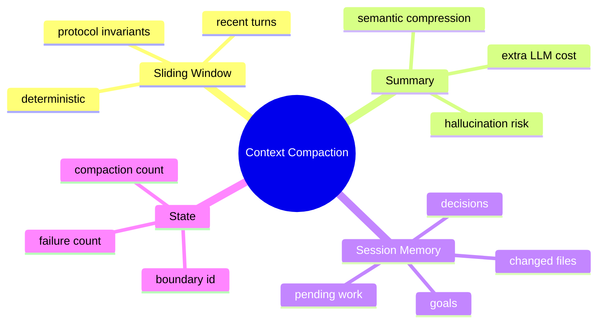

# 滑动窗口、摘要压缩与 Session Memory

## 1. 概念与三层治理

滑动窗口保留近期原文；摘要把早期历史压缩成高密度文本；Session Memory 保存稳定任务状态。三者分别解决“近期细节、历史语义、长期工作状态”。



## 2. 项目实现

ContextClipper 按 ConversationTurn 分组，保留 system、最近至少 3 轮和至少 5 个有效文本块，目标约 10k～40k Token；保护 tool_call/result 配对。ContextSummarizer 生成摘要；SessionCompactionState 记录边界和连续失败。SessionMemoryExtractor 在初始 10k、增长 8k 或 5 次工具调用并自然停顿时提取。

## 3. 为什么不能简单 subList

工具协议要求 assistant tool call 后紧跟对应结果。任意截断会留下 orphan，供应商可能返回 400。消息数也不能代表 Token。必须先按完整轮次分组，再选择安全边界。

## 4. Demo：按轮保留

```java
record Message(String role, String content, String toolCallId) {}
record Turn(java.util.List<Message> messages, int tokens) {}

static java.util.List<Turn> keepTail(java.util.List<Turn> turns, int budget) {
    var kept = new java.util.ArrayList<Turn>();
    int used = 0;
    for (int i = turns.size() - 1; i >= 0; i--) {
        Turn turn = turns.get(i);
        if (!kept.isEmpty() && used + turn.tokens() > budget) break;
        kept.add(turn);
        used += turn.tokens();
    }
    java.util.Collections.reverse(kept);
    return kept;
}
```

Turn 已经包含完整 user→assistant→tool results，选择时不会切开协议对。

## 5. 摘要的有损本质

LLM 摘要可能遗漏、改写甚至幻觉，所以应保留明确模板：目标、约束、已完成、关键决定、文件/符号、错误、待办。摘要要标注是 summary，不应伪装成原始 user 消息。增量摘要从上次 boundary 后开始，避免反复总结导致漂移。

## 6. 失败控制

压缩本身需要 Token 和网络，若在超限边缘重复失败会雪崩。每个 query loop 限制一次、连续失败最多 3 次；确定性 Clipper 优先，LLM Summary 为第二级；始终保留 hard block。

## 7. 掌握检查

- [ ] 能解释三个层次各自保存什么；
- [ ] 能证明按轮分组保护工具协议；
- [ ] 能列出摘要模板；
- [ ] 能设计压缩失败降级链。

## 8. ConversationTurn 的边界算法

通常 user 开始新 turn，后续 assistant 文本/tool calls及所有 tool results属于同一 turn，直到下一 user。若 assistant 一次返回多个 call，必须收齐对应结果。恢复时若结果缺失，可补 synthetic failed result；不能把孤立 call放进推理请求。

ContextClipper 当前 `hasToolPair` 调整起点的逻辑需要用边界测试证明不会退到错误 turn。对 resumed session 找不到旧 summary id 时从尾部扩展，是一种安全降级。

## 9. 摘要 Prompt 与事实保持

摘要器输入应明确“不要完成任务/调用工具，只提取事实”，输出固定 section。对文件路径、symbol、错误码、用户约束尽量原样复制；对未经验证结论标注 uncertain。摘要写入后可验证 token、必需 section 和关键实体覆盖，失败则回退 clipper。

## 10. 多次摘要的漂移

Summary-of-summary 每次有损，关键信息会衰减。增量策略应保留上一 summary 作为 base，加新历史更新；定期从原始 JSONL 重新生成 checkpoint 可纠偏。原始 Transcript 不因上下文压缩删除，保证可审计/重建。

## 11. Session Memory Schema

建议固定：Goal、User constraints、Architecture decisions、Files changed、Commands/tests、Known failures、Open todos、Last safe state。每项带 evidence messageId/path，避免记忆与事实分离。Memory 不是模型自由散文，越结构化越容易更新和冲突合并。

## 12. 质量评测

构造长会话后提问早期目标、近期细节、工具结果、未完成 Todo；比较原文、滑窗、摘要+滑窗、Memory+滑窗的答题正确率、Token、延迟和费用。还要验证 tool pair API 合法性，不只看摘要可读性。

## 13. 失败注入

让摘要 LLM 超时/返回空/超预算/产生 ToolCall；确保回退确定性 clipper。同一 loop 连续触发预算更新时只压缩一次；压缩状态写盘失败时不应丢原始 history。恢复后 boundary id 不存在，验证安全 tail window。

## 14. 深层面试追问与实验验收

**滑动窗口一定保留最近内容吗？** 通常是，但当前未完成Tool、system和有效文本下限可能调整边界；最近一条超大结果仍需先截断。**为什么摘要作为user消息而非system？** 不同role影响权重/协议，项目做法要明确标记boundary；更稳可使用专门system summary section并测试provider兼容。

**Memory和Summary会重复吗？** 会，需要各自职责：Summary描述对话历史，Session Memory描述当前任务状态；组合时去重关键section。**如何衡量信息损失？** gold questions/evidence recall和任务成功，不是摘要长度。

实验用生成的100轮对话，其中埋入10条关键事实/5组Tool pair；在不同budget压缩，自动检查pair、事实召回、Token范围、boundary id和恢复结果。对多次summary运行5轮观察漂移。

## 15. 压缩后的形式不变量

压缩不是简单删前 N 条，而是从合法 turn 边界生成新的上下文投影。必须始终保留最高优先级 system/rule；assistant 的每个 tool call 与对应 ToolResult 成对保留或共同摘要；最新未完成 turn 不被压掉；summary 记录覆盖到的 sequence/boundary 和生成版本；最终精确 Token 不超过预算并保留 completion reserve。

算法可先把不可压缩段预算锁定，再从最旧的完整 turn 选择待摘要区，生成结构化 summary（目标、已确认事实、决策、文件变更、未决事项、证据 ID），验证后用 summary boundary 替换。若摘要失败或仍超限，降级为确定性 extractive summary/更小窗口，而不是直接丢失安全规则。

多次压缩会产生有损链式编码。应优先从原始 transcript 重新总结到新 boundary，而不是 summary-of-summary；保留原事件让审计和重建成为可能。面试中真正要回答的是“哪些语义绝不丢、怎么验证”，不是只说使用滑动窗口。

## 项目源码精读

源码入口：[ContextSummarizer.java](../../../src/main/java/com/example/agent/context/compressor/ContextSummarizer.java)、[ContextClipper.java](../../../src/main/java/com/example/agent/context/compressor/ContextClipper.java)

```java
int splitIndex = findTurnBoundarySplit(historyMessages);
List<Message> toSummarize = historyMessages.subList(0, splitIndex);
List<Message> toKeep = historyMessages.subList(splitIndex, historyMessages.size());
String summary = getOrGenerateSummary(toSummarize);

result.add(0, Message.system("--- SESSION COMPACTION BOUNDARY ---"));
result.add(Message.user(createSummaryHeader(summary, ...)));
result.addAll(toKeep);
```

实现不是按消息数生硬切割，而是先寻找 turn boundary，避免 assistant tool call 与 tool result 被拆开；早期历史转为 summary，近期窗口原样保留。其本质是建立一个有损的“上下文投影”：原始 Transcript 仍是真源，发送给模型的 messages 是受预算约束的派生视图。

`getOrGenerateSummary` 会优先读取 session-memory.md；这省掉一次 LLM 调用，但只有当 Memory 明确记录自己覆盖的 boundary/version 时才安全，否则旧 Memory 可能替代更长的新历史。源码构造结果后计算 finalTokens，却没有在所示主路径中证明 finalTokens 一定小于 target；summary 自身超长时还需要 clip/fallback 的闭环。

> [!IMPORTANT]
> **疑难点：压缩必须维护协议不变量，而不只是“语义大概还在”。** 每个 tool call/result 要成对，system/rule 不可丢，最近未完成轮次不可截，最终 Token 必须小于预算。摘要失败时要降级到确定性 clipper，不能因 LLM 超时丢失原始历史。

## 16. 源码级实现原理解读

Conversation 不是任意 Message 列表。一个 assistant tool_calls 后必须跟齐所有对应 tool result；system 通常保持首位；正在执行或等待确认的 turn 不能被切成两半。因此 `subList(lastN)` 即使满足条数，也可能留下孤立 ToolResult，使 Provider 拒绝请求或模型误解历史。

压缩流程应先把消息解析为 logical turns，再选冻结区、可摘要区和最近保留区：system/tool schema 快照通常冻结；已闭合旧 turn 可摘要；当前 user turn、pending call 与最近若干 turn 原样保留。摘要作为新 artifact 要带 coverage range、source hash、版本和事实结构，重复压缩时应尽量从原摘要覆盖范围与新原文生成，而不是无限“摘要的摘要”。

项目 `ContextSummarizer/ContextClipper` 需要共同维持协议不变量。压缩后的 Token 要重新估算；如果仍超限，必须继续 clip 或拒绝，而不能假设摘要一定更短。

## 17. 可运行核心实现：按完整 Turn 保留

```java
import java.util.*;

public class TurnCompactionDemo {
    record Msg(String role, String callId, String text) {}
    record Turn(List<Msg> messages) {}

    static List<Turn> parseTurns(List<Msg> messages) {
        List<Turn> turns = new ArrayList<>();
        List<Msg> current = new ArrayList<>();
        for (Msg m : messages) {
            if (m.role().equals("user") && !current.isEmpty()) {
                turns.add(new Turn(List.copyOf(current))); current.clear();
            }
            current.add(m);
        }
        if (!current.isEmpty()) turns.add(new Turn(List.copyOf(current)));
        return turns;
    }
    static List<Msg> compact(List<Msg> all, int keepRecentTurns) {
        List<Msg> system = all.stream().filter(m -> m.role().equals("system")).toList();
        List<Msg> nonSystem = all.stream().filter(m -> !m.role().equals("system")).toList();
        List<Turn> turns = parseTurns(nonSystem);
        int cut = Math.max(0, turns.size() - keepRecentTurns);
        List<Msg> out = new ArrayList<>(system);
        if (cut > 0) {
            long covered = turns.subList(0, cut).stream().mapToLong(t -> t.messages().size()).sum();
            out.add(new Msg("system", null, "[summary covers " + covered + " messages]"));
        }
        turns.subList(cut, turns.size()).forEach(t -> out.addAll(t.messages()));
        validateToolPairs(out);
        return List.copyOf(out);
    }
    static void validateToolPairs(List<Msg> messages) {
        Set<String> calls = new HashSet<>(), results = new HashSet<>();
        for (Msg m : messages) {
            if (m.role().equals("assistant_call")) calls.add(m.callId());
            if (m.role().equals("tool")) results.add(m.callId());
        }
        if (!calls.equals(results)) throw new IllegalStateException("orphan tool message");
    }
}
```

这是协议骨架，不是摘要质量算法。实际 Turn parser 还要支持一个 assistant 发多个 call、拒绝/错误 result、历史兼容和 pending turn。验证应在压缩前后都执行，并用事实问答、tool-call 闭合率、token reduction、重复压缩漂移做评测。

## 延伸学习：博客与电子书

- [Anthropic：Context windows](https://docs.anthropic.com/en/docs/build-with-claude/context-windows)：理解长会话的上下文限制和管理策略。
- [OpenAI Prompt Caching](https://platform.openai.com/docs/guides/prompt-caching)：理解稳定前缀为何会影响压缩布局和缓存命中。
- [Designing Data-Intensive Applications](https://dataintensive.net/)：从真源、派生视图、重建与一致性角度理解 Transcript/summary 分层。

## 思维导图节点学习博客

本专题思维导图中的 13 个末级知识点均已展开为独立博客：[进入节点博客目录](../mindmap-blogs/05-context-storage/02-context-compaction/README.md)。
