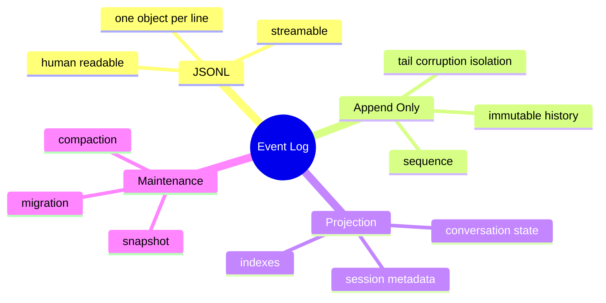

# JSONL、Append-only Log 与 Event Sourcing

## 1. 概念

JSONL 每行一个独立 JSON。Append-only log 只追加不可变事件。WAL 是为恢复而先写日志；Event Sourcing 把事件本身视为业务真相源，当前状态是投影。



## 2. 项目实现

`conversation.jsonl` 每行一个 TranscriptEntry，包含 UUID、时间、类型和 Message。SessionTranscript 追加，TranscriptLoader 重放恢复 Conversation。session.json 是便于列表查询的元数据。

## 3. 追加日志的原理、本质与优势

对话天然是有序事件流。追加避免每轮重写一个不断增长的大 JSON；崩溃通常只损坏最后一行；可以 tail、流式分析和审计。代价是加载要重放，更新/删除不自然，文件增长需要 snapshot/compaction。

## 4. Demo

```java
import java.nio.file.*;
import java.nio.charset.StandardCharsets;
import java.util.stream.Stream;

record Event(long sequence, String type, String payload) {}

static void append(Path path, String jsonLine) throws Exception {
    Files.writeString(path, jsonLine + System.lineSeparator(), StandardCharsets.UTF_8,
        StandardOpenOption.CREATE, StandardOpenOption.APPEND);
}

static Stream<String> replay(Path path) throws Exception {
    return Files.lines(path, StandardCharsets.UTF_8);
}
```

生产代码用 Jackson 序列化，不能手拼 JSON；每条事件应有 monotonic sequence 以检测缺口/乱序。

## 5. WAL vs Event Sourcing：方案取舍

WAL 服务于主数据恢复，日志可在 checkpoint 后丢弃；Event Sourcing 的事件是长期业务历史。HippoBuddy 目前更像 append-only event log。若规定 JSONL 是唯一真相、session.json 可完全重建，并把 edit/delete 表达为新事件，就更接近 Event Sourcing。

## 6. Schema 演进

历史事件不可随代码同步修改。事件应带 version；Loader 支持 upcaster 把 v1 读成当前模型；不要直接复用易变化的 API DTO。未知字段容忍，缺失关键字段明确失败/修复。

## 7. 掌握检查

- [ ] 能区分 JSONL、WAL、Event Sourcing；
- [ ] 能解释追加为何缩小损坏范围；
- [ ] 能设计 sequence/version；
- [ ] 能说明 metadata 投影如何重建。

## 8. 事件模型设计

事件名用过去式事实：UserMessageAdded、AssistantMessageCompleted、ToolCallProposed、ToolResultRecorded、CompactionCreated。事件 payload 只含重建所需数据；createdAt 用于展示，sequence 决定顺序，不能按时钟排序。eventId 用于幂等，sessionId 是 stream key。

若同一文件由单消费者写，sequence 可在内存递增并从尾部恢复；多进程则需要数据库唯一约束/锁。检测 sequence gap/duplicate 并标记损坏。

## 9. Projection 与 Snapshot

Session list、token stats、last message 都是投影。投影可删除后从事件重放。长 stream 可每 N 事件写 snapshot `{lastSequence,state}`，恢复从 snapshot+后续事件开始；snapshot 也必须原子写并有 schema version。

## 10. 修改与撤回的事件语义

Append-only 不直接改旧行。用户编辑消息可追加 MessageEdited(targetId,newContent)，rewind 可追加 SessionRewound(toSequence) 或创建新 branch。读取投影时应用这些事件。直接物理删除虽然简单，却破坏审计和幂等引用。

## 11. 并发 Writer

BufferedWriter append 在同 JVM 由锁/单消费者保护；两个进程同时写可能交错字节。文件锁可串行，但 sequence 分配仍需协调。当前本地单实例假设应明确；SaaS 应迁数据库 stream 表。

## 12. 数据迁移

Event envelope 带 eventVersion。Upcaster 只在读时把 v1转换当前，不重写原文件；复杂迁移可离线生成新 stream，保留备份/hash。Unknown event 不能无声跳过，否则投影不完整。

## 13. 实验

写 1 万事件，比较全量重放和 snapshot；加入 duplicate/gap/乱序；追加 Edit/Rewind 事件重建；模拟两个 Writer；改变 Message Java 类字段，证明持久事件 DTO 仍能读取旧数据。

## 14. 深层面试追问与项目源码

**JSONL每行原子吗？** 文件系统不保证任意长度append整体原子，单writer/锁避免交错，崩溃仍可能半行。**为什么不把整个Conversation序列化？** 每轮O(n)重写、损坏范围大、难流式审计。**Event Sourcing是否必须CQRS？** 不必须，但读投影通常自然分离；项目session.json已经是简单投影。

沿 `SessionTranscript` 的 TranscriptEntry.type、UUID写入，追到 `TranscriptLoader`如何识别compaction boundary和兼容旧行。检查是否有sequence；若只有timestamp/文件顺序，提出增加sequence和schemaVersion。检查 rewind当前是重写/截断还是事件，准确区分现状和理想模型。

进一步设计校验工具：逐行记录byte offset、eventId、version，遇尾行损坏可截到最后有效offset；中间损坏生成repair report，不自动跳过。为文件生成整体hash/index不是替代单事件校验，而是额外完整性证据。

## 15. 提交语义与演进协议

必须定义 append 返回时代表什么：仅进入内存队列是 accepted，写入用户态 buffer 是 written，`FileChannel.force` 后才接近 durable。API 名称和指标要区分这些层级；否则业务把 accepted 当 durable，崩溃时 metadata 已前进而事件消失。

每条 envelope 至少包含 `schemaVersion/eventId/sessionId/sequence/type/timestamp/payload`。Reader 对未知新字段忽略，对未知 type 保留原始事件并告警；破坏性 schema 变化用 upcaster 把旧版本转换为当前内存模型。sequence 由单 writer 分配并检查连续性，UUID 用于重试去重，两者职责不同。

建立 crash 测试：随机切断最后一行每个 byte 位置，loader 只能丢弃/隔离尾残片；复制同一 eventId 不得重复投影；删除中间 sequence 必须报告 gap。这样才能把“文本格式易读”升级成明确恢复契约。

## 项目源码精读

源码入口：[SessionTranscript.java](../../../src/main/java/com/example/agent/session/SessionTranscript.java)、[TranscriptLoader.java](../../../src/main/java/com/example/agent/session/TranscriptLoader.java)、[TranscriptEntry.java](../../../src/main/java/com/example/agent/session/TranscriptEntry.java)

```java
public void append(TranscriptEntry entry) {
    if (uuidCache.containsKey(entry.getUuid())) return;
    uuidCache.put(entry.getUuid(), System.currentTimeMillis());
    String jsonLine = objectMapper.writeValueAsString(entry);
    if (!writeQueue.offer(jsonLine, 100, TimeUnit.MILLISECONDS)) {
        uuidCache.remove(entry.getUuid());
    }
}
```

每个 TranscriptEntry 独占一行，天然支持 append、逐行重放和尾部损坏隔离。UUID cache 提供进程内/近期重试去重；Loader 按文件顺序读取并把不同 type 投影回 messages、title、tags、compaction boundary。JSONL 是格式，Event Log 是语义：只有定义事件 ID、顺序、版本和恢复规则后才接近事件溯源。

`append` 返回时只是成功放入内存队列，不代表已经写文件；队列满会直接跳过。Loader 解析失败会统计损坏行，但如果损坏发生在中间，继续加载后续行可能产生缺失投影。当前 UUID cache 还会过期且没有业务 operationId；不同 UUID 表示的同一工具副作用仍可重复。

> [!IMPORTANT]
> **疑难点：eventId 解决去重，sequence 解决顺序与缺口，二者不可替代。** 建议 envelope 增加 schemaVersion、sessionId、monotonic sequence、eventId、type、timestamp、payload。尾部半行可截断恢复；中间 gap/未知 type 应显式报告，不能静默当作完整会话。

## 16. 源码级实现原理解读

JSONL 的一行边界就是一条记录的 framing，所以 payload 中真实换行必须由 JSON serializer 转义为 `\n`，writer 每次生成完整单行后再 append。它便于 tail、增量恢复和忽略最后一条 partial line，但 JSONL 本身不提供事务、fsync、唯一性或 schema evolution。

`SessionTranscript` 写 append log，`TranscriptLoader` replay 成 Conversation。要可确定恢复，每条 entry 应有 sessionId、eventId、sequence、type、schemaVersion、timestamp 和 payload；Loader 按 sequence 校验缺口/重复，按 eventId 幂等。仅依赖文件行号时，合并、迁移或部分重写会丢身份。

Event Sourcing 的真相源是业务事件并能重建状态；如果 transcript 混合 UI delta、日志文本和偶然快照，却没有稳定事件语义，它只是 append-only audit log。面试中应准确区分，不要因为格式是 JSONL 就声称完整 Event Sourcing。

## 17. 可运行核心实现：有序追加与容错 Replay

```java
import java.io.*;
import java.nio.charset.StandardCharsets;
import java.nio.file.*;
import java.util.*;

public final class JsonlLogDemo {
    record Event(UUID id, long seq, int version, String type, String payload) {}
    static String encode(Event e) {
        String escaped = e.payload().replace("\\", "\\\\").replace("\"", "\\\"")
                .replace("\r", "\\r").replace("\n", "\\n");
        return e.id() + "\t" + e.seq() + "\t" + e.version() + "\t" + e.type() + "\t" + escaped;
    }
    static void append(Path file, Event event) throws IOException {
        String line = encode(event) + "\n";
        Files.writeString(file, line, StandardCharsets.UTF_8,
                StandardOpenOption.CREATE, StandardOpenOption.APPEND);
    }
    static List<Event> replay(Path file) throws IOException {
        List<Event> out = new ArrayList<>(); Set<UUID> seen = new HashSet<>(); long expected = 1;
        for (String line : Files.readAllLines(file, StandardCharsets.UTF_8)) {
            if (line.isBlank()) continue;
            String[] p = line.split("\t", 5);
            if (p.length < 5) break;                     // 只容忍文件尾 partial record
            Event e = new Event(UUID.fromString(p[0]), Long.parseLong(p[1]),
                    Integer.parseInt(p[2]), p[3], p[4]);
            if (!seen.add(e.id())) continue;
            if (e.seq() != expected++) throw new IOException("sequence gap at " + e.seq());
            out.add(e);
        }
        return List.copyOf(out);
    }
}
```

为了不依赖 JSON 库，Demo 用 tab framing 展示同一原理；项目应继续用 Jackson 输出真正 JSONL。关键是整条记录一次构造、稳定身份和 replay 校验。多 writer 不能只依赖 `APPEND` 猜测整行原子，应单 writer 或 FileChannel lock；崩溃耐久性还要结合下一篇的 force/fsync。

## 延伸学习：博客与电子书

- [JSON Lines 规范](https://jsonlines.org/)：掌握 UTF-8、每行一个 JSON value 和换行约定。
- [Martin Fowler：Event Sourcing](https://martinfowler.com/eaaDev/EventSourcing.html)：理解事件日志、重放、快照和逆向事件。
- [Designing Data-Intensive Applications](https://dataintensive.net/)：深入日志、复制、批处理与流处理的共同模型。

## 思维导图节点学习博客

本专题思维导图中的 12 个末级知识点均已展开为独立博客：[进入节点博客目录](../mindmap-blogs/05-context-storage/03-jsonl-event-log/README.md)。
