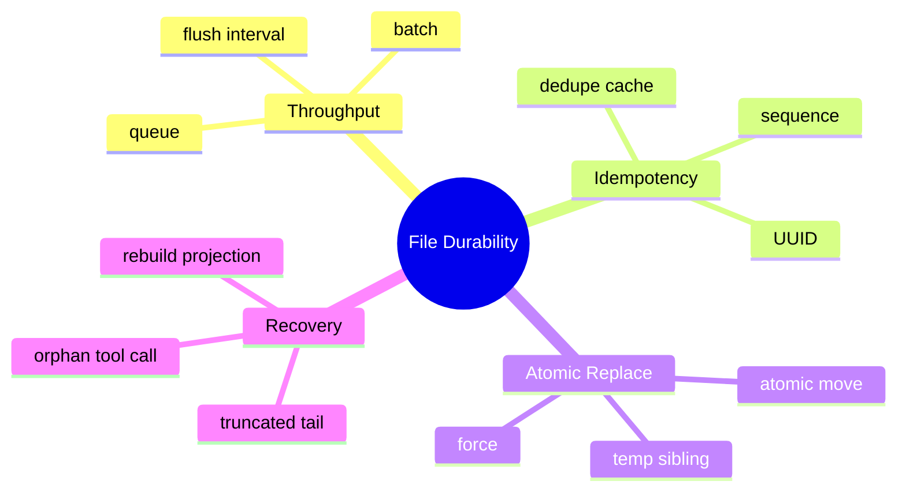

# 批量刷盘、幂等、原子写与崩溃恢复

## 1. 概念与耐久性原理

Java buffer → OS page cache → 存储设备。`BufferedWriter.flush()` 只保证进入下层流/OS，不等于断电后仍在；`FileChannel.force(true)` 请求同步数据和元数据。



## 2. 项目实现

SessionTranscript：有界队列 10000、batch 50、500ms flush、UUID 缓存 2 小时/最多 100000。SessionStorage 小文件 temp + ATOMIC_MOVE。MemoryStore 关键写 temp、`FileChannel.force(true)`、atomic move。TranscriptLoader 修复尾行和不完整工具对。

## 3. 原子替换原理

直接覆盖 JSON，崩溃会留下半文件。安全模式：同目录写完整 temp → flush/force → rename 替换。rename 切换目录项通常原子，读者看到旧版或新版，不看到半版。跨文件系统 move 不保证原子；某些平台不支持 ATOMIC_MOVE，需要降级和告警。

## 4. Demo

```java
import java.nio.ByteBuffer;
import java.nio.channels.FileChannel;
import java.nio.file.*;

static void atomicWrite(Path target, byte[] bytes) throws Exception {
    Path temp = target.resolveSibling(target.getFileName() + ".tmp");
    try (FileChannel ch = FileChannel.open(temp,
            StandardOpenOption.CREATE, StandardOpenOption.TRUNCATE_EXISTING,
            StandardOpenOption.WRITE)) {
        ch.write(ByteBuffer.wrap(bytes));
        ch.force(true);
    }
    Files.move(temp, target, StandardCopyOption.ATOMIC_MOVE,
        StandardCopyOption.REPLACE_EXISTING);
}
```

## 5. 幂等原理

发送方无法区分“写失败”和“写成功但确认丢失”，重试会重复。每条记录带 UUID，写入前查 dedupe。内存窗口只能提供有限幂等；强保证需持久唯一索引或扫描历史。

## 6. 批量取舍

batch 提高吞吐，但进程崩溃会丢队列/未 force 数据。Transcript 队列满时丢弃会损害恢复，应考虑同步降级写或标记 session incomplete。优雅关闭要停止生产、drain、flush，再关消费者。

## 7. 恢复原则

只自动截掉损坏尾行；中间损坏说明严重问题，不应静默跳过。重放后校验 sequence 和 tool pair，元数据视为可重建投影。

## 8. 掌握检查

- [ ] 能画出数据到磁盘的层次；
- [ ] 能区分 flush 与 fsync/force；
- [ ] 能实现 temp + atomic move；
- [ ] 能解释有限幂等窗口。

## 9. 操作系统与文件系统层次

write 进入内核 page cache 后进程崩溃通常仍由 OS 刷盘，但整机断电可能丢。`force(false)` 主要数据，`force(true)` 请求元数据也同步；具体保证受 OS/文件系统/硬件 cache 影响。原子 rename 保证可见性切换，不自动保证新文件内容已耐久，所以 force 必须在 move 前。

极端耐久还需 fsync 父目录确保 rename 目录项落盘，Java 跨平台 API 支持有限。项目本地应用可接受合理层级，但面试不能说“ATOMIC_MOVE=绝对不丢”。

## 10. Partial Write 与编码

FileChannel.write 不保证一次写完 ByteBuffer，应循环 `while (buffer.hasRemaining()) write`。BufferedWriter 处理字符编码，但异常时可能已写半个 UTF-8 字符；Loader按行解码/解析尾部，损坏尾行丢弃。每行可附 checksum，提高检测能力。

## 11. UUID Cache 的边界

LRU/时间窗口减少内存，但过期重复会再次写。启动扫描最近事件恢复 cache 成本随文件增长；可维护 side index，但又引入一致性。SQLite unique(event_id) 是强幂等演进路径。

UUID 防重复，不防 sequence 冲突；两条不同 UUID 的同一业务操作仍会重复。工具需要业务 callId。

## 12. Queue Full 的策略层级

先短暂阻塞；仍满则同步写；同步也失败则停止产生副作用并标记 storage unhealthy。直接丢 Transcript 只适合明确非关键事件。Health/readiness 应暴露磁盘只读、空间不足、writer disabled。

## 13. Crash Matrix

逐个注入：temp 创建前、写一半、force 前、force 后 move 前、move 后 metadata 更新前。每个点重启，期望目标为旧/新完整版本，临时文件可清理，projection 可重建。Windows 文件被杀毒软件占用导致 move 失败也要覆盖。

## 14. 进阶 Demo 修正

文档前面的 FileChannel Demo 应循环写完整 buffer，并在 finally 保留/清理 temp 策略。真实实现对 ATOMIC_MOVE 不支持捕获 AtomicMoveNotSupportedException，是否降级普通 move由数据等级决定并记录告警。

## 15. 深度实验与面试追问

实现 FailpointFileWriter，在OPEN/WRITE_HALF/FORCE/MOVE/METADATA各点抛异常，重启读取并生成状态矩阵。不要真的强杀生产目录，在TempDir复制流程。对Transcript queue满分别测试drop/sync fallback/fail closed。

**`Files.writeString`返回是否等于耐久？** 否，只完成调用语义；OS/设备持久需force。**原子move与锁有什么关系？** move保证读者不见半文件，锁防多个writer互相覆盖，二者解决不同问题。**为什么同目录temp？** 跨filesystem不能原子rename，且权限/配额不同。

项目源码对比 SessionStorage与MemoryStore：谁force、谁只flush、谁有atomic fallback。基于数据重要性解释差异，并为Conversation关键事件提出更强durability模式，而不是笼统说所有文件都原子安全。

## 16. rename 之后仍可能丢什么

POSIX 上要获得更强的 crash consistency，通常不仅 `force` 临时文件内容，还要在 rename 后同步父目录，保证目录项更新落盘；Java 跨平台对目录 fsync 支持有限，需要明确平台保证和降级。Windows 上打开句柄、杀毒软件和 replace 语义也会影响 move，fallback 到非原子复制时必须告警，不能仍声称原子提交。

耐久级别应产品化：普通 token chunk 可异步批量；关键用户消息/工具副作用记录需要 write-ahead 或同步确认；派生 summary/index 可丢后重建。所有数据都每行 fsync 会严重牺牲吞吐，所有数据只 flush 又无法兑现恢复承诺，关键是按可重建性分级。

## 项目源码精读

源码入口：[SessionTranscript.java](../../../src/main/java/com/example/agent/session/SessionTranscript.java)、[SessionStorage.java](../../../src/main/java/com/example/agent/session/SessionStorage.java)、[MemoryStore.java](../../../src/main/java/com/example/agent/memory/MemoryStore.java)

```java
// Transcript：批量写 + flush
writer.write(line);
writer.newLine();
writer.flush();

// Memory：临时文件 + force + 原子替换
channel.write(ByteBuffer.wrap(content.getBytes(UTF_8)));
channel.force(true);
Files.move(tempFile, file, ATOMIC_MOVE, REPLACE_EXISTING);
```

两条路径体现了数据等级：Transcript 为高频追加，用 queue/batch/flush 换吞吐；Memory 低频整文件更新，用 temp + fsync + rename 追求 crash consistency。`flush()` 主要把 Java buffer 交给 OS，`FileChannel.force(true)` 才请求把内容和元数据同步到设备；`ATOMIC_MOVE` 保证观察者看到旧文件或新文件，不看到半文件。

SessionStorage 写 temp 后原子 move，但只捕获 `UnsupportedOperationException`，实际不支持原子移动通常还可能表现为 `AtomicMoveNotSupportedException`（IOException 子类），此时 save 会失败而不是降级。MemoryStore 对 `channel.write` 只调用一次；FileChannel 允许部分写入，严格实现要 while(buffer.hasRemaining())。rename 后父目录项是否耐久也受平台影响。

> [!IMPORTANT]
> **疑难点：原子性、持久性、互斥是三件不同的事。** rename 防半文件，force 抗掉电，锁防并发 writer；缺少任意一个都有不同故障。还要明确 API 返回的是 accepted、written、flushed 还是 durable，不能把 queue.offer 成功描述成“消息已保存”。

## 17. 源码级实现原理解读

`Writer.flush()` 只把 Java 用户态缓冲推给操作系统，`FileChannel.force(true)` 才请求把文件内容和元数据推进稳定存储；即使 force 返回，硬件/文件系统仍有各自保证。`Files.move(ATOMIC_MOVE)` 只保证命名切换不暴露半文件，不自动保证新文件数据在断电后存在。

覆写类数据的可靠顺序通常是：同目录写 temp → channel.force(true) → atomic move → 尽可能同步目录元数据。追加日志则需要定义 ack：是入内存队列、write、flush 还是 force 后才对调用方成功。批量 force 提升吞吐，但扩大最多丢失窗口，文档和指标必须说清楚。

项目 Transcript 的 `forceFlush()` 应在 session destroy/shutdown 前阻止新 append、排空队列、flush/force、再关闭 writer。单纯看到队列为空并不足够：消费者可能已经 take 但尚未落盘，需要一个 barrier/ack sequence 表明某个 seq 已 durable。

## 18. 可运行完整实现：Force 后原子替换

```java
import java.io.IOException;
import java.nio.ByteBuffer;
import java.nio.channels.FileChannel;
import java.nio.file.*;

public final class DurableReplace {
    static void write(Path target, byte[] bytes) throws IOException {
        Path absolute = target.toAbsolutePath().normalize();
        Files.createDirectories(absolute.getParent());
        Path temp = Files.createTempFile(absolute.getParent(), ".durable-", ".tmp");
        boolean moved = false;
        try (FileChannel channel = FileChannel.open(temp, StandardOpenOption.WRITE,
                StandardOpenOption.TRUNCATE_EXISTING)) {
            ByteBuffer buffer = ByteBuffer.wrap(bytes);
            while (buffer.hasRemaining()) channel.write(buffer); // write 允许 partial
            channel.force(true);
        }
        try {
            Files.move(temp, absolute, StandardCopyOption.ATOMIC_MOVE,
                    StandardCopyOption.REPLACE_EXISTING);
            moved = true;
        } catch (AtomicMoveNotSupportedException e) {
            throw new IOException("atomic replace unsupported", e);
        } finally {
            if (!moved) Files.deleteIfExists(temp);
        }
    }
}
```

循环 write 是必要的，因为 FileChannel.write 不保证一次写完整 buffer。Windows/不同文件系统对目录 fsync 支持不同，不能用跨平台 Java API 做绝对承诺；系统应在目标平台通过 crash test 验证。恢复时扫描合法 target 和遗留 temp，根据 checksum/version 选择，而不是看到 temp 就无条件覆盖。

## 延伸学习：博客与电子书

- [Java FileChannel API](https://docs.oracle.com/en/java/javase/21/docs/api/java.base/java/nio/channels/FileChannel.html)：精读部分写入、`force` 和并发语义。
- [PostgreSQL：Write-Ahead Logging](https://www.postgresql.org/docs/current/wal-intro.html)：借成熟数据库理解 WAL、提交与恢复。
- [Designing Data-Intensive Applications](https://dataintensive.net/)：系统学习存储引擎、日志、崩溃恢复和复制。

## 思维导图节点学习博客

本专题思维导图中的 12 个末级知识点均已展开为独立博客：[进入节点博客目录](../mindmap-blogs/05-context-storage/04-file-durability/README.md)。
