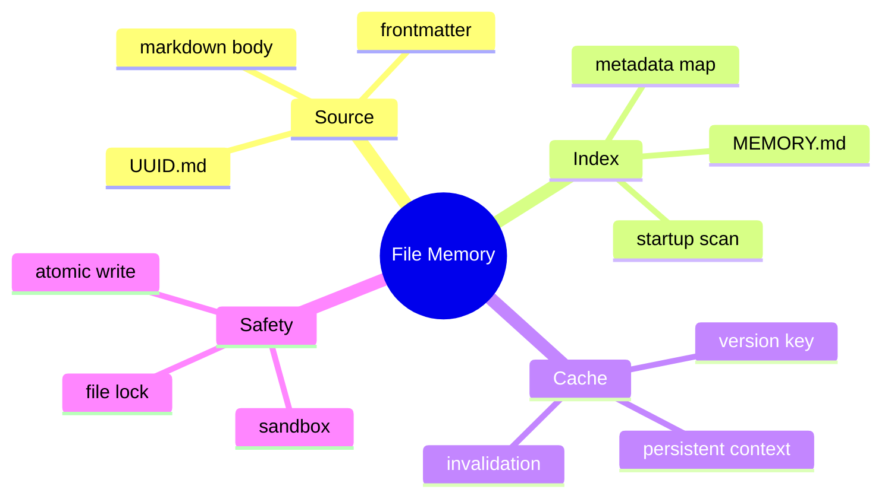

# Markdown 记忆、索引与缓存失效

## 1. 概念

Markdown body 保存人类/模型可读内容，frontmatter 保存机器元数据。一文件一条记忆构成本地 document store；内存索引是源文件的派生投影。



## 2. 项目实现

MemoryStore 通过 MemoryToolSandbox 限制根目录；启动扫描 Markdown 建 ConcurrentHashMap 元数据索引；按需读取正文；异步维护最多 200 行/25KB 的 MEMORY.md；一文件锁 + temp/force/atomic move。MemoryRetriever 只自动注入 USER_PREFERENCE 和 PROJECT_CONTEXT，每条最多约 2000 字符、最多 10 条。

## 3. Frontmatter 示例

```markdown
---
id: 123e4567
type: PROJECT_CONTEXT
tags: [java, build]
updatedAt: 2026-08-25T10:00:00Z
---
# Build constraints
The project requires Java 21 preview features.
```

元数据支持过滤/排序，body 保持自由表达。Parser 必须处理缺失字段、未知类型、用户手工损坏和 YAML 注入边界。

## 4. 索引原理与本质

索引不是事实源，删除后应能从 UUID.md 重建。写入流程要么先更新源文件再异步更新索引，要么使用事件确保最终一致；不能让 MEMORY.md 成为第二份无法判断谁正确的主数据。

## 5. 缓存失效

项目持久上下文 cache key 基于符合类型的数量 + updatedAt 时间和。它简单但存在理论碰撞，外部手改未更新时间时也会陈旧。更稳方案：全局 generation、目录 watcher、内容 hash 或每次写入增加 monotonic version。

## 6. Demo：版本缓存

```java
import java.util.concurrent.atomic.*;

final class VersionedCache<T> {
    private final AtomicLong generation = new AtomicLong();
    private volatile long cachedGeneration = -1;
    private volatile T cached;

    void invalidate() { generation.incrementAndGet(); }
    T get(java.util.function.Supplier<T> loader) {
        long g = generation.get();
        if (cachedGeneration != g) {
            synchronized (this) {
                if (cachedGeneration != generation.get()) {
                    cached = loader.get();
                    cachedGeneration = generation.get();
                }
            }
        }
        return cached;
    }
}
```

## 7. 掌握检查

- [ ] 能区分源数据、索引和缓存；
- [ ] 能解释 frontmatter 的作用；
- [ ] 能设计可重建索引；
- [ ] 能指出时间戳和作为 key 的不足。

## 8. Frontmatter Schema 与容错

定义 id/type/tags/createdAt/updatedAt/schemaVersion，id 与文件名是否一致要校验。未知 type 保留 raw 或映射 UNKNOWN；tags 去重/规范化；body 允许自由 Markdown。用户手改导致 YAML 失败时，将文件放 quarantine/报告错误，不能让一个坏文件阻止全部 Memory 启动。

## 9. 写入与索引一致性

源文件 atomic write 成功后更新内存 index，再异步重建 MEMORY.md。如果进程在源文件成功、index 更新前崩溃，重启 scan 可恢复，说明源文件是真相。反向顺序会让 index 指向不存在内容。删除同理：先定义 tombstone/删除语义，再更新投影。

## 10. 外部编辑

用户可能用编辑器改 Memory。WatchService 事件 debounce 后解析单文件并增加 generation；事件丢失时周期全量 scan兜底。写入时用 file identity/version 防 watcher 把自己的 temp/move 识别为两次冲突更新。

## 11. Cache Stampede

generation 改变后多个请求同时 loader，前面 Demo 的 synchronized double-check 可保证单进程一次重建。若 loader 失败，保留旧 cache 还是返回空要看数据陈旧容忍度；持久偏好可 stale-while-revalidate，但安全 Rule 不宜使用旧值。

## 12. Index 大小限制

MEMORY.md 200 行/25KB 是 Prompt 成本保护。排序策略决定哪些记忆可发现：类型优先、最近更新、访问频率或 pin。不能只截 Map 迭代前 200 条，因为顺序不稳定。被省略条目仍可通过搜索 Tool 访问。

## 13. 实验

损坏一个 frontmatter、id冲突、外部修改不更新时间、一次写入后崩溃、并发读取重建 cache、记忆超过 200 条。验证启动不全挂、索引可重建、排序稳定、缓存最终更新。

## 14. 深层面试追问与项目现状

**为何一记忆一文件而非一个大Markdown？** 单条更新/锁/冲突/恢复范围小，代价是目录文件数和全量scan。**内存索引是否等于数据库索引？** 都是加速映射，但当前无事务/查询优化器，且以源文件重建。**缓存key用时间戳和会碰撞实际严重吗？** 概率可能低，但外部编辑不更新时间更现实；generation由所有受控写入递增更清晰。

检查 MemoryModule 注释“注册记忆工具”与实际Recall注册被注释，AutoDream默认false、addPendingMemory TODO；文档和面试必须区分存储/注入已用与自动整合未完成。检查MemoryStore的vector search旧接口是否真的返回结果。

安全上Memory可能含Secret，Markdown可被普通用户/同步工具读取。需文件权限、加密/不落敏感内容、删除语义和备份策略。索引摘要不要意外把敏感正文复制到更多文件。

## 15. 一致性协议与可重建性

最简单可靠的模型是“Memory 文件为真源，内存索引为派生数据”。写入流程在 workspace 写锁内原子替换文件，成功后递增 generation 并更新/失效索引；进程崩溃导致索引丢失时全量扫描重建。索引绝不能先宣布新值再写真源，否则失败后读到不存在的记忆。

外部编辑通过 `WatchService` 只能作为失效提示，因为事件会合并、溢出或丢失；命中缓存前可比较目录 generation/文件 fingerprint，定期全量校验作为兜底。索引 entry 保存 memoryId、type、sourcePath、contentHash、updatedAt 和摘要，正文按需加载，避免重复驻留。

删除使用 tombstone 还是物理删除取决于同步/审计需求；无论哪种都要使旧缓存立即不可见。深度实验在原子 move 前后注入失败、模拟 WatchService overflow、外部保留 mtime 修改正文，证明索引最终能回到真源状态。

## 项目源码精读

源码入口：[MemoryStore.java](../../../src/main/java/com/example/agent/memory/MemoryStore.java)、[MemoryRetriever.java](../../../src/main/java/com/example/agent/memory/MemoryRetriever.java)

```java
private final ConcurrentHashMap<String, MemoryEntryMeta> index = new ConcurrentHashMap<>();

public void add(MemoryEntry entry) {
    assertCanWrite(entry.getId());
    writeMemoryFile(entry);          // 真源先提交
    index.put(entry.getId(), createMeta(entry));
    scheduleIndexUpdate();           // MEMORY.md 异步派生
}
```

设计把“一记忆一 Markdown 文件”作为真源，ConcurrentHashMap 只保存元数据，正文按 ID 加载；MEMORY.md 是给人和模型浏览的派生索引。启动时索引文件与实际文件数量不一致会触发目录扫描重建，这就是 cache/index 可重建原则。真源先写成功、再发布内存元数据，顺序正确地避免“索引指向不存在文件”。

但只比较 indexCount 和 fileCount 检不出“一条索引指错文件、同时另一条文件遗漏”的等量错误；需要 ID/content hash 校验。异步重写 MEMORY.md 遍历 ConcurrentHashMap，顺序不稳定，且并发更新可能生成跨时刻视图。MemoryRetriever 的缓存键是数量加 lastUpdated 时间戳总和，存在加和碰撞，外部编辑未更新时间也不会失效。

> [!IMPORTANT]
> **疑难点：缓存一致性不是要求缓存永远同步，而是明确真源和失效协议。** 受控写成功后增加单调 generation；缓存项绑定 generation/contentHash；外部 WatchService 仅作失效提示，overflow 后全量扫描。索引失败不应回滚已提交真源，因为索引可以重建。

## 16. 源码级实现原理解读

Markdown 文件应是真相源，index 是可重建投影，cache 是可丢弃加速层。这个层次决定恢复策略：index 损坏就扫描 Markdown 重建；cache 不一致就失效；不能让 cache 中只有而文件中没有的数据被当作长期记忆。

`MemoryStore` 写入时至少经历：sandbox path → 生成稳定 memory id/frontmatter → temp+atomic write → 更新/标脏 index → 失效查询 cache。若先更新 index 后文件写失败，会出现幽灵条目；若文件成功而 index 失败，查询短暂漏读但可通过重建恢复，因此“文件先、索引后”更符合真相层次。

外部编辑使进程内版本号不足。索引项应保存 content hash/mtime/size，并有 watcher 或查询时校验；watcher 事件可能丢/合并，所以启动扫描和周期 reconcile 仍需要。Cache key 还要包含 query、filters、limit、scorerVersion 与 indexGeneration。

## 17. 可运行完整实现：Generation 驱动的缓存失效

```java
import java.util.*;
import java.util.concurrent.*;
import java.util.concurrent.atomic.AtomicLong;
import java.util.function.Supplier;

public class GenerationCacheDemo<K,V> {
    record Entry<V>(long generation, V value) {}
    private final AtomicLong generation = new AtomicLong();
    private final ConcurrentHashMap<K,Entry<V>> cache = new ConcurrentHashMap<>();

    V get(K key, Supplier<V> loader) {
        long observed = generation.get();
        Entry<V> entry = cache.get(key);
        if (entry != null && entry.generation() == observed) return entry.value();
        Entry<V> loaded = cache.compute(key, (k, old) -> {
            long now = generation.get();
            if (old != null && old.generation() == now) return old;
            return new Entry<>(now, Objects.requireNonNull(loader.get()));
        });
        return loaded.value();
    }
    void afterDurableMutation() { generation.incrementAndGet(); }

    public static void main(String[] args) {
        GenerationCacheDemo<String,List<String>> c = new GenerationCacheDemo<>();
        var loads = new java.util.concurrent.atomic.AtomicInteger();
        c.get("q", () -> { loads.incrementAndGet(); return List.of("v1"); });
        c.get("q", () -> { loads.incrementAndGet(); return List.of("wrong"); });
        c.afterDurableMutation();
        c.get("q", () -> { loads.incrementAndGet(); return List.of("v2"); });
        if (loads.get() != 2) throw new AssertionError(loads);
    }
}
```

Generation 让任何成功持久化的 mutation 一次性使所有查询缓存逻辑过期，简单可靠但粒度粗。数据量大后可按 memory type/tag 分代。`compute` 防同 key cache stampede，但 loader 很慢时会占该 key 的 bin 锁；更成熟实现可缓存 CompletableFuture 并处理失败 future 的及时清除。

## 延伸学习：博客与电子书

- [Designing Data-Intensive Applications](https://dataintensive.net/)：重点学习派生数据、索引、缓存失效和流式维护视图。
- [SQLite FTS5 官方文档](https://www.sqlite.org/fts5.html)：了解文件量增长后如何引入可重建全文索引。
- [Martin Fowler：Cache-Aside](https://martinfowler.com/bliki/TwoHardThings.html)：从命名与缓存失效问题切入，结合本项目 generation 方案思考。

## 思维导图节点学习博客

本专题思维导图中的 12 个末级知识点均已展开为独立博客：[进入节点博客目录](../mindmap-blogs/05-context-storage/05-memory-index-cache/README.md)。
