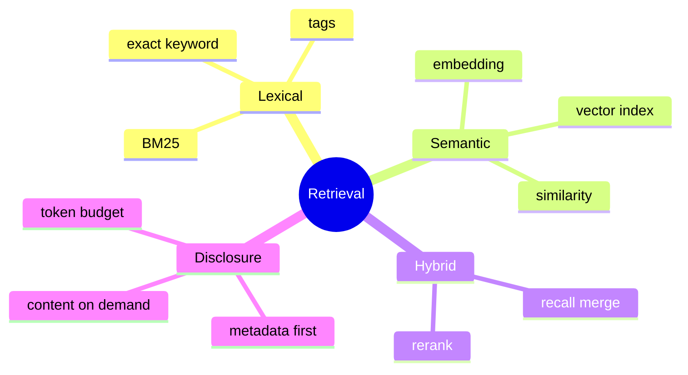

# 关键词、向量检索与 Progressive Disclosure

## 1. 检索范式

关键词检索比较字面匹配；BM25 基于词频/逆文档频率；向量检索比较 embedding 距离；混合检索组合字面和语义。Progressive Disclosure 先给轻量索引，需要时再加载全文。



## 2. 项目实现

当前 Memory 主路线强调文件与类型/标题/标签/关键词；持久偏好和项目约束自动注入，其他详细知识不全量注入。SkillManager 只把技能名称/描述放入 Prompt，模型调用 skill 工具后读取完整 Markdown。

## 3. 本质取舍

向量不是“更高级的模糊搜索”，它用训练模型定义语义空间，可能召回同义内容，也可能召回语义相似但任务无关内容。需要 embedding 成本、索引更新、维度/模型版本迁移和评测。

本地个人记忆规模小、强调透明可编辑，keyword/tag 足够且零部署。规模/表达多样性上升时再引入 BM25 + vector + rerank。

## 4. Demo：简单混合评分

```java
record Candidate(String id, double keywordScore, double vectorScore, long ageDays) {}

static double score(Candidate c) {
    double recency = Math.exp(-c.ageDays() / 30.0);
    return 0.45 * c.keywordScore() + 0.45 * c.vectorScore() + 0.10 * recency;
}
```

权重必须用标注查询集调优，不能凭感觉。还要按 memory type、workspace、权限先过滤，再排序。

## 5. 评测

建立 query→relevant memory 数据集，观察 Recall@K、MRR/NDCG 和最终任务成功率。自动注入还要测“错误记忆污染”和 Prompt Token 成本。检索高分不代表生成一定更好。

## 6. Progressive Disclosure 类比

像数据库索引指向行、虚拟内存按需换页：先暴露名称/描述/标签，确认相关后读正文。这样 Skill/Memory 数量增长不会线性扩大 system prompt，也保持前缀缓存。

## 7. 掌握检查

- [ ] 能区别 keyword/BM25/vector；
- [ ] 能解释 embedding 版本迁移；
- [ ] 能设计检索评测集；
- [ ] 能用 progressive disclosure 降低 Token。

## 8. BM25 原理

TF 衡量词在文档出现，IDF 降低常见词权重；BM25 对 TF 做饱和并按文档长度归一。它比简单 contains 更能排序，但中文需要分词，代码可按标识符/camelCase/snake_case 切分。标签和标题可设置字段 boost。

## 9. Vector 检索细节

Embedding 维度、距离（cosine/dot/L2）、归一化必须与索引一致。更换 embedding model 后旧向量不可直接比较，需要 versioned index/重建。ANN（HNSW等）用近似换速度，Recall 需测。向量只对候选语义相关，不保证事实新鲜/权限合法。

## 10. Hybrid 与 Rerank

先 metadata/权限过滤；BM25 和 vector 各取 topK；用 reciprocal rank fusion 合并；可用 reranker 对 query-document 对精排；最后按 Token budget选内容。过滤必须在返回前，不能先召回敏感跨 workspace 数据再希望模型忽略。

## 11. Chunking

长 Memory按标题/段落切 chunk，保留 parent id/path；chunk 太小丢上下文，太大降低定位并耗 Token。代码按 symbol、文档按 section。返回时邻近 chunk 合并并去重，引用原文件和更新时间。

## 12. 记忆污染与过期

模型生成的 Memory 可能错误。记录 source/evidence/confidence，用户可编辑；项目事实随代码变化需要 freshness/validation。USER_PREFERENCE 和 PROJECT_CONTEXT 自动注入是高影响路径，应限制数量并提供撤销。

## 13. 评测深化

Recall@K 只测是否找回；Precision 控制噪音；MRR/NDCG 测排序；最终还需 Answer Faithfulness/Task Success。建立 hard negative（术语相似但错误项目）验证语义检索不会误召回。比较 Token/延迟/费用。

## 14. 实验

实现简单 BM25，对 50 条记忆与 contains 比较；增加 embedding mock score 做 RRF；更换 embedding version验证拒绝混用；构造两个 workspace 同名秘密，验证权限过滤；调整 chunk size 观察召回。

## 15. 失败模式与深层追问

失败包括召回为空、错误记忆排第一、过期事实、跨workspace泄漏、chunk缺上下文、注入过多挤掉用户消息、embedding服务不可用。每种需降级：关键词fallback、freshness boost、权限先过滤、parent扩展、Token cap。

**向量相似度0.9代表90%相关吗？** 不是概率，只是空间度量，阈值需数据校准。**RAG为何仍会幻觉？** 检索只提供证据，生成可能忽略/误解；要引用和faithfulness评测。**Progressive disclosure会不会多一次Tool round？** 会，以延迟换Prompt规模和缓存，常用Skill可短索引优化。

项目现状主要是关键词/类型持久注入，不应声称成熟RAG。可先实现显式 recall tool并记录查询/点击/采用反馈，再决定是否引入向量库，避免无评测复杂化。

## 16. 两阶段检索的内部原理

第一阶段追求召回率：对 query 做语言/标识符归一化，同时运行 BM25/关键词、向量近邻和 metadata 过滤，取较大的候选集。第二阶段追求精度：用 reranker 或可解释加权公式重排，例如 `score = 0.45*semantic + 0.30*lexical + 0.15*freshness + 0.10*authority`。权重不是通用答案，要用本项目问答集校准；不同来源分数必须先归一化，不能直接相加 cosine 与 BM25 原值。

权限过滤应尽量发生在候选生成前，而不是取回正文后再删，否则向量索引、日志或 timing 可能泄漏跨 workspace 内容。每个 chunk 要携带 `documentId/source/version/acl/offset`，命中碎片后可按 Token 预算扩展相邻块或父标题，解决“局部相似但缺定义”的问题。

Progressive disclosure 的本质是把上下文选择从“一次性猜测”变成可反馈的控制循环：先给名称、摘要、来源和成本；模型明确选择后才取正文；若证据不足再扩大范围。它节省的是昂贵且会干扰注意力的模型上下文，不只是网络字节。

## 17. 如何证明检索真的有效

建立带标准证据位置的查询集，计算 Recall@K、MRR/nDCG、最终答案 evidence recall、faithfulness 和每题注入 Token；另外记录“召回但未被采用”。做消融实验分别关闭向量、关键词、freshness、rerank，才能知道复杂组件是否贡献价值。只展示几个看起来不错的检索结果不能证明系统有效。

## 项目源码精读

源码入口：[MemoryStore.java](../../../src/main/java/com/example/agent/memory/MemoryStore.java)、[RelevanceScorer.java](../../../src/main/java/com/example/agent/memory/RelevanceScorer.java)、[RecallMemoryTool.java](../../../src/main/java/com/example/agent/tools/RecallMemoryTool.java)

```java
for (MemoryEntryMeta meta : index.values()) {
    if (matchesQuery(meta, query)) {
        MemoryEntry entry = findById(meta.id);
        if (entry != null) results.add(entry);
    }
}
results.sort((a, b) -> Double.compare(
    RelevanceScorer.calculateRelevance(b, query),
    RelevanceScorer.calculateRelevance(a, query)));
```

当前是两层词法检索：先用标题、标签、类型做候选过滤，再加载正文并按标签命中和内容 contains 加权排序；`recall_memory` 让模型主动选择何时检索，符合 progressive disclosure。它省掉每轮全量注入的 Token，也把“是否需要长期记忆”变成带反馈的控制步骤。

这不是成熟向量 RAG：`searchSimilar` 已废弃并返回空；空格分词对连续中文几乎无效；contains 没有词频、文档频率、字段长度归一化，0.4/0.1 也不是概率。更隐蔽的是 `calculateRelevanceScore(entry)` 用 entry 自己的 content 作为 query，基础匹配天然偏高，不能代表用户查询相关性。

> [!IMPORTANT]
> **疑难点：先过滤权限，再做候选检索。** 如果跨 workspace 向量/正文先被取回再过滤，索引、日志和 timing 都可能泄漏信息。每个 chunk 要携带 source/version/ACL/offset；召回率、排序质量和最终答案忠实度必须分别评测。

## 18. 源码级实现原理解读

检索链应明确四阶段：candidate generation、filter、score/rerank、context packing。关键词/BM25 对精确标识符和罕见词强；向量对语义改写强；metadata filter 防止把错误 workspace、过期或无权限记忆送入模型；reranker 用更贵模型精排较小候选集；最后按 Token 预算打包而非固定条数。

当前 `MemoryRetriever/RelevanceScorer` 更接近词法与元数据评分，不能把它描述成已实现成熟 vector RAG。面试时应区分“设计路线”和“现有事实”：向量检索需要 embedding 生成、版本化、ANN index、更新/删除、一致性与评测，项目若没有这些组件就是未来方案。

Progressive Disclosure 是先给摘要/标题/handle，需要时再 fetch full content。它降低无关 Token，但 handle 必须经过权限校验和版本绑定，不能让模型通过猜 ID 读取越权记忆。

## 19. 可运行完整实现：BM25 + RRF 混合排序

```java
import java.util.*;

public class HybridRetrievalDemo {
    record Doc(String id, String text) {}
    static double bm25(int tf, int docLen, double avgLen, int docFreq, int totalDocs) {
        double k1 = 1.2, b = 0.75;
        double idf = Math.log(1.0 + (totalDocs - docFreq + 0.5) / (docFreq + 0.5));
        return idf * (tf * (k1 + 1)) / (tf + k1 * (1 - b + b * docLen / avgLen));
    }
    static List<String> rrf(List<List<String>> rankings, int k) {
        Map<String,Double> score = new HashMap<>();
        for (List<String> ranking : rankings)
            for (int rank = 0; rank < ranking.size(); rank++)
                score.merge(ranking.get(rank), 1.0 / (k + rank + 1), Double::sum);
        return score.entrySet().stream()
                .sorted(Map.Entry.<String,Double>comparingByValue().reversed()
                        .thenComparing(Map.Entry::getKey))
                .map(Map.Entry::getKey).toList();
    }
    public static void main(String[] args) {
        if (!(bm25(3, 100, 120, 2, 100) > bm25(1, 100, 120, 2, 100)))
            throw new AssertionError("term frequency should help with saturation");
        List<String> mixed = rrf(List.of(List.of("a","b","c"), List.of("b","d","a")), 60);
        if (!mixed.get(0).equals("b")) throw new AssertionError(mixed);
    }
}
```

BM25 的 TF 增益会饱和，文档长度归一化避免长文因词多天然占优；RRF 不要求词法分数与余弦分数在同一量纲，只融合排名。真正上线前要用带相关性标注的 query 集测 Recall@K、MRR/nDCG，再做端到端任务成功率与 Token 成本评测，不能只看几个主观示例。

## 延伸学习：博客与电子书

- [RAG 原始论文](https://arxiv.org/abs/2005.11401)：理解检索器、生成器与端到端训练的基本结构。
- [Introduction to Information Retrieval（免费电子书）](https://nlp.stanford.edu/IR-book/)：系统掌握倒排索引、TF-IDF、BM25 和评测指标。
- [OpenAI Cookbook：RAG 示例](https://cookbook.openai.com/examples/vector_databases/readme)：把切块、embedding、检索和答案生成串成可运行实验。

## 思维导图节点学习博客

本专题思维导图中的 11 个末级知识点均已展开为独立博客：[进入节点博客目录](../mindmap-blogs/05-context-storage/06-retrieval-progressive-disclosure/README.md)。
