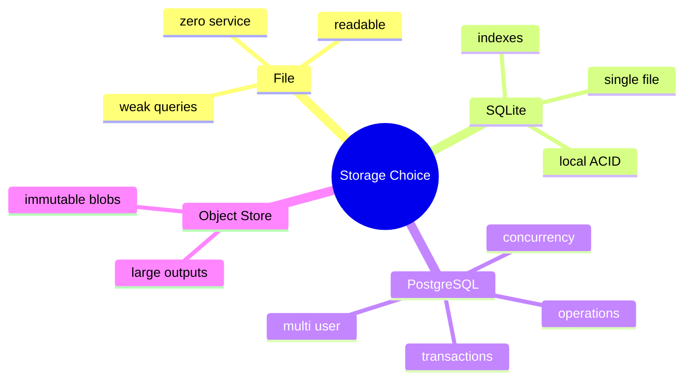

# 文件存储、SQLite 与 PostgreSQL 选型

## 1. 本质

存储选型由访问模式、一致性、规模、部署和运维决定。技术流行度不是决策依据。



## 2. 当前为何选文件

HippoBuddy 项目是单用户本地应用，访问模式是按 session 顺序追加、按 id 加载、希望可直接备份和编辑。JSONL/Markdown 无需服务，迁移透明。它不是“不会用数据库”，而是产品约束下的选择。

## 3. 对比

| 维度 | 文件 | SQLite | PostgreSQL |
|---|---|---|---|
| 部署 | 最简单 | 单文件/嵌入式 | 独立服务 |
| 事务 | 文件级技巧 | ACID | ACID/高并发 |
| 查询 | 扫描/自建索引 | SQL/索引 | 强 SQL/扩展 |
| 多进程写 | 弱 | 有锁机制但需规划 | 强 |
| 人类可读 | 高 | 需工具 | 需客户端 |
| SaaS | 不适合 | 有限 | 合适 |

## 4. SQLite 演进 Demo

```sql
CREATE TABLE conversation_event (
  session_id TEXT NOT NULL,
  sequence INTEGER NOT NULL,
  event_id TEXT NOT NULL UNIQUE,
  event_type TEXT NOT NULL,
  payload_json TEXT NOT NULL,
  created_at TEXT NOT NULL,
  PRIMARY KEY (session_id, sequence)
);
CREATE INDEX idx_event_session_time
  ON conversation_event(session_id, created_at);
```

保留 append-only 语义，同时获得唯一约束、事务和查询。

## 5. SaaS 架构

PostgreSQL 保存 session/event/metadata/permission；大 Tool output 放对象存储，数据库只存 URI/hash/size；任务队列管理 Agent lease；tenant_id 进入所有主键/索引/权限策略；审计事件不可变。

## 6. 迁移原则

定义 Repository/TranscriptPort；先双写并校验，历史 JSONL 离线导入；sequence/eventId 保持不变；投影可重建；提供回滚窗口。不要在业务类到处直接 JDBC。

## 7. 掌握检查

- [ ] 能用访问模式解释当前选择；
- [ ] 能说明 SQLite 的中间价值；
- [ ] 能设计 event 表唯一约束；
- [ ] 能画出 SaaS 存储拆分。

## 8. 一致性需求拆解

Conversation 事件要求 session 内顺序/幂等；session list 可以最终一致；approval/audit 需要强一致；Token metrics 可允许少量延迟；大 Tool output 适合不可变对象。不要试图用一种介质满足所有数据。

## 9. SQLite 深入

WAL journal mode 允许读写更好并发；仍是单机文件数据库，不适合共享网络盘/大量多进程写。设置 busy_timeout、transaction、foreign key；一条 Agent step 的 event+metadata projection可在同事务提交。备份用 SQLite backup API而非运行中直接复制文件。

## 10. PostgreSQL 并发模型

用 `(session_id, sequence)` 主键；事务中读取/更新 session next_sequence，或使用 advisory lock/optimistic version。多 worker 执行 Agent 需 lease `{owner,expiresAt,version}` 防同 session 双执行。RLS/tenant_id 保护多租户，连接池大小与虚拟线程并发分离。

## 11. Object Storage

超大 Tool output、Office 快照、附件用 content-addressed blob：hash 作为 key，数据库存 metadata/ref。上传完成后再提交引用；孤儿 blob 后台 GC。下载使用短期签名/本地权限，敏感内容加密和生命周期策略。

## 12. CAP 不是本地选型口号

单机文件/SQLite 不面对网络分区下的多副本选择。迁 SaaS 后，主数据库通常选择一致性，缓存/搜索投影最终一致。不要用“CAP 所以选某数据库”替代具体故障和访问模式分析。

## 13. 迁移验证

双写阶段定义真相源；每个 eventId/sequence 对账 hash；shadow read 比较重建 Conversation；切流前完成 backlog；回滚不丢新写。敏感 JSONL 导入后仍要保留/加密/安全删除策略。

## 14. 容量估算

估算 sessions/day × events/session × avg payload，索引和备份倍数；查询 p95、并发 writer、保留期。没有数据量和 SLA，任何“PostgreSQL更专业”都不是架构判断。

## 15. 项目源码、实验与面试追问

项目源码从 `WorkspaceManager` 画出 sessions/memory/rules/skills/logs目录；追踪 `SessionStorageFactory` 和 `MemoryStore` 的读写模式。特别核对 `WebSessionManager.getSessionJsonlPath()` 与 `WorkspaceManager.getSessionMessagesFile()` 路径不一致风险，这是“文件方案仍需统一schema”的真实例子。

**何时优先SQLite而非PostgreSQL？** 单机桌面、需要事务/查询但不想运维服务；多机器/租户/worker共享再PostgreSQL。**文件可否加事务？** 单文件atomic replace可近似，跨文件只能journal/补偿，复杂后数据库更合适。

实验生成10万事件/1万Memory，测启动scan、session list、查询、写并发和备份；将同模型迁SQLite，比较代码复杂度/性能/恢复。输出数据而非凭印象选型。

## 16. 从访问模式而不是数据量选型

先为每类数据写出不变量与访问模式：Transcript 是每 session 单调追加、按顺序回放；Memory 是按 workspace/type/关键词查询并单条更新；配置是极少量整对象替换；任务调度需要条件领取、租约和多 worker 竞争。即使总量都只有几 MB，最后一种也更需要数据库事务；反过来，几十万条只追加日志仍可能适合分段文件。

文件方案的优势是透明、可被 Git/编辑器查看、备份简单，代价是索引、自定义迁移、跨文件事务和并发协议都由应用承担。SQLite 提供单文件 ACID、索引、WAL 和 SQL 查询，但要设计 schema/version、连接和备份；PostgreSQL 增加多进程并发、网络访问和运维能力，也引入部署、权限和故障域。

选型时区分 source of truth 与 derived index。Memory Markdown 可作为真源，SQLite FTS/向量索引可删除重建；若两者都允许写就会形成双主。迁移采用 expand/contract：新 reader 先兼容旧新格式，后台复制并校验 count/hash，再切 writer，最后经过可回滚窗口才清理旧数据。

## 17. 面试中的决策表达

不要回答“数据量大就上 MySQL”。应给出 writer 数量、事务边界、查询维度、恢复目标 RPO/RTO、可移植性和运维约束，再说明当前阈值。对 HippoBuddy，本地单用户与可检查文件是重要产品属性；只有查询/事务复杂度实际超过文件协议成本时，SQLite 才是自然下一步，多实例共享才推动 PostgreSQL。

## 项目源码精读

源码入口：[WorkspaceManager.java](../../../src/main/java/com/example/agent/logging/WorkspaceManager.java)、[SessionStorageFactory.java](../../../src/main/java/com/example/agent/session/SessionStorageFactory.java)、[SessionStorage.java](../../../src/main/java/com/example/agent/session/SessionStorage.java)

```java
Path sessionsDir = WorkspaceManager.getHippoRoot().resolve("sessions");
return new SessionStorage(sessionsDir, maxSavedSessions,
                          expireHours, tombstoneThresholdBytes);

public static Path getSessionMessagesFile(String sessionId) {
    return getSessionDir(sessionId).resolve("conversation.jsonl");
}
```

WorkspaceManager 统一 `.hippo` 根下 sessions/logs/config/rules/skills/memory 的物理布局；SessionStorageFactory 把配置翻译成保存数量和清理策略。文件方案贴合本地桌面产品：用户可直接检查、复制和备份；会话按 ID/日期定位，Transcript 顺序追加，Memory 按 ID 单条读取。

选型本质由访问模式和不变量决定：追加回放适合 JSONL，整对象小配置适合原子替换，全文搜索可能需要 SQLite FTS，多 worker 竞争领取任务则更需要数据库事务。当前 `maxSavedSessions == 0` 日志称“memory-only”，但 factory 仍返回普通 SessionStorage；save 仍可能先落盘，再由数量清理删除，语义和成本都应通过测试确认，而不是只信日志。

> [!IMPORTANT]
> **疑难点：不要让两个可写真源并存。** 若将 Markdown Memory 同步进 SQLite，必须规定 Markdown 是 source of truth、SQLite 是可重建索引，或反过来；双向都能修改会产生冲突。迁移应用 expand/contract 和 shadow read，以 eventId/count/hash 对账后再切 writer。

## 18. 源码级实现原理解读

存储选型从访问模式和一致性需求出发：Transcript 是按 session 顺序追加与整段 replay，文件 JSONL 很自然；Memory 需要 metadata/filter/full-text，规模增长后 SQLite FTS 更自然；多实例协同任务需要并发事务、租约和唯一约束，PostgreSQL 更合适。数据量小不代表文件一定简单，跨对象事务和高并发 writer 才是分界。

HippoBuddy 当前 `WorkspaceManager/SessionStorage/SessionTranscript/MemoryStore` 以本地目录为主，优势是桌面应用可移植、可查看、无需服务进程；代价是多进程锁、查询、迁移、权限和 crash consistency 都由应用承担。不能把换 JDBC URL 称为迁移完成，领域层需先抽出按访问模式设计的 Repository/Log 端口。

迁移路径应是：建立端口与契约测试 → backfill 历史 → 双读比对 → 新存储 shadow write/校验 → 切读 → 停旧写 → 保留回滚窗口。长期无边界 dual-write 会让两边不一致成为新常态。

## 19. 代码实现：带事务与幂等约束的 JDBC Transcript

```java
import java.sql.*;
import java.util.*;

public final class JdbcTranscriptRepository {
    private final Connection connection;
    public JdbcTranscriptRepository(Connection connection) throws SQLException {
        this.connection = connection;
        try (Statement s = connection.createStatement()) {
            s.executeUpdate("""
                create table if not exists transcript_event(
                  session_id varchar(128) not null,
                  seq bigint not null,
                  event_id varchar(36) not null unique,
                  event_type varchar(64) not null,
                  payload text not null,
                  primary key(session_id, seq)
                )
                """);
        }
    }
    void append(String session, long expectedSeq, UUID eventId, String type, String payload)
            throws SQLException {
        boolean auto = connection.getAutoCommit(); connection.setAutoCommit(false);
        try (PreparedStatement q = connection.prepareStatement(
                    "select coalesce(max(seq),0) from transcript_event where session_id=?")) {
            q.setString(1, session);
            try (ResultSet rs = q.executeQuery()) {
                rs.next(); long next = rs.getLong(1) + 1;
                if (next != expectedSeq) throw new SQLException("sequence conflict: expected " + next);
            }
            try (PreparedStatement i = connection.prepareStatement(
                    "insert into transcript_event(session_id,seq,event_id,event_type,payload) values(?,?,?,?,?)")) {
                i.setString(1, session); i.setLong(2, expectedSeq); i.setString(3, eventId.toString());
                i.setString(4, type); i.setString(5, payload); i.executeUpdate();
            }
            connection.commit();
        } catch (SQLException e) { connection.rollback(); throw e; }
        finally { connection.setAutoCommit(auto); }
    }
}
```

这个实现展示事务、session sequence 主键和全局 eventId 去重，但 `max(seq)+1` 在 PostgreSQL 多连接下还需要锁 session row、使用 per-session sequence/version CAS，或直接依赖冲突重试；SQLite 单 writer 也要配置 busy timeout/WAL。Repository 的契约测试应对文件版和数据库版运行同一套 append/replay/duplicate/gap/crash 场景。

## 延伸学习：博客与电子书

- [SQLite Transactions](https://www.sqlite.org/lang_transaction.html)：理解本地单文件数据库的事务、锁与并发边界。
- [PostgreSQL Transaction Isolation](https://www.postgresql.org/docs/current/transaction-iso.html)：学习多 writer 下隔离级别和异常语义。
- [Designing Data-Intensive Applications](https://dataintensive.net/)：以访问模式、可靠性和运维成本进行存储选型，而不是只按数据量判断。

## 思维导图节点学习博客

本专题思维导图中的 12 个末级知识点均已展开为独立博客：[进入节点博客目录](../mindmap-blogs/05-context-storage/07-storage-selection/README.md)。
