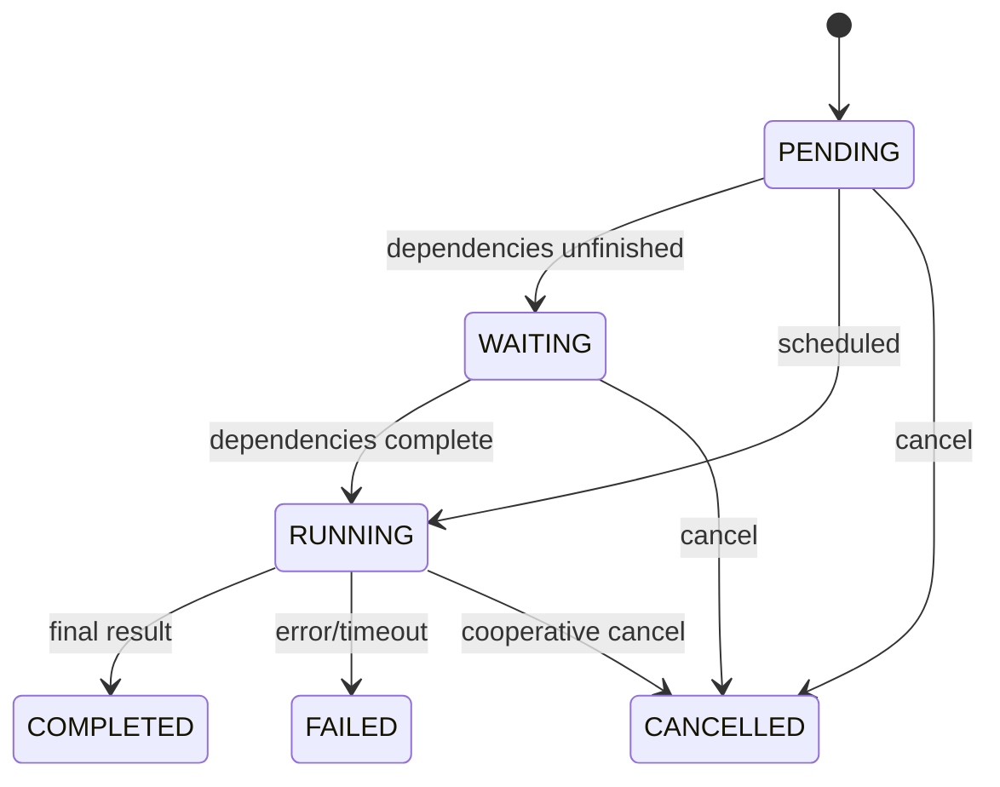
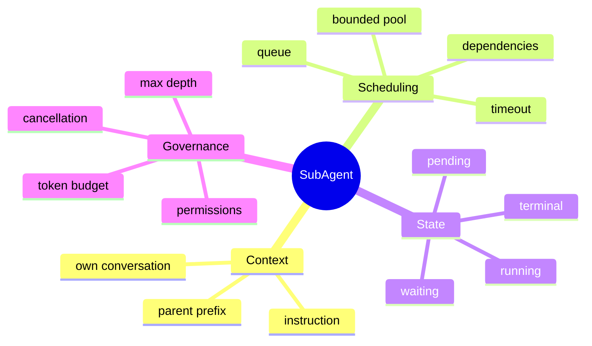

# 子 Agent、任务状态与有界调度

## 1. 概念

子 Agent 是独立任务上下文：有自己的 Conversation、状态、工具权限、超时、日志和结果。线程只是执行载体，不等于 Agent 隔离。





## 2. 项目实现

SubAgentManager 使用 ConcurrentHashMap 管理 active task/logger/callback；固定并行度 `max(2, CPU/2)`、队列 100；默认超时 300 秒；SubAgentRunner 执行独立 Loop；事件记录 started/waiting/completed/failed。

父 Conversation 消息复制/复用到子 Conversation，再追加任务指令，保持稳定前缀争取 Prompt Cache。准确说法是“上下文前缀复用”，不是严格 Java 内存零拷贝。

## 3. 调度原理与本质

昂贵资源是 LLM quota、Token、工具冲突和文件副作用，所以必须有界。任务状态迁移要原子、单向；completion callback 只能触发一次；取消应传播到 LLM、工具和进程。

## 4. Demo：原子状态迁移

```java
import java.util.concurrent.atomic.AtomicReference;

enum Status { PENDING, WAITING, RUNNING, COMPLETED, FAILED, CANCELLED }

final class TaskState {
    private final AtomicReference<Status> state = new AtomicReference<>(Status.PENDING);
    boolean start() {
        return state.compareAndSet(Status.PENDING, Status.RUNNING)
            || state.compareAndSet(Status.WAITING, Status.RUNNING);
    }
    boolean complete() { return state.compareAndSet(Status.RUNNING, Status.COMPLETED); }
    Status get() { return state.get(); }
}
```

CAS 防止超时线程标记 FAILED 的同时，执行线程又标记 COMPLETED。

## 5. 依赖 DAG

dependsOn 需要验证任务存在、无环、失败传播策略。可用 DFS/Kahn 检测环。依赖失败时选择 fail-fast、允许 degraded result 或让主 Agent 决策，必须显式。

## 6. 防止 fork 爆炸

限制父任务最大子数、最大深度、全局/每 session 并发、Token/费用、超时；子 Agent 默认只读；要求任务描述具体并对结果长度设限。

## 7. 掌握检查

- [ ] 能区分线程与 Agent 上下文；
- [ ] 能画状态机并解释 CAS；
- [ ] 能列出 DAG 调度异常；
- [ ] 能设计 fork 深度和预算限制。

## 8. Task Identity 与幂等

taskId 唯一标识一次逻辑任务；重复 fork 请求可带 clientRequestId 去重。状态和最终 result 应持久化，否则进程重启后父 Agent 不知道子任务是否执行过。completion callback 是通知，不是真相源；回调丢失时父任务可按 taskId 查询状态。

## 9. Dependency DAG 算法

Kahn 算法维护每个节点入度，入度 0 入 ready queue；完成后降低后继入度。最终处理节点数小于总数即有环。运行时依赖 FAILED 时，后继标记 SKIPPED/FAILED_DEPENDENCY，而不是永远 WAITING。

动态添加依赖要重新检查环，并防依赖当前/后代。项目已有 dependsOn/waiting，但面试应区分“具有依赖字段”和“完整 DAG 引擎”。

## 10. 上下文隔离与合并

父消息给子 Agent 是只读快照；子 Conversation 新消息不能回写父历史。最终只把结构化 result/evidence 合并父 Agent，而非整个子历史，减少 Token。子 Agent修改同一 workspace，结果合并仍需文件锁/version；更强隔离用 Git worktree。

## 11. 公平调度

一个主任务 fork 100 个可能占满全局池。增加每-parent 并发、round-robin/fair queue和优先级；交互用户任务高于后台 consolidate，但防永久饥饿。queue wait 算进 deadline。

## 12. 取消与超时竞态

timeout 线程 CAS RUNNING→FAILED 时，执行线程可能同时完成。终态只允许一个赢；若 cancel 赢，晚到 result 记录为 discarded，不触发 completion 两次。正在 LLM/Tool 的资源必须实际 cancel，不能只改 enum。

## 13. 实验

构造环 A→B→C→A；依赖失败；同 clientRequestId 重复 fork；100 个来自一个 parent与另一个交互任务；完成/超时 barrier 竞态；重启后从持久状态恢复 WAITING/RUNNING 的处理策略。

## 14. 方案取舍与深层面试追问

**子 Agent 和线程池任务有什么本质区别？** 子 Agent 不是一段普通 `Runnable`：它拥有独立模型上下文、权限快照、Token/时间预算、生命周期状态和结果协议。线程池只解决“代码在哪个线程运行”，子 Agent 调度还要解决“它能知道什么、能做什么、花多少资源、结果如何合并”。

**为什么不共享父 Conversation 对象？** Conversation 是持续追加的可变状态。父子并发写会产生顺序不确定、子消息污染父提示词、裁剪竞态和审计归属模糊。更稳妥的语义是：fork 时复制不可变前缀，父子此后各自追加；join 时只合并经过校验的结构化结论、证据和产物引用。

**何时并行才真正有收益？** 可独立读取多个模块、比较多个方案、分别运行互不干扰的验证时，关键路径接近 `max(Ti)`；有强依赖的连续编码任务会产生文件冲突、重复上下文和更高 Token 成本。调度器应在 fork 前估算独立性、合并成本和剩余预算，而不是看到多个子问题就无条件并发。

**为什么用 `availableProcessors()/2` 限流不够？** LLM Agent 多数时间等待网络，真正瓶颈常是 Provider QPS、账号并发、内存和预算，而不是 CPU。应按 Provider/会话设置独立 semaphore，并观察 queue wait、active、429、Token burn rate 后调参。

替代方案的边界：单 Agent 顺序执行最容易推理，适合强依赖任务；无限制虚拟线程只降低线程成本，不能解决配额和预算；有界内存调度器适合单机桌面应用；多实例服务需要持久任务队列、lease/heartbeat 和幂等领取，使 worker 崩溃后任务可重新分配。当前项目若只把 active task 保存在内存，就应明确它提供的是“单进程生命周期内”的任务语义，而不是 durable job 语义。

## 项目源码精读

源码入口：[SubAgentManager.java](../../../src/main/java/com/example/agent/subagent/SubAgentManager.java)、[SubAgentTask.java](../../../src/main/java/com/example/agent/subagent/SubAgentTask.java)

```java
private boolean areDependenciesSatisfied(SubAgentTask task) {
    for (String depId : task.getDependsOn()) {
        SubAgentTask depTask = activeTasks.get(depId);
        if (depTask == null) continue;
        SubAgentStatus status = depTask.getStatus();
        if (status != COMPLETED && status != FAILED) return false;
    }
    return true;
}
```

Manager 用有界 ThreadPoolExecutor 控制并发与排队，ConcurrentHashMap 管理任务、日志和 callback；fork 时创建独立 Conversation 快照，任务带权限、timeout 和 dependsOn。调度本质是一个 DAG 状态机：只有所有前驱满足成功条件，节点才能从 WAITING 进入 RUNNING；终态必须由原子迁移保证只完成一次。

当前代码把 FAILED 也视为“依赖满足”，因此依赖失败后后继仍会执行，而不是 FAILED_DEPENDENCY/SKIPPED；不存在的依赖只是警告后忽略。创建任务时也没有完整环检测。`activeTasks` 只在内存中，进程退出后 RUNNING/WAITING 语义无法恢复，所以它是本地并发管理器，不是 durable scheduler。

> [!IMPORTANT]
> **疑难点：线程池有界不等于系统资源有界。** 每个 Agent 还消耗 Provider QPS、Token/费用、Transcript、文件锁和网络连接。应分别设置全局、per-parent、per-provider semaphore；timeout 必须实际取消 LLM/Tool，不能只把状态改成 FAILED 后留下迟到副作用。

## 15. 源码级实现原理解读

`SubAgentManager` 当前把 activeTasks、logger、callback 放在 ConcurrentHashMap，用有界 ThreadPoolExecutor 执行任务。Map 安全不等于任务状态机安全：`RUNNING → COMPLETED` 与 watchdog 的 `RUNNING → FAILED` 若分别是普通 set，两个线程可能都发送终态事件和 callback；终态迁移需要 CAS。

依赖调度的正确条件是“所有前驱 COMPLETED”，而不是“COMPLETED 或 FAILED 都算结束”。前驱失败后后继应按声明策略进入 FAILED_DEPENDENCY/SKIPPED，或显式允许 degraded input。项目 `areDependenciesSatisfied()` 把 FAILED 视为 satisfied，并忽略不存在依赖，因此只是依赖等待机制，不是完整 DAG scheduler。

完整调度还需要创建时环检测、ready queue、公平性、全局/per-parent/per-provider 配额、queue wait 纳入 deadline、取消传播和 durable state。activeTasks 仅在内存表示进程生命周期内的并发任务，重启不能恢复 RUNNING/WAITING。

## 16. 可运行完整实现：DAG 校验与失败传播

```java
import java.util.*;

public class DagSchedulerDemo {
    enum Status { PENDING, READY, RUNNING, COMPLETED, FAILED, FAILED_DEPENDENCY }
    record Task(String id, Set<String> dependsOn) {}

    static List<String> topologicalOrder(Map<String,Task> tasks) {
        Map<String,Integer> indegree = new HashMap<>();
        Map<String,List<String>> children = new HashMap<>();
        for (Task t : tasks.values()) {
            indegree.put(t.id(), t.dependsOn().size());
            for (String dep : t.dependsOn()) {
                if (!tasks.containsKey(dep)) throw new IllegalArgumentException("missing dependency " + dep);
                children.computeIfAbsent(dep, ignored -> new ArrayList<>()).add(t.id());
            }
        }
        PriorityQueue<String> ready = new PriorityQueue<>();
        indegree.forEach((id,d) -> { if (d == 0) ready.add(id); });
        List<String> order = new ArrayList<>();
        while (!ready.isEmpty()) {
            String id = ready.remove(); order.add(id);
            for (String child : children.getOrDefault(id, List.of()))
                if (indegree.compute(child, (k,v) -> v - 1) == 0) ready.add(child);
        }
        if (order.size() != tasks.size()) throw new IllegalArgumentException("dependency cycle");
        return order;
    }
    static Status readyStatus(Task task, Map<String,Status> states) {
        if (task.dependsOn().stream().map(states::get)
                .anyMatch(s -> s == Status.FAILED || s == Status.FAILED_DEPENDENCY))
            return Status.FAILED_DEPENDENCY;
        return task.dependsOn().stream().allMatch(id -> states.get(id) == Status.COMPLETED)
                ? Status.READY : Status.PENDING;
    }
    public static void main(String[] args) {
        Map<String,Task> tasks = Map.of("a", new Task("a", Set.of()),
                "b", new Task("b", Set.of("a")), "c", new Task("c", Set.of("b")));
        if (!topologicalOrder(tasks).equals(List.of("a","b","c"))) throw new AssertionError();
        if (readyStatus(tasks.get("b"), Map.of("a", Status.FAILED)) != Status.FAILED_DEPENDENCY)
            throw new AssertionError();
    }
}
```

这段代码完成静态 DAG 和依赖状态语义；运行时还要用 `AtomicReference<Status>.compareAndSet` 领取 READY 任务，避免两个 scheduler 重复执行。跨进程版本需要数据库唯一 taskId、leaseUntil、heartbeat 和幂等 result，worker 只能在持有有效 lease 时提交终态。

## 延伸学习：博客与电子书

- [OpenJDK JEP 453：Structured Concurrency](https://openjdk.org/jeps/453)：理解父子任务的生命周期、失败传播与取消作用域。
- [Java Concurrency in Practice](https://jcip.net/)：深入任务执行、取消、线程安全与有界资源。
- [Designing Data-Intensive Applications](https://dataintensive.net/)：进一步学习持久任务、幂等、分区与故障恢复思维。

## 思维导图节点学习博客

本专题思维导图中的 15 个末级知识点均已展开为独立博客：[进入节点博客目录](../mindmap-blogs/06-extension-quality/01-subagent-scheduling/README.md)。
