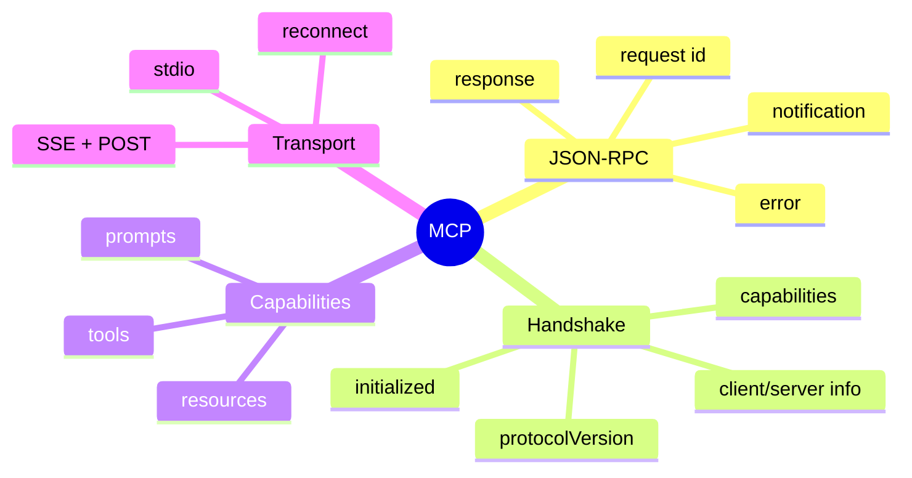

# JSON-RPC、MCP 与 Transport

## 1. 概念

JSON-RPC 2.0 用 id 关联 request/response；notification 没有 id/响应；error 有标准 code/message/data。MCP 在其上定义 initialize、tools/resources/prompts 等模型上下文能力。Transport 决定字节如何传输，协议语义与 Transport 分离。



## 2. 项目实现

JsonRpcHandler 生成 id，pending Map 保存 `id→CompletableFuture`，响应乱序到达也能匹配，scheduler 清理超时。AbstractMcpClient 执行 initialize/initialized，提供 list/call/read/get；Stdio/SSE Client 实现 Transport；McpToolAdapter 转为 ToolExecutor；McpServiceManager 注册能力和重连。

当前 CoreModule/入口未调用 McpServiceManager.initialize，属于组件完成、主链未接线。

## 3. Demo：请求关联

```java
import java.util.concurrent.*;
import java.util.concurrent.atomic.AtomicLong;

final class RpcPending {
    private final AtomicLong ids = new AtomicLong();
    private final ConcurrentMap<Long, CompletableFuture<String>> pending = new ConcurrentHashMap<>();

    long create() {
        long id = ids.incrementAndGet();
        pending.put(id, new CompletableFuture<>());
        return id;
    }
    CompletableFuture<String> future(long id) { return pending.get(id); }
    void complete(long id, String result) {
        var future = pending.remove(id);
        if (future != null) future.complete(result);
    }
}
```

超时与响应可能竞争，`remove` 确保只有一方取得 Future 并完成。

## 4. stdio 原理

父进程启动子进程，stdin/stdout 传协议。stdout 必须纯协议，日志写 stderr；必须持续消费 stderr 防 pipe 满导致阻塞；子进程退出时异常完成所有 pending；命令和环境变量需要信任列表。

## 5. SSE Transport 与重连

SSE 接收 server→client，HTTP POST 发送 client→server。断线恢复不代表旧 pending 仍有效；不能盲重放有副作用 tool call。重连后通常失败旧请求、重新握手并刷新能力。

## 6. 能力与安全

远端 Tool Schema 和输出都不可信：限制数量/大小/名称，套用本地 AgentMode/Blocker，给 server 配置独立权限和超时。动态工具会改变 Prompt 前缀，应版本化或仅新 session 生效。

## 7. 掌握检查

- [ ] 能区分 request 和 notification；
- [ ] 能解释 id 匹配乱序响应；
- [ ] 能画 MCP 握手；
- [ ] 能说明 stdio/SSE 的失败与重连语义。

## 8. JSON-RPC Envelope 细节

Request 必须包含 `jsonrpc:"2.0"`、method、可选 params、id；Response 是 result 或 error 二选一；Notification 无 id，接收方不得响应。id 可 string/number，但客户端内部统一类型。未知响应 id 是迟到/重复/协议异常，记录而不创建 Future。

Error code -32700 parse、-32600 invalid request、-32601 method not found、-32602 invalid params、-32603 internal；MCP 自定义错误仍映射到统一 McpException。

## 9. Pending Future 生命周期

发送前先放 pending，再写 Transport，防超快响应先到。写失败立即 remove+exception；timeout 与 response 用 remove 竞争；disconnect 遍历并异常完成所有 pending。cleanup scheduler 不能仅 complete 不 remove，否则泄漏。

## 10. Framing

stdio 是字节流，需要明确“一行一个 JSON”或 Content-Length framing；日志混 stdout 会破坏 parser。单行 JSON 要禁止 pretty-print/newline payload。SSE Transport 的 event data 可能多行，遵循 SSE framing后再送 JSON-RPC。

## 11. MCP Capability Negotiation

initialize 协商 protocolVersion/capabilities。客户端不能在完成 `initialized` 前调用 tools/list。版本不兼容应明确失败；server 能力变化后重连重新 list，ToolRegistry 创建新 snapshot。Resources/Prompts 的 URI/name 需带 server namespace 防冲突。

## 12. Reconnect 状态机

CONNECTED→LOST→BACKOFF→CONNECTING→INITIALIZING→READY/GAVE_UP。用户主动 disconnect 不重连；每次失败清除 handling guard，否则后续无法再触发；成功 reset attempts。加入 jitter和全局 shutdown token。

## 13. 安全与进程治理

stdio command 不能来自不可信 Prompt；限制 cwd/env、进程权限和资源。SSE URL 校验 scheme/allowlist，防 SSRF。Tool Schema/结果大小限制，本地 PEP 再授权。Server 退出 stderr要采集但脱敏。

## 14. 实验

Fake server 乱序响应、重复 id、未知 id、error、超时后迟到；stdio 输出日志污染；进程突然退出；SSE 重连时旧 pending；协议版本不兼容；两个 server 同名 tool的 namespace。

## 15. 方案取舍与深层面试追问

**为什么 MCP 采用 JSON-RPC 风格，而不是直接做 REST？** MCP 需要在 stdio、SSE 等不同传输上保持统一的双向请求关联、通知和异步响应语义。JSON-RPC 用 `id/method/params/result/error` 形成轻量 envelope；REST 更擅长利用 HTTP 资源、状态码、缓存和中间件。两者不是先进与落后的关系，而是抽象层级和通信模型不同。

**`CompletableFuture.orTimeout` 后底层请求会停止吗？** 不一定。它只保证调用者观察到 Future 超时完成；Transport 仍可能占用 socket/进程，`pendingRequests` 也可能保留条目。正确实现要原子移除 pending、尽力发送 cancel 或中断底层 I/O，并把迟到响应识别为 stale response，而不能再次完成业务流程。

**stdio 一定比 SSE 安全吗？** stdio 减少了网络监听和 SSRF 面，但被拉起的子进程仍继承本机身份、环境变量和文件权限；SSE 则额外要求 TLS、认证、URL allowlist 和重连治理。真正的安全边界是 capability、子进程 sandbox、网络 egress 和本地 PEP，而不是传输名称。

**断线后能否自动重发？** `tools/list`、健康检查等只读操作通常可重试；`tools/call` 可能已经在服务端产生副作用，若没有 idempotency key，自动重发会重复执行。因此断线时旧 pending 默认失败，由上层根据方法语义决定重试。

项目接线应是：`CoreModule` 建立本地 `ToolRegistry` 后创建 `McpServiceManager`，逐 server 执行 connect→initialize→tools/list，再为新 session 冻结工具快照；shutdown 先停止重连调度，再失败化 pending 并关闭 client/子进程。健康状态至少区分 configured、connected、initialized/ready。单个动态 server 注册失败应降级并留诊断，不能阻止核心本地工具启动。

## 项目源码精读

源码入口：[JsonRpcHandler.java](../../../src/main/java/com/example/agent/mcp/protocol/JsonRpcHandler.java)、[AbstractMcpClient.java](../../../src/main/java/com/example/agent/mcp/client/AbstractMcpClient.java)

```java
public CompletableFuture<JsonNode> registerPendingRequest(int id) {
    var future = new CompletableFuture<JsonNode>();
    pendingRequests.put(id, future);
    requestTimestamps.put(id, System.currentTimeMillis());
    return future;
}

public void handleResponse(String message) {
    int id = json.get("id").asInt();
    CompletableFuture<JsonNode> future = pendingRequests.remove(id);
    if (json.has("error")) future.completeExceptionally(...);
    else future.complete(json.get("result"));
}
```

JSON-RPC 的核心是相关性：请求 ID 把异步、乱序到达的 response 交还正确 Future；notification 没有 ID，不期待响应。MCP 在其上再定义 initialize/capability、tools/resources/prompts 等方法，而 stdio/SSE 只负责 framing 与传输。`AbstractMcpClient.initialize` 按 initialize → initialized 顺序完成握手，这一顺序属于协议状态机。

Handler 定时清理超时 pending；`CompletableFuture.orTimeout` 只让上层 Future 超时，不必然停止底层 I/O，也不自动移除 Handler 中的 pending，因而可能等到 120 秒清理。`requestIdCounter` 回绕处理、重复 ID 注册覆盖、迟到 response、断线时 pending 失败化，都应有契约测试。重连代码的 `connectionLossHandling` 只有成功时重置，失败后再次调用 `onConnectionLost` 会被 CAS 拦下，可能无法继续下一次重连。

> [!IMPORTANT]
> **疑难点：超时、取消和幂等是三条独立协议。** 超时后服务端可能已经执行 `tools/call`；没有 idempotency key 时自动重发会重复副作用。正确做法是移除 pending、标记迟到响应、尽力取消 Transport，并由上层依据 method 的副作用语义决定是否重试。

## 16. 源码级实现原理解读

JSON-RPC client 的核心状态是 `nextId` 与 `pending: id → CompletableFuture`。发送前先放 pending，再写 transport；响应 reader 按 id remove 并完成 future；timeout/cancel 也必须 compare-remove；连接关闭要异常完成当前 generation 的全部 pending。先 write 后 put 会遇到极快响应找不到 future。

stdio transport 不是“按 readLine 一定一条 JSON”的通用假设，framing 由具体协议约定；stderr 必须单独消费，否则子进程 stderr pipe 填满会反向阻塞。SSE/HTTP transport 还要处理 reconnect：旧连接迟到响应不能完成新连接中碰巧同 id 的请求，因此 pending key 最好包含 connection generation。

MCP 在 JSON-RPC 之上增加 initialize、protocolVersion、capabilities 和 tools/resources/prompts。只有双方协商后的能力能调用；服务端返回的 Tool Schema/描述仍是不可信外部输入，要限长、命名隔离和本地 capability 包装。

## 17. 可运行完整实现：关联、超时与连接代际

```java
import java.time.Duration;
import java.util.concurrent.*;
import java.util.concurrent.atomic.*;
import java.util.function.BiConsumer;

public final class JsonRpcPendingDemo implements AutoCloseable {
    record Key(long generation, long id) {}
    private final AtomicLong ids = new AtomicLong();
    private final AtomicLong generation = new AtomicLong(1);
    private final ConcurrentHashMap<Key,CompletableFuture<String>> pending = new ConcurrentHashMap<>();
    private final ScheduledExecutorService timer = Executors.newSingleThreadScheduledExecutor();
    private final BiConsumer<Key,String> transport;

    JsonRpcPendingDemo(BiConsumer<Key,String> transport) { this.transport = transport; }
    CompletableFuture<String> request(String json, Duration timeout) {
        Key key = new Key(generation.get(), ids.incrementAndGet());
        CompletableFuture<String> future = new CompletableFuture<>();
        pending.put(key, future);                         // 必须早于 send
        try { transport.accept(key, json); }
        catch (RuntimeException e) { if (pending.remove(key, future)) future.completeExceptionally(e); }
        timer.schedule(() -> {
            if (pending.remove(key, future)) future.completeExceptionally(new TimeoutException(key.toString()));
        }, timeout.toMillis(), TimeUnit.MILLISECONDS);
        return future;
    }
    void onResponse(Key key, String result) {
        CompletableFuture<String> f = pending.remove(key);
        if (f != null) f.complete(result);               // unknown/late id 只记录，不复活
    }
    void reconnect(Throwable cause) {
        long old = generation.getAndIncrement();
        pending.forEach((k,f) -> { if (k.generation()==old && pending.remove(k,f)) f.completeExceptionally(cause); });
    }
    public void close() { reconnect(new CancellationException("closed")); timer.shutdownNow(); }
}
```

真实 handler 还要验证 response 只能包含 result/error 之一、id 类型、最大消息长度、未知 method、notification 无 id 和 batch 支持。Reconnect 后不能盲目重放非幂等 MCP tool call；必须由方法语义和 idempotency token 决定。

## 延伸学习：博客与电子书

- [JSON-RPC 2.0 Specification](https://www.jsonrpc.org/specification)：精读 request、response、notification 和 error envelope。
- [MCP 生命周期规范](https://modelcontextprotocol.io/specification/2025-06-18/basic/lifecycle)：掌握 initialize、capability negotiation 与关闭顺序。
- [MCP Transport 规范](https://modelcontextprotocol.io/specification/2025-06-18/basic/transports)：理解 stdio/HTTP 的 framing、安全与会话要求。

## 思维导图节点学习博客

本专题思维导图中的 14 个末级知识点均已展开为独立博客：[进入节点博客目录](../mindmap-blogs/06-extension-quality/02-jsonrpc-mcp/README.md)。
