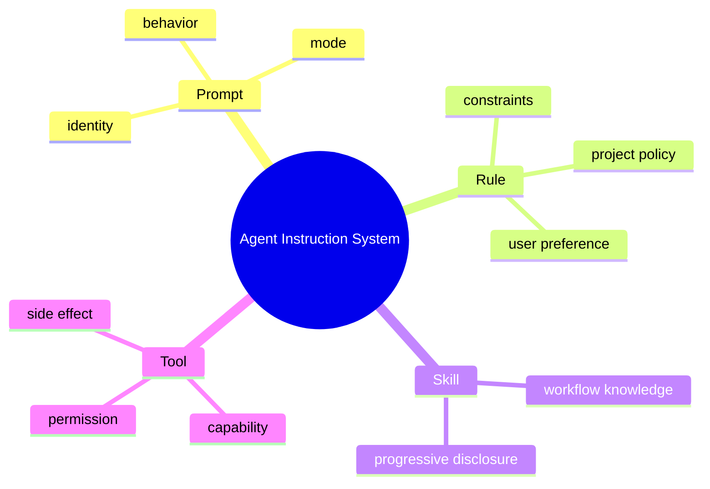

# Prompt、Rule、Skill、Tool 的边界

## 1. 概念对照

| 概念 | 作用 | 是否有副作用 | 生命周期 |
|---|---|---:|---|
| Prompt | 定义角色、输出方式和任务模式 | 否 | 每轮稳定前缀 |
| Rule | 用户/项目持续约束 | 否 | workspace/user 级 |
| Skill | 按需加载的操作知识 | 否 | 先索引、后全文 |
| Tool | 读取外部状态或执行动作 | 可能 | 结构化调用 |



## 2. 项目实现

PromptLibrary 从 classpath 加载核心/模式 Prompt；PromptService 按 TaskContext 组合。RuleManager/Loader 扫描规则和 frontmatter。SkillManager 扫描项目/用户 Markdown，只把名称和描述注入 system prompt；模型调用 SkillTool 获取全文。ToolRegistry 暴露真实能力。

## 3. 组合原理与本质

Prompt/Rule/Skill 都是信息，Tool 是能力。把“如何发布版本”的流程写成 Skill；真正执行 Maven/Git 的操作通过 Bash Tool。把所有 Skill 全文塞进 Prompt 会线性消耗 Token、降低前缀缓存并引发冲突。

## 4. Demo：按需技能目录

```java
record SkillMeta(String name, String description, java.nio.file.Path path) {}

static String catalog(java.util.List<SkillMeta> skills) {
    return skills.stream()
        .sorted(java.util.Comparator.comparing(SkillMeta::name))
        .map(s -> "- " + s.name() + ": " + s.description())
        .collect(java.util.stream.Collectors.joining("\n"));
}

static String load(SkillMeta skill) throws Exception {
    return java.nio.file.Files.readString(skill.path());
}
```

## 5. 冲突与优先级

需要明确 system/base prompt、组织政策、项目 rule、用户 rule、临时 instruction 的优先级。外部网页/Tool output 是数据，不是可信指令。Skill 正文也应来自受信目录并限制大小。

## 6. 版本与评测

Prompt/Skill 变更应有版本/hash，配合离线任务集评测成功率、Tool 误调用、Token 和缓存命中。仅凭主观“提示词更好”不可验证。

## 7. 掌握检查

- [ ] 能准确区分四个概念；
- [ ] 能为新能力判断放在哪层；
- [ ] 能解释 progressive disclosure；
- [ ] 能设计指令优先级。

## 8. 指令层级与信任

模型通常按 system>developer/user 处理，但应用自定义 Rule/Skill 全部最终变成文本，需要自己定义顺序。建议：不可覆盖安全 policy、核心行为、组织 Rule、项目 Rule、用户偏好、当前任务、外部数据。外部网页/Tool output 明确标记 untrusted data。

冲突不是靠“最后一个赢”总能解决：项目 Rule 要 Java 17，构建文件显示 Java 21，应提示冲突并以可验证项目事实更新 Rule，而非任意遵从。

## 9. Prompt 组合器

每个 section 有 stable id/version/priority/token estimate。组合前去重、固定顺序、按预算裁剪低优先动态部分；记录最终 prompt hash/section versions但不记录 Secret全文。不要多次创建 PromptService/Library导致缓存和 enable 状态不一致。

## 10. Skill 生命周期

Skill frontmatter 至少 name/description/version/applicability；正文包含 prerequisite、steps、verification、fallback。加载时限制路径/大小，项目级同名覆盖用户级要明确。修改后 cache invalidation，新 session是否生效与 tool snapshot策略一致。

## 11. Tool 与 Skill 协作示例

“发布版本” Skill 描述检查 clean tree→测试→改版本→构建→tag；read_file/bash 是执行能力。Skill 不直接拥有 shell权限，Runtime仍根据 mode审批。这样流程知识可迭代，安全边界保持代码化。

## 12. Prompt Injection 防御

把网页包 `<untrusted-content>` 只能帮助模型，不是强隔离。外部内容不能改变 Tool capability；Skill/Rule 只从信任目录；检索结果带来源；任何“系统已授权”文字都不被 PEP接受。

## 13. 评测

测试 Rule遵从率、Skill选择率/步骤完成率、Tool误调用、Token、cache hit。Prompt版本 A/B 使用同任务和确定评估器；输出非确定需多次采样。安全 prompt用越狱集测试，但最终看 Runtime是否阻止副作用。

## 14. 实验

创建两个同名 Skill观察优先级；让 Skill 超大验证按需加载；注入恶意网页指令验证 Tool deny；修改 Rule 后比较旧/新 session；删除 Skill 文件验证缓存刷新和稳定错误。

## 15. 失败模式与深层面试追问

典型失败包括 Prompt section 重复或优先级冲突、Rule frontmatter 损坏、Skill 索引仍在但正文已删除、正文超过上下文预算、Tool 与 Skill 同名造成模型误判、workspace 切换后缓存没有失效。Loader 应隔离单个坏文件、保留其他有效内容并返回可定位诊断，不能因为一篇 Skill 损坏就生成空系统提示词。

**Rule 与 Memory 中的 `PROJECT_CONTEXT` 有何区别？** Rule 是规范性信息，回答“必须怎样做/禁止怎样做”；Memory 是事实性或经验性信息，回答“这个项目是什么、以前做过什么决定”。错误 Memory 应可被新证据更新，而高优先级安全 Rule 不能被低信任内容覆盖。

**Skill 为什么不能自动获得执行权限？** Skill 是声明式知识和流程建议，不是 capability。即使 Skill 写着“执行 shell 并删除旧文件”，真正调用仍必须经过 Runtime 的 Tool Registry、AgentMode、PathSecurity 和确认策略。这样知识作者无法绕过权限边界。

源码核查要从 `SkillLoader` 的项目级/用户级覆盖顺序开始，继续检查 `SkillManager` 的 workspace cache key 与失效条件，再追到 `PromptService` 是否真的把 Skill 摘要/正文拼入最终 LLM request，以及 `SkillTool` 是否做路径与大小限制。Rule 也应沿“磁盘文件→解析对象→Prompt section→Provider request”追完整链路，避免只看到 Manager 类存在，就错误声称功能已在主链生效。

## 项目源码精读

源码入口：[PromptService.java](../../../src/main/java/com/example/agent/prompt/PromptService.java)、[RuleLoader.java](../../../src/main/java/com/example/agent/domain/rule/RuleLoader.java)、[SkillLoader.java](../../../src/main/java/com/example/agent/domain/skill/SkillLoader.java)

```java
public static List<SkillEntry> loadAllSkills(String workspacePath) {
    Map<String, SkillEntry> merged = new HashMap<>();
    for (SkillEntry e : loadUserSkills()) merged.put(e.getFileName(), e);
    for (SkillEntry e : loadProjectSkills(workspacePath)) merged.put(e.getFileName(), e);
    return merged.values().stream().sorted(...).toList();
}
```

Prompt 是每次请求的指令载体，Rule 是规范性约束，Skill 是可按需加载的过程知识，Tool 是 Runtime capability。SkillLoader 先放用户级、再用项目级同名文件覆盖，最终排序保证 Prompt/index 稳定；只解析 name/description/path，正文可在真正选中时再读，符合渐进披露。RuleLoader 只把 mode=always 的规则自动合并，manual 规则不应无条件占用上下文。

`PromptService` 本身只是 PromptLibrary 门面；要证明 Skill/Rule 生效，必须继续追 `buildSystemPrompt` 的 section 组合和最终 LlmClient request。SkillLoader 读完整文件后只限制 Frontmatter 前 20 行，并未在所示代码中设置文件大小上限；不可信 workspace 可用巨型 Skill 消耗内存/Token。简单按首个冒号解析也不是完整 YAML。

> [!IMPORTANT]
> **疑难点：指令优先级只影响模型行为，不能授予权限。** 项目 Skill 即使写着“删除目录”，也必须经过 AgentMode、Blocker、PathSecurity 和人工确认。外部网页/源码注释属于不可信数据，不能因为被拼进 Prompt 就获得与 system Rule 相同的可信度。

## 16. 源码级实现原理解读

Prompt、Rule、Skill、Tool 位于不同控制层：Prompt 影响模型概率分布；Rule 是运行时/组织政策；Skill 是按需加载的知识与工作流；Tool 是产生真实观察或副作用的能力。只有 Tool execution policy 能形成硬边界，把“不得访问 workspace 外”只写进 Prompt 没有安全保证。

项目通过 PromptLibrary/PromptService 读取基础提示，RuleLoader/Manager 解析项目规则，SkillLoader/Manager 暴露技能目录，ToolRegistry 投影能力。组合器应为每段内容保留 origin、trust、version/hash 和优先级；来自 workspace/MCP/tool output 的文本属于不可信数据，不能与 system policy 拼成无法区分的同级指令。

Progressive skill loading 是两阶段：稳定前缀只放 skill name/description/path，模型选择后由 SkillTool 加载完整内容。这既控制 Token，也保持 Prompt Cache；但加载路径仍要 sandbox，skill 指令不能自行扩大 Tool capability。

## 17. 可运行完整实现：带来源和稳定顺序的 Prompt 组合器

```java
import java.util.*;

public class PromptComposerDemo {
    enum Trust { SYSTEM, ADMIN_RULE, PROJECT_RULE, SKILL, UNTRUSTED_DATA }
    record Part(Trust trust, String id, int version, String content) {}
    static String compose(Collection<Part> input) {
        List<Part> parts = input.stream().sorted(Comparator
                .comparing(Part::trust).thenComparing(Part::id).thenComparingInt(Part::version)).toList();
        StringBuilder out = new StringBuilder();
        for (Part p : parts) {
            if (p.content().length() > 20_000) throw new IllegalArgumentException("part too large: " + p.id());
            out.append("<part trust=\"").append(p.trust()).append("\" id=\"")
                    .append(p.id().replace("\"", "")).append("\" version=\"")
                    .append(p.version()).append("\">\n")
                    .append(p.content()).append("\n</part>\n");
        }
        return out.toString();
    }
    static boolean canGrantCapability(Trust trust) {
        return trust == Trust.SYSTEM || trust == Trust.ADMIN_RULE;
    }
    public static void main(String[] args) {
        String p = compose(List.of(new Part(Trust.SKILL,"java",1,"workflow"),
                new Part(Trust.SYSTEM,"base",1,"policy")));
        if (p.indexOf("policy") > p.indexOf("workflow") || canGrantCapability(Trust.SKILL))
            throw new AssertionError(p);
    }
}
```

XML 标签只能帮助模型理解边界，不能抵抗所有 injection；真正执行仍按服务器端 capability。组合结果应计算 hash 并冻结到 session，日志只记 id/version/hash 而非可能含 secret 的全文。冲突规则应由确定性的政策优先级解决，并把冲突暴露给用户，而不是让“最后拼接的一段”暗中获胜。

## 延伸学习：博客与电子书

- [OWASP LLM Prompt Injection Prevention](https://cheatsheetseries.owasp.org/cheatsheets/LLM_Prompt_Injection_Prevention_Cheat_Sheet.html)：学习指令/数据分离、最小权限和输出监控。
- [OpenAI Prompt Engineering](https://platform.openai.com/docs/guides/prompt-engineering)：掌握稳定指令、结构化上下文和评测方法。
- [The Twelve-Factor App：Config](https://12factor.net/config)：借配置外置原则理解 Rule/Skill 与代码安全边界的分工。

## 思维导图节点学习博客

本专题思维导图中的 11 个末级知识点均已展开为独立博客：[进入节点博客目录](../mindmap-blogs/06-extension-quality/03-prompt-rule-skill-tool/README.md)。
