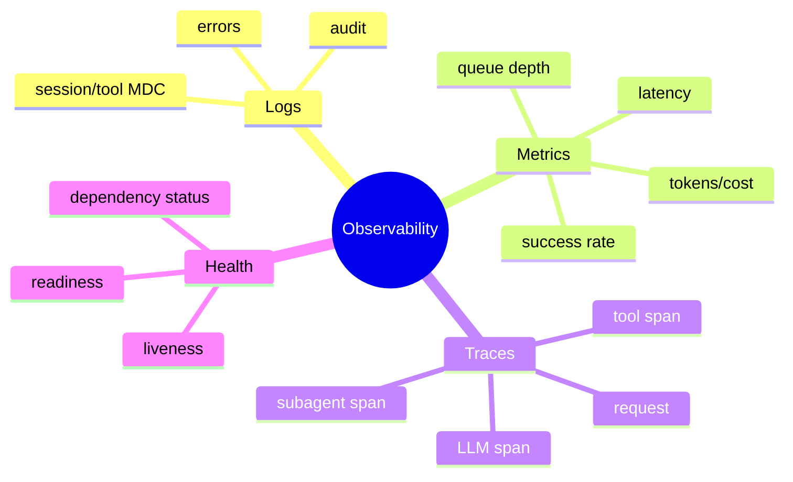

# 日志、指标、Trace 与健康检查

## 1. 概念、原理与本质：三大支柱

可观测性的本质是仅根据系统外部输出推断内部状态。Log 是离散详情，Metric 是聚合数值，Trace 是一次请求的因果路径。健康检查回答实例是否存活/准备好，不等于监控全部指标。



## 2. 项目实现

SLF4J/Logback；LoggingContext/MDC 关联 session/tool；CostMetricsCollector、EventMetricsCollector；HealthCheckRegistry 聚合 System/Config/LLM；Web Metrics API 提供数据。

## 3. Agent 特有指标

TTFT、完整响应延迟、turn 数、Tool 成功率/耗时、confirmation 率、cache hit、input/output Token、任务成本、压缩次数、SubAgent queue wait、取消率、连续失败。

指标必须有有限维度。sessionId/user prompt 不应作为 metric label，会造成高基数；它们属于 log/trace attribute。

## 4. Demo：Timer

```java
final class Timer implements AutoCloseable {
    private final String operation;
    private final long start = System.nanoTime();
    Timer(String operation) { this.operation = operation; }
    public void close() {
        long ms = (System.nanoTime() - start) / 1_000_000;
        System.out.println("operation=" + operation + " duration_ms=" + ms);
    }
}

// try (var ignored = new Timer("llm.chat")) { call(); }
```

生产环境应输出 histogram 而非只记录平均值，关注 p50/p95/p99。

## 5. 健康检查

Liveness 只判断进程能否继续运行，不依赖收费 LLM；Readiness 检查配置、磁盘和必要依赖。外部依赖失败时是否 not-ready 取决于是否有降级 provider。探针必须便宜、有 timeout、不会放大故障。

## 6. Trace 设计

一个 chat request 为 root span；每轮 LLM、每个 Tool、SubAgent 为 child span；属性记录 provider/model/turn/toolName，不记录完整 Prompt/Key。SSE 长连接可记录首事件和完成事件。

## 7. 掌握检查

- [ ] 能区分 log/metric/trace；
- [ ] 能列出 Agent 指标；
- [ ] 能解释高基数标签；
- [ ] 能区分 liveness/readiness。

## 8. 信号到问题的映射

TTFT 高但总 Tool 快：LLM/provider/Prompt cache；Tool p95 高：进程/文件/网络；queue wait 高但执行正常：容量不足；turn 激增：模型/Prompt/StopHook；Token 高：历史/结果截断；SSE disconnect 高：代理/客户端。可观测性要能支持这种因果定位，而非堆日志。

## 9. RED/USE 方法

API 用 RED：Rate、Errors、Duration；资源用 USE：Utilization、Saturation、Errors。Agent增加每任务 turns/tokens/cost/success。线程数对虚拟线程意义弱，关注在途任务、carrier pinning、连接/queue。

## 10. 日志结构与采样

字段化输出 event、sessionHash、runId、turn、provider/model、tool、duration、errorCode。Prompt/content默认不记录或脱敏；debug需用户显式开启和保留期。高频 token chunk不逐条 info，采样/聚合，否则 I/O反过来拖慢流。

## 11. Trace Context

root chat span跨 SSE 生命周期；LLM attempt为子 span并标 retry；Tool/SubAgent继续传播 traceId。异步队列在 enqueue时捕获 context，consumer创建 linked/child span。不要把 sessionId 当 traceId：一个 session有多次 request。

## 12. SLO 与告警

定义“成功完成无内部错误”“p95 TTFT”“取消响应时间”“Transcript durable error rate”。错误预算驱动优化。Provider 401是用户配置不应平台告警；全 provider 5xx、storage failure需要告警。健康探测只做便宜动作。

## 13. Metrics 正确性

Counter单调增；Gauge表示当前 queue/active；Histogram记录分布。平均值掩盖长尾。Label限定枚举 provider/model/tool/errorCode，不能用 path/session/prompt。价格指标带 currency/priceVersion。

## 14. 实验

注入 LLM慢、Tool慢、队列满、cache miss、磁盘失败，检查能否从指标区分；验证 MDC跨虚拟线程；日志中放假 Secret跑扫描；设计 dashboard只用能支持决策的 8~12个信号。

## 15. 方案取舍与深层面试追问

**日志越多是否越可观测？** 不是。无结构日志会增加检索噪音、存储成本、敏感数据泄漏和热路径 I/O。可观测性的价值来自稳定事件模型、受控维度、trace 关联和能回答故障假设，而不是输出行数。

**健康检查能否每次真实调用 LLM？** 它能验证端到端能力，但价格高、延迟大，Provider 故障时还会放大流量。liveness 只检查进程能否自我维持，不依赖外部服务；readiness 可低频探测并短期缓存，业务请求仍需自己的 timeout/circuit breaker。

**Metrics 与 EventLog 能否共用一套数据？** EventLog 保存离散事实，可异步聚合为指标，利于重算和审计；热路径直接累加 counter/histogram 延迟更低，但可能因进程崩溃丢最后窗口。关键账单/配额事实不能只存在易丢 Metrics 中，应有持久事件或 Provider 对账。

**SSE 长请求怎么划 span？** 根 span 从请求接收到 complete/disconnect，TTFT、每个 LLM attempt、Tool call 是子 span/event。若响应中途断开，应以取消/断连状态结束，而不是标成功。只记录总耗时会分不清“首字节慢”还是“生成过程慢”。

对项目做源码检查时，应确认 `HealthCheckRegistry` 是否并发执行并给每个 indicator 独立 timeout，一个坏检查不能拖死整个 `/health`；检查 `CostMetrics` 的价格表版本与未知模型行为；检查 `EventBus` handler 异常是否隔离；检查 Metrics/Config API 是否泄漏 session、路径或密钥。最终报告要把“已有观测”“缺少信号”“信号有但未接主链”分开。

## 项目源码精读

源码入口：[HealthCheckRegistry.java](../../../src/main/java/com/example/agent/core/health/HealthCheckRegistry.java)、[LlmHealthIndicator.java](../../../src/main/java/com/example/agent/core/health/LlmHealthIndicator.java)、[LoggingContext.java](../../../src/main/java/com/example/agent/core/logging/LoggingContext.java)

```java
for (Map.Entry<String, HealthIndicator> entry : indicators.entrySet()) {
    try {
        Health health = entry.getValue().check();
        results.put(entry.getKey(), health);
        // DOWN > DEGRADED > UNKNOWN > UP
    } catch (Exception e) {
        results.put(entry.getKey(), Health.down().withException(e).build());
    }
}
```

Registry 用状态格（severity lattice）聚合组件结果：任一 DOWN 使整体 DOWN，否则 DEGRADED/UNKNOWN 逐级覆盖 UP。异常被隔离到单个组件，这比整个 health endpoint 抛 500 更可诊断。System indicator 读取 JVM/OS 状态；LLM indicator 暴露配置与累计成本，但它没有发网络探测，所以“UP”更接近配置对象可读取，不代表 Provider 真能调用。

所有 indicator 当前串行执行，也没有独立 timeout；一个阻塞检查会拖住整次 health。`getReadableStatus` 先 checkAll，随后又逐个 `check(name)`，会重复执行有副作用/昂贵的探测，并可能得到不同快照。LlmHealthIndicator 暴露 base_url、model 和成本，若 endpoint 无认证，需要先做数据分级。

> [!IMPORTANT]
> **疑难点：liveness、readiness、diagnostics 不能混成一个端点。** liveness 不依赖外部系统；readiness 判断是否能接新请求；详细诊断可能含路径、模型和异常，只给已授权用户。日志、指标、trace 还要共享 runId/trace context，才能从一次慢 SSE 定位到具体 LLM attempt 或 Tool。

## 16. 源码级实现原理解读

Logs 回答离散事件，metrics 回答可聚合趋势，trace 回答一次请求跨组件的因果路径。三者通过 sessionId/traceId/turnId/toolCallId 关联，但要控制 cardinality：sessionId 适合日志/trace attribute，通常不适合直接做 metrics label，否则时间序列爆炸。

Agent 的关键跨度是 HTTP request → Agent turn → 每次 LLM attempt → Tool execution → persistence；Token/费用是 span/event 的数值属性。MDC 只传播日志关联，不等于完整 trace context。异步/虚拟线程边界要显式快照传播。

`HealthCheckRegistry` 若串行调用所有 indicator 且没有独立 timeout，一个卡死的 LLM probe 会让 `/health` 本身卡死。Liveness 只判断进程事件循环是否活；readiness 才检查是否可接新工作；外部 LLM 故障通常不应触发容器无限重启。

## 17. 可运行完整实现：并行、有超时的健康检查

```java
import java.time.Duration;
import java.util.*;
import java.util.concurrent.*;
import java.util.function.Supplier;

public class HealthRegistryDemo implements AutoCloseable {
    enum Status { UP, DEGRADED, DOWN }
    record Health(Status status, String detail, long latencyMillis) {}
    private final ExecutorService executor = Executors.newVirtualThreadPerTaskExecutor();

    Map<String,Health> check(Map<String,Supplier<Health>> indicators, Duration timeout) {
        Map<String,CompletableFuture<Health>> futures = new LinkedHashMap<>();
        indicators.forEach((name, check) -> futures.put(name,
                CompletableFuture.supplyAsync(() -> {
                    long start = System.nanoTime();
                    try {
                        Health h = check.get();
                        return new Health(h.status(), h.detail(), (System.nanoTime()-start)/1_000_000);
                    } catch (Throwable e) {
                        return new Health(Status.DOWN, e.getClass().getSimpleName(),
                                (System.nanoTime()-start)/1_000_000);
                    }
                }, executor).completeOnTimeout(new Health(Status.DOWN,"timeout",timeout.toMillis()),
                        timeout.toMillis(), TimeUnit.MILLISECONDS)));
        Map<String,Health> out = new LinkedHashMap<>();
        futures.forEach((name,f) -> out.put(name, f.join()));
        return Map.copyOf(out);
    }
    public void close() { executor.shutdownNow(); }
}
```

`completeOnTimeout` 返回超时结果，但底层不响应中断的 probe 仍可能继续运行；probe 必须自身使用连接/read deadline。检查结果要短时缓存并限制并发，避免监控频繁请求反而压垮依赖。日志 detail 也要脱敏，健康接口不应暴露 base URL、API key 或内部路径。

## 延伸学习：博客与电子书

- [OpenTelemetry：Signals](https://opentelemetry.io/docs/concepts/signals/)：系统掌握 traces、metrics、logs 和 baggage 的职责。
- [Google SRE Book（免费电子书）](https://sre.google/sre-book/table-of-contents/)：重点学习 SLI/SLO、监控分布式系统和错误预算。
- [Prometheus：Metric types](https://prometheus.io/docs/concepts/metric_types/)：理解 counter、gauge、histogram 与标签基数。

## 思维导图节点学习博客

本专题思维导图中的 14 个末级知识点均已展开为独立博客：[进入节点博客目录](../mindmap-blogs/06-extension-quality/04-observability-health/README.md)。
