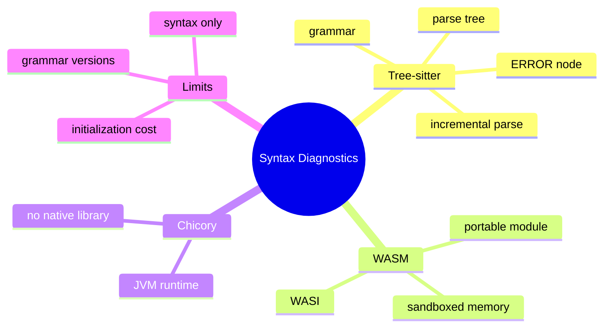

# Tree-sitter、WASM 与 Chicory

## 1. 概念

Tree-sitter 是增量语法解析器，输出 Concrete Syntax Tree；WASM 是可移植字节码；Chicory 是纯 Java WebAssembly runtime，使 JVM 无需 JNI 加载语言 parser。



## 2. 项目实现

`CodeParser` 定义抽象；`TreeSitterWasmParser` 通过 Chicory runtime/WASI 加载相应 grammar WASM，返回 ParseResult/SyntaxError；LintDiagnosticsTool 在文件编辑后提供语法反馈。

## 3. 本质

正则无法正确解析嵌套括号、字符串、注释和语言上下文。Parser 根据 grammar 构建树，即使代码部分错误也能产生 ERROR/MISSING 节点，适合增量编辑器。

WASM 解决跨平台分发：同一 `.wasm` 在 JVM runtime 执行，避免为 Windows/macOS/Linux 打包 JNI 动态库。它降低 native 集成风险，但并不自动保证模块无资源滥用，需要内存/指令/输入限制。

## 4. Demo：抽象解析接口

```java
record SyntaxIssue(int line, int column, String message) {}
record ParseResult(boolean valid, java.util.List<SyntaxIssue> issues) {}

interface CodeParser {
    boolean supports(String extension);
    ParseResult parse(String source);
}

final class BracketDemoParser implements CodeParser {
    public boolean supports(String ext) { return ".demo".equals(ext); }
    public ParseResult parse(String source) {
        int depth = 0;
        for (char c : source.toCharArray()) {
            if (c == '{') depth++;
            if (c == '}' && --depth < 0)
                return new ParseResult(false, java.util.List.of(new SyntaxIssue(1,1,"extra }")));
        }
        return new ParseResult(depth == 0, depth == 0 ? java.util.List.of()
            : java.util.List.of(new SyntaxIssue(1,1,"missing }")));
    }
}
```

Demo 说明接口，真实语言不能用括号计数替代 Tree-sitter。

## 5. Syntax vs Semantic

Tree-sitter 判断语法结构，不知道 Java 类型、重载、classpath。`foo.unknown()` 语法正确但编译失败。生产诊断需要结合 javac、语言服务器或构建工具。

## 6. 掌握检查

- [ ] 能解释 CST 和 ERROR node；
- [ ] 能说明 WASM 相对 JNI 的优势；
- [ ] 能区分语法与语义诊断；
- [ ] 能设计 parser 缓存和超时。

## 7. Tree-sitter 的 CST 与增量编辑

Tree-sitter 保留标点/括号等具体语法节点，适合编辑器定位。增量解析通过 `tree.edit` 告知旧树文本范围变化，再以旧树作为 parse hint，复用未变子树。项目若每次完整 parse仍能诊断，但大文件/连续编辑性能不如增量。

ERROR 节点表示无法匹配语法，MISSING 是恢复时假设缺失 token。诊断要把 byte offset转换行列，Unicode 下 byte/UTF-16/Java char不同，不能简单 substring index。

## 8. Grammar 与 ABI

每语言 grammar WASM版本、Tree-sitter ABI和导出函数需兼容。加载时验证 magic/version/export，不信任任意 wasm。语言由扩展名推断可能错误（模板/嵌入语言），可结合 shebang/config。

## 9. WASM Runtime 原理

WASM 模块有线性内存、函数表、imports/exports；WASI提供受控系统接口。Chicory解释/执行模块，避免 native动态库，但仍需限制内存、执行时间和输入。Sandbox强度取决于不给危险 host imports。

## 10. Parser 缓存

Module编译/实例化可能昂贵。按 language缓存 immutable module，instance若有可变 memory/非线程安全则每任务/池化。池需要 reset，异常 instance丢弃。缓存带 grammar version，升级失效。

## 11. 与编译器/LSP 组合的方案取舍

Tree-sitter给快速语法反馈；javac/build给完整类型/依赖；LSP给增量语义。Agent编辑后先快速 parser阻止明显语法错，再按任务运行真实构建，不能用 parser成功宣称代码正确。

## 12. 实验

缺括号/多括号/Unicode/超大文件；同文件连续小编辑比较全量/增量；多线程共享 instance测试；加载错误 grammar；WASM超时/内存限制；Tree-sitter无错误但javac类型失败的对照。

## 13. 深层面试追问与源码定位

**Tree-sitter 为什么能在代码不完整时继续解析？** grammar 生成的增量 LR 解析器在无法匹配时通过插入 `MISSING` 节点、产生 `ERROR` 节点或跳过部分 token 进行错误恢复，因此编辑器中间态仍有结构树。它保证的是“尽量构造可用语法结构”，不是证明源码可编译。

**WASM 一定比 JNI 快吗？** 不一定。WASM 的主要收益是 grammar 二进制可移植、部署一致以及 host import 可控；解释执行、线性内存复制可能更慢。选择必须分别测首次 module 加载、warm parse、峰值内存和并发吞吐。

**WASI 的本质是什么？** WASI 是一组标准化系统接口，module 只有在 host 显式提供相应 import 后才能访问文件、时钟等资源；它不是完整操作系统，也不代表自动安全。若 Host 把任意文件/网络能力暴露进去，WASM 仍可造成副作用。

源码需要核对 language→grammar WASM 的资源映射、Module/Instance 缓存、Instance 并发安全、UTF-8 byte offset 到 Java 字符位置的转换，以及文件大小/执行时间上限。Chicory 或 grammar 异常应降级为“快速语法诊断不可用”，不能阻止普通文件编辑；但真实写入后仍必须运行构建或 LSP 语义验证。

基准测试至少覆盖首次 module 加载、warm 全量解析和小范围增量解析；使用 1 KB、100 KB、1 MB 文件记录 p50/p95、分配和 heap 峰值。只测 warm 的小文件会掩盖桌面应用最明显的首次使用延迟。

## 项目源码精读

源码入口：[TreeSitterWasmParser.java](../../../src/main/java/com/example/agent/domain/ast/TreeSitterWasmParser.java)

```java
synchronized (TreeSitterWasmParser.class) {
    int codePtr = (int) allocFn.apply(codeBytes.length)[0];
    int langPtr = (int) allocFn.apply(langBytes.length)[0];
    instance.memory().write(codePtr, codeBytes);
    long packed = parseFn.apply(codePtr, codeBytes.length,
                                langPtr, langBytes.length)[0];
    deallocFn.apply(resultPtr, resultLen);
}
```

Java 通过 Chicory 实例化 WASM，显式调用导出的 alloc/parse/dealloc，并把 UTF-8 bytes 写入线性内存；WASM 返回 packed pointer/length，Host 读出 JSON 诊断再映射为 SyntaxError。全局 synchronized 说明单一 Instance/Memory 被视为非线程安全：正确性简单，但所有文件解析被串行化。

源码只释放 resultPtr，没有看到对 codePtr/langPtr 的 dealloc；若 guest parse 不接管输入所有权，连续解析会造成线性内存泄漏，必须核对 Rust ABI 并用压力测试证明。`WasiOptions.builder().inheritSystem()` 加 `wasi.toHostFunctions()` 扩大了 Host imports，安全审计不能只因为“是 WASM”就默认隔离。初始化失败返回 valid=true 的跳过结果，还应在诊断中区分“源码合法”与“解析器不可用”。

> [!IMPORTANT]
> **疑难点：Tree-sitter 验证语法树，不验证类型与业务语义。** `foo.unknown()` 可能语法完全正确却编译失败；因此快速 parse 只用于阻止明显语法错误，最终仍需 javac/build/LSP。还要区分 UTF-8 byte offset、Unicode code point 与 Java UTF-16 column。

## 14. 源码级实现原理解读

Tree-sitter 生成的是 concrete syntax tree：包含标点、错误节点和精确 byte range，适合增量解析与结构编辑。它不做完整类型解析、符号绑定或跨文件语义，所以 AST 查询能回答“这里是 method_declaration”，不能可靠回答“这个调用最终绑定哪个重载”。

`TreeSitterWasmParser` 通过 Chicory 实例化 WASM，Host 把 UTF-8 source 写入 guest linear memory，调用导出函数，guest 返回 result pointer/length，再从 memory 拷回 Java。每一个 pointer 都只在对应 instance/memory/generation 中有效；长度必须先做非负与上限校验；任何 malloc 成功后的异常路径都要 finally free。

WASM 实例通常带可变 linear memory 与 allocator 状态，不应在多个线程无保护共享。项目若 synchronized parse 就牺牲并行换取安全；若建实例池，每个 instance 仍需单 owner。当前源码只 dealloc result pointer 的话，还要审计 source buffer、tree/query 对象的所有权，错误返回也不能跳过释放。

## 15. 可运行完整实现：ABI 边界与资源释放模型

```java
import java.nio.charset.StandardCharsets;
import java.util.*;

public class WasmAbiDemo {
    interface Guest {
        int alloc(int length); void write(int ptr, byte[] bytes);
        long parse(int sourcePtr, int sourceLength);     // high32=ptr, low32=len
        byte[] read(int ptr, int length); void free(int ptr, int length);
    }
    static String parseSafely(Guest guest, String source, int maxResultBytes) {
        byte[] input = source.getBytes(StandardCharsets.UTF_8);
        int inputPtr = guest.alloc(input.length);
        int resultPtr = 0, resultLen = 0;
        try {
            guest.write(inputPtr, input);
            long packed = guest.parse(inputPtr, input.length);
            resultPtr = (int)(packed >>> 32); resultLen = (int)packed;
            if (resultPtr <= 0 || resultLen < 0 || resultLen > maxResultBytes)
                throw new IllegalStateException("invalid guest result: " + resultPtr + "/" + resultLen);
            return new String(guest.read(resultPtr, resultLen), StandardCharsets.UTF_8);
        } finally {
            if (resultPtr > 0 && resultLen >= 0) guest.free(resultPtr, resultLen);
            guest.free(inputPtr, input.length);
        }
    }
}
```

这段代码用打包 long 示意 ABI，实际项目必须以 WASM module 导出签名为准，不能自行假定高低位。还要防 `ptr + len` 整数溢出并确认位于 memory bounds。增量解析真正发挥优势时要保留旧 tree，并用 edit 的 byte/point range 更新；每次都只传完整 source 则仍是全量解析。

## 延伸学习：博客与电子书

- [Tree-sitter 官方文档](https://tree-sitter.github.io/tree-sitter/)：学习增量解析、错误恢复、grammar 和 syntax tree。
- [Chicory 源码与文档](https://github.com/dylibso/chicory)：理解纯 Java WASM runtime、Instance、Memory 和 Host functions。
- [WASI 官方站](https://wasi.dev/)：理解 capability-oriented 系统接口及 Host 授权边界。

## 思维导图节点学习博客

本专题思维导图中的 12 个末级知识点均已展开为独立博客：[进入节点博客目录](../mindmap-blogs/06-extension-quality/05-tree-sitter-wasm/README.md)。
