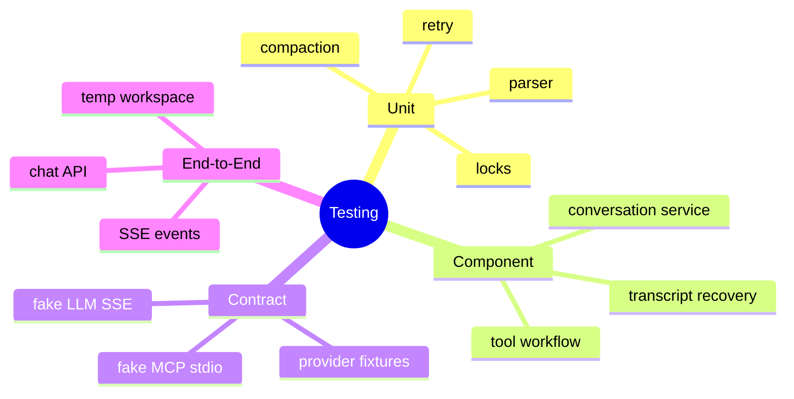

# 单元测试、Fake Server 与契约测试

## 1. 概念与测试原理

软件测试是用可重复输入和可判定断言寻找实现与需求之间的差异。单元测试验证纯逻辑不变量；组件测试验证若干类协作；契约测试验证外部协议映射；端到端测试验证真实入口到持久化。不同层次捕获不同风险。



## 2. 项目现状

159 个测试文件、约 2557 个测试注解，覆盖多个核心模块；JUnit 5、Mockito、AssertJ、JaCoCo。CI 的 Maven test 当前被注释，release 跳过测试，所以不能由数量推断当前全量通过或覆盖率达标。

## 3. Fake vs Mock

Fake 有可工作的简化行为，如按脚本发 SSE；Mock 验证调用交互。流式协议、重试和恢复更适合 Fake，因为大量 mock 容易只验证实现细节。

## 4. Demo：脚本化 Fake LLM

```java
interface ChunkConsumer { void onChunk(String chunk); }
interface StreamingLlm { void stream(ChunkConsumer consumer) throws Exception; }

final class FakeStreamingLlm implements StreamingLlm {
    private final java.util.List<String> chunks;
    FakeStreamingLlm(String... chunks) { this.chunks = java.util.List.of(chunks); }
    public void stream(ChunkConsumer consumer) {
        chunks.forEach(consumer::onChunk);
    }
}

// new FakeStreamingLlm("{\"pa", "th\":", "\"a.java\"}")
```

测试随机拆帧后 assembler 结果始终相同，比断言某个私有方法被调用更有价值。

## 5. 高价值场景

SSE 拆帧、header 后静默、429 Retry-After、断线；tool pair 压缩；JSONL 尾行；锁顺序；审批重放；symlink；SubAgent 超时/取消；MCP pending future 清理。

## 6. 覆盖率本质

Line coverage 只说明执行过；Branch coverage 更接近分支风险，仍不能证明断言质量。关键模块可增加 mutation testing，确认删掉安全检查或反转条件时测试会失败。

## 7. 可重复性

测试用 temp directory、fake clock、固定 random seed、短可控 timeout；不得依赖真实用户 `.hippo`、网络和 API Key。并发测试用 barrier/latch 建立确定时序，少用 sleep。

## 8. 掌握检查

- [ ] 能区分 fake/mock/contract；
- [ ] 能设计流式异常 fixture；
- [ ] 能解释覆盖率局限；
- [ ] 能用 latch 写确定性并发测试。

## 9. 测试不变量而非实现

Context测试断言 tool pair完整、预算不超；不应断言调用某个私有 helper。重构内部算法后不变量测试保持有效。安全测试从公开 ToolRegistry执行入口尝试绕过，证明 PEP，而不是只验证 Blocker方法返回 deny。

## 10. 并发确定性工具

CountDownLatch让线程同时开始，CyclicBarrier固定竞争点，Phaser多阶段，fake clock控制 deadline。Awaitility可轮询状态但仍要上限。sleep只能模拟耗时，不应作为“等待事件完成”的同步机制。

## 11. 文件系统测试

JUnit `@TempDir`，构造 symlink（平台支持时）、只读目录、磁盘空间/IOException通过 FileSystem abstraction或 Jimfs/fake；崩溃恢复可把 writer每一步暴露 failpoint。测试不触碰真实 WorkspaceManager全局目录。

## 12. Fake SSE Server

脚本控制 status/header/chunk/delay/disconnect。用真实 HttpClient跑 Adapter，覆盖 header后idle、逐字符UTF-8、arguments交错、429 Retry-After。Fixture记录 attempt和收到的 request，验证稳定 Tool Schema与认证脱敏。

## 13. Property/Mutation

属性：任意拆分合并相同；任意安全 turn裁剪后无 orphan；任意路径normalize后不越 root；锁资源顺序无环。Mutation删除 deny、反转阈值、跳过 UUID 去重时测试必须失败。

## 14. CI 门禁

恢复 `mvn test`，固定 JDK21+preview；单元/组件每 PR，契约离线 fixture每 PR，真实 provider nightly/manual；JaCoCo line+branch仅作底线，关键安全模块 mutation；失败保存 logs/seed但脱敏。

## 15. Flaky Test 治理

不能简单 retry通过。记录失败种子/时序，隔离真实网络/时钟/全局 singleton，限制并行。并发 bug重现率低时循环测试+JFR/thread dump。测试运行顺序改变仍应通过。

## 16. 项目源码、方案取舍与深度实验

先按模块建立风险地图：Orchestrator 状态机、Tool 安全边界、Transcript 崩溃恢复是最高风险，简单 getter/POJO 较低。测试投入应随失败影响、状态空间和修改频率分配，而不是每个包平均覆盖。搜索 `src/test/java` 与生产包对照，定位完全无测试的高风险类；JaCoCo 行覆盖只能作为发现盲区的线索。

**Mock 越少越好吗？** 外部协议边界用可编程 Fake 往往比逐调用 Mock 更接近真实行为；验证“是否向确认总线发布事件”等纯交互时 Mock 很直接。原则是断言可观察契约，不把私有调用顺序锁死。

**集成测试能否替代单元测试？** 集成测试能发现装配和协议问题，但反馈慢、失败定位粗、组合路径难穷举；状态机、裁剪算法、安全谓词仍需要快速单元/属性测试。两者验证的风险维度不同。

**真实 LLM 非确定，怎么测试？** Adapter 契约用固定 SSE fixture 保证确定性；Prompt/Agent 效果用任务集、多次采样和统计阈值；真实 Provider smoke 只验证认证、连通和最小格式，不作为每次提交的稳定门禁。

深度实验可以实现 `FakeClock`、`FakeLlm`、`FakeTool`、`FileSystemPort`，枚举 Agent 状态机的合法/非法迁移；在 transcript 写入步骤插 failpoint 遍历崩溃矩阵；用 property test 随机生成 Tool 消息序列验证压缩后无孤儿结果；用 mutation test 删除 `PathSecurity` deny 分支，确认安全测试必然变红。

面试深问应能解释：覆盖率为什么不是充分质量指标、Fake 与 Mock 如何选择、非确定 LLM 如何分层测试，以及怎样用 mutation/failpoint 证明测试确实能捕获安全与恢复缺陷。

## 项目源码精读

源码入口：[pom.xml](../../../pom.xml)、[SseParserToolCallTest.java](../../../src/test/java/com/example/agent/llm/stream/SseParserToolCallTest.java)、[TranscriptP0EndToEndTest.java](../../../src/test/java/com/example/agent/session/TranscriptP0EndToEndTest.java)

```java
@Test
void testCrashRecoveryWithTruncatedLine() throws IOException {
    service.addUserMessage(conversation, "Message before crash");
    service.flushTranscript(sessionId);
    Files.writeString(transcriptFile, "{\"type\":\"user\",...\n", APPEND);
    LoadResult result = TranscriptLoader.load(transcriptFile);
    assertTrue(result.isRecoveredFromCrash());
    assertTrue(result.getMessages().stream().anyMatch(...));
}
```

测试栈是 JUnit 5 + Mockito + AssertJ；Surefire 以 Java 21 preview 运行，JaCoCo 配置了 80% line/70% branch 门槛。测试已经覆盖 SSE/tool-call 边界、路径越界、Transcript 尾行损坏、并发与 Provider adapter 等关键风险，`@TempDir` 隔离真实工作区，固定 JSON fixture 隔离真实 LLM 非确定性。

但“有测试方法”不等于“验证了契约”。例如 `testTranscriptPersistenceAndRecovery` 加载的是 `newConversation`，最后却断言原 `conversation.size()`；这个断言即使恢复逻辑坏了也可能通过。`testListSessionsWithoutLoadingFullFiles` 只调用不断言。面试中这正好解释 mutation testing 的价值：删除生产恢复逻辑后测试仍绿，说明测试没有杀死突变。

> [!IMPORTANT]
> **疑难点：覆盖率衡量执行过，不衡量断言是否有效。** 安全边界要加入 mutation/property test；崩溃恢复用 failpoint matrix；SSE 用可编程 Fake Server；真实 Provider 只做 nightly smoke。CI 还应固定时区/编码/随机 seed，并对 flaky test 找根因而非无限 retry。

## 17. 源码级实现原理解读

测试金字塔不是按文件数量分层，而是按反馈速度与边界风险组合。纯算法如 delta merge、path normalize 用单元/属性测试；LlmClient 对 Fake HTTP Server 做 wire contract；各 provider adapter 共用契约 fixture；Transcript 做真实临时文件与 crash/partial line 测试；Agent Loop 用脚本化 Fake LLM 验证状态机。

Mock 验证“调用了某方法”容易把测试绑在实现顺序；Fake 实现端口并保存可观察状态，更适合验证业务不变量。项目已有 `MockLlmClient/TestFixtures/LlmResponseBuilder`，但一些测试缺有效断言或断言了错误对象，这会产生“绿色但没证明行为”。覆盖率只能说明代码被执行，不说明关键结果被检查。

并发测试不能依赖 sleep 猜时序。使用 CountDownLatch/CyclicBarrier/Phaser 在精确点暂停线程，强制制造竞争；重复运行与超时只是辅助。契约测试还应检查 error、取消、重复事件、未知字段和 partial frame，而不是只有 happy path。

## 18. 代码实现：脚本化 Fake LLM 的状态机测试

```java
import static org.junit.jupiter.api.Assertions.*;
import java.util.*;
import org.junit.jupiter.api.Test;

class AgentContractExampleTest {
    sealed interface Reply permits ToolReply, FinalReply {}
    record ToolReply(String callId, String tool, Map<String,String> args) implements Reply {}
    record FinalReply(String text) implements Reply {}
    interface Llm { Reply next(List<String> history); }

    static final class ScriptedLlm implements Llm {
        private final Deque<Reply> script;
        ScriptedLlm(Reply... replies) { script = new ArrayDeque<>(List.of(replies)); }
        public Reply next(List<String> history) {
            if (script.isEmpty()) throw new AssertionError("unexpected extra LLM call");
            return script.removeFirst();
        }
        void verifyExhausted() { assertTrue(script.isEmpty(), "not all scripted replies consumed"); }
    }

    @Test void toolCallMustBeClosedBeforeFinalAnswer() {
        ScriptedLlm llm = new ScriptedLlm(
                new ToolReply("c1", "read", Map.of("path", "README.md")),
                new FinalReply("done"));
        List<String> history = new ArrayList<>(List.of("user:inspect"));
        Reply first = llm.next(List.copyOf(history));
        ToolReply call = assertInstanceOf(ToolReply.class, first);
        history.add("assistant-call:" + call.callId());
        history.add("tool-result:" + call.callId() + ":content");
        FinalReply answer = assertInstanceOf(FinalReply.class, llm.next(List.copyOf(history)));
        assertEquals("done", answer.text());
        assertTrue(history.indexOf("assistant-call:c1") < history.indexOf("tool-result:c1:content"));
        llm.verifyExhausted();
    }
}
```

高质量测试要说明它证明的不变量：这里证明 call/result 关联与先后顺序，并保证 Loop 没有多调/少调模型。项目当前全量测试有失败，因此不能用“测试文件很多”推导质量高；应先给失败分类为真实回归、共享全局状态污染、平台差异和脆弱断言，再建立稳定 CI gate。

## 延伸学习：博客与电子书

- [JUnit 5 User Guide](https://junit.org/junit5/docs/current/user-guide/)：掌握生命周期、参数化、嵌套测试、扩展与并行执行。
- [JaCoCo 官方文档](https://www.jacoco.org/jacoco/trunk/doc/)：理解 line/branch/instruction coverage 的口径与局限。
- [Martin Fowler：Test Pyramid](https://martinfowler.com/articles/practical-test-pyramid.html)：学习单元、集成、契约和端到端测试的风险分工。

## 思维导图节点学习博客

本专题思维导图中的 13 个末级知识点均已展开为独立博客：[进入节点博客目录](../mindmap-blogs/06-extension-quality/06-testing-contracts/README.md)。
