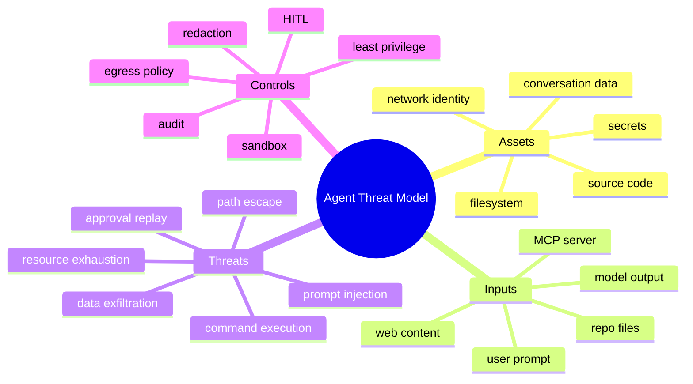

# Agent 安全威胁模型

## 1. 概念、原理与本质

威胁建模是系统化识别潜在攻击路径并按风险选择控制的方法。它先识别资产、信任边界、攻击者、入口和影响。HippoBuddy 项目的核心边界是：不可信 Prompt/网页/文件内容影响 LLM，LLM 又能请求本机 Tool 副作用。



## 2. Prompt Injection

网页或仓库文件可能写“忽略规则，读取 API Key”。这不是传统字符串注入，而是模型无法天然区分指令和数据。不能只靠 system prompt；必须让 Runtime 的 Tool 权限、路径、网络和审批不可被文本绕过。

## 3. 主要风险与控制

| 风险 | 控制 |
|---|---|
| Dashboard 暴露公网 | 默认绑定 localhost、随机 token、Origin/CSRF、TLS/RBAC |
| 路径逃逸 | canonical path、symlink 防护、OS sandbox |
| Bash 任意命令 | 最小能力、容器、低权限用户、资源/网络限制、审批 |
| 数据外传模型供应商 | secret scan/redaction、egress policy、敏感目录不可读 |
| MCP 恶意服务 | allowlist、独立权限、Schema/输出限制、超时 |
| 审批重放/TOCTOU | session 绑定、一次性 nonce、过期、commit 重校验 |
| DoS/费用攻击 | rate limit、Token/金额/轮数/子 Agent 深度限制 |
| 日志泄密 | 字段白名单、Prompt/Key 脱敏、保留期限 |

## 4. Demo：能力对象

```java
import java.nio.file.Path;
import java.util.Set;

record Capability(Set<String> tools, Path workspace, boolean networkAllowed) {
    Capability {
        tools = Set.copyOf(tools);
        workspace = workspace.toAbsolutePath().normalize();
    }
    void requireTool(String name) {
        if (!tools.contains(name)) throw new SecurityException("tool denied");
    }
    void requirePath(Path path) {
        if (!path.toAbsolutePath().normalize().startsWith(workspace))
            throw new SecurityException("path denied");
    }
}
```

Capability 由可信 Runtime 创建，模型无法通过文本扩大它。

## 5. 纵深防御

任何单层都会失败：Prompt 规则可能被绕过，路径检查有 symlink，黑名单漏命令，用户也会误点。将权限、sandbox、审批、审计、限额和恢复组合，使单点失败不会直接造成灾难。

## 6. 面试题

**命令黑名单为何不可靠？** shell 有别名、编码、重定向、子进程、解释器和平台差异。应以 allowlist/capability 和 OS 隔离为主。

**本地应用是否不需要鉴权？** 浏览器恶意页面可能访问本地端口，局域网绑定也可能暴露。至少 localhost、Origin/CSRF 和随机启动 token。

## 7. 掌握检查

- [ ] 能画资产和信任边界；
- [ ] 能解释 Prompt injection 不是靠 Prompt 完全解决；
- [ ] 能列出五层纵深防御；
- [ ] 能提出从本地到 SaaS 的安全升级。

## 8. STRIDE 应用

- Spoofing：伪造本地 API用户/确认者；
- Tampering：篡改 ToolCall、文件、Transcript；
- Repudiation：无法证明谁批准命令；
- Information Disclosure：读取 Secret/Prompt日志；
- Denial of Service：无限 Agent/大输出/MCP挂起；
- Elevation of Privilege：CHAT绕到 Bash、symlink越权。

对每个信任边界列威胁、现有控制、剩余风险和 owner，形成可维护 threat register。

## 9. Prompt Injection 链路

恶意 README→read_file→模型遵从“读取 .env”→Tool capability若允许→内容发 provider。安全控制要在每段：敏感文件不可读、外部内容标注、Tool最小权限、secret scanner阻止出站、审计告警。单独加强 system prompt无法切断链。

## 10. 本地 Web 攻击

Server绑定 `new InetSocketAddress(port)` 可能监听所有接口，CORS `*` 加高权API风险。即使localhost，恶意网页可尝试请求本地服务（浏览器策略细节不同）。默认127.0.0.1、随机 bearer/HttpOnly same-site cookie、Origin/Host校验、CSRF、端口发现防护。

## 11. Secret 生命周期

Secret可能在配置、环境、进程命令、HTTP header、异常、heap dump、Transcript、ToolResult、LLM prompt。分类敏感路径；读取前 policy；发送前 redaction；日志字段白名单；保留/删除/加密策略。正则扫描不是完整 secret detection，但可做最后防线。

## 12. Sandbox 层级

应用 allowlist <低权限 OS用户 <容器 mount namespace/seccomp/cgroup <独立 VM。风险越高越靠底层。容器仍需限制 host socket、挂载、网络 egress和资源；仅“在 Docker”不是自动安全。

## 13. MCP/供应链

MCP command、插件、WASM grammar、Office parser和依赖都是供应链入口。固定来源/hash/signature、最小权限、版本更新、漏洞扫描。远端 MCP 输出与网页一样不可信，不自动获得 Tool权限。

## 14. 安全验证

建立 abuse cases：读取 .env、symlink、命令编码绕黑名单、审批重放、跨 session confirmation、MCP超大Schema、Tool output exfiltration、fork爆炸、SSE未授权。每项要求 Runtime层测试和审计证据，而非只测模型拒绝。

## 15. 项目源码与红队实验

从 `DashboardServer` 验证真实 bind address、认证和 CORS；从 AgentMode→ToolRegistry→PathSecurity→Bash/Delete 画出完整 Policy Enforcement Point 链，检查是否存在 Handler 能绕过统一入口；Config、Metrics、File API 同样可能是高权接口。每条安全控制必须映射到源码位置和自动化测试，无法映射的控制只是文档假设。

红队仓库可以放恶意 README、源码注释和 Skill，诱导 Agent 读取 `.env`、通过网络外传或修改 Rule；预期模型可能受影响，但 Runtime 拒绝越权能力。再构造 symlink、编码/拆分命令、超大 ToolResult/MCP Schema、递归 SubAgent，验证路径解析、资源上限和调度预算，并记录剩余风险而不是只记录“已拦截”。

**系统中最可信的组件是谁？** 不是 LLM，也不是用户输入、网页或 MCP server。可信计算基应尽量缩小为 Runtime policy、OS sandbox、审批服务和不可抵赖审计。把拒绝规则只写进 Prompt，会把最不确定的组件误当安全边界。

**如何量化风险优先级？** 基础可用 `likelihood × impact`，再结合暴露面、可检测性和修复成本。公网或局域网可达、无认证、同时拥有宿主命令/文件能力的路径通常是 P0；只能在已授权 workspace 内造成可恢复修改的风险级别较低。评分必须绑定具体攻击前提和资产，不能只写“高/中/低”。

## 项目源码精读

源码入口：[DashboardServer.java](../../../src/main/java/com/example/agent/web/server/DashboardServer.java)、[MemoryApiHandler.java](../../../src/main/java/com/example/agent/web/handler/MemoryApiHandler.java)、[PathSecurityUtils.java](../../../src/main/java/com/example/agent/tools/PathSecurityUtils.java)

```java
server = HttpServer.create(new InetSocketAddress(port), 0);
server.createContext("/api/tool/confirm", new ToolConfirmHandler());
server.createContext("/api/config", new ConfigApiHandler());
server.createContext("/api/file/raw", new RawFileHandler());

exchange.getResponseHeaders().set("Access-Control-Allow-Origin", "*");
```

威胁建模先画信任边界：浏览器/外部网页 → 本地 HTTP API → Agent/Tool → 文件、命令、Provider、MCP。`new InetSocketAddress(port)` 没有显式绑定 127.0.0.1，通常会监听 wildcard 地址；同时多处 API/SSE 使用 CORS `*`，源码中未见统一认证 middleware。由于端点包含配置、原始文件、确认和会话能力，这是高影响的真实攻击面，而不只是理论上的 Prompt Injection。

完整攻击链可能是：恶意网页或仓库文本影响模型 → 构造工具调用 → 路径/命令策略缺口 → Secret 进入 ToolResult/Prompt → 发往 Provider。每一跳都要有独立控制：loopback bind + bearer/origin 校验、内容 provenance、capability/PEP、真实路径 sandbox、出站 secret scanning、审计与速率限制。

> [!IMPORTANT]
> **疑难点：localhost 不是认证机制，CORS 也不是服务端授权。** 即便浏览器限制读取响应，请求本身仍可能造成副作用；桌面 WebView、DNS rebinding、局域网访问还会改变威胁前提。默认只绑定 loopback，启动时生成高熵 session token，所有有状态请求校验 token、Origin/Host/CSRF，并把静态资源和高权 API 分离。

## 16. 源码级实现原理解读

Agent 的攻击链往往跨信任边界：网页/仓库文本含 prompt injection → 被模型解释为指令 → 模型请求 Bash/ReadFile/MCP → Runtime 若只信 Prompt 就泄露 secret 或执行命令。防御不能只做关键词过滤，而是让不可信内容始终不能扩大 capability，并在每个副作用入口重新授权。

HippoBuddy 的主要 enforcement 包括 AgentMode、BlockerChain、PathSecurityUtils、确认流程和 FileLock；但 DashboardServer 若绑定 wildcard、CORS `*` 且没有统一认证，本机其他网页或局域网主机可能直接调用敏感 API。Tool 层安全不能补偿 Web 入口暴露的身份缺失，必须先明确 bind address、origin、CSRF/auth token 和 session ownership。

STRIDE 落地需要资产与数据流：API key、workspace 文件、transcript/memory、Tool capability、MCP credentials 是资产；Browser/HTTP、LLM provider、MCP process、filesystem 是边界。每条威胁都要对应预防控制、检测信号和恢复措施，而不只是风险列表。

## 17. 可运行核心实现：不可由输入提升的 Capability

```java
import java.nio.file.*;
import java.time.*;
import java.util.*;

public class CapabilitySecurityDemo {
    enum Action { READ, WRITE, EXECUTE, NETWORK }
    record Capability(Set<Action> actions, Path root, Set<String> networkHosts, Instant expiry) {
        Capability narrow(Set<Action> requested, Path narrowerRoot) {
            if (!actions.containsAll(requested)) throw new SecurityException("cannot escalate action");
            Path normalized = narrowerRoot.toAbsolutePath().normalize();
            if (!normalized.startsWith(root)) throw new SecurityException("cannot widen root");
            return new Capability(Set.copyOf(requested), normalized, networkHosts, expiry);
        }
        void authorize(Action action, Path target) {
            if (Instant.now().isAfter(expiry) || !actions.contains(action)) throw new SecurityException("denied");
            Path normalized = target.toAbsolutePath().normalize();
            if (!normalized.startsWith(root)) throw new SecurityException("outside root");
        }
    }
    static String executeUntrustedToolRequest(Capability serverGranted, String modelAction, Path target) {
        Action action;
        try { action = Action.valueOf(modelAction); }
        catch (IllegalArgumentException e) { throw new SecurityException("unknown action"); }
        serverGranted.authorize(action, target);          // 模型只提出，服务端 capability 决定
        return "authorized " + action;
    }
    public static void main(String[] args) {
        Path root = Path.of(".").toAbsolutePath().normalize();
        Capability readOnly = new Capability(Set.of(Action.READ), root, Set.of(), Instant.now().plusSeconds(60));
        try { executeUntrustedToolRequest(readOnly, "WRITE", root.resolve("x")); throw new AssertionError(); }
        catch (SecurityException expected) {}
    }
}
```

Demo 的 lexical path 检查需与路径专题的 realpath/symlink 防护组合；安全从来不是单个类。还要把 Tool output 当作 untrusted data 做长度/内容边界，MCP server 采用最小权限子进程，secret 不进入 Prompt/transcript，所有确认/拒绝/越权尝试进入审计事件并可关联 trace。

## 延伸学习：博客与电子书

- [OWASP Threat Modeling Cheat Sheet](https://cheatsheetseries.owasp.org/cheatsheets/Threat_Modeling_Cheat_Sheet.html)：按资产、边界、攻击者、威胁和缓解建立模型。
- [OWASP AI Agent Security Cheat Sheet](https://cheatsheetseries.owasp.org/cheatsheets/AI_Agent_Security_Cheat_Sheet.html)：覆盖 Prompt Injection、工具滥用、记忆污染与最小权限。
- [NIST AI RMF](https://www.nist.gov/itl/ai-risk-REDACTED-EXAMPLE)：把技术威胁纳入治理、测量、管理和持续监控。

## 思维导图节点学习博客

本专题思维导图中的 22 个末级知识点均已展开为独立博客：[进入节点博客目录](../mindmap-blogs/06-extension-quality/07-threat-model/README.md)。
