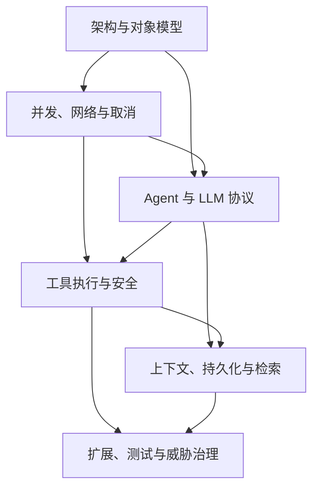

# HippoBuddy 后端知识库：系统化学习指南

这是一条覆盖全部 **42 个专题、538 个末级知识点**的主学习路线。目标不是“读完文档”，而是为每个专题留下源码调用链、可运行实验、失败分析和面试口述四类证据。

## 1. 学习闭环

每个知识点达到“掌握”，必须能独立完成：

1. 不看文档画出数据结构、状态机或时序图；
2. 从入口类追踪到状态写入、外部 I/O 和异常返回；
3. 运行 Demo，并故意破坏一个不变量使测试失败；
4. 说明项目为什么采用当前实现，以及它没有提供什么保证；
5. 用“概念—原理—源码—失败—改进”口述三分钟。

## 2. 学习强度

| 路线 | 周期 | 每周投入 | 覆盖全部 538 点 | 适用情况 |
|---|---:|---:|---|---|
| 完整路线 | 42 周 | 8–10 小时 | 是 | 工作学习并行，优先推荐 |
| 加速路线 | 21 周 | 16–20 小时 | 是 | 集中准备跳槽，每周两个专题 |
| 面试冲刺 | 12 周 | 12–15 小时 | 否，先核心后回补 | 已有基础、面试临近 |

## 3. 每周固定节奏

- **第 1 天（90 分钟）**：阅读父专题，重画思维导图，标记陌生术语。
- **第 2 天（90 分钟）**：学习前半节点博客，从真实入口追踪源码。
- **第 3 天（90 分钟）**：学习后半节点博客，运行完整 Java Demo。
- **第 4 天（90 分钟）**：制造并发、异常、边界或安全失败，补一条测试。
- **第 5 天（60 分钟）**：完成方案比较、风险清单和三分钟口述。
- **第 7 天（45 分钟）**：闭卷复习，未通过项进入下周补课队列。

## 4. 42 周完整路线

| 周 | 阶段 | 专题 | 节点数 | 本周交付物 |
|---:|---|---|---:|---|
| 1 | 架构与对象模型 | [分层架构与应用服务](mindmap-blogs/01-architecture/01-layered-architecture/README.md) | 15 | 调用链图 + Demo + 失败测试 + 口述 |
| 2 | 架构与对象模型 | [IoC、DI 与 Service Locator](mindmap-blogs/01-architecture/02-ioc-di-service-locator/README.md) | 13 | 调用链图 + Demo + 失败测试 + 口述 |
| 3 | 架构与对象模型 | [对象作用域、全局状态与生命周期](mindmap-blogs/01-architecture/03-scope-lifecycle/README.md) | 12 | 调用链图 + Demo + 失败测试 + 口述 |
| 4 | 架构与对象模型 | [HippoBuddy 中的设计模式](mindmap-blogs/01-architecture/04-design-patterns/README.md) | 11 | 调用链图 + Demo + 失败测试 + 口述 |
| 5 | 架构与对象模型 | [配置系统与不可变快照](mindmap-blogs/01-architecture/05-configuration/README.md) | 14 | 调用链图 + Demo + 失败测试 + 口述 |
| 6 | 并发、网络与取消 | [Java 21 虚拟线程](mindmap-blogs/02-concurrency-network/01-virtual-threads/README.md) | 11 | 调用链图 + Demo + 失败测试 + 口述 |
| 7 | 并发、网络与取消 | [有界线程池、队列与背压](mindmap-blogs/02-concurrency-network/02-bounded-pool-backpressure/README.md) | 11 | 调用链图 + Demo + 失败测试 + 口述 |
| 8 | 并发、网络与取消 | [Session 锁、原子性与临界区](mindmap-blogs/02-concurrency-network/03-session-lock-atomicity/README.md) | 11 | 调用链图 + Demo + 失败测试 + 口述 |
| 9 | 并发、网络与取消 | [多文件锁与死锁](mindmap-blogs/02-concurrency-network/04-file-lock-deadlock/README.md) | 12 | 调用链图 + Demo + 失败测试 + 口述 |
| 10 | 并发、网络与取消 | [SSE 协议与流式响应](mindmap-blogs/02-concurrency-network/05-sse/README.md) | 12 | 调用链图 + Demo + 失败测试 + 口述 |
| 11 | 并发、网络与取消 | [生产者—消费者、批处理与背压](mindmap-blogs/02-concurrency-network/06-producer-consumer/README.md) | 13 | 调用链图 + Demo + 失败测试 + 口述 |
| 12 | 并发、网络与取消 | [取消、超时、线程中断与 Watchdog](mindmap-blogs/02-concurrency-network/07-cancellation-timeout-watchdog/README.md) | 11 | 调用链图 + Demo + 失败测试 + 口述 |
| 13 | 并发、网络与取消 | [MDC 上下文传播与 EventBus](mindmap-blogs/02-concurrency-network/08-mdc-eventbus/README.md) | 12 | 调用链图 + Demo + 失败测试 + 口述 |
| 14 | Agent 与 LLM 协议 | [Agent Loop 与状态机](mindmap-blogs/03-agent-llm/01-agent-loop-state-machine/README.md) | 14 | 调用链图 + Demo + 失败测试 + 口述 |
| 15 | Agent 与 LLM 协议 | [Function Calling 与工具协议](mindmap-blogs/03-agent-llm/02-function-calling/README.md) | 14 | 调用链图 + Demo + 失败测试 + 口述 |
| 16 | Agent 与 LLM 协议 | [SSE Delta 解析与增量合并](mindmap-blogs/03-agent-llm/03-stream-delta-assembly/README.md) | 13 | 调用链图 + Demo + 失败测试 + 口述 |
| 17 | Agent 与 LLM 协议 | [多供应商 Adapter 与统一模型](mindmap-blogs/03-agent-llm/04-provider-adapter/README.md) | 12 | 调用链图 + Demo + 失败测试 + 口述 |
| 18 | Agent 与 LLM 协议 | [重试、指数退避与幂等](mindmap-blogs/03-agent-llm/05-retry-backoff-idempotency/README.md) | 10 | 调用链图 + Demo + 失败测试 + 口述 |
| 19 | Agent 与 LLM 协议 | [错误分类与异常语义](mindmap-blogs/03-agent-llm/06-error-taxonomy/README.md) | 16 | 调用链图 + Demo + 失败测试 + 口述 |
| 20 | Agent 与 LLM 协议 | [Prompt 前缀缓存](mindmap-blogs/03-agent-llm/07-prompt-cache/README.md) | 13 | 调用链图 + Demo + 失败测试 + 口述 |
| 21 | Agent 与 LLM 协议 | [Token Usage、价格与成本治理](mindmap-blogs/03-agent-llm/08-token-cost/README.md) | 14 | 调用链图 + Demo + 失败测试 + 口述 |
| 22 | 工具执行与安全 | [Command、Tool Registry 与 JSON Schema](mindmap-blogs/04-tools-security/01-command-registry-schema/README.md) | 13 | 调用链图 + Demo + 失败测试 + 口述 |
| 23 | 工具执行与安全 | [Blocker 责任链与能力权限](mindmap-blogs/04-tools-security/02-blocker-capability/README.md) | 12 | 调用链图 + Demo + 失败测试 + 口述 |
| 24 | 工具执行与安全 | [路径规范化、Sandbox 与符号链接](mindmap-blogs/04-tools-security/03-path-sandbox/README.md) | 12 | 调用链图 + Demo + 失败测试 + 口述 |
| 25 | 工具执行与安全 | [Human-in-the-loop 与两阶段执行](mindmap-blogs/04-tools-security/04-human-in-the-loop/README.md) | 14 | 调用链图 + Demo + 失败测试 + 口述 |
| 26 | 工具执行与安全 | [乐观并发、快照与补偿事务](mindmap-blogs/04-tools-security/05-edit-snapshot-compensation/README.md) | 12 | 调用链图 + Demo + 失败测试 + 口述 |
| 27 | 工具执行与安全 | [工具输出分类与截断策略](mindmap-blogs/04-tools-security/06-output-truncation/README.md) | 14 | 调用链图 + Demo + 失败测试 + 口述 |
| 28 | 工具执行与安全 | [工具并发、依赖与结果排序](mindmap-blogs/04-tools-security/07-concurrent-tools/README.md) | 10 | 调用链图 + Demo + 失败测试 + 口述 |
| 29 | 上下文、持久化与检索 | [Tokenizer、Token 估算与预算监听](mindmap-blogs/05-context-storage/01-token-budget/README.md) | 14 | 调用链图 + Demo + 失败测试 + 口述 |
| 30 | 上下文、持久化与检索 | [滑动窗口、摘要压缩与 Session Memory](mindmap-blogs/05-context-storage/02-context-compaction/README.md) | 13 | 调用链图 + Demo + 失败测试 + 口述 |
| 31 | 上下文、持久化与检索 | [JSONL、Append-only Log 与 Event Sourcing](mindmap-blogs/05-context-storage/03-jsonl-event-log/README.md) | 12 | 调用链图 + Demo + 失败测试 + 口述 |
| 32 | 上下文、持久化与检索 | [批量刷盘、幂等、原子写与崩溃恢复](mindmap-blogs/05-context-storage/04-file-durability/README.md) | 12 | 调用链图 + Demo + 失败测试 + 口述 |
| 33 | 上下文、持久化与检索 | [Markdown 记忆、索引与缓存失效](mindmap-blogs/05-context-storage/05-memory-index-cache/README.md) | 12 | 调用链图 + Demo + 失败测试 + 口述 |
| 34 | 上下文、持久化与检索 | [关键词、向量检索与 Progressive Disclosure](mindmap-blogs/05-context-storage/06-retrieval-progressive-disclosure/README.md) | 11 | 调用链图 + Demo + 失败测试 + 口述 |
| 35 | 上下文、持久化与检索 | [文件存储、SQLite 与 PostgreSQL 选型](mindmap-blogs/05-context-storage/07-storage-selection/README.md) | 12 | 调用链图 + Demo + 失败测试 + 口述 |
| 36 | 扩展、测试与威胁治理 | [子 Agent、任务状态与有界调度](mindmap-blogs/06-extension-quality/01-subagent-scheduling/README.md) | 15 | 调用链图 + Demo + 失败测试 + 口述 |
| 37 | 扩展、测试与威胁治理 | [JSON-RPC、MCP 与 Transport](mindmap-blogs/06-extension-quality/02-jsonrpc-mcp/README.md) | 14 | 调用链图 + Demo + 失败测试 + 口述 |
| 38 | 扩展、测试与威胁治理 | [Prompt、Rule、Skill、Tool 的边界](mindmap-blogs/06-extension-quality/03-prompt-rule-skill-tool/README.md) | 11 | 调用链图 + Demo + 失败测试 + 口述 |
| 39 | 扩展、测试与威胁治理 | [日志、指标、Trace 与健康检查](mindmap-blogs/06-extension-quality/04-observability-health/README.md) | 14 | 调用链图 + Demo + 失败测试 + 口述 |
| 40 | 扩展、测试与威胁治理 | [Tree-sitter、WASM 与 Chicory](mindmap-blogs/06-extension-quality/05-tree-sitter-wasm/README.md) | 12 | 调用链图 + Demo + 失败测试 + 口述 |
| 41 | 扩展、测试与威胁治理 | [单元测试、Fake Server 与契约测试](mindmap-blogs/06-extension-quality/06-testing-contracts/README.md) | 13 | 调用链图 + Demo + 失败测试 + 口述 |
| 42 | 扩展、测试与威胁治理 | [Agent 安全威胁模型](mindmap-blogs/06-extension-quality/07-threat-model/README.md) | 22 | 调用链图 + Demo + 失败测试 + 口述 |

## 5. 前置依赖

- 架构阶段先建立依赖、生命周期与边界语言。
- 并发阶段必须先于复杂 Agent Loop，避免把乱序、背压和取消误判为模型问题。
- Agent 协议先于工具安全：先理解模型怎样提出动作，再学习 Runtime 怎样限制动作。
- 存储阶段建立在消息、ToolCall 和取消语义之上，否则无法定义可恢复状态。
- 扩展质量最后学习，因为契约测试、Trace 和威胁模型覆盖前面所有边界。

## 6. 六个阶段项目

1. **架构**：从 `ChatApiHandler` 画到 LLM/Transcript，重构出可 Fake 的端口测试。
2. **并发**：构造同 Session 竞态，加入 deadline、取消传播和确定性结果顺序。
3. **Agent**：用脚本化 Fake LLM 完成 ToolCall → ToolResult → Final 状态机。
4. **工具安全**：实现路径规范化、Capability、一次性确认和 compare-and-write。
5. **存储**：对 Transcript 做 partial-tail 恢复，为 Memory 检索建立评测集。
6. **质量**：给一轮 Agent 建 Trace，补 Provider/MCP 契约测试和 STRIDE 报告。

## 7. 间隔复习

- **D1**：闭卷写出概念、本质和一个源码类；
- **D3**：重画执行流程或状态机；
- **D7**：重新运行失败实验并解释根因；
- **D14**：回答博客中的面试追问；
- **D30**：从项目新入口重新追踪，确认不是只记住原文路径。

任一次无法在五分钟内完成，就标记为“未掌握”，重新执行源码和失败实验，而不是只重读文字。

## 8. 掌握等级

| 等级 | 能力表现 |
|---|---|
| L0 未接触 | 不能给出定义 |
| L1 了解 | 能解释概念，但无法落到项目 |
| L2 会用 | 能定位源码、运行 Demo |
| L3 掌握 | 能解释底层状态、不变量和失败模式 |
| L4 面试熟练 | 能连续回答三层追问并比较替代方案 |
| L5 可改造 | 能补测试、识别缺口并安全修改实现 |

完整学习要求全部节点达到 L3，重点节点达到 L4，每个阶段至少一个项目达到 L5。

## 9. 学习入口

- [538 个节点博客总索引](mindmap-blogs/README.md)
- [全量掌握进度表](MASTER_PROGRESS_TRACKER.md)
- [后端知识库总索引](README.md)

